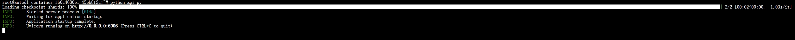
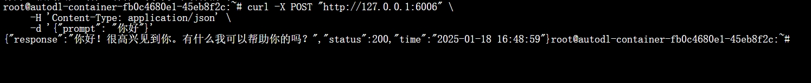
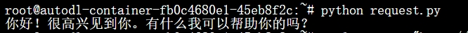
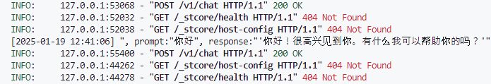

# InternLM3-8B-instruct FastAPI部署

InternLM3 开源了一个具有 80 亿参数的指令模型，名为 **InternLM3-8B-Instruct**，旨在用于通用任务和高级推理。该模型具有以下特点：

- **在降低成本的同时提升性能**：在推理和知识密集型任务中，表现超越了像 Llama3.1-8B 和 Qwen2.5-7B 等模型。值得注意的是，InternLM3 仅在 4 万亿高质量标记上进行训练，比其他同规模的语言模型节省了超过 75% 的训练成本。
- **深度思考能力**：InternLM3 支持两种模式：一种是通过长链思维解决复杂推理任务的深度思考模式，另一种是用于流畅用户交互的正常响应模式。

## 环境配置

实验所依赖的基础开发环境如下：

```
----------------
ubuntu 22.04
Python 3.12.3
cuda 12.1
pytorch 2.3.0
----------------
```
> 本文默认学习者已安装好以上 Pytorch(cuda) 环境，如未安装请自行安装。

首先 `pip` 换源加速下载并安装依赖包：

```shell
# 升级pip
python -m pip install --upgrade pip
# 更换 pypi 源加速库的安装
pip config set global.index-url https://pypi.tuna.tsinghua.edu.cn/simple

# FastAPI 相关依赖
pip install requests==2.32.3
pip install fastapi==0.104.1
pip install uvicorn==0.24.0

# Langchain 相关依赖
pip install langchain==0.3.7

# WebDemo 相关依赖
pip install streamlit==1.41.1

# LoRA微调 相关依赖
pip install peft==0.11.1          # 用于 LoRA 微调

# 通用依赖
pip install modelscope==1.22.0    # 用于模型下载和管理
pip install transformers==4.47.1  # Hugging Face 的模型库，用于加载和训练模型
pip install sentencepiece==0.2.0  # 用于处理文本数据
pip install accelerate==0.34.2    # 用于分布式训练和混合精度训练
pip install datasets==2.20.0      # 用于加载和处理数据集
```

> 考虑到部分同学配置环境可能会遇到一些问题，我们在 AutoDL 平台准备了 InternLM3-8b-Instruct 的环境镜像，点击下方链接并直接创建 AutoDL 示例即可。
> ***https://www.codewithgpu.com/i/datawhalechina/self-llm/InternLM3-self-llm***

## 模型下载

`modelscope` 是一个模型管理和下载工具，支持从魔搭 (Modelscope) 等平台快速下载模型。

这里使用 `modelscope` 中的 `snapshot_download` 函数下载模型，第一个参数 `model_name_or_path` 为模型名称或者本地路径，第二个参数 `cache_dir` 为模型的下载路径，第三个参数 `revision` 为模型的版本号。

在 `/root/autodl-tmp` 路径下新建 `model_download.py` 文件并在其中粘贴以下代码，并保存文件。

```python
from modelscope import snapshot_download

model_dir = snapshot_download('Shanghai_AI_Laboratory/internlm3-8b-instruct', cache_dir='./', revision='master')
```

> 注意：记得修改 cache_dir 为你的模型下载路径哦~

在终端运行 `python /root/autodl-tmp/model_download.py` 执行下载，模型大小为 18GB 左右，下载模型大概需要5-30分钟。

## 代码准备

新建 `api.py` 文件并在其中输入以下内容，粘贴代码后请及时保存文件。记得将tokenizer和model的路径改成上面模型下载的cache_dir的路径。以下代码有很详细的注释，大家如有不理解的地方，欢迎提出 issue 。

```python
from fastapi import FastAPI, Request
from transformers import AutoTokenizer, AutoModelForCausalLM, GenerationConfig
import uvicorn
import json
import datetime
import torch

# 设置设备参数
DEVICE = "cuda"  # 使用CUDA
DEVICE_ID = "0"  # CUDA设备ID，如果未设置则为空
CUDA_DEVICE = f"{DEVICE}:{DEVICE_ID}" if DEVICE_ID else DEVICE  # 组合CUDA设备信息

# 清理GPU内存函数
def torch_gc():
    if torch.cuda.is_available():  # 检查是否可用CUDA
        with torch.cuda.device(CUDA_DEVICE):  # 指定CUDA设备
            torch.cuda.empty_cache()  # 清空CUDA缓存
            torch.cuda.ipc_collect()  # 收集CUDA内存碎片

# 创建FastAPI应用
app = FastAPI(
    title="InternLM Chat API",
    description="API for InternLM 3 chat model",
    version="1.0.0"
)

# 添加GET方法的根路由
@app.get("/")
async def root():
    return {
        "message": "Welcome to InternLM Chat API",
        "status": "healthy",
        "timestamp": datetime.datetime.now().strftime("%Y-%m-%d %H:%M:%S")
    }

# 处理POST请求的端点
@app.post("/v1/chat")
async def create_chat(request: Request):
    global model, tokenizer  # 声明全局变量以便在函数内部使用模型和分词器
    json_post_raw = await request.json()  # 获取POST请求的JSON数据
    json_post = json.dumps(json_post_raw)  # 将JSON数据转换为字符串
    json_post_list = json.loads(json_post)  # 将字符串转换为Python对象
    prompt = json_post_list.get('prompt')  # 获取用户的问题
    # 构建对话模板
    messages = [
        {"role": "system", "content": "You are a helpful assistant."},
        {"role": "user", "content": prompt},
    ]
    tokenized_chat = tokenizer.apply_chat_template(messages, tokenize=True, add_generation_prompt=True, return_tensors="pt").to("cuda")
    generated_ids = model.generate(tokenized_chat, max_new_tokens=1024, temperature=1, repetition_penalty=1.005, top_k=40, top_p=0.8)
    generated_ids = [
        output_ids[len(input_ids):] for input_ids, output_ids in zip(tokenized_chat, generated_ids)
    ]
    response = tokenizer.batch_decode(generated_ids, skip_special_tokens=True)[0]
    now = datetime.datetime.now()  # 获取当前时间
    time = now.strftime("%Y-%m-%d %H:%M:%S")  # 格式化时间为字符串
    # 构建响应JSON
    answer = {
        "response": response,
        "status": 200,
        "time": time
    }
    # 构建日志信息
    log = "[" + time + "] " + '", prompt:"' + prompt + '", response:"' + repr(response) + '"'
    print(log)  # 打印日志
    torch_gc()  # 执行GPU内存清理
    return answer  # 返回响应

# 主函数入口
if __name__ == '__main__':
    # 加载预训练的分词器和模型
    model_path = '/root/autodl-tmp/Shanghai_AI_Laboratory/internlm3-8b-instruct'
    tokenizer = AutoTokenizer.from_pretrained(model_path, trust_remote_code=True)
    model = AutoModelForCausalLM.from_pretrained(model_path, torch_dtype=torch.float16, trust_remote_code=True).cuda()
    model = model.eval()

    # 启动FastAPI应用
    # 用6006端口可以将autodl的端口映射到本地，从而在本地使用api
    uvicorn.run(app, host='0.0.0.0', port=6006, workers=1)  # 在指定端口和主机上启动应用
```


然后在当前文件的路径下面运行:

```python
python api.py 
```

出现下面的信息就说明成功运行了。




## 调用API

默认部署在 6006 端口，通过 POST 方法进行调用。可以使用命令行curl和代码的方式来调用。

命令行:

```shell
curl -X POST "http://localhost:6006/v1/chat" \
     -H 'Content-Type: application/json' \
     -d '{"prompt": "你好"}'
```

或者使用实际IP地址：

```shell
curl -X POST "http://<your-ip>:6006/v1/chat" \
     -H 'Content-Type: application/json' \
     -d '{"prompt": "你好"}'
```

返回结果:




使用 python 中的 requests 库进行调用，创建 `request.py` 文件，复制下面的代码，运行 `python request.py` 。

```python
import requests
import json

def get_completion(prompt):
    headers = {'Content-Type': 'application/json'}
    data = {"prompt": prompt}
    response = requests.post(url='http://127.0.0.1:6006/v1/chat', headers=headers, data=json.dumps(data))
    return response.json()['response']

if __name__ == '__main__':
    print(get_completion('你好'))
```

返回结果:



同时, 这是我们部署的FastAPI的Terminal页面, 还可以看到如下信息



这里简要对上述控制台信息进行解释:

```
INFO: ... "GET /_stcore/health HTTP/1.1" 404 Not Found
INFO: ... "GET /_stcore/host-config HTTP/1.1" 404 Not Found
```
- 这些是来自 Streamlit 的健康检查请求，返回 404 是正常的，因为我们的 FastAPI 服务器没有实现这些端点
- 这表明可能有 Streamlit 应用试图连接到这个端口，但这不影响我们的 API 功能

```
INFO: ... "POST / HTTP/1.1" 405 Method Not Allowed
```
- 这是失败的API调用记录
    - 显示了请求时间、用户输入和模型响应
    - 405 Method Not Allowed 表示请求方法不允许
    - 有请求试图向根路径 ("/") 发送 POST 请求
    - 返回 405 是因为我们只在根路径定义了 GET 方法，而不是 POST

```
[2025-01-19 12:40:08] ", prompt:"你好", response:"'你好！很高兴见到你。有什么我可以帮助你的吗？'"
INFO: ... "POST /v1/chat HTTP/1.1" 200 OK
```

- 这是成功的API调用记录
    - 显示了请求时间、用户输入和模型响应
    - 200 OK 表示请求成功处理
