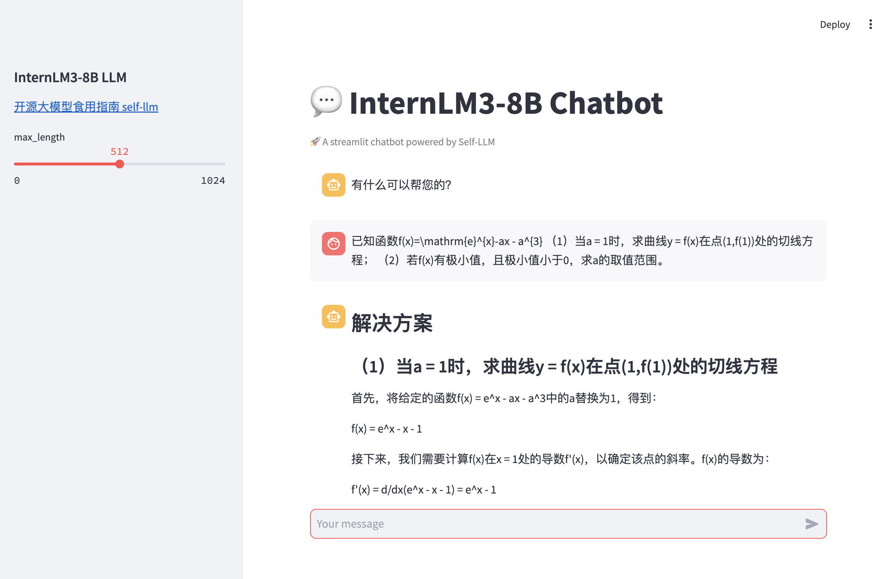

# InternLM3-8B-Instruct WebDemo 部署

## 环境配置

实验所依赖的基础开发环境如下：

```
----------------
ubuntu 22.04
Python 3.12.3
cuda 12.1
pytorch 2.3.0
----------------
```
> 本文默认学习者已安装好以上 Pytorch(cuda) 环境，如未安装请自行安装。

首先 `pip` 换源加速下载并安装依赖包：

```shell
# 升级pip
python -m pip install --upgrade pip
# 更换 pypi 源加速库的安装
pip config set global.index-url https://pypi.tuna.tsinghua.edu.cn/simple

# FastAPI 相关依赖
pip install requests==2.32.3
pip install fastapi==0.104.1
pip install uvicorn==0.24.0

# Langchain 相关依赖
pip install langchain==0.3.7

# WebDemo 相关依赖
pip install streamlit==1.41.1

# LoRA微调 相关依赖
pip install peft==0.11.1          # 用于 LoRA 微调

# 通用依赖
pip install modelscope==1.22.0    # 用于模型下载和管理
pip install transformers==4.47.1  # Hugging Face 的模型库，用于加载和训练模型
pip install sentencepiece==0.2.0  # 用于处理文本数据
pip install accelerate==0.34.2    # 用于分布式训练和混合精度训练
pip install datasets==2.20.0      # 用于加载和处理数据集
```

> 考虑到部分同学配置环境可能会遇到一些问题，我们在 AutoDL 平台准备了 InternLM3-8b-Instruct 的环境镜像，点击下方链接并直接创建 AutoDL 示例即可。
> ***https://www.codewithgpu.com/i/datawhalechina/self-llm/InternLM3-self-llm***

## 模型下载

`modelscope` 是一个模型管理和下载工具，支持从魔搭 (Modelscope) 等平台快速下载模型。

这里使用 `modelscope` 中的 `snapshot_download` 函数下载模型，第一个参数 `model_name_or_path` 为模型名称或者本地路径，第二个参数 `cache_dir` 为模型的下载路径，第三个参数 `revision` 为模型的版本号。

在 `/root/autodl-tmp` 路径下新建 `model_download.py` 文件并在其中粘贴以下代码，并保存文件。

```python
from modelscope import snapshot_download

model_dir = snapshot_download('Shanghai_AI_Laboratory/internlm3-8b-instruct', cache_dir='./', revision='master')
```

> 注意：记得修改 cache_dir 为你的模型下载路径哦~

在终端运行 `python /root/autodl-tmp/model_download.py` 执行下载，模型大小为 18GB 左右，下载模型大概需要5-30分钟。

## 代码准备

在`/root/autodl-tmp`路径下新建 `chatBot.py` 文件并在其中输入以下内容，粘贴代码后记得保存文件。下面的代码有很详细的注释，大家如有不理解的地方，欢迎提出 issue。

```python
# 导入所需的库
from transformers import AutoTokenizer, AutoModelForCausalLM, GenerationConfig, TextIteratorStreamer
from threading import Thread
import torch
import streamlit as st

# 在侧边栏中创建一个标题和一个链接
with st.sidebar:
    st.markdown("## InternLM3-8B LLM")
    "[开源大模型食用指南 self-llm](https://github.com/datawhalechina/self-llm.git)"
    # 创建一个滑块，用于选择最大长度，范围在0到1024之间，默认值为512
    max_length = st.slider("max_length", 0, 1024, 512, step=1)

# 创建一个标题和一个副标题
st.title("💬 InternLM3-8B Chatbot")
st.caption("🚀 A streamlit chatbot powered by Self-LLM")

# 定义模型路径
model_name_or_path = '/root/autodl-tmp/Shanghai_AI_Laboratory/internlm3-8b-instruct'

# 定义一个函数，用于获取模型和tokenizer
@st.cache_resource
def get_model():
    # 从预训练的模型中获取tokenizer
    tokenizer = AutoTokenizer.from_pretrained(model_name_or_path, use_fast=False, trust_remote_code=True)
    # 从预训练的模型中获取模型，并设置模型参数
    model = AutoModelForCausalLM.from_pretrained(model_name_or_path, torch_dtype=torch.bfloat16,  device_map="auto", trust_remote_code=True)
  
    return tokenizer, model

# 加载 InternLM3-8B 的model和tokenizer
tokenizer, model = get_model()

# 如果session_state中没有"messages"，则创建一个包含默认消息的列表
if "messages" not in st.session_state:
    st.session_state["messages"] = [{"role": "assistant", "content": "有什么可以帮您的？"}]

# 遍历session_state中的所有消息，并显示在聊天界面上
for msg in st.session_state.messages:
    st.chat_message(msg["role"]).write(msg["content"])

# 如果用户在聊天输入框中输入了内容，则执行以下操作
if prompt := st.chat_input():
    # 将用户的输入添加到session_state中的messages列表中
    st.session_state.messages.append({"role": "user", "content": prompt})
    # 在聊天界面上显示用户的输入
    st.chat_message("user").write(prompt)
    
    # 构建输入     
    input_ids = tokenizer.apply_chat_template(st.session_state.messages,tokenize=False,add_generation_prompt=True)
    model_inputs = tokenizer([input_ids], return_tensors="pt")['input_ids'].to('cuda')

    
    streamer = TextIteratorStreamer(tokenizer=tokenizer, skip_special_tokens=True, skip_prompt=True)
    kwargs = {'inputs': model_inputs, 'streamer': streamer, 'max_new_tokens': max_length}

    # Generation
    thread = Thread(target=model.generate, kwargs=kwargs)
    thread.start()


    # 在聊天界面上显示模型的输出
    with st.chat_message("assistant"):
        response = st.write_stream(streamer)
    # 将模型的输出添加到session_state中的messages列表中
    st.session_state.messages.append({"role": "assistant", "content": response})
```

## 运行 demo

在终端中运行以下命令，启动 streamlit 服务，`server.port` 可以更换端口

```bash
streamlit run /root/autodl-tmp/chatBot.py --server.address 127.0.0.1 --server.port 6006
```

在本地浏览器中打开链接 http://localhost:6006/ ，即可查看部署的 `WebDemo` 聊天界面。运行效果如下：


