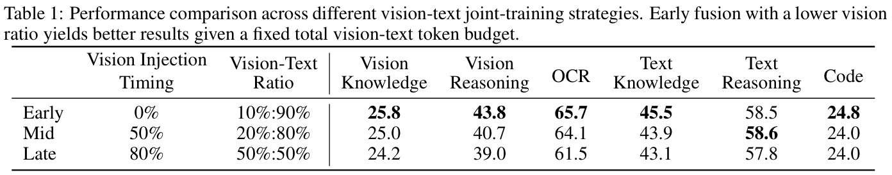
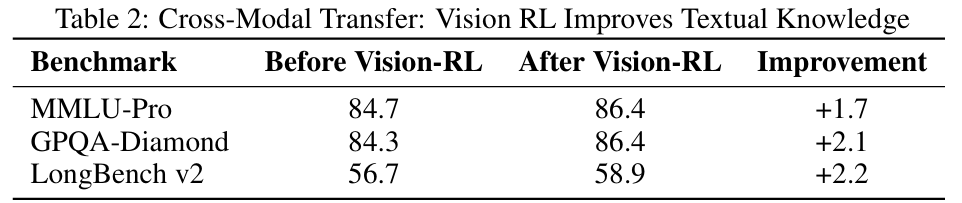
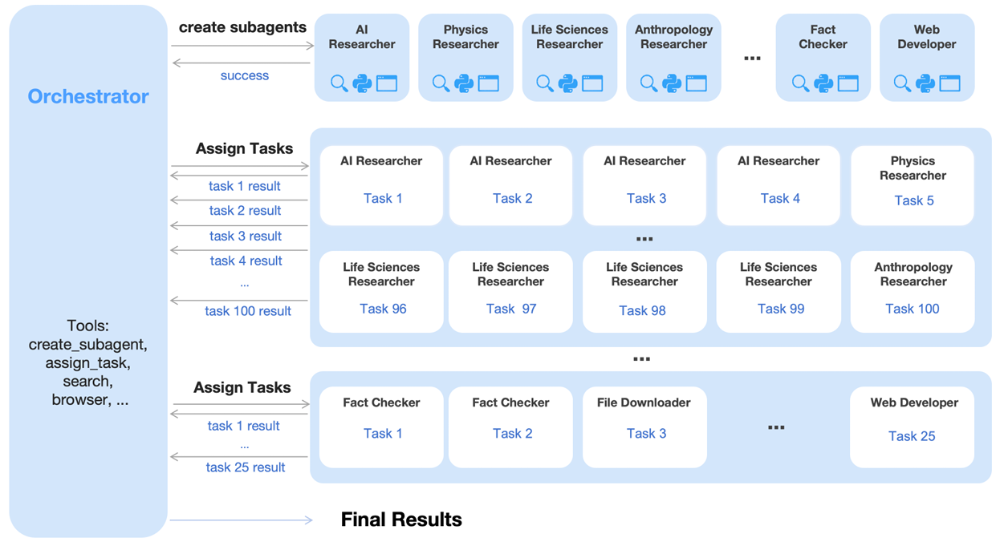
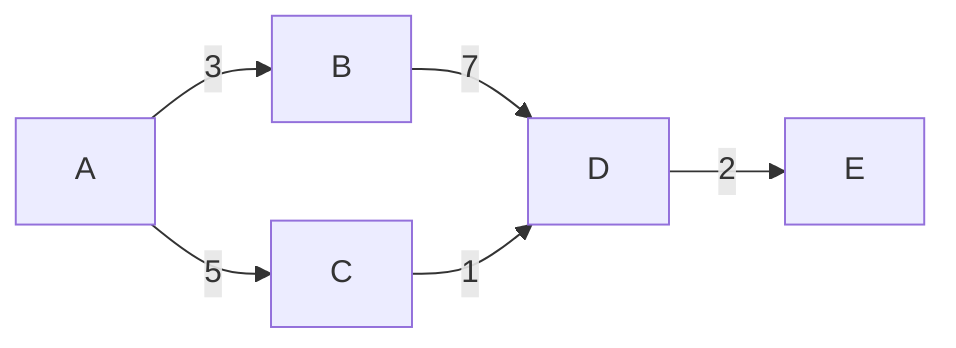
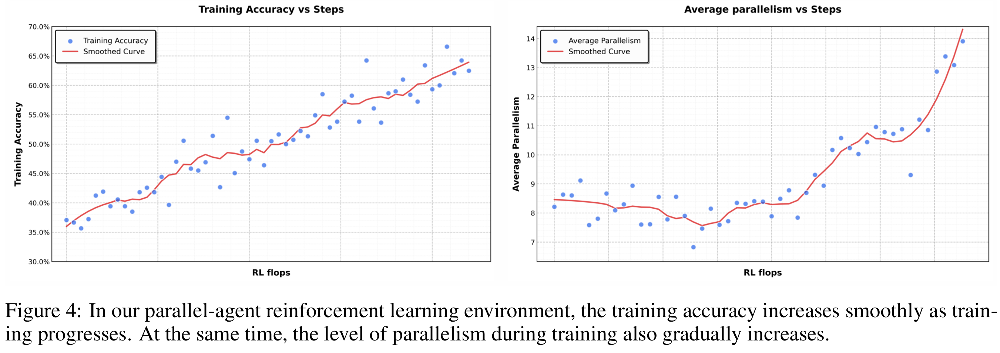
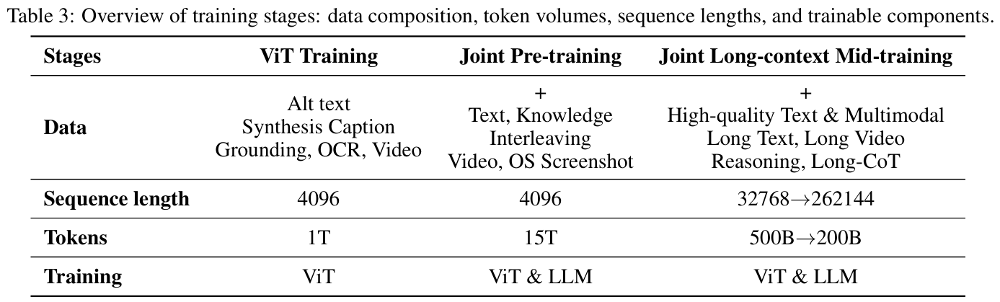
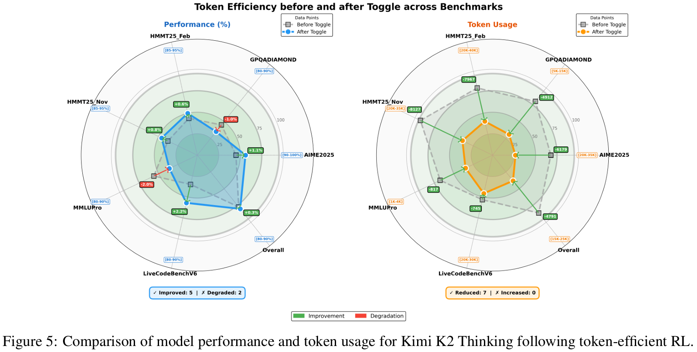

# Kimi-K2.5 论文解读

Kimi-K2.5 是一个**开源的**，**原生多模态**的 **agentic model**。正如 Kimi-K2.5 在发布时所引用的那句话 “The soul never thinks without a mental image” 一样，多模态能力对于实现更强大的智能至关重要。因此，接下来将围绕**多模态**和**智能体**两个关键词对于 Kimi-K2.5 的技术报告进行解读。先附上一个简易目录。

- [图文联合优化（Joint Optimization of Text and Vision）](#图文联合优化joint-optimization-of-text-and-vision)
    - [原生多模态预训练](#原生多模态预训练)
    - [零视觉 SFT](#零视觉-sft)
    - [多模态联合强化学习](#多模态联合强化学习)
- [智能体集群（Agent Swarm）](#智能体集群agent-swarm)
    - [并行智能体强化学习（PARL）](#并行智能体强化学习parl)
- [Kimi-K2.5 架构与训练](#kimi-k25-架构与训练)
    - [MoonViT 3D 压缩策略](#moonvit-3d-压缩策略)
    - [训练策略](#训练策略)

## 图文联合优化（Joint Optimization of Text and Vision）

> K2.5 emphasizes the joint optimization of text and vision so that two modalities enhance each other. 
>
> K2.5 强调文本模态与视觉模态的联合优化，使两种模态互相增强。

在预训练方面，不同于之前的方法（在靠后的训练阶段，才给文本模型加入视觉 token），Kimi-K2.5 **在训练早期就以较低比例混入了视觉数据**。

在架构方面，Kimi-K2.5 使用了 MoonViT-3D。为了理解视频，还引入了一种轻量化的 3D ViT 压缩策略。即，连续的4帧视为一组，经过相同的 MoonViT 处理后，并在时间维度对 patch 进行平均。

在后训练方面，Kimi-K2.5 采用了**零视觉 SFT**，即**仅使用文本数据激活模型的视觉推理和工具调用能力**。此外，Kimi-K2.5 还在文本和视觉任务上应用了联合强化学习。**视觉任务上的强化学习不仅不会损害文本能力，反而会提升。同时，文本任务上的强化学习也会促进视觉能力。**

### 原生多模态预训练

先前的方法会在训练后期以较高比例（比如大于50%）混入视觉数据，**将视觉能力进行事后追加**。

但是，经过实验，**早期以较低比例混入视觉数据可以得到更好的效果**，这有助于模型获得较为均衡的多模态表征。



### 零视觉 SFT

为了让预训练的 VLM 获得基于视觉的工具调用能力，Kimi-K2.5 **仅使用文本数据来进行 SFT**，作为后续视觉强化学习的冷启动。所有的图片操作均通过 IPython 进行代理。

这种**零视觉 SFT**训练，激活了模型多种推理行为。包括物体大小估计（通过二值化和计数），并泛化到各种视觉定位任务（物体定位、计数和 OCR）。

此外，实验说明，视觉-文本 SFT 的效果不如仅文本 SFT，这可能是因为缺少高质量的视觉数据。

### 多模态联合强化学习

由于零视觉 SFT，视觉输入有时候会被忽略。因此，在视觉理解任务上采用了基于结果的强化学习。主要分为三类：**视觉定位与计数**、**图表与文档理解**、**依赖视觉的 STEM** （数学、科学等）任务。

根据下表实验结果，**基于结果的视觉强化学习对于文本能力的强化也起到了作用**。视觉强化学习增强校准了需要结构化信息提取的领域，就像是减少了视觉基础推理（技术、OCR）的查询的不确定性。**视觉强化学习可以增强文本推理能力，而不是降低语言能力。**



因此，Kimi-K2.5 采用了多模态联合强化学习，不再按照输入模态组织，而是按照能力（知识、推理、代码、agent）来组织 RL。同时，生成式奖励模型（Generative Reward Model）打破了模态的障碍。

## 智能体集群（Agent Swarm）

> The limited capacity of a single agent working through each step one by one can lead to the exhaustion of practical
reasoning depth and tool-call budgets, ultimately hindering the system’s ability to handle more complex scenarios.
> 
> 单个智能体依次逐步执行任务的有限能力，可能导致实际推理深度和工具调用配额的耗尽，最终阻碍系统处理更复杂场景的能力。

Agent Swarm 可谓是 Kimi-K2.5 引入的最有趣的内容。正如技术报告中所说，K2.5 不是将任务执行视为推理链，也不是预定义的并行化启发式方法，而是通过**动态任务分解，子 agent 实例化和并行任务调度来启动智能体的集群**。如下图所示，智能体集群由一个超级智能体 Orchestrator 通过调用 `create_subagent` 实现子 agent 的创建以及任务的拆分与分发。



### 并行智能体强化学习（PARL）

为了实现“何时并行，如何并行”，Kimi-K2.5 采用了 RL 的方法来进行探索学习。具体地，强化学习过程中的 reward 设计为：

$r_{\text{PARL}}(x, y) = \lambda_1 r_{\text{parallel}} + \lambda_2 r_{\text{finish}} + r_{\text{perf}}(x, y)$

其中， $x$ 是任务， $y$ 是解法。奖励函数的三部分分别评估了：并行度、子任务完成率，任务 $x$ 的完成表现。

并行度奖励虽然鼓励模型生成更加并行化的任务拆分，但也引入了**生成无效子 agent 来骗取并行度**的 reward hacking 嫌疑。但是子任务完成率一项通过关注子 agent 有没有把事情做完来避免虚假并行。

为了衡量并行智能体的计算开销，类比于图中的关键路径，关键步骤（Critical Steps）被提出。定义为：

<details>
<summary>图中的关键路径</summary>



如上图所示，A->B->D->E 的总开销为 3+7+2=12，而 A->C->D->E 的开销为 5+1+2=8，因此 A->B->D->E 为该图的关键路径。

</details>

$\text{CriricalSteps} = \sum_{t=1}^T (S_{\text{main}}^{(t)} + \max_i S_{\text{sub}}^{(t)})$

对于每一个时刻，关键步骤的组成为：主 agent 的行动步骤数 + 最长耗时的子 agent 的行动步骤数。在该指标下，**不减少最大执行时间的过多子任务创建没有益处，均衡的任务分解才有用。**

如下图所示，随着 PARL 的进行，准确率与 agent 并行度都有明显增长。



## Kimi-K2.5 架构与训练

### MoonViT 3D 压缩策略

> 连续的4帧视为一组，经过相同的 MoonViT 处理后，并在时间维度对 patch 进行平均。

**连续的4帧作为一组的具体代码**位于 https://huggingface.co/moonshotai/Kimi-K2.5/blob/main/kimi_k25_vision_processing.py#L63-L98 。

具体地，就是首先根据视频的原始帧率与采样帧率计算出待采样帧的索引，然后采样真实的视频帧，接着每4个连续的采样帧作为一个 `video_chunk` 以备后续处理。

而**压缩策略的具体代码**位于 https://huggingface.co/moonshotai/Kimi-K2.5/blob/main/modeling_kimi_k25.py#L623-L625 。

在经过 MoonViT 处理后，得到的视觉信息序列的 shape 为 `[L, D]`。此时根据 `grid_thws` 拿回原本的时间信息、高度方向的 patch 数目，宽度方向的 patch 数目，就可以将**patch 长度信息重新解析回时-空信息**，从而对时间维度进行平均。相关处理函数如下：

<details>
<summary>时间维度 patch 平均代码</summary>

```python
def tpool_patch_merger(
        x: torch.Tensor,
        grid_thws: torch.Tensor,
        merge_kernel_size: tuple[int, int] = (2, 2),
) -> list[torch.Tensor]:
    d_model = x.size(-1)

    outputs = []
    pre_sum = 0
    for t, h, w in grid_thws.tolist():
        # Get the current sequence
        seq = x[pre_sum:pre_sum + t * h * w]
        # Reshape along self.merge_kernel_size and concat to the last dimension
        kernel_height, kernel_width = merge_kernel_size
        new_height, new_width = h // kernel_height, w // kernel_width
        reshaped_seq = seq.view(t, new_height, kernel_height, new_width,
                                kernel_width, d_model)
        reshaped_seq = reshaped_seq.permute(0, 1,
                                            3, 2, 4, 5).contiguous().mean(
                                                dim=0)  # temporal pooling
        padded_seq = reshaped_seq.view(new_height * new_width,
                                       kernel_height * kernel_width, -1)
        outputs.append(padded_seq)
        pre_sum += t * h * w

    return outputs
```
</details>

### 训练策略

#### 预训练

如下表所示，Kimi-K2.5 的预训练基于 Kimi-K2，使用了约 15T tokens。首先，单独训练 ViT；其次，联合训练，增强语言-视觉能力；最后，用高质量数据和长文本数据进一步提升能力，并拓展上下文窗口。



MoonViT-3D 从 SigLIP 继续预训练而来，训练数据包括图像替代文本、图像视频的合成标签、检测框和 OCR 文本。在第一阶段，通过描述损失函数将 MoonViT-3D 与 Moonlight-16B-A3B 进行对齐，**主要让 ViT 理解高分辨率图像和视频**。在第二阶段，只开放连接 MoonViT-3D 与 1T 参数的 LLM 的 projector 的训练。

在联合训练阶段，首先通过引入独特的 token，调整数据比例和增加代码数据，以拓展预训练分布。

在预训练的第三阶段（高质量&长文本）时，通过 YaRN 来拓展上下文窗口。

#### 后训练

SFT 训练阶段主要通过一系列模型（K2、K2 Thinking、内部模型）构造了高质量的回复。最终构造了一个大规模指令优化数据集，以让模型优先关注互动推理和精确的工具调用。

在 RL 阶段，优化目标为：

$L_{\text{RL}}(\theta) = \mathbb{E}_{x \sim \mathcal{D}} [ \frac{1}{N} \sum_{j=1}^{K} \sum_{i=1}^{|y_j|} \mathrm{Clip} ( \frac{\pi_\theta(y_j^i | x, y_j^{0:i})}{\pi_{\text{old}}(y_j^i | x, y_j^{0:i})}, \alpha, \beta ) (r(x, y_j) - \bar{r}(x)) - \tau ( \log \frac{\pi_\theta(y_j^i | x, y_j^{0:i})}{\pi_{\text{old}}(y_j^i | x, y_j^{0:i})} )^2 ]$

具体地，引入了一个 token 级的剪裁机制来**缓解训练与推理不一致的问题**，只计算策略比例落在 $[\alpha, \beta]$ 范围的 token 的梯度。不同于 PPO，该方案只考虑比例范围，而不考虑优势的符号。

在奖励函数方面，通用任务使用生成式奖励模型（Generative Reward Model）；视觉定位和点定位任务，使用 F1-score 和软匹配；分割任务，使用 IoU；OCR 任务使用归一化编辑距离；计数任务使用预测值与真实值的绝对差值。此外，还合成了复杂的视觉 puzzle，并使用 Kimi-K2 作为验证。

此外，Kimi-K2.5 还应用了 Token Efficient RL，以激励模型生成更简洁的推理过程。具体地，对于 iteration $t$，奖励函数为

$\tilde{r}(x, y) = \begin{cases} r(x, y) \cdot \mathbb{I} \{ \frac{1}{K} \sum_{i=1}^{K} r(x, y_i) < \lambda \text{ or } |y_i| \leq \text{budget}(x) \}, & \text{if } \lfloor t/m \rfloor \mod 2 = 0 \text{ (Phase0)} \\ r(x, y), & \text{if } \lfloor t/m \rfloor \mod 2 = 1 \text{ (Phase1)} \end{cases}$

其中，$\lambda$ 和 $m$ 是超参数，$K$ 是采样次数，算法每隔 $m$ 个 iteration 交替阶段。

在阶段0，当模型的准确率超过阈值时，**鼓励模型在 token budget 内完成**。在阶段1，鼓励模型使用更多的计算资源提升表现。Token budget 具体为**正确的响应的长度集合的第 $\rho$ 百分位**，$\text{budget}(x) = \text{Percentile}(\{|y_j| | r(x, y_i) = 1, i=1, \ldots, K\}, \rho)$。

如下图所示，经过 token efficient RL 后，模型表现几乎没有变化，而模型的 token 使用量有明显下降。


