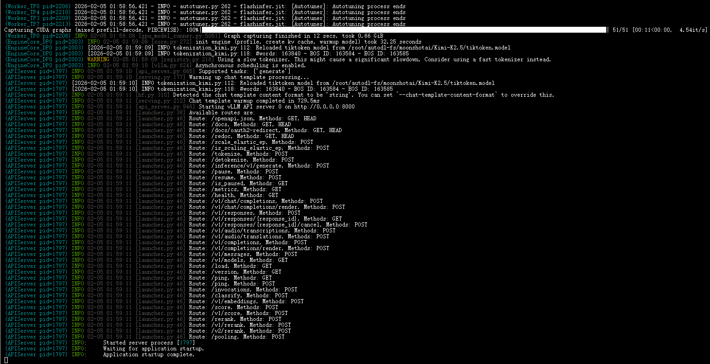
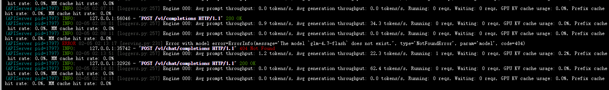

# 02-KiMi-2.5 vLLM 部署调用

## **vLLM 简介**

`vLLM` 框架是一个高效的大语言模型**推理和部署服务系统**，具备以下特性：

- **高效的内存管理**：通过 `PagedAttention` 算法，`vLLM` 实现了对 `KV` 缓存的高效管理，减少了内存浪费，优化了模型的运行效率。
- **高吞吐量**：`vLLM` 支持异步处理和连续批处理请求，显著提高了模型推理的吞吐量，加速了文本生成和处理速度。
- **易用性**：`vLLM` 与 `HuggingFace` 模型无缝集成，支持多种流行的大型语言模型，简化了模型部署和推理的过程。兼容 `OpenAI` 的 `API` 服务器。
- **分布式推理**：框架支持在多 `GPU` 环境中进行分布式推理，通过模型并行策略和高效的数据通信，提升了处理大型模型的能力。
- **开源共享**：`vLLM` 由于其开源的属性，拥有活跃的社区支持，这也便于开发者贡献和改进，共同推动技术发展。

## 环境准备

本文基础环境如下：

```
----------------
ubuntu 22.04
python 3.12
cuda 12.8
pytorch 2.8.0
----------------
```

> 本文默认学习者已配置好以上 `Pytorch (cuda)` 环境，如未配置请先自行安装。

首先 `pip` 换源加速下载并安装依赖包

```bash
python -m pip install --upgrade pip
pip config set global.index-url https://pypi.tuna.tsinghua.edu.cn/simple

pip install modelscope
pip install vllm
```

> 考虑到部分同学配置环境可能会遇到一些问题，我们在 AutoDL 平台准备了 KiMi-2.5 的环境镜像，点击下方链接并直接创建 Autodl 示例即可。
> ***[datawhalechina/self-llm/KIMI-2.5-vllm | AutoDL](https://www.codewithgpu.com/i/datawhalechina/self-llm/KIMI-2.5-vllm)***

## 模型下载

使用 modelscope 中的 snapshot_download 函数下载模型，第一个参数为模型名称，参数 cache_dir 为模型的下载路径。

新建 `model_download.py` 文件并在其中输入以下内容，粘贴代码后记得保存文件。

```python
from modelscope import snapshot_download

model_dir = snapshot_download('moonshotai/Kimi-K2.5', cache_dir='/root/autodl-tmp', revision='master')
```

然后在终端中输入 `python model_download.py` 执行下载，这里需要耐心等待一段时间直到模型下载完成。

> 注意：记得修改 `cache_dir` 为你的模型下载路径哦~

## **代码准备**

### **Python 脚本**

新建 `vllm_model.py` 文件并在其中输入以下内容，粘贴代码后请及时保存文件。下面的代码有很详细的注释，如有不理解的地方，欢迎大家提 `issue`。

首先从 `vLLM` 库中导入 `LLM` 和 `SamplingParams` 类。`LLM` 类是使用 `vLLM` 引擎运行离线推理的主要类。`SamplingParams` 类指定采样过程的参数，用于控制和调整生成文本的随机性和多样性。

`vLLM` 提供了非常方便的封装，我们直接传入模型名称或模型路径即可，不必手动初始化模型和分词器。

然后，通过使用分词器的 apply_chat_template 函数，将我们的 prompt（提示词）格式化为模型所需的输入格式。

我们可以通过这个代码示例熟悉下 ` vLLM` 引擎的使用方式。被注释的部分内容可以丰富模型的能力，但不是必要的，大家可以按需选择，自己多多动手尝试 ~

```python
from vllm import LLM, SamplingParams
from transformers import AutoTokenizer
import os
import json

# 自动下载模型时，指定使用modelscope; 否则，会从HuggingFace下载
os.environ['VLLM_USE_MODELSCOPE']='True'

def get_completion(prompts, model, tokenizer=None, temperature=0.6, top_p=0.95, top_k=20, min_p=0, max_tokens=4096, max_model_len=8192):
    stop_token_ids = [151645, 151643]
    # 创建采样参数。temperature 控制生成文本的多样性，top_p 控制核心采样的概率，top_k 通过限制候选词的数量来控制生成文本的质量和多样性, min_p 通过设置概率阈值来筛选候选词，从而在保证文本质量的同时增加多样性
    sampling_params = SamplingParams(temperature=temperature, top_p=top_p, top_k=top_k, min_p=min_p, max_tokens=max_tokens, stop_token_ids=stop_token_ids)  # max_tokens 用于限制模型在推理过程中生成的最大输出长度
    # 初始化 vLLM 推理引擎
    llm = LLM(model=model, tokenizer=tokenizer, max_model_len=max_model_len,trust_remote_code=True, tensor_parallel_size=8)  # max_model_len 用于限制模型在推理过程中可以处理的最大输入和输出长度之和。
    outputs = llm.generate(prompts, sampling_params)
    return outputs


if __name__ == "__main__":
    # 初始化 vLLM 推理引擎
    model='/root/autodl-fs/moonshotai/Kimi-K2.5' # 指定模型路径
    tokenizer = AutoTokenizer.from_pretrained(model) # 加载分词器

    prompt = "给我一个关于大模型的简短介绍。"
    messages = [
        {"role": "user", "content": prompt}
    ]
    text = tokenizer.apply_chat_template(
        messages,
        tokenize=False,
        add_generation_prompt=True,
        enable_thinking=True  # 是否开启思考模式，默认为 True
    )

    outputs = get_completion(text, model, tokenizer=None, temperature=0.6, top_p = 0.95, top_k=20, min_p=0)  # 对于思考模式，官方建议使用以下参数：temperature = 0.6，TopP = 0.95，TopK = 20，MinP = 0。

    # 输出是一个包含 prompt、生成文本和其他信息的 RequestOutput 对象列表。
    # 打印输出。
    for output in outputs:
        prompt = output.prompt
        generated_text = output.outputs[0].text
        print(f"Prompt: {prompt!r}, \nResponse: {generated_text!r}")
```

运行代码

```bash
python vllm_model.py
```

结果如下：

```bash
Prompt: '<|im_user|>user<|im_middle|>给我一个关于大模型的简短介绍。<|im_end|><|im_assistant|>assistant<|im_middle|><think>', 
Response: ' 用户要求一个关于大模型的简短介绍。我需要提供一个简洁、准确且全面的概述，涵盖大模型的基本概念、特点和应用。\n\n关键点应该包括：\n1. 什么是大模型（Large Language Models/LLMs或Foundation Models）\n2. 核心特点（参数规模大、训练数据多、涌现能力等）\n3. 主要应用领域\n4. 简要的技术背景（Transformer架构、预训练+微调范式）\n5. 当前主流代表（GPT、Claude、文心一言等）\n\n需要保持简短，控制在200-300字左右，语言通俗易懂但专业准确。\n\n结构建议：\n- 定义（1-2句）\n- 技术特点（1-2句）\n- 能力表现（1-2句）\n- 应用场景（1句）\n- 局限性提示（可选，简要）\n\n让我组织一下内容：\n\n大模型（Large Language Models，LLM）是基于深度学习技术的人工智能系统，通常包含数十亿至数千亿参数，通过海量文本数据训练而成。它们以Transformer架构为基础，采用"预训练+微调"的技术路线，具备强大的语言理解、生成和推理能力。\n\n这类模型的核心特征包括规模效应（参数越多能力越强）、上下文学习（In-context Learning）和涌现能力（Emergent Abilities）。典型代表如GPT-4、Claude、文心一言等，已广泛应用于智能客服、内容创作、代码生成、知识问答等领域。\n\n尽管大模型展现出接近人类的语言交互能力，但仍存在幻觉（生成虚假信息）、知识时效性等局限，通常需要结合检索增强（RAG）等技术来提升可靠性。\n\n字数检查：约200字，符合"简短介绍"的要求。内容涵盖了定义、技术、应用和局限，比较全面。 </think> 大模型（Large Language Models，LLM）是基于深度学习的人工智能系统，通常包含数十亿至数千亿参数，通过海量文本数据训练而成。它们以Transformer架构为基础，采用"预训练+微调"的技术路线，具备强大的语言理解、生成和推理能力。\n\n这类模型的核心特征包括**规模效应**（参数越多能力越强）、**上下文学习**（无需微调即可适应新任务）和**涌现能力**（复杂能力的突然出现）。典型代表如GPT-4、Claude、文心一言等，已广泛应用于智能客服、内容创作、代码生成、知识问答等领域。\n\n尽管大模型展现出接近人类的语言交互能力，但仍存在**幻觉**（生成虚假信息）、知识时效性等局限，实际应用中常需结合检索增强（RAG）等技术提升可靠性。'
```

模型的 response 由两部分组成，一部分是思考过程，用\<think>和\</think>包裹住，另一部分是最终答案，在\</think>标识符之后。

### 创建兼容 OpenAI API 接口的服务器

`KiMi-2.5` 兼容 `OpenAI API` 协议，所以我们可以直接使用 `vLLM` 创建 `OpenAI API` 服务器。`vLLM` 部署实现 `OpenAI API` 协议的服务器非常方便。默认会在 http://localhost:8000 启动服务器。服务器当前一次托管一个模型，并实现列表模型、`completions` 和 `chat completions` 端口。

- `completions`：是基本的文本生成任务，模型会在给定的提示后生成一段文本。这种类型的任务通常用于生成文章、故事、邮件等。
- `chat completions`：是面向对话的任务，模型需要理解和生成对话。这种类型的任务通常用于构建聊天机器人或者对话系统。

在创建服务器时，我们可以指定模型名称、模型路径、聊天模板等参数。

- `--host` 和 `--port` 参数指定地址。
- `--model` 参数指定模型名称。
- `--chat-template` 参数指定聊天模板。
- `--served-model-name` 指定服务模型的名称。
- `--max-model-len` 指定模型的最大长度。
- `--enable-reasoning` 开启思考模式
- `--reasoning-parser` 指定如何解析模型生成的推理内容。设置 --enable-reasoning 参数时，--reasoning-parser 是必需的。推理模型会在输出中包含一个额外的 reasoning_content 字段，该字段包含导致最终结论的推理步骤。通过指定合适的解析器，可以正确提取和格式化这些推理内容。

我们复制以下命令到终端上，就可以成功启动 KiMi-2.5 模型的 API 接口

```bash
VLLM_USE_MODELSCOPE=true vllm serve /root/autodl-fs/moonshotai/Kimi-K2.5 -tp 8 --max_model_len 8192 --trust-remote-code --tool-call-parser kimi_k2 --reasoning-parser kimi_k2
```

加载完毕后出现如下信息说明服务成功启动



- 通过 `curl` 命令查看当前的模型列表

```bash
curl http://localhost:8000/v1/models
```

得到的返回值如下所示

```json
{
    "object": "list",
    "data": [
        {
            "id": "/root/autodl-fs/moonshotai/Kimi-K2.5",
            "object": "model",
            "created": 1770228068,
            "owned_by": "vllm",
            "root": "/root/autodl-fs/moonshotai/Kimi-K2.5",
            "parent": null,
            "max_model_len": 8192,
            "permission": [
                {
                    "id": "modelperm-91d23e09c5068ccb",
                    "object": "model_permission",
                    "created": 1770228068,
                    "allow_create_engine": false,
                    "allow_sampling": true,
                    "allow_logprobs": true,
                    "allow_search_indices": false,
                    "allow_view": true,
                    "allow_fine_tuning": false,
                    "organization": "*",
                    "group": null,
                    "is_blocking": false
                }
            ]
        }
    ]
}
```

- 用 `curl` 命令测试 `OpenAI Chat Completions API`

```bash
curl http://localhost:8000/v1/completions \
    -H "Content-Type: application/json" \
    -d '{
        "model": "/root/autodl-fs/moonshotai/Kimi-K2.5",
        "prompt": "我想问你，什么是深度学习算法？<think>\n",
        "max_tokens": 1024,
        "temperature": 0
    }'
```

得到的返回值如下所示

```json
{
    "id": "cmpl-899843517a844968",
    "object": "text_completion",
    "created": 1770228473,
    "model": "/root/autodl-fs/moonshotai/Kimi-K2.5",
    "choices": [
        {
            "index": 0,
            "text": "深度学习算法是机器学习的一个子集，它基于人工神经网络，特别是具有多个隐藏层的神经网络（因此称为“深度”）。这些算法通过模拟人脑处理信息的方式来学习数据的复杂模式和表示。\n\n## 核心特点\n\n| 特点 | 说明 |\n|------|------|\n| **多层结构** | 包含输入层、多个隐藏层和输出层 |\n| **自动特征提取** | 无需人工设计特征，自动从原始数据中学习 |\n| **端到端学习** | 直接从输入映射到输出 |\n| **大数据需求** | 通常需要大量训练数据 |\n| **计算密集** | 依赖GPU等硬件加速 |\n\n## 主要架构类型\n\n1. **卷积神经网络 (CNN)** — 图像处理、计算机视觉\n2. **循环神经网络 (RNN/LSTM)** — 序列数据、自然语言处理\n3. **Transformer** — 现代NLP主流（如GPT、BERT）\n4. **生成对抗网络 (GAN)** — 生成新数据\n5. **自编码器 (Autoencoder)** — 降维、特征学习\n\n## 简单比喻\n\n> 想象教小孩认猫：传统机器学习需要你先告诉它\"猫有尖耳朵、胡须、毛茸茸\"；而深度学习只需给它看成千上万张猫的照片，它自己就能总结出\"猫\"的概念。\n\n## 典型应用\n\n- 语音识别（Siri、Alexa）\n- 图像识别（人脸识别、医学影像）\n- 自然语言处理（机器翻译、ChatGPT）\n- 自动驾驶\n- 推荐系统\n\n你想深入了解哪个具体方面？比如训练过程、某种网络结构，或者实际应用？",
            "logprobs": null,
            "finish_reason": "stop",
            "stop_reason": 163586,
            "token_ids": null,
            "prompt_logprobs": null,
            "prompt_token_ids": null
        }
    ],
    "service_tier": null,
    "system_fingerprint": null,
    "usage": {
        "prompt_tokens": 9,
        "total_tokens": 352,
        "completion_tokens": 343,
        "prompt_tokens_details": null
    },
    "kv_transfer_params": null
}
```

- 用 `Python` 脚本请求 `OpenAI Chat Completions API`

```python
from openai import OpenAI
openai_api_key = "sk-xxx" # 随便填写，只是为了通过接口参数校验
openai_api_base = "http://localhost:8000/v1"

client = OpenAI(
    api_key=openai_api_key,
    base_url=openai_api_base,
)

chat_outputs = client.chat.completions.create(
    model="/root/autodl-fs/moonshotai/Kimi-K2.5",
    messages=[
        {"role": "user", "content": "什么是大模型？"},
    ]
)
print(chat_outputs)
```

```shell
python vllm_openai_chat_completions.py
```

得到的返回值如下所示

```
ChatCompletion(id='chatcmpl-af0cb04e8460c288', choices=[Choice(finish_reason='stop', index=0, logprobs=None, message=ChatCompletionMessage(content=' **大模型**（Large Models，通常指大语言模型LLM）是指参数量巨大（通常数十亿到数千亿级别）、训练数据海量、计算资源需求极高的机器学习模型，尤其是基于深度学习的模型。\n\n以下是核心要点解析：\n\n## 1. 本质特征：「大」在哪里？\n- **参数规模大**：从数十亿（如GPT-3有1750亿参数）到万亿级别（如GPT-4据传超过1万亿），这些参数是模型学习到的"知识"的数学表示\n- **训练数据大**：需要TB甚至PB级别的文本、图像、代码等数据（相当于阅读了人类大部分公开知识）\n- **计算资源大**：训练一次需要数千张高端GPU/TPU运行数周至数月，成本可达数百万美元\n\n## 2. 技术基础\n主要基于**Transformer架构**（2017年Google提出），通过"注意力机制"（Attention）理解文本中词语之间的长距离关联，突破传统RNN的顺序处理限制。\n\n## 3. 核心能力（涌现现象）\n当模型达到特定规模后，会突然表现出小模型不具备的能力：\n- **上下文理解**：理解复杂指令和长篇对话\n- **推理能力**：数学计算、逻辑推演、代码生成\n- **知识整合**：跨领域知识迁移和综合\n- **少样本学习**（Few-shot）：仅需几个示例就能掌握新任务\n\n## 4. 典型代表\n- **国外**：GPT-4/4o（OpenAI）、Claude（Anthropic）、Gemini（Google）、Llama（Meta）\n- **国内**：文心一言（百度）、通义千问（阿里）、讯飞星火、智谱ChatGLM、DeepSeek等\n\n## 5. 与中小模型的区别\n| 维度 | 大模型 | 传统小模型 |\n|------|--------|------------|\n| 参数 | 十亿级以上 | 百万-千万级 |\n| 训练方式 | 预训练+微调 | 针对特定任务训练 |\n| 泛化能力 | 通用性强，跨领域 | 专用性强，领域狭窄 |\n| 使用方式 | 提示词（Prompt）驱动 | 需要特征工程 |\n\n## 6. 局限性\n- **幻觉**（Hallucination）：可能生成看似合理但错误的信息\n- **计算成本高**：推理需要大量算力\n- **数据偏见**：可能继承训练数据中的偏见\n- **可解释性差**：内部决策机制如同"黑箱"\n\n**简单比喻**：如果把AI比作大脑，传统模型是专精某科的"专科生"（如只会识别猫狗的视觉模型），大模型则是博览群书的"通才博士"，能通过语言理解并处理各种复杂任务，但偶尔也会"一本正经地胡说八道"。', refusal=None, role='assistant', annotations=None, audio=None, function_call=None, tool_calls=[], reasoning=' 用户问的是"什么是大模型？"这是一个关于人工智能领域的基础概念问题。我需要用中文清晰、准确地解释这个概念。\n\n 大模型（Large Language Models 或 Large Models）的关键点包括：\n 1. 定义：参数量巨大的机器学习模型，通常是深度学习模型\n 2. 规模：数十亿到数千亿甚至万亿级别的参数\n 3. 技术基础：基于Transformer架构的神经网络\n 4. 训练数据：海量的文本、图像等多模态数据\n 5. 能力：涌现能力（Emergent abilities），如推理、生成、理解上下文等\n 6. 代表：GPT系列、BERT、文心一言、通义千问等\n 7. 应用：聊天机器人、代码生成、内容创作等\n\n 我应该从基础到深入，用通俗易懂的方式解释，同时保持技术准确性。\n\n 结构建议：\n 1. 简单定义（是什么）\n 2. 核心特征（为什么"大"）\n 3. 工作原理（简要技术解释）\n 4. 主要能力（能做什么）\n 5. 典型代表（举例）\n 6. 局限性（平衡视角）\n\n 避免过于技术化的术语，但关键概念如"参数"、"Transformer"、"预训练"等需要提及并简要解释。 ', reasoning_content=' 用户问的是"什么是大模型？"这是一个关于人工智能领域的基础概念问题。我需要用中文清晰、准确地解释这个概念。\n\n 大模型（Large Language Models 或 Large Models）的关键点包括：\n 1. 定义：参数量巨大的机器学习模型，通常是深度学习模型\n 2. 规模：数十亿到数千亿甚至万亿级别的参数\n 3. 技术基础：基于Transformer架构的神经网络\n 4. 训练数据：海量的文本、图像等多模态数据\n 5. 能力：涌现能力（Emergent abilities），如推理、生成、理解上下文等\n 6. 代表：GPT系列、BERT、文心一言、通义千问等\n 7. 应用：聊天机器人、代码生成、内容创作等\n\n 我应该从基础到深入，用通俗易懂的方式解释，同时保持技术准确性。\n\n 结构建议：\n 1. 简单定义（是什么）\n 2. 核心特征（为什么"大"）\n 3. 工作原理（简要技术解释）\n 4. 主要能力（能做什么）\n 5. 典型代表（举例）\n 6. 局限性（平衡视角）\n\n 避免过于技术化的术语，但关键概念如"参数"、"Transformer"、"预训练"等需要提及并简要解释。 '), stop_reason=163586, token_ids=None)], created=1770228828, model='/root/autodl-fs/moonshotai/Kimi-K2.5', object='chat.completion', service_tier=None, system_fingerprint=None, usage=CompletionUsage(completion_tokens=847, prompt_tokens=12, total_tokens=859, completion_tokens_details=None, prompt_tokens_details=None), prompt_logprobs=None, prompt_token_ids=None, kv_transfer_params=None)
```

- 用 `Python` 脚本请求 `OpenAI Chat Completions API`

```python
from openai import OpenAI

client = OpenAI(
    api_key="a", # 随便填
    base_url="http://localhost:8000/v1"
)

def add(a: float, b: float):
    return a + b

def mul(a: float, b: float):
    return a * b

def compare(a: float, b: float):
    if a > b:
        return f'{a} is greater than {b}'
    elif a < b:
        return f'{b} is greater than {a}'
    else:
        return f'{a} is equal to {b}'

def count_letter_in_string(a: str, b: str):
    string = a.lower()
    letter = b.lower()
  
    count = string.count(letter)
    return(f"The letter '{letter}' appears {count} times in the string.")


tools = [
{
    'type': 'function',
    'function': {
        'name': 'add',
        'description': 'Compute the sum of two numbers',
        'parameters': {
            'type': 'object',
            'properties': {
                'a': {
                    'type': 'int',
                    'description': 'A number',
                },
                'b': {
                    'type': 'int',
                    'description': 'A number',
                },
            },
            'required': ['a', 'b'],
        },
    }
}, 
{
    'type': 'function',
    'function': {
        'name': 'mul',
        'description': 'Calculate the product of two numbers',
        'parameters': {
            'type': 'object',
            'properties': {
                'a': {
                    'type': 'int',
                    'description': 'A number',
                },
                'b': {
                    'type': 'int',
                    'description': 'A number',
                },
            },
            'required': ['a', 'b'],
        },
    }
},
{
    'type': 'function',
    'function': {
        'name': 'count_letter_in_string',
        'description': 'Count letter number in a string',
        'parameters': {
            'type': 'object',
            'properties': {
                'a': {
                    'type': 'str',
                    'description': 'source string',
                },
                'b': {
                    'type': 'str',
                    'description': 'letter',
                },
            },
            'required': ['a', 'b'],
        },
    }
},
{
    'type': 'function',
    'function': {
        'name': 'compare',
        'description': 'Compare two number, which one is bigger',
        'parameters': {
            'type': 'object',
            'properties': {
                'a': {
                    'type': 'float',
                    'description': 'A number',
                },
                'b': {
                    'type': 'float',
                    'description': 'A number',
                },
            },
            'required': ['a', 'b'],
        },
    }
}
]

def function_call_playground(prompt):
    messages = [{'role': 'user', 'content': prompt}]
    response = client.chat.completions.create(
        model="/root/autodl-fs/moonshotai/Kimi-K2.5",
        messages = messages,
        temperature=0.01,
        top_p=0.95,
        stream=False,
        tools=tools)

    # print(response)
    func1_name = response.choices[0].message.tool_calls[0].function.name
    func1_args = response.choices[0].message.tool_calls[0].function.arguments
    func1_out = eval(f'{func1_name}(**{func1_args})')
    # print(func1_out)

    messages.append(response.choices[0].message)
    messages.append({
        'role': 'tool',
        'content': f'{func1_out}',
        'tool_call_id': response.choices[0].message.tool_calls[0].id
    })
    # print(messages)
    response = client.chat.completions.create(
        model="/root/autodl-fs/moonshotai/Kimi-K2.5",
        messages=messages,
        temperature=0.01,
        top_p=0.95,
        stream=False,
        tools=tools)
    return response.choices[0].message.content
  
prompts = [
    "用中文回答：strawberry中有多少个r?", 
    "用中文回答：9.11和9.9，哪个小?"
]

for prompt in prompts:
    print(function_call_playground(prompt))
```

```shell
python vllm_openai_chat_completions.py
```

得到的返回值如下所示

```
在字符串"strawberry"中，字母'r'出现了3次。
9.11比9.9小。

根据比较结果，9.9比9.11大，所以9.11更小。
```

另外，在以上所有的在请求处理过程中， `API` 后端都会打印相对应的日志和统计信息:


