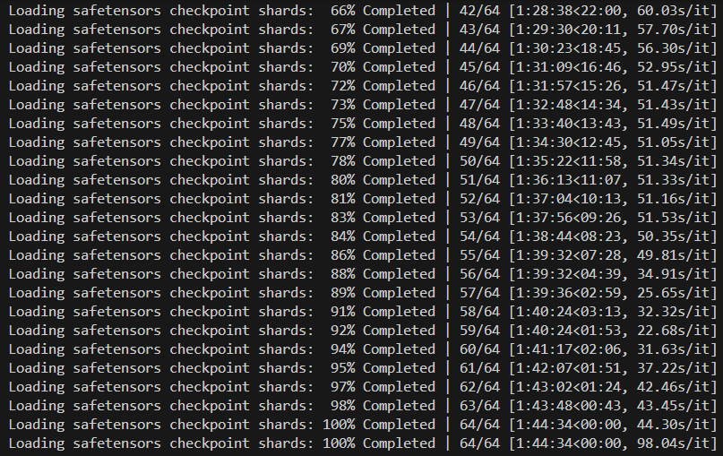
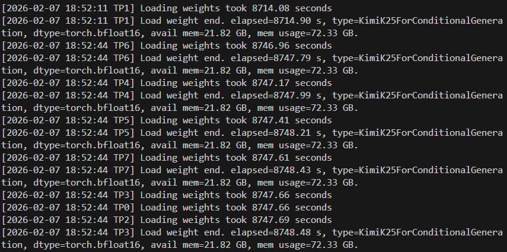
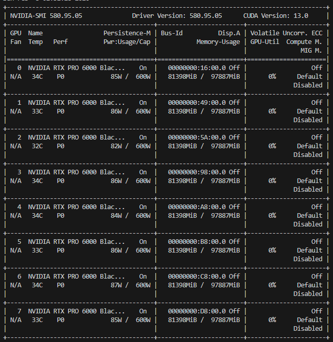
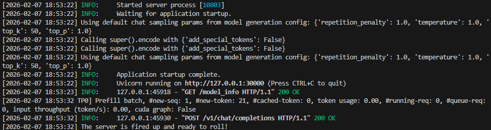

# 03-Kimi-2.5-SGLang部署应用

本教程旨在帮助学习者在本地环境上，利用 SGLang 框架高效部署最新的 **Kimi 2.5 (K2.5)** 模型。


## 本地部署的必要性

1.  **数据隐私与安全**：无需将敏感数据上传至云端，所有对话和处理均在本地内网完成，确保数据合规性。
2.  **极低延迟**：消除网络传输波动，满足高频实时交互或自动化 Agent 任务的性能需求。
3.  **长期成本优势**：对于吞吐量极大的业务，本地部署能节省昂贵的 API 调用费用。


## SGLang、vLLM 与 Ollama 的对比分析

**SGLang**是一种高性能本地部署框架，其支持企业级的高并发场景，其倾向于半精度（FP16），跨设备、分布式能力较强；**Ollama**则适合个人轻量化本地运行，适合单设备部署，其主要采用4-bit量化，精度损失较大；而**vLLM**则介于二者之间，是工业级本地部署框架，支持较高的吞吐量，一般采用8-bit量化，是经济和精度的折中选择。本教程我们采用SGLang框架对于Kimi-2.5进行本地部署。


## 实验环境

*   **硬件**：NVIDIA RTX PRO 6000 (96GB) × 8卡
*   **操作系统**：Ubuntu 22.04
*   **CUDA 版本**：12.8
*   **Python 版本**：3.12
*   **PyTorch 版本**：2.8.0


## 模型下载

使用 ModelScope 提供的工具进行高速下载，确保模型文件的完整性。

```python
from modelscope import snapshot_download

# 下载 Kimi-K2.5 模型
model_dir = snapshot_download(
    'moonshotai/Kimi-K2.5', 
    cache_dir='./kimi_models', 
    revision='master'
)

print(f"模型下载完成，存储路径为: {model_dir}")
```


## 虚拟环境配置与 SGLang 启动

### 虚拟环境准备
```bash
# 创建并激活环境，明确 python 版本和安装 pip， -y则跳过各种确认
conda create -n sglang python=3.12 pip -y
conda activate sglang

# 更新 pip 版本
python -m pip install --upgrade pip
```

### Tips：学术加速
在AutoDL中，如果下载源码缓慢，可使用以下加速指令：
*   **开启加速**：`source /etc/network_turbo`
*   **关闭加速**：`unset http_proxy; unset https_proxy`

### SGLang 与特定依赖安装
传统的 `pip install sglang` 可能会在处理 Kimi 2.5 时遇到兼容性问题，根据官方 [`deploy_guidance.md`](https://huggingface.co/moonshotai/Kimi-K2.5/blob/main/docs/deploy_guidance.md)，推荐采用源码安装及指定版本的 cudnn：

```bash
# 源码安装 SGLang
pip install "sglang @ git+https://github.com/sgl-project/sglang.git#subdirectory=python"

# 安装特定的 cudnn 版本以优化性能
pip install nvidia-cudnn-cu12==9.16.0.29
```

### 启动命令
```bash
# 请将 $MODEL_PATH 替换为您实际的文件夹路径
sglang serve --model-path /your/path/to/Kimi-K2.5 --tp 8 --trust-remote-code --tool-call-parser kimi_k2 --reasoning-parser kimi_k2
```

**参数详解：**
*   `--model-path`: 指向含有 `config.json` 和权重文件(`./bin`或者`./safetensors`)的文件夹。
*   `--tp 8`: 使用 8 张卡进行张量并行（Tensor Parallelism）。
*   `--trust-remote-code`: 信任并执行模型中的自定义代码。
*   `--tool-call-parser kimi_k2`: 针对 Kimi 的工具调用功能进行特定解析。
*   `--reasoning-parser kimi_k2`: 针对 Kimi 的逻辑推理输出进行特定解析。

启动的一些细节详见附录部分。


## 调用示例

> **注意**：启动服务的终端需保持开启，请打开一个新的终端运行以下脚本。

### 1. 聊天功能 (chat.py)
**场景**：适用于短指令、一次性任务，返回完整结果。

```python
import openai

client = openai.Client(
    base_url="http://127.0.0.1:30000/v1", 
    api_key="empty"
)

response = client.chat.completions.create(
    model="default",
    messages=[
        {"role": "user", "content": "你好 Kimi，请介绍一下你自己，并确认一下你现在的版本。"}
    ],
    temperature=0.7
)

print(f"Kimi 的回答：\n{response.choices[0].message.content}")
```

```
Kimi 的回答：
你好！我是 **Kimi**，由 **月之暗面科技有限公司**（Moonshot AI）开发的人工智能助手。

关于我目前的版本：**我现在运行的是 Kimi K2.5**（知识截止于 2025 年 1 月）。

作为一名 AI 助手，我能够：

- **多语言交流**：流利使用中文、英文等多种语言进行对话
- **长文本处理**：支持超长上下文窗口（最高可达 200 万字级别），能够阅读和分析长篇文档、论文、书籍等
- **文件理解**：可以解析 PDF、Word、图片等多种格式的文件内容
- **联网搜索**：获取最新信息（取决于当前功能配置）
- **代码与技术**：协助编程、调试、解释技术概念
- **创意与写作**：帮助撰写文章、润色文本、头脑风暴等

如果你有任何问题、需要分析文档、写代码，或者只是想聊聊天，随时告诉我！今天有什么我可以帮你的吗？
```

### 2. 流式输出 (stream.py)
**场景**：适用于长文本生成或交互式对话，提升用户感知速度（打字机效果）。核心区别在于设置 `stream=True`。

```python
import sys
from openai import OpenAI

client = OpenAI(
    base_url="http://127.0.0.1:30000/v1", 
    api_key="empty"
)

def chat_stream(prompt):
    print(f"User: {prompt}")
    print("Kimi: ", end="", flush=True)

    try:
        response = client.chat.completions.create(
            model="default",
            messages=[
                {"role": "system", "content": "你是由月之暗面开发的Kimi2.5，现在运行在高性能的SGLang后端。"},
                {"role": "user", "content": prompt}
            ],
            temperature=0.7,
            stream=True  # 核心参数：开启流式传输
        )

        for chunk in response:
            content = chunk.choices[0].delta.content
            if content is not None:
                print(content, end="", flush=True)

        print("\n" + "-"*30)
    except Exception as e:
        print(f"\n[错误]: {e}")

if __name__ == "__main__":
    chat_stream("请详细介绍一下 SGLang 的 RadixAttention 技术及其优势。")
```

```
User: 请详细介绍一下 SGLang 的 RadixAttention 缓存技术，并分点说明它的优势。
Kimi: 
 SGLang 的 **RadixAttention** 是一种基于**基数树（Radix Tree）**的 KV 缓存（Key-Value Cache）管理技术，专为高效处理大型语言模型（LLM）推理中的**前缀复用**而设计。它是 SGLang  runtime 的核心优化之一，能够自动识别和共享不同请求间相同的 token 序列前缀，从而避免重复计算。

以下是详细的技术解析及其优势：

---

### 一、核心技术原理

#### 1. **基数树（Radix Tree）索引结构**
RadixAttention 将 KV 缓存组织成一棵基数树（压缩前缀树）：
- **节点（Node）**：代表一个 token 序列段（通常对应一个固定大小的缓存块，如 16/32/64 个 token）。
- **边（Edge）**：标记为具体的 token ID 序列。
- **叶节点到根节点的路径**：构成完整的 token 序列及其对应的 KV 缓存块。

#### 2. **块级（Block-level）缓存管理**
- 将连续的 KV 缓存划分为固定大小的**物理块**（Physical Blocks）。
- 每个块通过其包含的 token 内容的哈希值在基数树中索引。
- 支持**细粒度共享**：不同请求可以共享树中的部分路径（前缀），而独占后续分支。

#### 3. **自动前缀匹配（Automatic Prefix Matching）**
当新请求到达时：
- 系统遍历基数树，寻找与输入序列**最长的公共前缀**。
- **完全匹配**的节点对应的 KV 缓存块被直接复用（"命中"）。
- **未匹配部分**触发新的计算，并动态插入树中作为新分支。

#### 4. **动态内存管理**
- **引用计数（Reference Counting）**：跟踪每个缓存块被多少个活跃请求或历史会话引用。
- **LRU 驱逐策略**：当 GPU 内存不足时，自动驱逐最近最少使用的叶节点块，释放内存。

---

### 二、主要优势（分点说明）

#### 1. **显著减少重复计算，提升吞吐量**
- **场景**：多轮对话（历史上下文作为前缀）、批量推理（共享 System Prompt）、Agent 工作流（重复的工具调用模板）。
- **效果**：公共前缀只需计算一次 KV 缓存，后续请求直接复用。实测可将多轮对话的**首 token 延迟（TTFT）降低 5-10 倍**，整体吞吐量提升 2-5 倍。

#### 2. **透明化的自动缓存复用**
- **零配置**：开发者无需手动管理缓存键（cache key）或显式指定哪些部分需要缓存。
- **智能匹配**：自动处理部分匹配、重叠序列，甚至支持非连续前缀的复用（通过树的结构特性）。

#### 3. **高效的内存共享与隔离**
- **写时复制（Copy-on-Write）**：当某个请求需要修改共享前缀后的内容时，系统仅复制必要的块，保持前缀部分的共享状态，避免内存浪费。
- **细粒度隔离**：不同会话的后缀部分独立存储，互不干扰，确保逻辑正确性。

#### 4. **优化长上下文（Long Context）性能**
- 对于超长文档问答或代码仓库级推理，RadixAttention 能缓存文档本身的 KV 表示。
- 当用户针对同一文档提出不同问题时，只需计算问题部分的 KV，文档部分的缓存即时可用，极大缓解长上下文带来的计算压力。

#### 5. **降低 GPU 内存碎片**
- 基于块的分配策略（类似操作系统的分页）减少了动态内存分配产生的碎片。
- 基数树的压缩特性（合并单 child 节点）减少了索引本身的内存开销。

#### 6. **与解码优化协同工作**
- 与 **Continous Batching** 结合：在等待新请求时，已缓存的前缀可立即用于构造新 batch，减少 GPU 空闲时间。
- 与 **Speculative Decoding** 结合：草稿模型和主模型可共享前缀缓存，进一步加速。

---

### 三、典型应用场景

| 场景 | 优化效果 |
|------|---------|
| **多轮对话系统** | 第 N 轮对话直接复用前 N-1 轮的 KV 缓存，仅计算最新一轮的增量。 |
| **批量 API 调用** | 一批请求共享相同的 System Prompt 和工具描述，只需计算一次前缀。 |
| **Agent 工作流** | 重复的 ReAct 模式（Thought -> Action -> Observation）中，固定模板部分被自动缓存。 |
| **代码补全/生成** | 同一文件内的多次补全请求共享文件前缀的 KV 缓存。 |

---

### 四、与类似技术的区别

- **vs. vLLM PagedAttention**：PagedAttention 主要解决**显存碎片化和动态 batching** 问题（通过块表映射虚拟/物理块）；而 **RadixAttention 专注于前缀复用和共享**（通过基数树索引）。两者正交，SGLang 实际上也借鉴了分页思想来实现 RadixAttention 的底层存储。
- **vs. 手动 Prompt Cache**：RadixAttention 是自动的、细粒度的（块级），而传统手动缓存通常是整个 prompt 级别的，灵活性低。

总结来说，RadixAttention 通过基数树实现了 KV 缓存的**结构化复用**，在保持完全自动化的同时，显著提升了 LLM 服务在处理交互式、长上下文和批量任务时的效率和响应速度。
```


## 附录（加载与资源占用说明）

### 启动耗时分析


  **加载阶段**：单纯从磁盘读取模型权重耗时约 **1小时45分钟**，整体权重读取还是比较耗时的。

  **初始化阶段**：权重加载完后，终端会有较长时间（数十分钟）无日志输出。此时系统正在进行多卡间的 P2P 通信、张量切分以及 MoE（混合专家模型）专家的排列。

  **总时长**：实测总启动时间为 **8714秒（约2小时25分钟）**。


### 显存占用情况

  **SGLang 报告 (mem_usage)**：约 **72.33G / 卡**。这是模型权重和必要缓冲区的实际占用。

  **nvidia-smi 报告**：约 **81.4G / 卡**。这是由于 SGLang 预先分配了静态图和巨大的 **KV Cache 显存池** 以保证极致性能。



### 部署成功验证

当您在终端看到类似 HTTP 200 响应及 API 成功被调用的日志时，即表示 Kimi 2.5 部署成功。