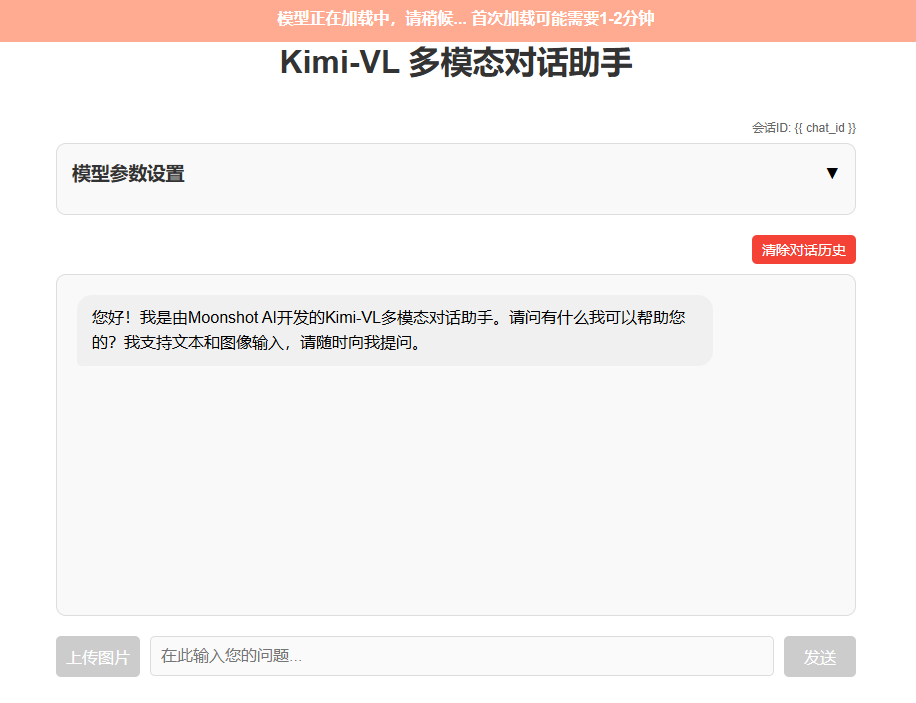
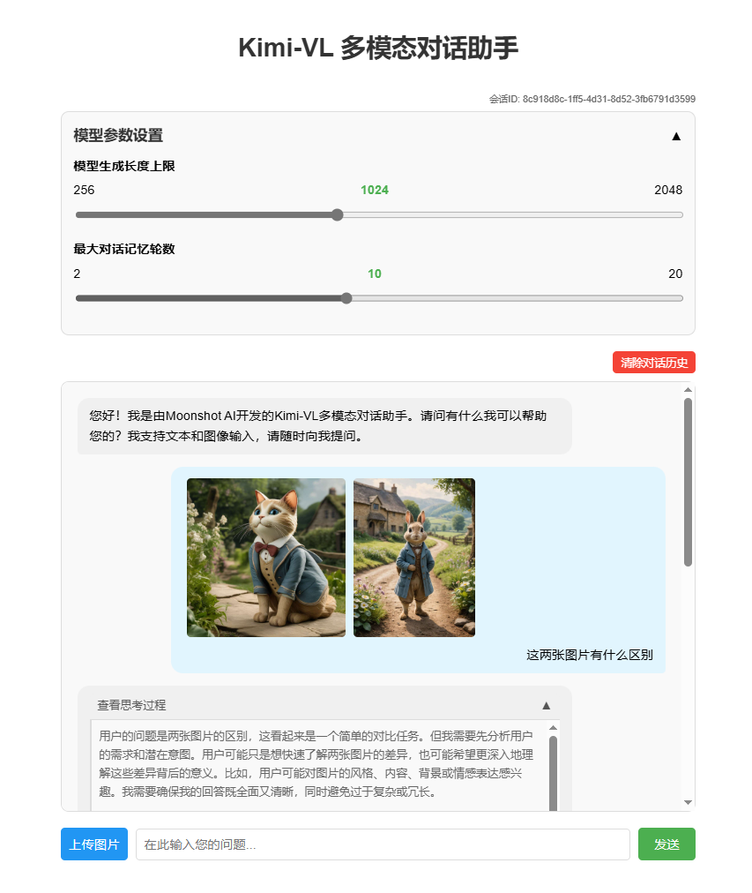
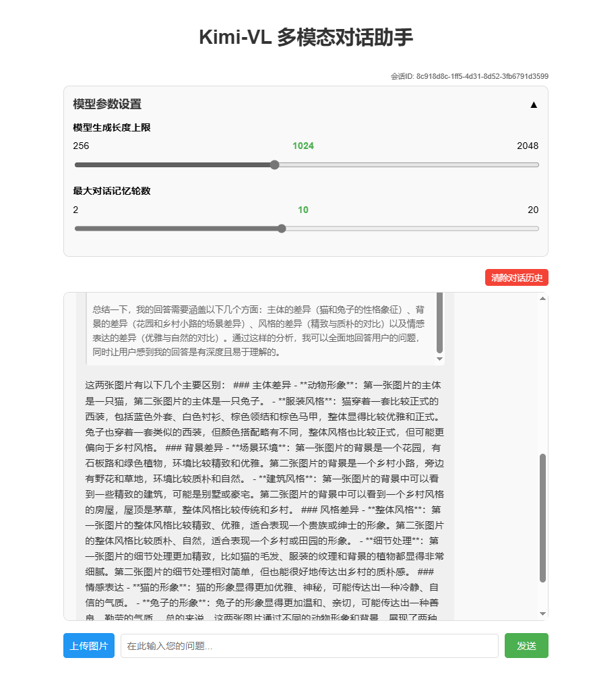

# Kimi-VL-对话助手


## 环境准备  

基础环境：

```
----------------
ubuntu 22.04
python 3.12
cuda 12.4
pytorch 2.6.0
----------------
另外：保证有足够的GPU显存
```
首先 `pip` 换源加速下载并安装依赖包

```shell
pip config set global.index-url https://pypi.tuna.tsinghua.edu.cn/simple

pip install transformers==4.48.2
pip install accelerate==1.6.0
pip install flask==3.1.0
pip install blobfile==3.0.0
pip install pillow==10.4.0
pip install modelscope==1.22.3

```


## 模型下载  

使用 `modelscope` 中的 `snapshot_download` 函数下载模型，第一个参数为模型名称，参数 `cache_dir` 为模型的下载路径。

新建 `model_download.py` 文件输入以下代码，并运行 `python model_download.py` 执行下载。

此处使用 `modelscope` 提供的 `snapshot_download` 函数进行下载，该方法对国内的用户十分友好。

```python
# model_download.py
from modelscope import snapshot_download

model_dir = snapshot_download('moonshotai/Kimi-VL-A3B-Thinking', cache_dir='请修改我！', revision='master')
print(f"模型下载完成，保存路径为：{model_dir}")
```

> 注意：请记得修改 `cache_dir` 为你自己的模型下载路径 ~


## 应用搭建

#### 后端代码

```python
# app.py

from flask import Flask, request, jsonify, render_template, session
import torch
from transformers import AutoTokenizer, AutoModelForCausalLM, AutoProcessor
import gc
import re
import uuid
import json
import base64
import logging
from io import BytesIO
from PIL import Image

# 配置日志
# logging.basicConfig(level=logging.INFO, format='%(asctime)s - %(name)s - %(levelname)s - %(message)s')
# logger = logging.getLogger(__name__)

app = Flask(__name__)
app.secret_key = "kimi-chatbot-secret-key"  # 用于session加密
# 修改为合理的值：最大100MB
app.config['MAX_CONTENT_LENGTH'] = 100 * 1024 * 1024  # 限制上传文件大小为100MB
app.config['MAX_CONTENT_PATH'] = None

# 全局变量存储预加载的模型和tokenizer
MODEL_ID = "/mnt/shufan/moonshotai/Kimi-VL-A3B-Thinking"
tokenizer = None
model = None
processor = None
# 用于存储对话历史的字典
chat_histories = {}
# 默认值设置
DEFAULT_MAX_NEW_TOKENS = 1024
DEFAULT_MAX_HISTORY_LENGTH = 10

# 在应用启动前预加载模型
def load_model():
    global tokenizer, model, processor
    print("正在加载模型和tokenizer，请稍候...")
    
    # 加载processor (用于处理图像和文本)
    processor = AutoProcessor.from_pretrained(MODEL_ID, trust_remote_code=True)
    
    # 加载tokenizer
    tokenizer = AutoTokenizer.from_pretrained(MODEL_ID, trust_remote_code=True)
    
    # 加载模型
    model = AutoModelForCausalLM.from_pretrained(
        MODEL_ID,
        device_map="auto",
        torch_dtype=torch.bfloat16,
        trust_remote_code=True
    )
    print("模型加载完成！")

def clean_response(text):
    """清理模型响应中的特殊标记"""
    # 先清理常见的结束标记，包括<|im_end|>和[EOS]
    text = re.sub(r'<\|im_end\|>(\s*\[EOS\])?', '', text)
    text = re.sub(r'\[EOS\]', '', text)
    
    # 保留思考标签
    # 如果存在思考标签，只清理标签内外的结束标记，保留标签本身
    thinking_pattern = r'◁think▷([\s\S]*?)◁/think▷'
    if re.search(thinking_pattern, text):
        # 思考部分的内容
        def clean_thinking_content(match):
            thinking_content = match.group(1)
            # 清理思考内容中的特殊标记
            thinking_content = re.sub(r'<[\|/]?eot[\|]?>', '', thinking_content)
            thinking_content = thinking_content.replace('<|eot|>', '')
            # 清理额外的结束标记
            thinking_content = re.sub(r'<\|im_end\|>(\s*\[EOS\])?', '', thinking_content)
            thinking_content = re.sub(r'\[EOS\]', '', thinking_content)
            return f'◁think▷{thinking_content}◁/think▷'
        
        # 先处理思考标签内的内容
        text = re.sub(thinking_pattern, clean_thinking_content, text)
        
        # 再处理剩余文本中的特殊标记
        remaining_text = re.sub(thinking_pattern, '', text)
        cleaned_remaining = re.sub(r'<[\|/]?eot[\|]?>', '', remaining_text)
        cleaned_remaining = cleaned_remaining.replace('<|eot|>', '')
        # 清理额外的结束标记
        cleaned_remaining = re.sub(r'<\|im_end\|>(\s*\[EOS\])?', '', cleaned_remaining)
        cleaned_remaining = re.sub(r'\[EOS\]', '', cleaned_remaining)
        
        # 替换原文中的思考标签后的部分
        text = re.sub(r'◁/think▷[\s\S]*', f'◁/think▷{cleaned_remaining}', text)
        
        return text.strip()
    else:
        # 根据截图中看到的标记，定义可能的标记形式
        patterns = [
            # 直接匹配具体的标记
            '<|eot|>',
            '<|im_end|>',
            '[EOS]'
        ]
        
        # 应用所有模式
        for pattern in patterns:
            text = text.replace(pattern, '')
        
        # 使用正则表达式处理可能的其他token
        text = re.sub(r'<[\|/]?eot[\|]?>', '', text)  # 匹配形如 <eot>, </eot>, <|eot|> 等
        
        return text.strip()

# 从base64字符串转换为PIL图像，并进行压缩处理
def base64_to_image(base64_str):
    if "base64," in base64_str:
        base64_str = base64_str.split("base64,")[1]
    
    try:
        # logger.info(f"开始处理base64图像，大小约 {len(base64_str) // 1024} KB")
        image_bytes = base64.b64decode(base64_str)
        # logger.info(f"解码后的图像大小: {len(image_bytes) // 1024} KB")
        
        image = Image.open(BytesIO(image_bytes))
        
        # 获取原始尺寸
        original_width, original_height = image.size
        # logger.info(f"原始图像尺寸: {original_width}x{original_height}")
        
        # 压缩大图片，如果宽度或高度超过1500像素，则按比例缩小
        max_size = 1500
        if original_width > max_size or original_height > max_size:
            # 按比例缩放
            if original_width > original_height:
                new_width = max_size
                new_height = int(original_height * (max_size / original_width))
            else:
                new_height = max_size
                new_width = int(original_width * (max_size / original_height))
            
            # 缩放图像
            image = image.resize((new_width, new_height), Image.LANCZOS)
            
            # logger.info(f"图像已压缩: {original_width}x{original_height} -> {new_width}x{new_height}")
        
        # 如果是RGBA模式（带透明通道），转换为RGB
        if image.mode == 'RGBA':
            background = Image.new('RGB', image.size, (255, 255, 255))
            background.paste(image, mask=image.split()[3])  # 使用透明通道作为蒙版
            image = background
            # logger.info("RGBA图像已转换为RGB")
        
        return image
    except Exception as e:
        # logger.error(f"图像处理错误: {str(e)}", exc_info=True)
        # 返回错误，但不中断处理，而是返回一个默认图像
        return Image.new('RGB', (100, 100), color=(200, 200, 200))

@app.route('/')
def home():
    # 创建会话ID
    if 'chat_id' not in session:
        session['chat_id'] = str(uuid.uuid4())
    
    # 如果是新会话，初始化聊天历史
    chat_id = session['chat_id']
    if chat_id not in chat_histories:
        chat_histories[chat_id] = []
    
    return render_template('index.html', chat_id=chat_id)

@app.route('/api/generate', methods=['POST'])
def generate():
    try:
        # 确保模型已加载
        if tokenizer is None or model is None or processor is None:
            return jsonify({"error": "模型正在加载中，请稍后再试"}), 503
        
        # 获取请求数据，支持JSON和表单数据
        chat_id = request.form.get('chat_id') or request.json.get('chat_id', session.get('chat_id', str(uuid.uuid4())))
        user_input = request.form.get('user_input') or request.json.get('user_input', '')
        
        # logger.info(f"收到请求 chat_id: {chat_id}, 请求方法: {request.method}, 内容类型: {request.content_type}")
        # logger.info(f"请求大小: {request.content_length // 1024 if request.content_length else 0} KB")
        
        # 获取前端传递的参数，如果没有则使用默认值
        max_new_tokens = int(request.form.get('max_new_tokens') or request.json.get('max_new_tokens', DEFAULT_MAX_NEW_TOKENS))
        max_history_length = int(request.form.get('max_history_length') or request.json.get('max_history_length', DEFAULT_MAX_HISTORY_LENGTH))
        
        # 参数限制，确保在合理范围内
        max_new_tokens = max(256, min(max_new_tokens, 2048))
        max_history_length = max(2, min(max_history_length, 20))
        
        # 检查是否有消息输入（可以是纯文本或者包含图像）
        has_input = False
        
        # 如果前端通过JSON传递了完整的历史记录（包含图像）
        chat_history_json = request.form.get('chat_history')
        if chat_history_json:
            try:
                received_history = json.loads(chat_history_json)
                # logger.info(f"收到历史记录，消息数量: {len(received_history)}")
                
                # 初始化或使用已有聊天历史
                if chat_id not in chat_histories:
                    chat_histories[chat_id] = []
                
                # 如果收到的历史不为空，且最后一条是用户消息
                if received_history and len(received_history) > 0 and received_history[-1]['role'] == 'user':
                    has_input = True
                    
                    # 获取用户消息内容
                    user_message = received_history[-1]
                    user_message_content = user_message.get('content', [])
                    
                    # 检查content是否是列表类型
                    if not isinstance(user_message_content, list):
                        # 如果不是列表，可能是旧格式的纯文本，直接进入纯文本处理模式
                        # logger.warning("用户消息内容不是列表格式，转为纯文本处理")
                        has_input = False
                    else:
                        # 处理用户消息中的图像
                        images = []
                        processed_content = []
                        has_images = False
                        
                        # logger.info(f"处理用户消息内容，项目数: {len(user_message_content)}")
                        
                        for i, item in enumerate(user_message_content):
                            # logger.info(f"处理消息项 {i}: {item.get('type') if isinstance(item, dict) else '非字典项'}")
                            
                            if isinstance(item, dict) and item.get('type') == 'image' and 'image' in item:
                                has_images = True
                                # 将base64图像转换为PIL图像对象
                                # logger.info(f"开始处理第 {i+1} 张图像")
                                image = base64_to_image(item['image'])
                                images.append(image)
                                processed_content.append({'type': 'image', 'image': f'image_{len(images)-1}'})
                            elif isinstance(item, dict) and item.get('type') == 'text' and 'text' in item:
                                processed_content.append({'type': 'text', 'text': item['text']})
                                # logger.info(f"添加文本内容: {item['text'][:20]}...")
                        
                        # 如果没有图像，使用标准文本处理
                        if not has_images:
                            # logger.warning("未找到图像内容，转为纯文本处理")
                            has_input = False
                        else:
                            # logger.info(f"成功处理 {len(images)} 张图像")
                            # 更新聊天历史中用户消息的图像
                            user_message['content'] = processed_content
                            chat_histories[chat_id].append(user_message)
                            
                            try:
                                # 使用processor处理多模态输入
                                # 构建符合processor要求的消息格式
                                messages = [
                                    {
                                        "role": "user",
                                        "content": processed_content
                                    }
                                ]
                                
                                # 应用聊天模板
                                # logger.info("应用聊天模板...")
                                text = processor.apply_chat_template(messages, add_generation_prompt=True, return_tensors="pt")
                                
                                # 处理输入
                                # logger.info("处理图像输入...")
                                inputs = processor(images=images, text=text, return_tensors="pt", padding=True, truncation=True).to(model.device)
                                
                                # 生成响应
                                # logger.info(f"开始生成响应，max_new_tokens={max_new_tokens}...")
                                with torch.no_grad():
                                    generated_ids = model.generate(**inputs, max_new_tokens=max_new_tokens)
                                    
                                # 处理输出
                                generated_ids_trimmed = [
                                    out_ids[len(in_ids):] for in_ids, out_ids in zip(inputs.input_ids, generated_ids)
                                ]
                                
                                response = processor.batch_decode(
                                    generated_ids_trimmed, skip_special_tokens=True, clean_up_tokenization_spaces=False
                                )[0]
                                
                                # 清理响应，移除结束标记
                                cleaned_response = clean_response(response)
                                # logger.info(f"生成的响应: {cleaned_response[:50]}...")
                                
                                # 添加模型回复到历史记录
                                chat_histories[chat_id].append({"role": "assistant", "content": cleaned_response})
                                
                                # 如果历史记录太长，保留最新的max_history_length条
                                if len(chat_histories[chat_id]) > max_history_length * 2:  # 用户和助手消息各占一半
                                    chat_histories[chat_id] = chat_histories[chat_id][-max_history_length*2:]
                                
                                # 清理缓存
                                torch.cuda.empty_cache()
                                gc.collect()
                                
                                return jsonify({
                                    "response": cleaned_response,
                                    "chat_id": chat_id,
                                    "max_new_tokens": max_new_tokens,
                                    "max_history_length": max_history_length
                                })
                            except Exception as e:
                                # logger.error(f"多模态生成过程中出错: {str(e)}", exc_info=True)
                                return jsonify({"error": f"多模态生成过程中出错: {str(e)}"}), 500
            except Exception as e:
                # logger.error(f"处理多模态输入时出错: {str(e)}", exc_info=True)
                return jsonify({"error": f"处理多模态输入时出错: {str(e)}"}), 500
        
        # 传统文本输入处理（向后兼容）
        if not has_input:
            # logger.info("使用传统文本输入处理")
            
            # 判断是否有文本输入
            if not user_input and not request.form:
                return jsonify({"error": "请输入问题或上传图片"}), 400
            
            # 获取或初始化聊天历史
            if chat_id not in chat_histories:
                chat_histories[chat_id] = []
            
            # 添加用户消息到历史记录
            chat_histories[chat_id].append({"role": "user", "content": user_input})
            
            # 从历史记录构建消息列表，使用前端传递的历史长度
            messages = chat_histories[chat_id][-max_history_length*2:]  # 用户和助手消息各算一条
            
            # 应用chat模板
            inputs = tokenizer.apply_chat_template(messages, add_generation_prompt=True, return_tensors="pt", return_dict=True)
            
            # 生成响应
            with torch.no_grad():
                outputs = model.generate(**inputs.to(model.device), max_new_tokens=max_new_tokens)
            response = tokenizer.batch_decode(outputs[:, inputs["input_ids"].shape[-1]:])
            
            # 清理缓存
            torch.cuda.empty_cache()
            gc.collect()
            
            # 清理响应，移除结束标记
            cleaned_response = clean_response(response[0])
            
            # 添加模型回复到历史记录
            chat_histories[chat_id].append({"role": "assistant", "content": cleaned_response})
            
            # 如果历史记录太长，保留最新的max_history_length条
            if len(chat_histories[chat_id]) > max_history_length * 2:  # 用户和助手消息各占一半
                chat_histories[chat_id] = chat_histories[chat_id][-max_history_length*2:]
            
            return jsonify({
                "response": cleaned_response,
                "chat_id": chat_id,
                "max_new_tokens": max_new_tokens,
                "max_history_length": max_history_length
            })
    
    except Exception as e:
        import traceback
        error_details = traceback.format_exc()
        # logger.error(f"处理请求时发生错误: {str(e)}\n{error_details}")
        return jsonify({"error": str(e)}), 500

@app.route('/api/clear_history', methods=['POST'])
def clear_history():
    try:
        data = request.json
        chat_id = data.get('chat_id', session.get('chat_id'))
        
        if chat_id and chat_id in chat_histories:
            chat_histories[chat_id] = []
            return jsonify({"success": True, "message": "聊天历史已清除"})
        else:
            return jsonify({"success": False, "error": "无效的会话ID"}), 400
    except Exception as e:
        return jsonify({"success": False, "error": str(e)}), 500

if __name__ == '__main__':
    # 在另一个线程中预加载模型
    import threading
    threading.Thread(target=load_model).start()
    
    app.run(debug=True, host='0.0.0.0', port=5000, use_reloader=False) 
```

> 注意：同样记得修改 `MODEL_ID` 为你自己的模型下载路径 ~


#### 前端代码

```html
# index.html

<!DOCTYPE html>
<html lang="zh">
<head>
    <meta charset="UTF-8">
    <meta name="viewport" content="width=device-width, initial-scale=1.0">
    <title>Kimi-VL 多模态对话助手</title>
    <style>
        body {
            font-family: Arial, sans-serif;
            line-height: 1.6;
            max-width: 800px;
            margin: 0 auto;
            padding: 20px;
        }
        h1 {
            text-align: center;
            margin-bottom: 30px;
            color: #333;
        }
        .chat-container {
            background-color: #f9f9f9;
            border-radius: 10px;
            padding: 20px;
            margin-bottom: 20px;
            min-height: 300px;
            max-height: 500px;
            overflow-y: auto;
            border: 1px solid #ddd;
        }
        .message {
            margin-bottom: 15px;
            padding: 10px 15px;
            border-radius: 15px;
            max-width: 80%;
        }
        .user-message {
            background-color: #e1f5fe;
            margin-left: auto;
            text-align: right;
            border-bottom-right-radius: 5px;
        }
        .bot-message {
            background-color: #f0f0f0;
            margin-right: auto;
            border-bottom-left-radius: 5px;
        }
        .input-container {
            display: flex;
            gap: 10px;
            align-items: center;
        }
        #user-input {
            flex: 1;
            padding: 10px;
            border: 1px solid #ddd;
            border-radius: 5px;
            font-size: 16px;
        }
        button {
            padding: 10px 20px;
            background-color: #4CAF50;
            color: white;
            border: none;
            border-radius: 5px;
            cursor: pointer;
            font-size: 16px;
        }
        button:hover {
            background-color: #45a049;
        }
        button:disabled {
            background-color: #cccccc;
            cursor: not-allowed;
        }
        #loading {
            text-align: center;
            display: none;
        }
        #model-loading {
            position: fixed;
            top: 0;
            left: 0;
            width: 100%;
            background-color: #ffab91;
            color: white;
            text-align: center;
            padding: 10px;
            font-weight: bold;
            z-index: 1000;
        }
        .spinner {
            border: 4px solid rgba(0, 0, 0, 0.1);
            width: 36px;
            height: 36px;
            border-radius: 50%;
            border-left-color: #09f;
            animation: spin 1s linear infinite;
            margin: 10px auto;
        }
        @keyframes spin {
            0% { transform: rotate(0deg); }
            100% { transform: rotate(360deg); }
        }
        .control-buttons {
            display: flex;
            justify-content: flex-end;
            margin-bottom: 10px;
        }
        #clear-btn {
            background-color: #f44336;
            font-size: 14px;
            padding: 5px 10px;
        }
        #clear-btn:hover {
            background-color: #d32f2f;
        }
        .session-info {
            font-size: 12px;
            color: #666;
            text-align: right;
            margin-bottom: 5px;
        }
        .settings-container {
            background-color: #f9f9f9;
            border: 1px solid #ddd;
            border-radius: 10px;
            padding: 15px;
            margin-bottom: 20px;
        }
        .settings-header {
            display: flex;
            justify-content: space-between;
            align-items: center;
            margin-bottom: 10px;
            cursor: pointer;
        }
        .settings-header h3 {
            margin: 0;
            color: #333;
        }
        .settings-content {
            display: none;
        }
        .settings-content.active {
            display: block;
        }
        .slider-container {
            margin-bottom: 15px;
        }
        .slider-container label {
            display: block;
            margin-bottom: 5px;
            font-weight: bold;
        }
        .slider-container .slider-info {
            display: flex;
            justify-content: space-between;
            margin-bottom: 5px;
        }
        .slider-container .value-display {
            font-weight: bold;
            color: #4CAF50;
        }
        input[type="range"] {
            width: 100%;
            margin-top: 5px;
        }
        /* 图片上传和预览样式 */
        .upload-btn {
            padding: 10px;
            background-color: #2196F3;
            cursor: pointer;
        }
        .upload-btn:hover {
            background-color: #0b7dda;
        }
        #upload-input {
            display: none;
        }
        .image-preview-container {
            display: flex;
            flex-wrap: wrap;
            gap: 10px;
            margin: 10px 0;
        }
        .image-preview {
            position: relative;
            width: 100px;
            height: 100px;
            border: 1px solid #ddd;
            border-radius: 5px;
            overflow: hidden;
        }
        .image-preview img {
            width: 100%;
            height: 100%;
            object-fit: cover;
        }
        .remove-image {
            position: absolute;
            top: 2px;
            right: 2px;
            background-color: rgba(255, 0, 0, 0.7);
            color: white;
            width: 20px;
            height: 20px;
            border-radius: 50%;
            text-align: center;
            line-height: 20px;
            cursor: pointer;
        }
        .uploaded-image {
            max-width: 200px;
            max-height: 200px;
            margin: 5px;
            border-radius: 5px;
        }
        .message-content {
            display: flex;
            flex-direction: column;
        }
        .message-images {
            display: flex;
            flex-wrap: wrap;
            margin-bottom: 5px;
        }
        /* 思考过程样式 */
        .thinking-container {
            margin-bottom: 10px;
            border-radius: 5px;
            overflow: hidden;
        }
        .thinking-header {
            background-color: #f0f0f0;
            color: #555;
            padding: 5px 10px;
            cursor: pointer;
            display: flex;
            justify-content: space-between;
            align-items: center;
            font-size: 0.9em;
            border-bottom: 1px solid #ddd;
        }
        .thinking-process {
            color: #666;
            font-size: 0.9em;
            background-color: #f9f9f9;
            padding: 10px;
            white-space: pre-wrap;
            display: none;
            border-left: 3px solid #ddd;
            max-height: 300px;
            overflow-y: auto;
        }
        .thinking-process.show {
            display: block;
        }
        .real-response {
            font-weight: normal;
            color: #333;
            padding-top: 10px;
        }
        .toggle-indicator {
            font-weight: bold;
        }
    </style>
</head>
<body>
    <div id="model-loading">
        模型正在加载中，请稍候... 首次加载可能需要1-2分钟
    </div>
    
    <h1>Kimi-VL 多模态对话助手</h1>
    
    <div class="session-info">
        会话ID: <span id="chat-id">{{ chat_id }}</span>
    </div>
    
    <div class="settings-container">
        <div class="settings-header" id="settings-toggle">
            <h3>模型参数设置</h3>
            <span>▼</span>
        </div>
        <div class="settings-content" id="settings-content">
            <div class="slider-container">
                <label for="max-tokens-slider">模型生成长度上限</label>
                <div class="slider-info">
                    <span>256</span>
                    <span class="value-display" id="max-tokens-value">1024</span>
                    <span>2048</span>
                </div>
                <input type="range" id="max-tokens-slider" min="256" max="2048" step="128" value="1024">
            </div>
            <div class="slider-container">
                <label for="history-length-slider">最大对话记忆轮数</label>
                <div class="slider-info">
                    <span>2</span>
                    <span class="value-display" id="history-length-value">10</span>
                    <span>20</span>
                </div>
                <input type="range" id="history-length-slider" min="2" max="20" step="1" value="10">
            </div>
        </div>
    </div>
    
    <div class="control-buttons">
        <button id="clear-btn" disabled>清除对话历史</button>
    </div>
    
    <div class="chat-container" id="chat-container">
        <div class="message bot-message">
            您好！我是由Moonshot AI开发的Kimi-VL多模态对话助手。请问有什么我可以帮助您的？我支持文本和图像输入，请随时向我提问。
        </div>
    </div>
    
    <div id="loading">
        <div class="spinner"></div>
        <p>正在生成回答，请稍候...</p>
    </div>
    
    <div class="input-container">
        <button id="upload-btn" class="upload-btn" disabled>
            <i class="fa fa-image"></i> 上传图片
        </button>
        <input type="file" id="upload-input" accept="image/*" multiple>
        <input type="text" id="user-input" placeholder="在此输入您的问题..." disabled>
        <button id="send-btn" disabled>发送</button>
    </div>
    
    <div class="image-preview-container" id="image-preview-container"></div>

    <script>
        document.addEventListener('DOMContentLoaded', function() {
            const chatContainer = document.getElementById('chat-container');
            const userInput = document.getElementById('user-input');
            const sendBtn = document.getElementById('send-btn');
            const clearBtn = document.getElementById('clear-btn');
            const loading = document.getElementById('loading');
            const modelLoading = document.getElementById('model-loading');
            const chatId = document.getElementById('chat-id').textContent;
            const uploadBtn = document.getElementById('upload-btn');
            const uploadInput = document.getElementById('upload-input');
            const imagePreviewContainer = document.getElementById('image-preview-container');
            
            // 设置相关元素
            const settingsToggle = document.getElementById('settings-toggle');
            const settingsContent = document.getElementById('settings-content');
            const maxTokensSlider = document.getElementById('max-tokens-slider');
            const maxTokensValue = document.getElementById('max-tokens-value');
            const historyLengthSlider = document.getElementById('history-length-slider');
            const historyLengthValue = document.getElementById('history-length-value');
            
            // 默认值
            let maxNewTokens = 1024;
            let maxHistoryLength = 10;
            
            // 聊天历史存储
            const chatHistory = [];
            
            // 初始化历史记录 - 添加欢迎消息
            const welcomeMessage = '您好！我是由Moonshot AI开发的Kimi-VL多模态对话助手。请问有什么我可以帮助您的？我支持文本和图像输入，请随时向我提问。';
            chatHistory.push({
                role: 'assistant',
                content: welcomeMessage
            });
            
            // 上传的图片存储
            let uploadedImages = [];
            
            // 压缩图像函数 - 更严格的图像压缩
            async function compressImage(file, maxWidth = 1200, maxHeight = 1200, quality = 0.7) {
                return new Promise((resolve, reject) => {
                    try {
                        const reader = new FileReader();
                        reader.onload = function(event) {
                            try {
                                const img = new Image();
                                img.onload = function() {
                                    try {
                                        // 计算新尺寸
                                        let width = img.width;
                                        let height = img.height;
                                        let needResize = false;
                                        
                                        console.log(`原始图片大小: ${width}x${height}, 文件大小: ${Math.round(file.size / 1024)}KB`);
                                        
                                        // 强制调整大尺寸图片
                                        if (width > maxWidth || height > maxHeight) {
                                            needResize = true;
                                            if (width > height) {
                                                height = Math.round(height * maxWidth / width);
                                                width = maxWidth;
                                            } else {
                                                width = Math.round(width * maxHeight / height);
                                                height = maxHeight;
                                            }
                                            console.log(`调整尺寸为: ${width}x${height}`);
                                        }
                                        
                                        // 创建canvas进行压缩
                                        const canvas = document.createElement('canvas');
                                        canvas.width = width;
                                        canvas.height = height;
                                        const ctx = canvas.getContext('2d');
                                        ctx.fillStyle = 'white'; // 设置白色背景
                                        ctx.fillRect(0, 0, canvas.width, canvas.height);
                                        ctx.drawImage(img, 0, 0, width, height);
                                        
                                        // 转换为base64 - 始终使用JPEG格式（除非是PNG且需要透明度）
                                        let dataUrl;
                                        
                                        // 对于较大图片，使用更低的质量
                                        let compressionQuality = quality;
                                        if (file.size > 3 * 1024 * 1024) { // 大于3MB
                                            compressionQuality = 0.5;
                                        } else if (file.size > 1 * 1024 * 1024) { // 大于1MB
                                            compressionQuality = 0.6;
                                        }
                                        
                                        if (file.type === 'image/png' && needCheckTransparency(ctx, width, height)) {
                                            // PNG且有透明像素时保留PNG格式，但仍然压缩
                                            dataUrl = canvas.toDataURL('image/png', 0.8);
                                            console.log('使用PNG格式保留透明度');
                                        } else {
                                            // 其他情况一律转为JPEG以获得更好的压缩效果
                                            dataUrl = canvas.toDataURL('image/jpeg', compressionQuality);
                                            console.log(`使用JPEG格式，质量: ${compressionQuality}`);
                                        }
                                        
                                        // 估算压缩后大小
                                        const compressedSize = Math.round(dataUrl.length * 0.75 / 1024);
                                        console.log(`压缩后大小: ${compressedSize}KB, 压缩率: ${Math.round(compressedSize / (file.size / 1024) * 100)}%`);
                                        
                                        // 如果压缩后仍然过大，进一步减小质量
                                        if (compressedSize > 1024) { // 大于1MB
                                            console.log('图像仍过大，进一步压缩');
                                            const finalDataUrl = canvas.toDataURL('image/jpeg', 0.4);
                                            console.log(`最终大小: ${Math.round(finalDataUrl.length * 0.75 / 1024)}KB`);
                                            resolve(finalDataUrl);
                                        } else {
                                            resolve(dataUrl);
                                        }
                                    } catch (e) {
                                        console.error('Canvas处理图像时出错:', e);
                                        reject(e);
                                    }
                                };
                                img.onerror = function(e) {
                                    console.error('加载图像时出错:', e);
                                    reject(new Error('无法加载图像'));
                                };
                                img.src = event.target.result;
                            } catch (e) {
                                console.error('处理图像数据时出错:', e);
                                reject(e);
                            }
                        };
                        reader.onerror = function(e) {
                            console.error('读取文件时出错:', e);
                            reject(e);
                        };
                        reader.readAsDataURL(file);
                    } catch (e) {
                        console.error('压缩图像初始化错误:', e);
                        reject(e);
                    }
                });
            }
            
            // 检查图像是否有透明像素
            function needCheckTransparency(ctx, width, height) {
                // 采样检查，不检查所有像素以提高性能
                const imageData = ctx.getImageData(0, 0, width, height);
                const data = imageData.data;
                const sampleSize = Math.max(1, Math.floor(data.length / 4000)); // 最多检查1000个像素
                
                for (let i = 3; i < data.length; i += 4 * sampleSize) {
                    if (data[i] < 255) { // Alpha值小于255表示有透明度
                        return true;
                    }
                }
                return false;
            }
            
            // 上传图片按钮点击事件
            uploadBtn.addEventListener('click', function() {
                uploadInput.click();
            });
            
            // 图片选择事件
            uploadInput.addEventListener('change', async function(e) {
                const files = e.target.files;
                if (files.length > 0) {
                    // 添加加载指示器
                    loading.style.display = 'block';
                    
                    try {
                        // 图片数量限制
                        const maxImages = 2; // 最多允许上传2张图片
                        if (files.length > maxImages) {
                            alert(`一次最多只能上传${maxImages}张图片`);
                        }
                        
                        // 处理前清空已上传图片，避免累积
                        if (uploadedImages.length + files.length > maxImages) {
                            uploadedImages = [];
                            imagePreviewContainer.innerHTML = '';
                        }
                        
                        // 处理每张图片
                        for (let i = 0; i < Math.min(files.length, maxImages); i++) {
                            const file = files[i];
                            // 检查文件类型
                            if (!file.type.startsWith('image/')) {
                                console.warn(`跳过非图像文件: ${file.name}, 类型: ${file.type}`);
                                continue;
                            }
                            
                            // 检查文件大小
                            if (file.size > 10 * 1024 * 1024) { // 大于10MB
                                alert(`图片 ${file.name} 太大 (${Math.round(file.size/1024/1024)}MB)，请选择较小的图片`);
                                continue;
                            }
                            
                            try {
                                // 压缩图像
                                console.log(`开始压缩图片: ${file.name}, 大小: ${Math.round(file.size/1024)}KB`);
                                const compressedDataUrl = await compressImage(file);
                                
                                const imageObj = {
                                    file: file,
                                    dataUrl: compressedDataUrl,
                                    originalSize: Math.round(file.size / 1024), // 原始大小（KB）
                                    compressedSize: Math.round(compressedDataUrl.length * 0.75 / 1024) // 压缩后大小（KB）
                                };
                                
                                console.log(`图片 ${file.name} 压缩: ${imageObj.originalSize}KB -> ${imageObj.compressedSize}KB`);
                                
                                uploadedImages.push(imageObj);
                                addImagePreview(imageObj, uploadedImages.length - 1);
                                
                                // 如果图片仍然很大，给用户警告
                                if (imageObj.compressedSize > 1024) {
                                    console.warn(`压缩后的图片依然较大: ${imageObj.compressedSize}KB`);
                                }
                            } catch (error) {
                                console.error(`处理图片 ${file.name} 时出错:`, error);
                                alert(`处理图片 ${file.name} 时出错: ${error.message}`);
                            }
                        }
                        
                        // 如果没有成功上传任何图片
                        if (uploadedImages.length === 0) {
                            alert('没有成功上传任何图片，请重试');
                        }
                    } catch (error) {
                        console.error('图片处理总体错误:', error);
                        alert('图片处理出错: ' + error.message);
                    } finally {
                        loading.style.display = 'none';
                    }
                }
                uploadInput.value = ''; // 清空input以允许再次选择相同文件
            });
            
            // 添加图片预览
            function addImagePreview(imageObj, index) {
                const previewDiv = document.createElement('div');
                previewDiv.className = 'image-preview';
                previewDiv.innerHTML = `
                    
                    <div class="remove-image" data-index="${index}">×</div>
                `;
                imagePreviewContainer.appendChild(previewDiv);
                
                // 移除图片按钮点击事件
                previewDiv.querySelector('.remove-image').addEventListener('click', function() {
                    const removeIndex = parseInt(this.getAttribute('data-index'));
                    uploadedImages.splice(removeIndex, 1);
                    refreshImagePreviews();
                });
            }
            
            // 刷新所有图片预览
            function refreshImagePreviews() {
                imagePreviewContainer.innerHTML = '';
                uploadedImages.forEach((img, idx) => {
                    addImagePreview(img, idx);
                });
            }
            
            // 切换设置面板
            settingsToggle.addEventListener('click', function() {
                settingsContent.classList.toggle('active');
                settingsToggle.querySelector('span').textContent = 
                    settingsContent.classList.contains('active') ? '▲' : '▼';
            });
            
            // 更新拖动条值显示和实时应用
            maxTokensSlider.addEventListener('input', function() {
                maxNewTokens = parseInt(this.value);
                maxTokensValue.textContent = maxNewTokens;
            });
            
            historyLengthSlider.addEventListener('input', function() {
                maxHistoryLength = parseInt(this.value);
                historyLengthValue.textContent = maxHistoryLength;
            });
            
            // 清理响应中的特殊标记
            function cleanResponse(text) {
                // 移除各种结束标记
                return text.replace(/<\|eot\|>/g, '')
                           .replace(/<eot>/g, '')
                           .replace(/<\/eot>/g, '')
                           .replace(/<\|im_end\|>/g, '')
                           .replace(/\[EOS\]/g, '')
                           .trim();
            }
            
            // 检查模型是否已加载
            function checkModelStatus() {
                fetch('/api/generate', {
                    method: 'POST',
                    headers: {
                        'Content-Type': 'application/json'
                    },
                    body: JSON.stringify({ user_input: '', chat_id: chatId })
                })
                .then(response => {
                    if (response.status === 503) {
                        // 模型仍在加载，继续等待
                        setTimeout(checkModelStatus, 5000);
                    } else {
                        // 模型已加载，启用输入
                        modelLoading.style.display = 'none';
                        sendBtn.disabled = false;
                        userInput.disabled = false;
                        uploadBtn.disabled = false;
                        clearBtn.disabled = false;
                        
                        // 激活设置面板
                        settingsContent.classList.add('active');
                        settingsToggle.querySelector('span').textContent = '▲';
                        
                        // 如果历史为空，添加欢迎消息到历史记录
                        if (chatHistory.length === 0) {
                            const welcomeMessage = '您好！我是由Moonshot AI开发的Kimi-VL多模态对话助手。请问有什么我可以帮助您的？我支持文本和图像输入，请随时向我提问。';
                            chatHistory.push({
                                role: 'assistant',
                                content: welcomeMessage
                            });
                        }
                    }
                })
                .catch(error => {
                    // 发生错误，继续等待
                    setTimeout(checkModelStatus, 5000);
                });
            }
            
            // 启动检查
            checkModelStatus();

            // 添加消息到聊天界面
            function addMessage(content, isUser) {
                const messageDiv = document.createElement('div');
                messageDiv.className = `message ${isUser ? 'user-message' : 'bot-message'}`;
                
                // 处理内容
                if (isUser) {
                    const messageContent = document.createElement('div');
                    messageContent.className = 'message-content';
                    
                    // 添加图片
                    if (uploadedImages.length > 0) {
                        const messageImages = document.createElement('div');
                        messageImages.className = 'message-images';
                        uploadedImages.forEach(img => {
                            const imgElement = document.createElement('img');
                            imgElement.src = img.dataUrl;
                            imgElement.className = 'uploaded-image';
                            messageImages.appendChild(imgElement);
                        });
                        messageContent.appendChild(messageImages);
                    }
                    
                    // 添加文本
                    const textElement = document.createElement('div');
                    textElement.textContent = content;
                    messageContent.appendChild(textElement);
                    
                    messageDiv.appendChild(messageContent);
                    
                    // 保存到历史记录
                    const userMessageContent = [];
                    
                    // 添加图片内容
                    uploadedImages.forEach(img => {
                        userMessageContent.push({
                            type: "image",
                            image: img.dataUrl
                        });
                    });
                    
                    // 添加文本内容（仅当文本不为空时）
                    if (content.trim()) {
                        userMessageContent.push({
                            type: "text",
                            text: content
                        });
                    }
                    
                    // 确保内容不为空
                    if (userMessageContent.length === 0) {
                        userMessageContent.push({
                            type: "text",
                            text: " " // 至少添加一个空格，防止空消息
                        });
                    }
                    
                    chatHistory.push({
                        role: "user",
                        content: userMessageContent
                    });
                    
                    // 清空上传的图片
                    uploadedImages = [];
                    imagePreviewContainer.innerHTML = '';
                } else {
                    // 清理机器人响应中的特殊标记
                    content = cleanResponse(content);
                    
                    // 处理◁think▷标签
                    const thinkPattern = /◁think▷([\s\S]*?)◁\/think▷([\s\S]*)/;
                    const match = content.match(thinkPattern);
                    
                    if (match) {
                        // 有思考过程，分开显示
                        const thinkContent = match[1].trim();
                        const realResponse = match[2].trim();
                        
                        // 创建思考过程容器
                        const thinkingContainer = document.createElement('div');
                        thinkingContainer.className = 'thinking-container';
                        
                        // 创建思考标题
                        const thinkingHeader = document.createElement('div');
                        thinkingHeader.className = 'thinking-header';
                        thinkingHeader.innerHTML = '<span>查看思考过程</span><span class="toggle-indicator">▼</span>';
                        
                        // 创建思考过程元素
                        const thinkingDiv = document.createElement('div');
                        thinkingDiv.className = 'thinking-process';
                        thinkingDiv.textContent = thinkContent;
                        
                        // 添加点击事件
                        thinkingHeader.addEventListener('click', function() {
                            thinkingDiv.classList.toggle('show');
                            const indicator = this.querySelector('.toggle-indicator');
                            indicator.textContent = thinkingDiv.classList.contains('show') ? '▲' : '▼';
                        });
                        
                        // 创建真实回复元素
                        const responseDiv = document.createElement('div');
                        responseDiv.className = 'real-response';
                        responseDiv.textContent = realResponse;
                        
                        // 添加到容器
                        thinkingContainer.appendChild(thinkingHeader);
                        thinkingContainer.appendChild(thinkingDiv);
                        
                        // 清空并添加新元素
                        messageDiv.innerHTML = '';
                        messageDiv.appendChild(thinkingContainer);
                        messageDiv.appendChild(responseDiv);
                    } else {
                        // 没有思考标签，直接显示内容
                        messageDiv.textContent = content;
                    }
                    
                    // 保存到历史记录
                    chatHistory.push({
                        role: 'assistant',
                        content: content
                    });
                }
                
                chatContainer.appendChild(messageDiv);
                chatContainer.scrollTop = chatContainer.scrollHeight;
            }

            async function sendMessage() {
                const message = userInput.value.trim();
                if (!message && uploadedImages.length === 0) return;

                try {
                    // 检查图片总大小
                    let totalImageSize = 0;
                    uploadedImages.forEach(img => {
                        totalImageSize += img.compressedSize;
                    });
                    
                    console.log(`发送请求: ${uploadedImages.length}张图片，总大小约${totalImageSize}KB, 文本长度: ${message.length}`);
                    
                    if (totalImageSize > 5 * 1024) { // 超过5MB
                        if (!confirm(`上传的图片总大小超过5MB (${Math.round(totalImageSize/1024)}MB)，可能导致请求失败。是否继续？`)) {
                            return;
                        }
                    }
                
                    // 添加用户消息到聊天框
                    addMessage(message, true);
                    userInput.value = '';
                    
                    // 显示加载中
                    loading.style.display = 'block';
                    sendBtn.disabled = true;
                    userInput.disabled = true;
                    uploadBtn.disabled = true;
                    clearBtn.disabled = true;
                    
                    // 创建FormData对象用于上传文件
                    const formData = new FormData();
                    formData.append('user_input', message);
                    formData.append('chat_id', chatId);
                    formData.append('max_new_tokens', maxNewTokens);
                    formData.append('max_history_length', maxHistoryLength);
                    
                    // 添加历史记录 - 确保只发送最近的历史
                    const recentHistory = chatHistory.slice(-maxHistoryLength*2);
                    formData.append('chat_history', JSON.stringify(recentHistory));
                    
                    // 设置更长的超时时间
                    const controller = new AbortController();
                    const timeoutId = setTimeout(() => controller.abort(), 120000); // 2分钟超时
                    
                    // 发起请求，捕获网络错误
                    try {
                        console.log("开始发送请求...");
                        const startTime = Date.now();
                        
                        const response = await fetch('/api/generate', {
                            method: 'POST',
                            body: formData,
                            signal: controller.signal
                        });
                        
                        const endTime = Date.now();
                        console.log(`请求完成，耗时: ${(endTime - startTime) / 1000}秒`);
                        
                        // 清除超时
                        clearTimeout(timeoutId);
                        
                        if (!response.ok) {
                            const errorText = await response.text();
                            console.error(`HTTP错误 ${response.status}: ${errorText}`);
                            throw new Error(`服务器返回错误: ${response.status} ${response.statusText}`);
                        }

                        const data = await response.json();
                        // 添加AI回复到聊天框
                        addMessage(data.response, false);
                    } catch (error) {
                        console.error("请求或解析错误:", error);
                        
                        if (error.name === 'AbortError') {
                            addMessage(`请求超时: 服务器响应时间过长，请稍后重试或尝试上传较小的图片。`, false);
                        } else if (error.name === 'TypeError' && error.message.includes('NetworkError')) {
                            addMessage(`网络错误: 连接服务器失败，请检查网络连接。`, false);
                        } else if (error.name === 'SyntaxError') {
                            addMessage(`数据解析错误: 服务器返回的数据格式不正确。`, false);
                        } else {
                            addMessage(`发生错误: ${error.message}`, false);
                        }
                    }
                } catch (error) {
                    console.error("发送消息准备阶段错误:", error);
                    addMessage(`准备发送时出错: ${error.message}`, false);
                } finally {
                    loading.style.display = 'none';
                    sendBtn.disabled = false;
                    userInput.disabled = false;
                    uploadBtn.disabled = false;
                    clearBtn.disabled = false;
                    
                    // 清空已上传图像，避免重复发送
                    uploadedImages = [];
                    imagePreviewContainer.innerHTML = '';
                }
            }
            
            // 清除对话历史
            async function clearHistory() {
                try {
                    clearBtn.disabled = true;
                    
                    const response = await fetch('/api/clear_history', {
                        method: 'POST',
                        headers: {
                            'Content-Type': 'application/json'
                        },
                        body: JSON.stringify({ chat_id: chatId })
                    });
                    
                    const data = await response.json();
                    
                    if (data.success) {
                        // 清除聊天界面
                        chatContainer.innerHTML = '';
                        // 添加欢迎消息
                        const welcomeMessage = '您好！我是由Moonshot AI开发的Kimi-VL多模态对话助手。请问有什么我可以帮助您的？我支持文本和图像输入，请随时向我提问。';
                        const welcomeDiv = document.createElement('div');
                        welcomeDiv.className = 'message bot-message';
                        welcomeDiv.textContent = welcomeMessage;
                        chatContainer.appendChild(welcomeDiv);
                        
                        // 清除本地历史
                        chatHistory.length = 0;
                        // 添加欢迎消息到历史记录
                        chatHistory.push({
                            role: 'assistant',
                            content: welcomeMessage
                        });
                    } else {
                        alert('清除历史失败: ' + (data.error || '未知错误'));
                    }
                } catch (error) {
                    alert('清除历史时发生错误: ' + error.message);
                } finally {
                    clearBtn.disabled = false;
                }
            }

            // 添加事件监听器
            sendBtn.addEventListener('click', sendMessage);
            clearBtn.addEventListener('click', clearHistory);
            userInput.addEventListener('keypress', function(e) {
                if (e.key === 'Enter' && !sendBtn.disabled) {
                    sendMessage();
                }
            });
        });
    </script>
</body>
</html> 
```


#### 运行应用

```bash
python app.py
```

应用将在 http://localhost:5000 上运行。

**注意**：启动后模型会在后台自动加载，这可能需要1-2分钟。在此期间，界面会显示"模型正在加载中"的提示，加载完成后才能开始对话。


#### 使用方法

1. 在浏览器中打开 http://localhost:5000
2. 等待模型加载完成（顶部的橙色通知条消失）
3. 根据需要调整参数滑动条：
   - **生成长度上限**：控制每次回复生成的最大token数（范围：256-2048）
   - **历史记录长度**：控制对话中保留的最大轮数（范围：2-20）
4. 在输入框中输入您的问题
5. 点击"发送"按钮或按Enter键发送问题
6. 等待模型生成回复
7. 继续进行多轮对话，模型会记住之前的对话内容
8. 如需清除对话历史，点击"清除对话历史"按钮

#### 效果展示








## 参考代码及其使用

本次教程搭建了一个基于 `Kimi-VL-A3B-Thinking` 的前后端分离的对话助手，额外提供了参考代码供学习者参考
