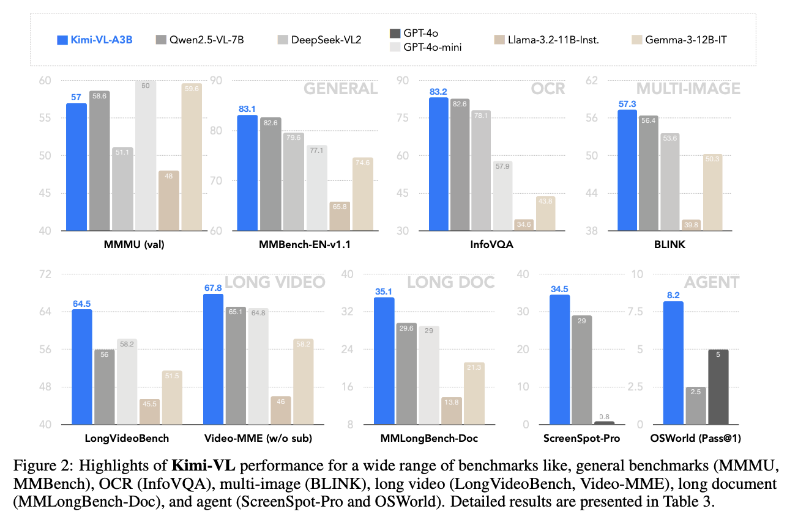
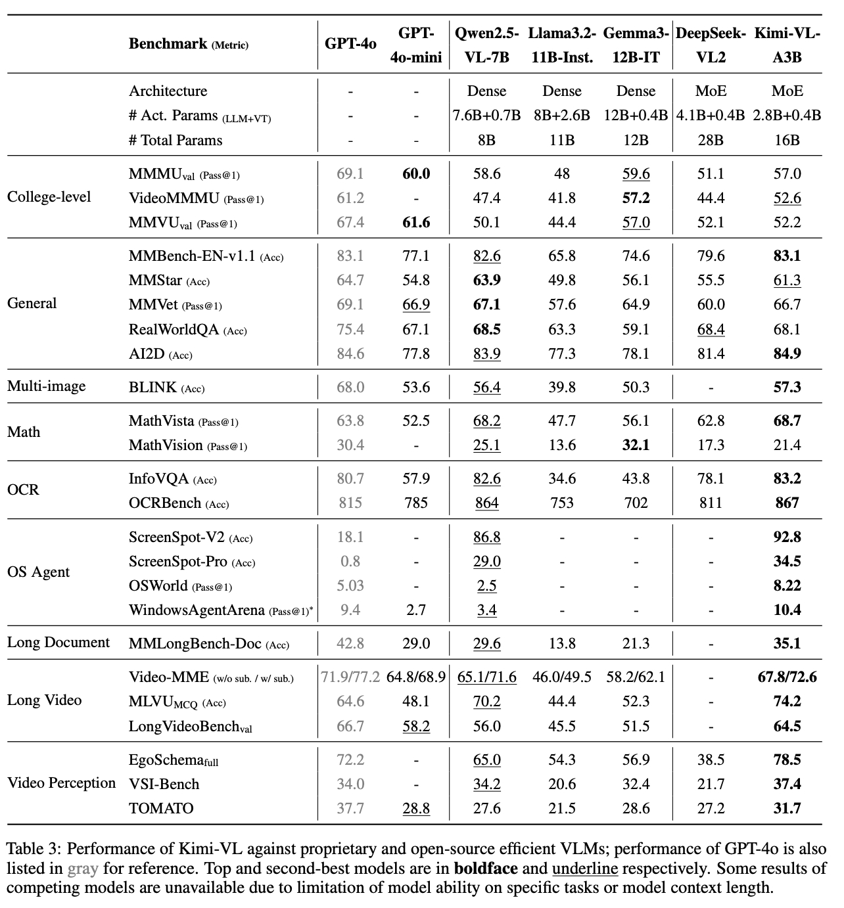
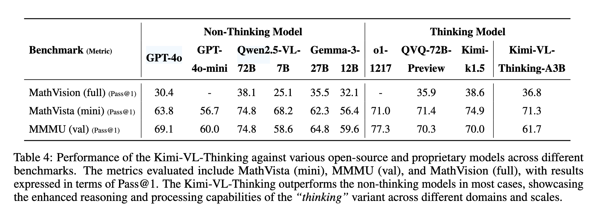
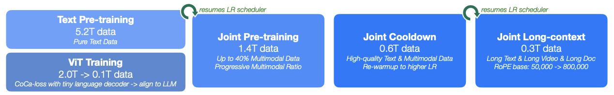
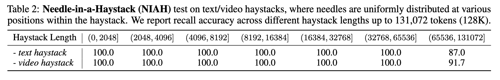
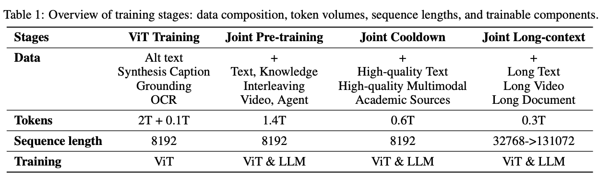

# Kimi-VL技术报告解读

## 模型介绍
Kimi-VL是由月之暗面开发的开源多模态大模型，采用混合专家（Mixture-of-Experts, MoE）架构，具备视觉感知、长上下文理解和强大的智能体能力，总参数量为16B激活参数量仅为2.8B。较低的推理成本使其能够在参数高性能的基础上实现强大的多模态交互与推理能力

## 效果评估

Kimi-VL在InfoVQA、MathVista、LongVideoBench、OSWord、ScreenSpot、WindowsAgentArena、MMLongBench、Video-MME 、EgoSchema、 VSI-Bench等权威基准测试中表现出色，以超越了GPT-4o、Qwen2.5-VL、DeepSeek-VL2等模型。

## 技术解读

### 模型架构解读

Kimi-VL的结构主要包含视觉编码器、MLP投影层、MoE解码器三个部分。

1. **视觉编码器（MoonViT）：** Kimi-VL的视觉编码器MoonViT允许原生分辨率处理，无需复杂的切割拼接操作，直接处理不同分辨率的视觉输入。MoonViT采用插值绝对位置嵌入和二维旋转位置嵌入（RoPE），增强了对高分辨率图像的细节感知能力。
2. **MLP投影层（Projector）：** 采用双层MLP结构，将视觉编码器的连续输出特征通过pixel shuffle操作，以空间维度2×2降采样，同时通道维度相应扩展，再经过MLP投影到语言模型空间。投影后的用于表达视觉特征的tokens长度不固定，而是随输入图像的尺寸和处理方式而变化，实现了视觉与语言模态间灵活、高效的融合。
3. **MoE语言解码器（Moonlight）：** 基于月之暗面自主研发的Moonlight模型，使用Mixture-of-Experts架构，实现仅2.8B激活参数即可达到较大模型的性能水平。

## 模型训练解读

### 预训练阶段

1. **视觉预训练：** 该阶段训练MoonViT视觉编码器，使用大规模图文对数据，包括图片alt文本、OCR文字、生成的描述、边界框标注等数据，通过SigLIP风格的对比损失（SigLIP loss）和图像引导下的文本生成（caption loss）两个loss进行训练，提升视觉表征能力。在此过程，MoonViT的输出被训练成能生成连续、高质量的图像语义特征，为后续与语言模型的融合做准备。
2. **联合预训练阶段：** 在此阶段，加载了已完成纯文本预训练的MoE语言模型（Moonlight），并与视觉编码器MoonViT进行联合训练，使用1.4T tokens的混合数据（文本+图文），采用逐步增加图文比例的方式，确保语言能力不被弱化。
3. **联合冷却阶段：** 为进一步提升模型在高难度任务中的综合能力，Kimi-VL 在预训练完成后进入了“联合冷却阶段”（Joint Cooldown Stage）。该阶段的核心目标是利用更高质量的语言与多模态数据，在不干扰模型已有能力的前提下，有针对性地强化其在数学推理、代码生成、知识问答等领域的表现。无论是纯文本数据还是多模态数据都是用了多重方案对数据进行了清洗和增强。不仅提升了模型的图文对齐能力，也强化了其对复杂视觉语境的理解与处理能力。这种精细化的数据调度策略，保证了模型在保持泛化能力的同时，能够精准提升目标任务上的表现。
4. **多模态联合长上下文激活阶段：** 该阶段通过两轮训练将上下文长度由8K扩展至128K tokens，每个子阶段都将上下文长度扩大四倍。并将RoPE旋转位置编码的频率下限从50,000提升至800,000。每个子阶段中将长文本数据的占比为 25%，其余 75% 的 token 重放前一阶段的短文本数据。为使模型在纯文本和多模态输入场景中均能激活长上下文能力，该阶段所使用的长数据不仅包括长文本，还涵盖了多种类型的长多模态数据。经过长上下文激活训练后，模型能够在Needle-in-a-Haystack（NIAH）任务中成功定位关键信息，无论是在长文本还是长视频场景下，均展现出卓越的检索与理解能力。

#### 后训练阶段

1. **多模态联合SFT：** 该阶段通过指令微调对 Kimi-VL 的基座模型进行训练，增强其指令跟随能力与对话互动能力，最终形成可交互的VLLM 模型。在微调过程中，对MoonViT、MLP投影层、MoE LLM进行联合优化，训练数据包含纯文本与图文混合形式的监督微调数据。训练数据使用了精心构建的多模态QA数据，首先在 32K token 的序列长度下进行 1 个epoch的训练，再在 128K token 的序列长度下再进行 1 个epoch的训练。训练采用了学习率衰减策略，在第一个阶段（32K）中，学习率从 2 × 10⁻⁵ 衰减至 2 × 10⁻⁶；在第二阶段（128K）中，先将学习率重新升温（warmup）至 1 × 10⁻⁵，最终再衰减至 1 × 10⁻⁶。
2. **长思维链SFT：** 在强化学习前，使用经过筛选的 RL prompt数据和prompt工程构建了一个规模小但质量极高的长链式思维（Long-CoT）数据集。该数据集包括针对文本和图像输入生成的、经过严格验证的推理路径。与传统拒绝采样（Rejection Sampling）方法类似，通过精心设计的提示引导模型生成具备“规划、评估、反思、探索”等人类类推理过程的推理链条：规划->评估->反思->探索。通过使用该数据集的轻量级SFT，模型可以内化这些多模态推理策略，从而提升其在复杂任务中的思考深度与逻辑连贯性。微调后的 Kimi-VL 在生成多模态回答时表现出更为细致、条理清晰的推理能力。
3. **强化学习：** 为了进一步提升模型的推理能力，对其进行了大规模的强化学习训练，使其能自主构建结构化的链式思维（CoT）推理过程。与 Kimi k1.5相似，采用了一种变体的在线 Policy Mirror Descent 算法，旨在迭代优化策略模型 π，以提升其问题求解的准确率。优化以下目标函数：$$\max_{\theta} \mathbb{E}_{(x, y^*) \sim \mathcal{D}} \left[ \mathbb{E}_{(y, z) \sim \pi_{\theta}} \left[ r(x, y, y^*) \right] - \tau \, \mathrm{KL} \left( \pi_{\theta}(x) \, \| \, \pi_{\theta_i}(x) \right) \right]$$其中，$$r(x, y, y^*) \in \{0,1\}$$ 是用于评估模型输出答案是否正确的奖励模型，τ 是正则化参数，用于控制策略更新的幅度。此外还引入了长度惩罚机制，用于避免模型在推理中“过度思考”而生成冗余的推理步骤。训练中采用了两种智能采样策略以优化训练路径：1. 课程学习采样（Curriculum Sampling）：基于问题难度标签引导模型由浅入深地学习；2. 优先级采样（Prioritized Sampling）：根据每个样本的成功率对其训练价值进行动态排序。通过这些策略，模型能够更加集中精力学习具有教学意义的样本，从而加快能力提升的速度。最终，模型逐步发展出关键的元推理能力（Metareasoning），包括错误检测、路径回溯、解法重构等。通过完整历史推理轨迹的上下文利用，实现了“有意识地搜索与修正”的能力，并将这一策略内化至模型中。

### 训练数据解读

在每个训练阶段所使用的数据如下表：

各种数据的处理方式与详细说明如下：

| 数据类型             | 数据来源与处理方式                                                                                                                                           | 大小            | 作用与用途                                                                                  |
|----------------------|--------------------------------------------------------------------------------------------------------------------------------------------------------------|-----------------|---------------------------------------------------------------------------------------------|
| 文本数据             | 来源于Moonlight语言模型的预训练语料，涵盖中英文本、代码、数学、推理、百科等领域。数据经过清洗、质量筛选与分布调控，以提升语言建模质量。                          | 5.2T tokens     | 提供语言建模基础，强化语言理解与生成能力                                                           |
| 图文配对数据（Caption） | 包含LAION、CC等开源中英文图文对，结合月之暗面自建的图文描述数据。合成数据比例受到严格控制以避免幻觉，处理过程包含去重、相关性校验与图像分辨率多样化。                    | 约2T tokens     | 建立图文对齐能力，学习通用视觉表示与基础图像理解                                                     |
| 图文交织数据（Interleaved） | 来自教材、网页、教程等多来源图文内容，采用结构化提取与重排序策略，保证图文顺序一致性；部分内容为合成，部分来源于开源语料结构化转换。                                       | -               | 支持长图文内容的理解与跨模态上下文建模，特别有助于多图文档类任务                                           |
| OCR数据              | 包含公开OCR数据集与大规模内部采集数据，涵盖手写、自然图景、扫描文档等；应用图像增强技术（旋转、加噪、变形）以增强鲁棒性，并通过OCR 2.0策略扩展图表、表格识别能力。          | 数百万样本      | 提升模型识别多样化视觉文本（文字、排版、结构等）的能力                                                  |
| 知识类视觉数据        | 从课本、百科、论文等知识性资料中提取图示与图文段落，配合OCR与版面解析组件，生成结构化知识输入。强调图解知识的推理性与专业性。                                        | -               | 加强模型对图解知识、图形推理、空间结构等知识的理解能力                                                  |
| 智能体数据（Agent）    | 利用自动化脚本与人类标注器在虚拟桌面/网页中生成截图、动作记录与任务轨迹，并对图标语义与交互行为进行标注。任务轨迹经过整理为结构化多步交互路径。                             | 数十万条交互    | 支持模型完成多步操作任务，具备软件GUI理解与智能体执行能力                                                 |
| 视频数据             | 采集自开源视频数据集与网络长短视频，统一为视频帧+描述对格式。长视频采用滑窗方式生成稠密描述，部分为人工标注，部分为合成。                                    | 数百万帧        | 构建模型时序理解、视频问答、多模态联动的能力                                                          |

