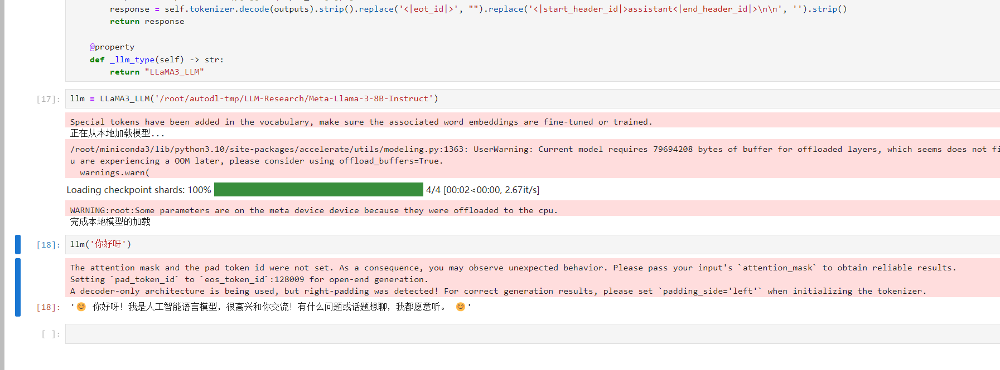

# LLaMA3-8B-Instruct langchain 接入

## 环境准备  

在 Autodl 平台中租赁一个 3090 等 24G 显存的显卡机器，如下图所示镜像选择 `PyTorch-->2.1.0-->3.10(ubuntu22.04)-->12.1 `

接下来打开刚刚租用服务器的 JupyterLab，并且打开其中的终端开始环境配置、模型下载和运行演示。  


pip 换源加速下载并安装依赖包

```shell
# 升级pip
python -m pip install --upgrade pip
# 更换 pypi 源加速库的安装
pip config set global.index-url https://pypi.tuna.tsinghua.edu.cn/simple

pip install modelscope==1.11.0
pip install langchain==0.1.15
pip install "transformers>=4.40.0" accelerate tiktoken einops scipy transformers_stream_generator==0.1.16
pip install -U huggingface_hub
```  

> 考虑到部分同学配置环境可能会遇到一些问题，我们在 AutoDL 平台准备了 LLaMA3 的环境镜像，该镜像适用于该仓库的所有部署环境。点击下方链接并直接创建 Autodl 示例即可。
> ***https://www.codewithgpu.com/i/datawhalechina/self-llm/self-llm-LLaMA3***

## 模型下载

使用 modelscope 中的 snapshot_download 函数下载模型，第一个参数为模型名称，参数 cache_dir 为模型的下载路径。

在 /root/autodl-tmp 路径下新建 model_download.py 文件并在其中输入以下内容，粘贴代码后记得保存文件，如下图所示。并运行 `python /root/autodl-tmp/model_download.py` 执行下载，模型大小为 15 GB，下载模型大概需要 2 分钟。

```python  
import torch
from modelscope import snapshot_download, AutoModel, AutoTokenizer
import os

model_dir = snapshot_download('LLM-Research/Meta-Llama-3-8B-Instruct', cache_dir='/root/autodl-tmp', revision='master')
```

## 代码准备

为便捷构建 LLM 应用，我们需要基于本地部署的 LLaMA3_LLM，自定义一个 LLM 类，将 LLaMA3 接入到 LangChain 框架中。完成自定义 LLM 类之后，可以以完全一致的方式调用 LangChain 的接口，而无需考虑底层模型调用的不一致。

基于本地部署的 LLaMA3 自定义 LLM 类并不复杂，我们只需从 LangChain.llms.base.LLM 类继承一个子类，并重写构造函数与 _call 函数即可：

```python
from langchain.llms.base import LLM
from typing import Any, List, Optional
from langchain.callbacks.manager import CallbackManagerForLLMRun
from transformers import AutoTokenizer, AutoModelForCausalLM
import torch

class LLaMA3_LLM(LLM):
    # 基于本地 llama3 自定义 LLM 类
    tokenizer: AutoTokenizer = None
    model: AutoModelForCausalLM = None
        
    def __init__(self, mode_name_or_path :str):

        super().__init__()
        print("正在从本地加载模型...")
        self.tokenizer = AutoTokenizer.from_pretrained(mode_name_or_path, use_fast=False)
        self.model = AutoModelForCausalLM.from_pretrained(mode_name_or_path, torch_dtype=torch.bfloat16, device_map="auto")
        self.tokenizer.pad_token = self.tokenizer.eos_token
        print("完成本地模型的加载")

    def bulid_input(self, prompt, history=[]):
        user_format='<|start_header_id|>user<|end_header_id|>\n\n{content}<|eot_id|>'
        assistant_format='<|start_header_id|>assistant<|end_header_id|>\n\n{content}<|eot_id|>'
        history.append({'role':'user','content':prompt})
        prompt_str = ''
        # 拼接历史对话
        for item in history:
            if item['role']=='user':
                prompt_str+=user_format.format(content=item['content'])
            else:
                prompt_str+=assistant_format.format(content=item['content'])
        return prompt_str
    
    def _call(self, prompt : str, stop: Optional[List[str]] = None,
                run_manager: Optional[CallbackManagerForLLMRun] = None,
                **kwargs: Any):

        input_str = self.bulid_input(prompt=prompt)
        input_ids = self.tokenizer.encode(input_str, add_special_tokens=False, return_tensors='pt').to(self.model.device)
        outputs = self.model.generate(
            input_ids=input_ids, max_new_tokens=512, do_sample=True,
            top_p=0.9, temperature=0.5, repetition_penalty=1.1, eos_token_id=self.tokenizer.encode('<|eot_id|>')[0]
            )
        outputs = outputs.tolist()[0][len(input_ids[0]):]
        response = self.tokenizer.decode(outputs).strip().replace('<|eot_id|>', "").replace('<|start_header_id|>assistant<|end_header_id|>\n\n', '').strip()
        return response
        
    @property
    def _llm_type(self) -> str:
        return "LLaMA3_LLM"
```

在上述类定义中，我们分别重写了构造函数和 _call 函数：对于构造函数，我们在对象实例化的一开始加载本地部署的 LLaMA3 模型，从而避免每一次调用都需要重新加载模型带来的时间过长；_call 函数是 LLM 类的核心函数，LangChain 会调用该函数来调用 LLM，在该函数中，我们调用已实例化模型的 generate 方法，从而实现对模型的调用并返回调用结果。

在整体项目中，我们将上述代码封装为 LLM.py，后续将直接从该文件中引入自定义的 LLM 类。

```python
from LLM import LLaMA3_LLM
llm = LLaMA3_LLM(mode_name_or_path = "/root/autodl-tmp/LLM-Research/Meta-Llama-3-8B-Instruct")
llm("你是谁")
```

