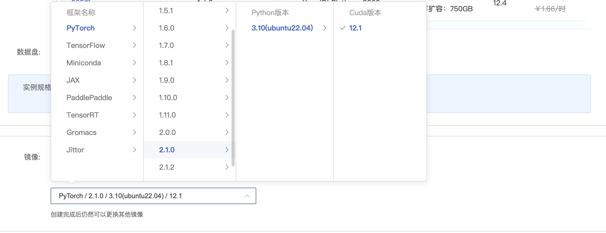

# LLaMA3_1-8B-Instruct langchain 接入

## 环境准备  
本文基础环境如下：

```
----------------
ubuntu 22.04
python 3.12
cuda 12.1
pytorch 2.3.0
----------------
```
> 本文默认学习者已安装好以上 Pytorch(cuda) 环境，如未安装请自行安装。

pip 换源加速下载并安装依赖包

```shell
# 升级pip
python -m pip install --upgrade pip
# 更换 pypi 源加速库的安装
pip config set global.index-url https://pypi.tuna.tsinghua.edu.cn/simple

pip install modelscope==1.16.1
pip install langchain==0.2.3
pip install transformers==4.43.2
pip install accelerate==0.32.1
```

> 考虑到部分同学配置环境可能会遇到一些问题，我们在AutoDL平台准备了LLaMA3-1的环境镜像，点击下方链接并直接创建Autodl示例即可。
> ***https://www.codewithgpu.com/i/datawhalechina/self-llm/self-llm-llama3.1***


## 模型下载

使用 `modelscope` 中的 `snapshot_download` 函数下载模型，第一个参数为模型名称，参数 `cache_dir` 为模型的下载路径。

在新建 `model_download.py` 文件并在其中输入以下内容，粘贴代码后记得保存文件，如下图所示。并运行 `python model_download.py` 执行下载，模型大小为 16 GB，下载模型大概需要 12 分钟。

```python  
import torch
from modelscope import snapshot_download, AutoModel, AutoTokenizer
import os

model_dir = snapshot_download('LLM-Research/Meta-Llama-3.1-8B-Instruct', cache_dir='/root/autodl-tmp', revision='master')
```
> 注意：记得修改 `cache_dir` 为你的模型下载路径哦~

## 代码准备

为便捷构建 `LLM` 应用，我们需要基于本地部署的 `LLaMA3_1_LLM`，自定义一个 `LLM` 类，将 `LLaMA3.1` 接入到 `LangChain` 框架中。完成自定义 `LLM` 类之后，可以以完全一致的方式调用 `LangChain` 的接口，而无需考虑底层模型调用的不一致。

基于本地部署的 `LLaMA3.1` 自定义 `LLM` 类并不复杂，我们只需从 `LangChain.llms.base.LLM` 类继承一个子类，并重写构造函数与 `_call` 函数即可：

在当前路径新建一个 `LLM.py` 文件，并输入以下内容，粘贴代码后记得保存文件。

```python
from langchain.llms.base import LLM
from typing import Any, List, Optional
from langchain.callbacks.manager import CallbackManagerForLLMRun
from transformers import AutoTokenizer, AutoModelForCausalLM
import torch

class LLaMA3_1_LLM(LLM):
    # 基于本地 llama3.1 自定义 LLM 类
    tokenizer: AutoTokenizer = None
    model: AutoModelForCausalLM = None
        
    def __init__(self, mode_name_or_path :str):

        super().__init__()
        print("正在从本地加载模型...")
        self.tokenizer = AutoTokenizer.from_pretrained(mode_name_or_path, use_fast=False)
        self.model = AutoModelForCausalLM.from_pretrained(mode_name_or_path, torch_dtype=torch.bfloat16, device_map="auto")
        self.tokenizer.pad_token = self.tokenizer.eos_token
        print("完成本地模型的加载")

    
    def _call(self, prompt : str, stop: Optional[List[str]] = None,
                run_manager: Optional[CallbackManagerForLLMRun] = None,
                **kwargs: Any):
        messages = [
            {"role": "system", "content": "You are a helpful assistant."},
            {"role": "user", "content": prompt}
        ]
        
        input_ids = self.tokenizer.apply_chat_template(messages,tokenize=False,add_generation_prompt=True)
        model_inputs = self.tokenizer([input_ids], return_tensors="pt").to(self.model.device)        
        generated_ids = self.model.generate(model_inputs.input_ids,max_new_tokens=512)
        generated_ids = [
            output_ids[len(input_ids):] for input_ids, output_ids in zip(model_inputs.input_ids, generated_ids)
        ]        
        response = self.tokenizer.batch_decode(generated_ids, skip_special_tokens=True)[0]
        return response
        
    @property
    def _llm_type(self) -> str:
        return "LLaMA3_1_LLM"
```

在上述类定义中，我们分别重写了构造函数和 `_call` 函数：对于构造函数，我们在对象实例化的一开始加载本地部署的 `LLaMA3.1` `模型，从而避免每一次调用都需要重新加载模型带来的时间过长；_call` 函数是 `LLM` 类的核心函数，`LangChain` 会调用该函数来调用 `LLM`，在该函数中，我们调用已实例化模型的 `generate` 方法，从而实现对模型的调用并返回调用结果。

在整体项目中，我们将上述代码封装为 `LLM.py`，后续将直接从该文件中引入自定义的 LLM 类。

## 调用

然后就可以像使用任何其他的langchain大模型功能一样使用了。

> 注意：记得修改模型路径为你的路径哦~

```python
from LLM import LLaMA3_1_LLM
llm = LLaMA3_1_LLM(mode_name_or_path = "/root/autodl-tmp/LLM-Research/Meta-Llama-3___1-8B-Instruct")

print(llm("你好呀"))
```


