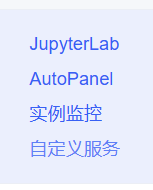
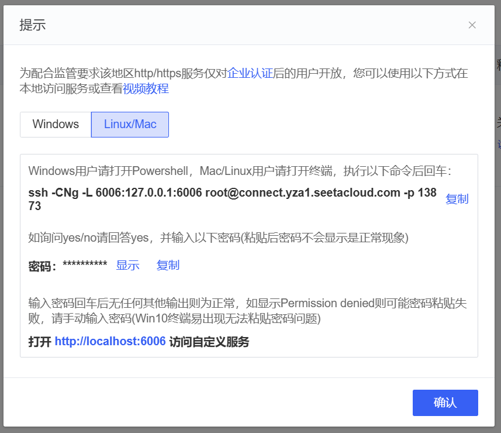
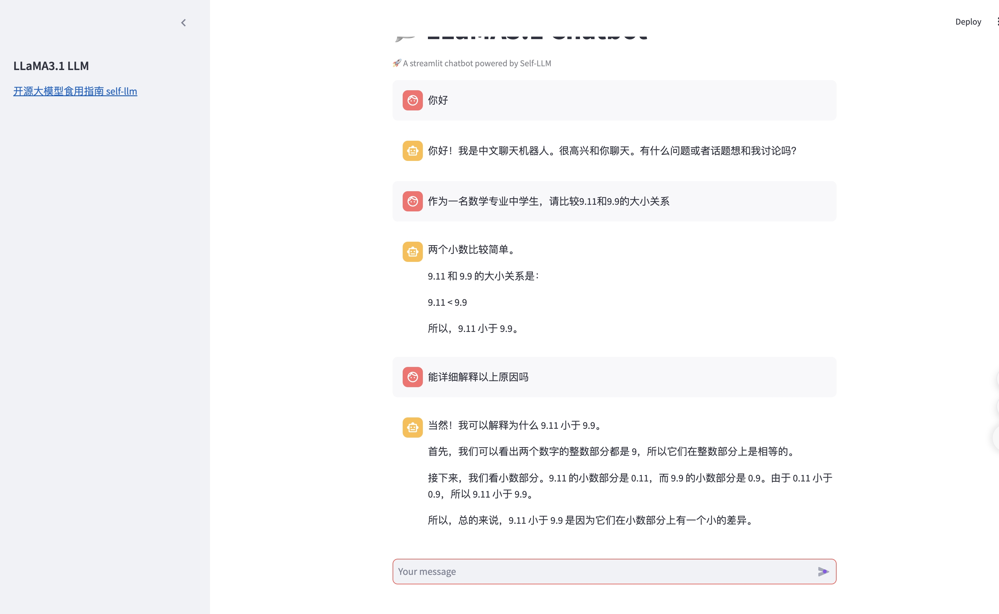

# LLaMA3_1-8B-Instruct WebDemo 部署

## 环境准备  


```
----------------
ubuntu 22.04
python 3.12
cuda 12.1
pytorch 2.3.0
----------------
```
> 本文默认学习者已安装好以上 Pytorch(cuda) 环境，如未安装请自行安装。

pip 换源加速下载并安装依赖包

```shell
# 升级pip
python -m pip install --upgrade pip
# 更换 pypi 源加速库的安装
pip config set global.index-url https://pypi.tuna.tsinghua.edu.cn/simple

pip install modelscope==1.16.1
pip install langchain==0.2.3
pip install streamlit==1.37.0
pip install transformers==4.43.2
pip install accelerate==0.32.1
```

> 考虑到部分同学配置环境可能会遇到一些问题，我们在AutoDL平台准备了LLaMA3-1的环境镜像，点击下方链接并直接创建Autodl示例即可。
> ***https://www.codewithgpu.com/i/datawhalechina/self-llm/self-llm-llama3.1***


## 模型下载

使用 modelscope 中的 snapshot_download 函数下载模型，第一个参数为模型名称，参数 cache_dir 为模型的下载路径。

在新建 `model_download.py` 文件并在其中输入以下内容，粘贴代码后记得保存文件，如下图所示。并运行 `python model_download.py` 执行下载，模型大小为 16 GB，下载模型大概需要 12 分钟。

```python  
import torch
from modelscope import snapshot_download, AutoModel, AutoTokenizer
import os

model_dir = snapshot_download('LLM-Research/Meta-Llama-3.1-8B-Instruct', cache_dir='/root/autodl-tmp', revision='master')
```

> 注意：记得修改 `cache_dir` 为你的模型下载路径哦~

## 代码准备

新建 `chatBot.py` 文件并在其中输入以下内容，粘贴代码后记得保存文件。下面的代码有很详细的注释，大家如有不理解的地方，欢迎提出issue。

```python
from transformers import AutoTokenizer, AutoModelForCausalLM
import torch
import streamlit as st

# 在侧边栏中创建一个标题和一个链接
with st.sidebar:
    st.markdown("## LLaMA3.1 LLM")
    "[开源大模型食用指南 self-llm](https://github.com/datawhalechina/self-llm.git)"

# 创建一个标题和一个副标题
st.title("💬 LLaMA3.1 Chatbot")
st.caption("🚀 A streamlit chatbot powered by Self-LLM")

# 定义模型路径
mode_name_or_path = '/root/autodl-tmp/LLM-Research/Meta-Llama-3___1-8B-Instruct'

# 定义一个函数，用于获取模型和tokenizer
@st.cache_resource
def get_model():
    # 从预训练的模型中获取tokenizer
    tokenizer = AutoTokenizer.from_pretrained(mode_name_or_path, trust_remote_code=True)
    tokenizer.pad_token = tokenizer.eos_token
    # 从预训练的模型中获取模型，并设置模型参数
    model = AutoModelForCausalLM.from_pretrained(mode_name_or_path, torch_dtype=torch.bfloat16).cuda()
  
    return tokenizer, model

# 加载LLaMA3的model和tokenizer
tokenizer, model = get_model()

# 如果session_state中没有"messages"，则创建一个包含默认消息的列表
if "messages" not in st.session_state:
    st.session_state["messages"] = []

# 遍历session_state中的所有消息，并显示在聊天界面上
for msg in st.session_state.messages:
    st.chat_message(msg["role"]).write(msg["content"])

# 如果用户在聊天输入框中输入了内容，则执行以下操作
if prompt := st.chat_input():
    
    # 在聊天界面上显示用户的输入
    st.chat_message("user").write(prompt)
    
    # 将用户输入添加到session_state中的messages列表中
    st.session_state.messages.append({"role": "user", "content": prompt})

    # 将对话输入模型，获得返回
    input_ids = tokenizer.apply_chat_template(st.session_state["messages"],tokenize=False,add_generation_prompt=True)
    model_inputs = tokenizer([input_ids], return_tensors="pt").to('cuda')
    generated_ids = model.generate(model_inputs.input_ids,max_new_tokens=512)
    generated_ids = [
        output_ids[len(input_ids):] for input_ids, output_ids in zip(model_inputs.input_ids, generated_ids)
    ]
    response = tokenizer.batch_decode(generated_ids, skip_special_tokens=True)[0]

    # 将模型的输出添加到session_state中的messages列表中
    st.session_state.messages.append({"role": "assistant", "content": response})
    # 在聊天界面上显示模型的输出
    st.chat_message("assistant").write(response)
    print(st.session_state)
```

## 运行 demo

在终端中运行以下命令，启动streamlit服务，`server.port`可以更换端口
```bash
streamlit run chatBot.py --server.address 127.0.0.1 --server.port 6006
```

点击自定义服务





在本地终端中建立 `ssh` 连接与输入密码


在本地浏览器中打开链接 http://localhost:6006/ ，即可查看部署的 `WebDemo` 聊天界面。运行效果如下：



