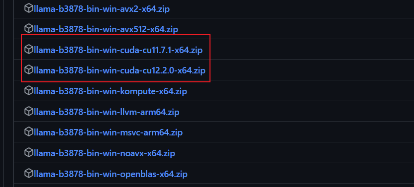
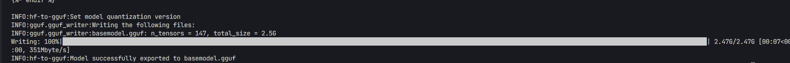
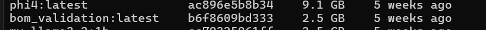

#llm #ollama #LoRA部署 

## 引言 

在上面的[[04-LLaMA3-8B-Instruct Lora 微调]]中, 介绍了构建大语言模型微调的数据集格式,数据集预处理, Q-LoRA 微调大模型, 本章我们将来到**大模型的部署**环节.
在模型的部署场景我们会希望部署后的模型服务可以提供一个标准的API, 同时部署模型的框架还要对Cuda 保持兼容性,**Ollama**就成为了很好的选择.
本文将通过**模型导入到Ollama**完成对大模型+LoRA的本地部署.

## Ollama 介绍

Ollama是一个用于简化大语言模型本地部署和运行的工具,它提供了一个轻量\易于扩展的框架, 让开发者可以在本地部署和管理大模型. 通过Ollama,开发者可以访问和管理原始pre-trained 大模型,也可以导入自己的大模型, 而无需关注底层细节.

Ollama 主要支持的是**GGUF**格式的模型文件. GGUF（GPT-Generated Unified Format）是专为高效运行 LLM 设计的二进制格式，由 `llama.cpp` 项目引入，取代了旧版 GGML 格式。可以从Hugging face 下载预转换的GGUF 原始模型, 或者使用`llama.cpp` 自行转换
## 什么是GGUF

GGUF 格式的全名为（GPT-Generated Unified Format），提到 GGUF 就不得不提到它的前身 GGML（GPT-Generated Model Language）。GGML 是专门为了机器学习设计的张量库，最早可以追溯到 2022/10。其目的是为了有一个单文件共享的格式，并且易于在不同架构的 GPU 和 CPU 上进行推理。但在后续的开发中，遇到了灵活性不足、相容性及难以维护的问题。

根据上面Ollama 部分的介绍我们可以发现, pytorch训练后的模型文件不能直接导入到ollama中, 需要将其预先转为`.gguf` 文件. 本节将讲述如何将训练后的模型导出为gguf 文件.

## 动手转化基础模型和LoRA 文件到GGUF

### 从huggingface download 基础模型
最直觉是用 git clone 来下载模型，但是因为 LLM 每个一部分都按 GB 来计算，避免出现 OOM Error 的情况，简单用 Python 写一个 download.py 比较简单

```shell
#安装huggingface_hub
pip install huggingface_hub
```

执行下面的代码

```python
from huggingface_hub import snapshot_download
model_id="unsloth/Llama-3.1-8B-Instruct"
snapshot_download(repo_id=model_id, local_dir="yout_path",
                          local_dir_use_symlinks=False, revision="main")
```

### 转换模型到GGUF
#### 克隆llama.cpp
在控制台中部署下面的代码,clone 项目到本地

```shell
git clone https://github.com/ggerganov/llama.cpp.git

cd llama.cpp
```

直接从[release](https://github.com/ggerganov/llama.cpp/releases/tag/b3878) 中下载最新的预编译好的文件到本地并解压缩到llama.cpp目录下. ==**注意: 请下载带有CUDA 编译的版本, 请根据自己的Cuda版本进行选择**==


#### 创建虚拟环境
##### 使用conda

```shell
conda create -n llamacpp
conda activate llamacpp
```

##### 使用venv

```shell
python -m venv llamacpp
.\venv\Scripts\activate
```

#### 安装环境依赖

```shell
pip install -r .\requirements.txt
```

#### 转换基础模型

运行`convert_hf_to_gguf.py`, 此脚本用于将 Hugging Face 格式的模型转换为 GGUF 格式。请按照以下步骤操作：

1. 确保您已经在`llama.cpp`目录下，并且已经激活了 Python 虚拟环境。

2. 使用以下命令运行脚本：
```shell
python convert_hf_to_gguf.py --outfile <gguf_path> <base_model_path>
```
- `--outfile` 参数指定转换后的 GGUF 文件的输出路径。
- 最后的参数是您要转换的 Hugging Face 模型的路径。

请确保在运行这些脚本之前，所有路径和文件名都是正确的，并且所需的依赖项已经安装完毕。

通过日志可以看到导出成功

#### 转换LoRA 适配器

继续使用下面的命令运行脚本
```shell
python .\convert_lora_to_gguf.py --outfile <lora_gguf_path> --base <base_model_path>   <lora_model_path>
```

- `--outfile`参数指定转换后的GGUF 文件的输出路径
- `--base` 参数指定转换gguf 前的基础模型的地址
- 最后的参数是您要转换的LoRA 模型的路径

### 基于GGUF文件创建模型

如果你有一个基于 GGUF 的模型或适配器，可以通过Ollama 的modelfile将其导入 Ollama.

`Modelfile`是一个模型的配置文件, 需要包含如下信息:

*  `FROM`(必须):模型的GGUF 文件地址
*  `ADAPTER`: 模型的LORA 适配器地址, 也需要转化为GGUF 文件
*  `TEMPLATE`: 模型的提示模板, **建议直接沿用基模型的TEMPLATE**

```Modelfile
FROM /path/to/model.gguf
ADAPTER /path/to/adapter.gguf
TEMPLATE 基础模型的template
```

创建`my_lora_adapter.Modelfile` 文件, 并按照上述模板填写信息, 完成创建后通过下面的语句创建模型

```shell
ollama create <modelname> -f my_lora_adapter.Modelfile
```
再次执行`ollama list` 即可看到自己的模型啦



# 总结

将模型和LoRA适配器转换为GGUF格式需以下步骤：下载LLM至本地，准备环境并安装依赖，使用脚本将Hugging Face模型转为GGUF格式，再将LoRA适配器转为GGUF。后续介绍了ollama以及Modelfile 文件, 基于这些命令可以快速使用ollama 部署微调后的Lora 适配器