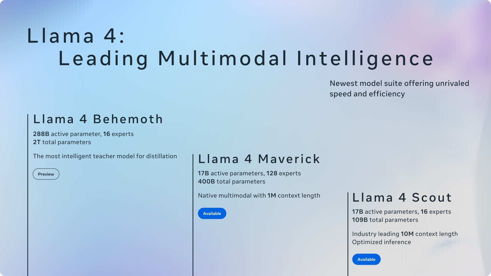
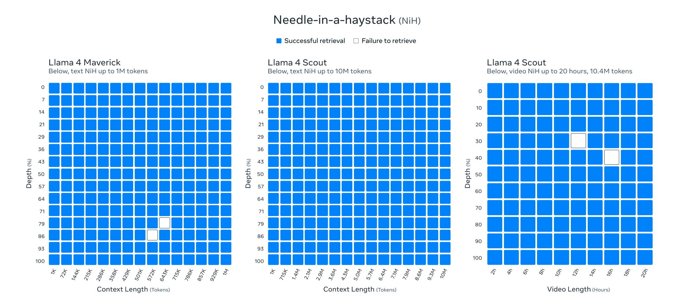
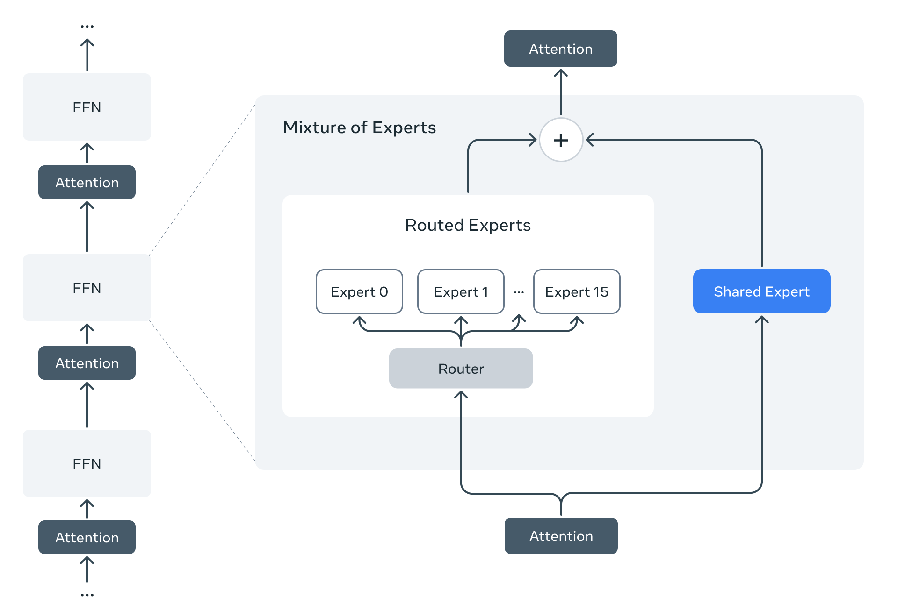
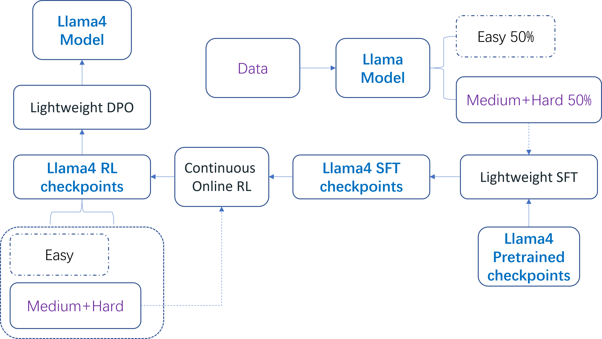
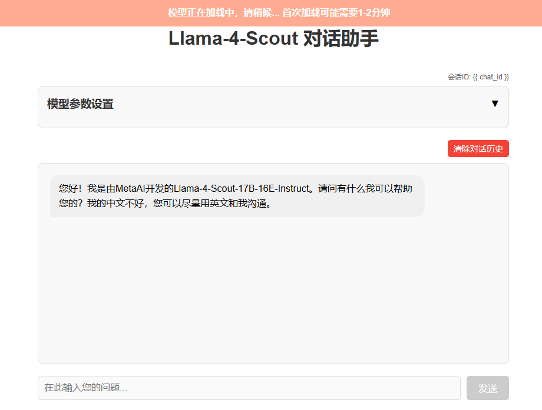
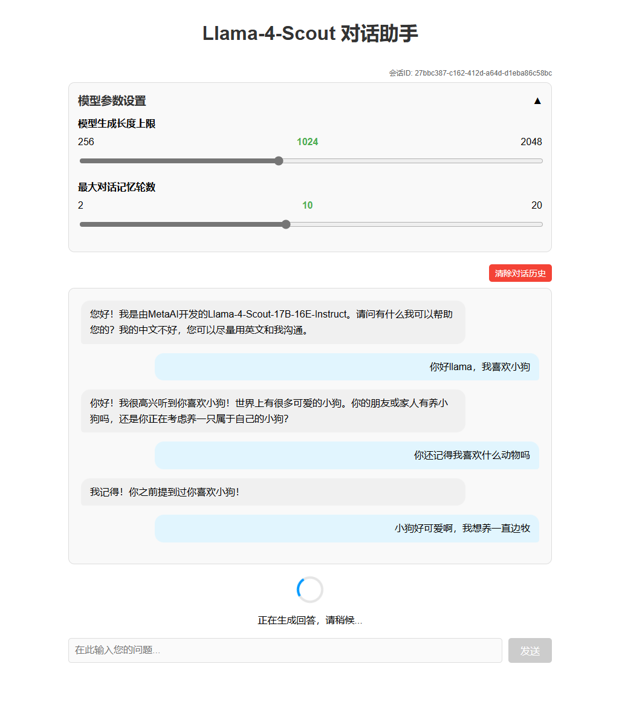

# Llama4-对话助手


## 环境准备  

基础环境：

```
----------------
ubuntu 22.04
python 3.12
cuda 12.4
pytorch 2.6.0
----------------
另外：保证有足够的GPU显存
```
首先 `pip` 换源加速下载并安装依赖包

```shell
pip config set global.index-url https://pypi.tuna.tsinghua.edu.cn/simple

pip install modelscope==1.20.0
pip install transformers==4.51.0
pip install accelerate==1.6.0
pip install compressed-tensors==0.9.3
pip install flask==3.1.0
```


## 模型简介



Llama 4 已发布系列中目前包括 Llama 4 Scout 和 Llama 4 Maverick，并预发布了 Llama 4 Behemoth 模型。Scout 和 Maverick 都具备原生多模态能力，能够理解**图像和文本**两种形式的输入，以及**文本**形式的输出。Llama 4 Maverick 的上下文窗口为 1M tokens，而Llama 4 Scout 拥有高达 10M tokens 的上下文窗口大小（先前开源模型中最大的只有1M）。此外，模型支持多语言（但对中文依然没有很好的支持）。

值得一提的是，这次是 Meta 第一次采用 MoE 架构。

**表 1：Llama 4 和 上一代 Llama 3 的比较**

| 特性           | Llama 4 (Scout/Maverick)                      | Llama 3 (8B/70B/405B)                                        |
| :------------- | :-------------------------------------------- | :----------------------------------------------------------- |
| 发布日期       | 2025.04.05                                    | 2024.04.18                                                   |
| 知识截止日期   | 2024.08                                       | 2023.10                                                      |
| 输入模态       | 文本和图像（最多8张）                         | 主要基于文本（后续Llama3.2发布了11B和90B尺寸的Vision版本，支持了图像输入） |
| 输出模态       | 文本                                          | 文本                                                         |
| 架构           | Sparse (MoE)                                  | Dense                                                        |
| 训练数据       | 40T+ tokens（Scout）/ 22T+ tokens（Maverick） | 15T+ tokens                                                  |
| 最大上下文窗口 | 10M                                           | 128k                                                         |
| 参数规模       | 17B/109B（Scout）17B/400B（Maverick）         | 8B，70B，405B                                                |
| 支持语言       | 多语言（200 languages）                       | 多语言                                                       |

**表 2：Llama 4 性能基准测试**

| 基准测试类别 | 基准测试           | Llama 4 Scout | Llama 4 Maverick | GPT-4o | Gemini 2.0 Flash | DeepSeek v3 0324 |
| :----------- | :----------------- | :------------ | :--------------- | :----- | :--------------- | :--------------- |
| 图像推理     | MMMU               | 69.4          | 73.4             | 69.1   | 71.7             | 不支持多模态     |
|              | MathVista          | 70.7          | 73.7             | 63.8   | 73.1             | 不支持多模态     |
| 图像理解     | ChartQA            | 88.8          | 90.0             | 85.7   | 88.3             | 不支持多模态     |
| 编码         | LiveCodeBench      | 32.8          | 43.4             | 32.3   | 34.5             | 45.8/49.2        |
| 推理与知识   | MMLU Pro           | 74.3          | 80.5             | N/A    | 77.6             | 81.2             |
|              | GPQA Diamond       | 57.2          | 69.8             | 53.6   | 60.1             | 68.4             |
| 多语言       | MGSM               | 90.6          | 92.3             | N/A    | N/A              | N/A              |
| 长上下文     | MTOB               | 42.2          | 54.0             | N/A    | 48.4             | N/A              |
|              | ELO 评分 (LMArena) | N/A           | 1417             | N/A    | N/A              | N/A              |

**几个值得注意的点**

**原生多模态能力**：Llama 4 采用了**early fusion**，将文本和视觉 tokens 集成到统一的模型骨干中，从而实现了对多模态输入的更连贯理解。这种方法从模型架构的底层就将视觉和语言信息联系起来，使得模型能够更好地理解图像和文本之间的关系，并生成更相关的响应。

**扩展的上下文窗口**：Llama 4 Scout 拥有高达 10M 的上下文窗口，使得模型能够处理和理解极其长的信息序列，在mid-training阶段加入了特殊的数据集（long-context dataset）进行长上下文扩展

> retrieval needle in haystack experiments result



**MoE**：Llama 4 Scout 和 Maverick 都采用了混合专家架构。在这种架构中，对于任何给定的 token，只有一部分模型参数是激活的，从而提高了计算效率并提升了模型质量。通过MoE，模型可以在保持较低的计算成本的同时，拥有更大的模型容量。整体架构和DeepSeek MoE架构很像（但是额外引入了对多模态的处理），即两个核心思想，split more experts and shared expert



**训练**：预训练过程采用了 FP8 精度进行高效训练，以及使用 MetaP 技术设置超参数。此外，后训练阶段还采用了具有自适应数据过滤功能的持续在线强化学习策略，以进一步提升模型性能。


**Llama 4 中的新技术和新架构**

**early fusion**：Llama 4 使用**early fusion**方法从模型架构的开始就整合文本和视觉处理，将两种模态视为一个 token 序列进行处理。这种方法使得模型能够更早地学习文本和图像之间的关联，从而提高了对多模态输入的理解能力。

Llama4 的 vision encoder 基于 MetaClip 进行了改进，其与冻结的 Llama 模型单独训练，以更好地适配LLM encoder

**iRoPE**：Llama 4 Scout 采用了 interleaved attention layers without positional embeddings，并且使用inference time temperature scaling of attention来增强其长度泛化能力，称为 iRoPE 架构，这有助于其高效地处理长上下文，更高效的处理长序列中位置信息。

**MetaP**：设置关键模型超参数，例如每层学习率和初始化尺度。发现所选的超参数在不同批大小、模型宽度、深度和训练token之间具有良好的迁移性


**从数据规模上来看**，训练中数据的量依然在扩展，增加的量一部分是来源于更多语言的支持，一部分来源于Meta产品中真实用户数据，一部分是Llama3到Llama4这一年期间公开互联网产生的新的数据

Llama 4 相较于 Llama 3 训练数据规模的显著增加和Llama 4 Behemoth 2T的总模型参数量表明，Meta 依然坚信Scaling Law，即更多的数据，更大的模型，更多的算力通常会导致更好的性能。


**Post-Training阶段**

在对 Llama 4 Maverick 模型进行后训练时，最大的挑战在于维持多模态输入、推理和对话能力之间的平衡。

Llama 4，使用了一个后训练pipeline：轻量级监督微调 (SFT) > 在线强化学习 (RL) > 轻量级直接偏好优化 (DPO)。一个关键的经验是，SFT 和 DPO 可能会过度约束模型，限制在线 RL 阶段的探索，并导致次优的准确性，尤其是在推理、编码和数学领域。

为了解决这个问题，使用 Llama Model as a Judge，去除了超过 50% 被标记为简单的数据，并在剩余的较难数据集上进行了轻量级 SFT。

在随后的多模态在线 RL 阶段，通过仔细选择更难的prompt，得以在性能上实现阶跃式的提升。具体而言，持续在线 RL 策略中，通过交替训练模型，然后使用该模型持续筛选并仅保留medium到hard的prompt。实验结果表明，这种策略在计算和准确性权衡方面都非常有益。

最后，进行了轻量级的 DPO 来处理与模型响应质量相关的边缘情况，有效地在模型的智能和对话能力之间取得了良好的平衡。




## 模型下载  

使用 `modelscope` 中的 `snapshot_download` 函数下载模型，第一个参数为模型名称，参数 `cache_dir` 为模型的下载路径。

新建 `model_download.py` 文件输入以下代码，并运行 `python model_download.py` 执行下载。

此处使用 `modelscope` 提供的 `snapshot_download` 函数进行下载，该方法对国内的用户十分友好。

```python
# model_download.py
from modelscope import snapshot_download

model_dir = snapshot_download('LLM-Research/Llama-4-Scout-17B-16E-Instruct', cache_dir='请修改我！', revision='master')
# model_dir = snapshot_download('LLM-Research/Llama-4-Maverick-17B-128E-Instruct-FP8', cache_dir='请修改我！', revision='master')
```

> 注意：请记得修改 `cache_dir` 为你自己的模型下载路径 ~


## 应用搭建

#### 后端代码

```python
# app.py

from flask import Flask, request, jsonify, render_template, session
import torch
from transformers import AutoTokenizer, Llama4ForConditionalGeneration
import gc
import re
import uuid

app = Flask(__name__)
app.secret_key = "llama4-scout-chatbot-secret-key"  # 用于session加密

# 全局变量存储预加载的模型和tokenizer
MODEL_ID = "/pfs/mt-euDpOR/nlp/personal/shufan.jiang/models/LLM-Research/Llama-4-Scout-17B-16E-Instruct"
tokenizer = None
model = None
# 用于存储对话历史的字典
chat_histories = {}
# 默认值设置
DEFAULT_MAX_NEW_TOKENS = 1024
DEFAULT_MAX_HISTORY_LENGTH = 10

# 在应用启动前预加载模型
def load_model():
    global tokenizer, model
    print("正在加载模型和tokenizer，请稍候...")
    
    # 加载tokenizer
    tokenizer = AutoTokenizer.from_pretrained(MODEL_ID)
    
    # 加载模型
    model = Llama4ForConditionalGeneration.from_pretrained(
        MODEL_ID,
        attn_implementation="eager",
        device_map="auto",
        torch_dtype=torch.bfloat16,
    )
    print("模型加载完成！")

def clean_response(text):
    """清理模型响应中的特殊标记"""
    # 根据截图中看到的标记，定义可能的标记形式
    patterns = [
        # 直接匹配具体的标记
        '<|eot|>',
    ]
    
    # 应用所有模式
    for pattern in patterns:
        text = text.replace(pattern, '')
    
    # 使用正则表达式处理可能的其他token
    text = re.sub(r'<[\|/]?eot[\|]?>', '', text)  # 匹配形如 <eot>, </eot>, <|eot|> 等
    
    return text.strip()

@app.route('/')
def home():
    # 创建会话ID
    if 'chat_id' not in session:
        session['chat_id'] = str(uuid.uuid4())
    
    # 如果是新会话，初始化聊天历史
    chat_id = session['chat_id']
    if chat_id not in chat_histories:
        chat_histories[chat_id] = []
    
    return render_template('index.html', chat_id=chat_id)

@app.route('/api/generate', methods=['POST'])
def generate():
    try:
        # 确保模型已加载
        if tokenizer is None or model is None:
            return jsonify({"error": "模型正在加载中，请稍后再试"}), 503
        
        data = request.json
        user_input = data.get('user_input', '')
        chat_id = data.get('chat_id', session.get('chat_id', str(uuid.uuid4())))
        
        # 获取前端传递的参数，如果没有则使用默认值
        max_new_tokens = int(data.get('max_new_tokens', DEFAULT_MAX_NEW_TOKENS))
        max_history_length = int(data.get('max_history_length', DEFAULT_MAX_HISTORY_LENGTH))
        
        # 参数限制，确保在合理范围内
        max_new_tokens = max(256, min(max_new_tokens, 2048))
        max_history_length = max(2, min(max_history_length, 20))
        
        if not user_input:
            return jsonify({"error": "请输入问题"}), 400
        
        # 获取或初始化聊天历史
        if chat_id not in chat_histories:
            chat_histories[chat_id] = []
        
        # 添加用户消息到历史记录
        chat_histories[chat_id].append({"role": "user", "content": user_input})
        
        # 从历史记录构建消息列表，使用前端传递的历史长度
        messages = chat_histories[chat_id][-max_history_length*2:]  # 用户和助手消息各算一条
        
        # 应用chat模板
        inputs = tokenizer.apply_chat_template(messages, add_generation_prompt=True, return_tensors="pt", return_dict=True)
        
        # 生成响应，使用前端传递的token数量
        with torch.no_grad():
            outputs = model.generate(**inputs.to(model.device), max_new_tokens=max_new_tokens)
        response = tokenizer.batch_decode(outputs[:, inputs["input_ids"].shape[-1]:])
        
        # 清理缓存
        torch.cuda.empty_cache()
        gc.collect()
        
        # 清理响应，移除结束标记
        cleaned_response = clean_response(response[0])
        
        # 添加模型回复到历史记录
        chat_histories[chat_id].append({"role": "assistant", "content": cleaned_response})
        
        # 如果历史记录太长，保留最新的max_history_length条
        if len(chat_histories[chat_id]) > max_history_length * 2:  # 用户和助手消息各占一半
            chat_histories[chat_id] = chat_histories[chat_id][-max_history_length*2:]
        
        return jsonify({
            "response": cleaned_response,
            "chat_id": chat_id,
            "max_new_tokens": max_new_tokens,
            "max_history_length": max_history_length
        })
    
    except Exception as e:
        return jsonify({"error": str(e)}), 500

@app.route('/api/clear_history', methods=['POST'])
def clear_history():
    try:
        data = request.json
        chat_id = data.get('chat_id', session.get('chat_id'))
        
        if chat_id and chat_id in chat_histories:
            chat_histories[chat_id] = []
            return jsonify({"success": True, "message": "聊天历史已清除"})
        else:
            return jsonify({"success": False, "error": "无效的会话ID"}), 400
    except Exception as e:
        return jsonify({"success": False, "error": str(e)}), 500

if __name__ == '__main__':
    # 在另一个线程中预加载模型
    import threading
    threading.Thread(target=load_model).start()
    
    app.run(debug=True, host='0.0.0.0', port=5000, use_reloader=False) 
```

> 注意：同样记得修改 `MODEL_ID` 为你自己的模型下载路径 ~


#### 前端代码

```html
# index.html

<!DOCTYPE html>
<html lang="zh">
<head>
    <meta charset="UTF-8">
    <meta name="viewport" content="width=device-width, initial-scale=1.0">
    <title>Llama-4-Scout 对话助手</title>
    <style>
        body {
            font-family: Arial, sans-serif;
            line-height: 1.6;
            max-width: 800px;
            margin: 0 auto;
            padding: 20px;
        }
        h1 {
            text-align: center;
            margin-bottom: 30px;
            color: #333;
        }
        .chat-container {
            background-color: #f9f9f9;
            border-radius: 10px;
            padding: 20px;
            margin-bottom: 20px;
            min-height: 300px;
            max-height: 500px;
            overflow-y: auto;
            border: 1px solid #ddd;
        }
        .message {
            margin-bottom: 15px;
            padding: 10px 15px;
            border-radius: 15px;
            max-width: 80%;
        }
        .user-message {
            background-color: #e1f5fe;
            margin-left: auto;
            text-align: right;
            border-bottom-right-radius: 5px;
        }
        .bot-message {
            background-color: #f0f0f0;
            margin-right: auto;
            border-bottom-left-radius: 5px;
        }
        .input-container {
            display: flex;
            gap: 10px;
        }
        #user-input {
            flex: 1;
            padding: 10px;
            border: 1px solid #ddd;
            border-radius: 5px;
            font-size: 16px;
        }
        button {
            padding: 10px 20px;
            background-color: #4CAF50;
            color: white;
            border: none;
            border-radius: 5px;
            cursor: pointer;
            font-size: 16px;
        }
        button:hover {
            background-color: #45a049;
        }
        button:disabled {
            background-color: #cccccc;
            cursor: not-allowed;
        }
        #loading {
            text-align: center;
            display: none;
        }
        #model-loading {
            position: fixed;
            top: 0;
            left: 0;
            width: 100%;
            background-color: #ffab91;
            color: white;
            text-align: center;
            padding: 10px;
            font-weight: bold;
            z-index: 1000;
        }
        .spinner {
            border: 4px solid rgba(0, 0, 0, 0.1);
            width: 36px;
            height: 36px;
            border-radius: 50%;
            border-left-color: #09f;
            animation: spin 1s linear infinite;
            margin: 10px auto;
        }
        @keyframes spin {
            0% { transform: rotate(0deg); }
            100% { transform: rotate(360deg); }
        }
        .control-buttons {
            display: flex;
            justify-content: flex-end;
            margin-bottom: 10px;
        }
        #clear-btn {
            background-color: #f44336;
            font-size: 14px;
            padding: 5px 10px;
        }
        #clear-btn:hover {
            background-color: #d32f2f;
        }
        .session-info {
            font-size: 12px;
            color: #666;
            text-align: right;
            margin-bottom: 5px;
        }
        .settings-container {
            background-color: #f9f9f9;
            border: 1px solid #ddd;
            border-radius: 10px;
            padding: 15px;
            margin-bottom: 20px;
        }
        .settings-header {
            display: flex;
            justify-content: space-between;
            align-items: center;
            margin-bottom: 10px;
            cursor: pointer;
        }
        .settings-header h3 {
            margin: 0;
            color: #333;
        }
        .settings-content {
            display: none;
        }
        .settings-content.active {
            display: block;
        }
        .slider-container {
            margin-bottom: 15px;
        }
        .slider-container label {
            display: block;
            margin-bottom: 5px;
            font-weight: bold;
        }
        .slider-container .slider-info {
            display: flex;
            justify-content: space-between;
            margin-bottom: 5px;
        }
        .slider-container .value-display {
            font-weight: bold;
            color: #4CAF50;
        }
        input[type="range"] {
            width: 100%;
            margin-top: 5px;
        }
    </style>
</head>
<body>
    <div id="model-loading">
        模型正在加载中，请稍候... 首次加载可能需要1-2分钟
    </div>
    
    <h1>Llama-4-Scout 对话助手</h1>
    
    <div class="session-info">
        会话ID: <span id="chat-id">{{ chat_id }}</span>
    </div>
    
    <div class="settings-container">
        <div class="settings-header" id="settings-toggle">
            <h3>模型参数设置</h3>
            <span>▼</span>
        </div>
        <div class="settings-content" id="settings-content">
            <div class="slider-container">
                <label for="max-tokens-slider">模型生成长度上限</label>
                <div class="slider-info">
                    <span>256</span>
                    <span class="value-display" id="max-tokens-value">1024</span>
                    <span>2048</span>
                </div>
                <input type="range" id="max-tokens-slider" min="256" max="2048" step="128" value="1024">
            </div>
            <div class="slider-container">
                <label for="history-length-slider">最大对话记忆轮数</label>
                <div class="slider-info">
                    <span>2</span>
                    <span class="value-display" id="history-length-value">10</span>
                    <span>20</span>
                </div>
                <input type="range" id="history-length-slider" min="2" max="20" step="1" value="10">
            </div>
        </div>
    </div>
    
    <div class="control-buttons">
        <button id="clear-btn" disabled>清除对话历史</button>
    </div>
    
    <div class="chat-container" id="chat-container">
        <div class="message bot-message">
            您好！我是由MetaAI开发的Llama-4-Scout-17B-16E-Instruct。请问有什么我可以帮助您的？
        </div>
    </div>
    
    <div id="loading">
        <div class="spinner"></div>
        <p>正在生成回答，请稍候...</p>
    </div>
    
    <div class="input-container">
        <input type="text" id="user-input" placeholder="在此输入您的问题..." disabled>
        <button id="send-btn" disabled>发送</button>
    </div>

    <script>
        document.addEventListener('DOMContentLoaded', function() {
            const chatContainer = document.getElementById('chat-container');
            const userInput = document.getElementById('user-input');
            const sendBtn = document.getElementById('send-btn');
            const clearBtn = document.getElementById('clear-btn');
            const loading = document.getElementById('loading');
            const modelLoading = document.getElementById('model-loading');
            const chatId = document.getElementById('chat-id').textContent;
            
            // 设置相关元素
            const settingsToggle = document.getElementById('settings-toggle');
            const settingsContent = document.getElementById('settings-content');
            const maxTokensSlider = document.getElementById('max-tokens-slider');
            const maxTokensValue = document.getElementById('max-tokens-value');
            const historyLengthSlider = document.getElementById('history-length-slider');
            const historyLengthValue = document.getElementById('history-length-value');
            
            // 默认值
            let maxNewTokens = 1024;
            let maxHistoryLength = 10;
            
            // 聊天历史存储
            const chatHistory = [];
            
            // 切换设置面板
            settingsToggle.addEventListener('click', function() {
                settingsContent.classList.toggle('active');
                settingsToggle.querySelector('span').textContent = 
                    settingsContent.classList.contains('active') ? '▲' : '▼';
            });
            
            // 更新拖动条值显示和实时应用
            maxTokensSlider.addEventListener('input', function() {
                maxNewTokens = parseInt(this.value);
                maxTokensValue.textContent = maxNewTokens;
            });
            
            historyLengthSlider.addEventListener('input', function() {
                maxHistoryLength = parseInt(this.value);
                historyLengthValue.textContent = maxHistoryLength;
            });
            
            // 清理响应中的特殊标记
            function cleanResponse(text) {
                // 移除各种结束标记
                return text.replace(/<\|eot\|>/g, '')
                           .replace(/<eot>/g, '')
                           .replace(/<\/eot>/g, '')
                           .trim();
            }
            
            // 检查模型是否已加载
            function checkModelStatus() {
                fetch('/api/generate', {
                    method: 'POST',
                    headers: {
                        'Content-Type': 'application/json'
                    },
                    body: JSON.stringify({ user_input: '', chat_id: chatId })
                })
                .then(response => {
                    if (response.status === 503) {
                        // 模型仍在加载，继续等待
                        setTimeout(checkModelStatus, 5000);
                    } else {
                        // 模型已加载，启用输入
                        modelLoading.style.display = 'none';
                        sendBtn.disabled = false;
                        userInput.disabled = false;
                        clearBtn.disabled = false;
                        
                        // 激活设置面板
                        settingsContent.classList.add('active');
                        settingsToggle.querySelector('span').textContent = '▲';
                    }
                })
                .catch(error => {
                    // 发生错误，继续等待
                    setTimeout(checkModelStatus, 5000);
                });
            }
            
            // 启动检查
            checkModelStatus();

            function addMessage(content, isUser) {
                const messageDiv = document.createElement('div');
                messageDiv.className = `message ${isUser ? 'user-message' : 'bot-message'}`;
                
                // 清理机器人响应中的特殊标记
                if (!isUser) {
                    content = cleanResponse(content);
                }
                
                messageDiv.textContent = content;
                chatContainer.appendChild(messageDiv);
                chatContainer.scrollTop = chatContainer.scrollHeight;
                
                // 保存到本地历史记录（可选，因为服务器已经保存了）
                chatHistory.push({
                    role: isUser ? 'user' : 'assistant',
                    content: content
                });
            }

            async function sendMessage() {
                const message = userInput.value.trim();
                if (!message) return;

                // 添加用户消息到聊天框
                addMessage(message, true);
                userInput.value = '';
                
                // 显示加载中
                loading.style.display = 'block';
                sendBtn.disabled = true;
                userInput.disabled = true;
                clearBtn.disabled = true;
                
                try {
                    const response = await fetch('/api/generate', {
                        method: 'POST',
                        headers: {
                            'Content-Type': 'application/json'
                        },
                        body: JSON.stringify({ 
                            user_input: message,
                            chat_id: chatId,
                            max_new_tokens: maxNewTokens,
                            max_history_length: maxHistoryLength
                        })
                    });

                    const data = await response.json();
                    
                    if (response.ok) {
                        // 添加AI回复到聊天框
                        addMessage(data.response, false);
                    } else {
                        addMessage(`错误: ${data.error || '服务器错误'}`, false);
                    }
                } catch (error) {
                    addMessage(`发生错误: ${error.message}`, false);
                } finally {
                    loading.style.display = 'none';
                    sendBtn.disabled = false;
                    userInput.disabled = false;
                    clearBtn.disabled = false;
                }
            }
            
            // 清除对话历史
            async function clearHistory() {
                try {
                    clearBtn.disabled = true;
                    
                    const response = await fetch('/api/clear_history', {
                        method: 'POST',
                        headers: {
                            'Content-Type': 'application/json'
                        },
                        body: JSON.stringify({ chat_id: chatId })
                    });
                    
                    const data = await response.json();
                    
                    if (data.success) {
                        // 清除聊天界面
                        chatContainer.innerHTML = '';
                        // 添加欢迎消息
                        const welcomeDiv = document.createElement('div');
                        welcomeDiv.className = 'message bot-message';
                        welcomeDiv.textContent = '您好！我是由MetaAI开发的Llama-4-Scout-17B-16E-Instruct。请问有什么我可以帮助您的？';
                        chatContainer.appendChild(welcomeDiv);
                        
                        // 清除本地历史
                        chatHistory.length = 0;
                    } else {
                        alert('清除历史失败: ' + (data.error || '未知错误'));
                    }
                } catch (error) {
                    alert('清除历史时发生错误: ' + error.message);
                } finally {
                    clearBtn.disabled = false;
                }
            }

            // 添加事件监听器
            sendBtn.addEventListener('click', sendMessage);
            clearBtn.addEventListener('click', clearHistory);
            userInput.addEventListener('keypress', function(e) {
                if (e.key === 'Enter' && !sendBtn.disabled) {
                    sendMessage();
                }
            });
        });
    </script>
</body>
</html> 
```

#### 

#### 运行应用

```bash
python app.py
```

应用将在 http://localhost:5000 上运行。

**注意**：启动后模型会在后台自动加载，这可能需要1-2分钟。在此期间，界面会显示"模型正在加载中"的提示，加载完成后才能开始对话。

以 `bfloat16` 精度加载模型时，参考显存占用大约为 `212910MB = 208GB`

如果显存不足，可以使用 `INT4` 进行量化加载

#### 使用方法

1. 在浏览器中打开 http://localhost:5000
2. 等待模型加载完成（顶部的橙色通知条消失）
3. 根据需要调整参数滑动条：
   - **生成长度上限**：控制每次回复生成的最大token数（范围：256-2048）
   - **历史记录长度**：控制对话中保留的最大轮数（范围：2-20）
4. 在输入框中输入您的问题
5. 点击"发送"按钮或按Enter键发送问题
6. 等待模型生成回复
7. 继续进行多轮对话，模型会记住之前的对话内容
8. 如需清除对话历史，点击"清除对话历史"按钮

#### 效果展示






## 参考代码及其使用

本次教程搭建了一个基于 `Llama-4-Scout-17B-16E-Instruct` 的前后端分离的对话助手，额外提供了参考代码供学习者参考
