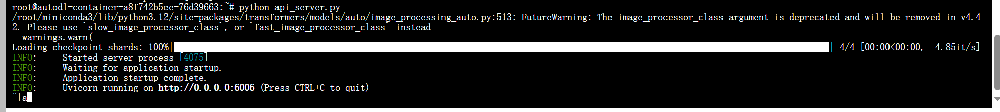
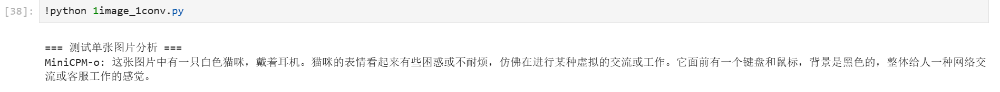
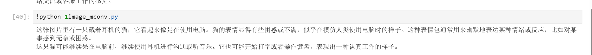
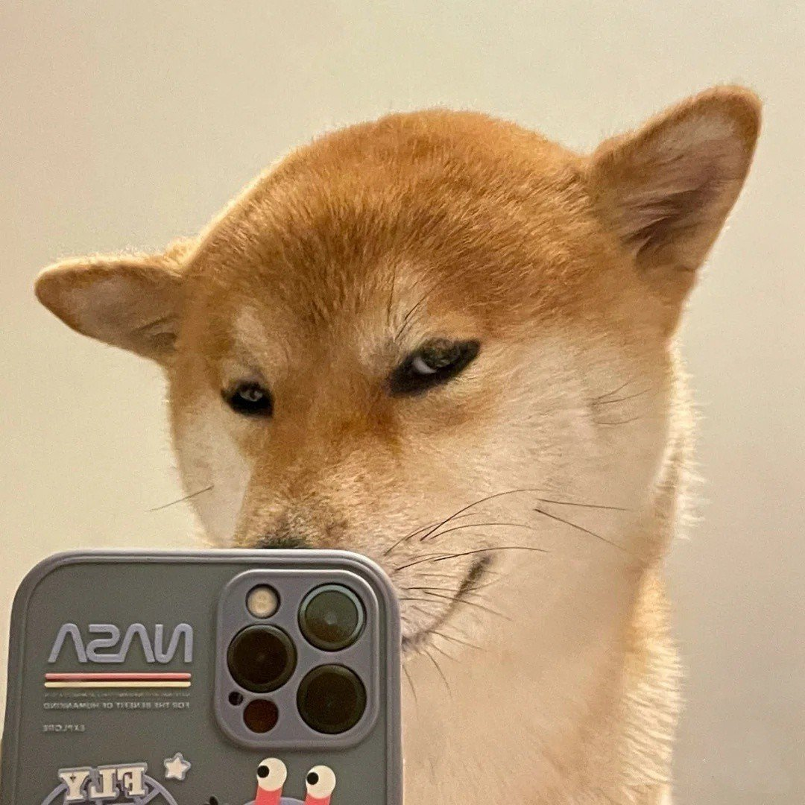
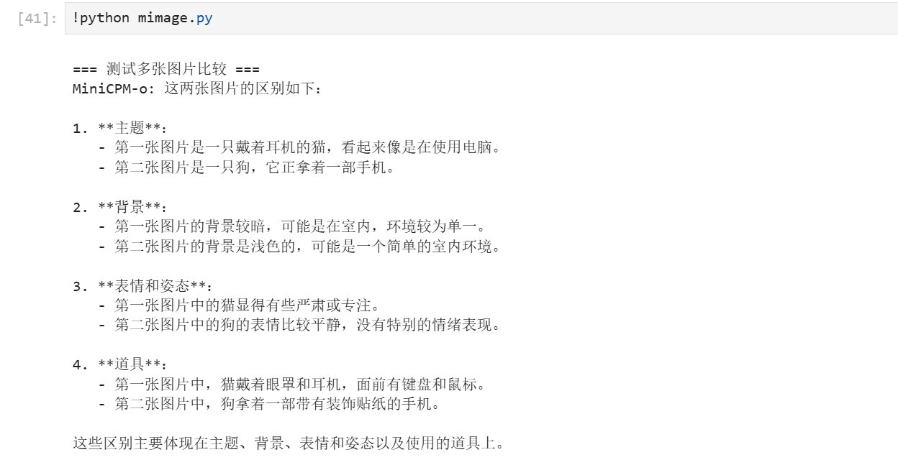
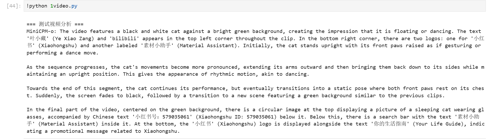

# MiniCPM-o 2.6 FastApi部署调用

## 环境配置

基础环境如下：

```
----------------
ubuntu 22.04
Python 3.12.3
cuda 12.1
pytorch 2.3.0
----------------
```

打开终端或新建 `Jupyter.ipynb` 文件，换源加速及安装魔搭依赖

```shell
pip config set global.index-url https://pypi.tuna.tsinghua.edu.cn/simple

pip install modelscope==1.20.0
```


官方环境打包文件传送门：https://github.com/OpenBMB/MiniCPM-o/blob/main/requirements_o2.6.txt

下载到所属路径下，一键`pip`安装

```shell
pip install -r requirements_o2.6.txt
```


或手动`pip`安装

```shell
pip install Pillow==10.1.0 torch==2.3.1 torchaudio==2.3.1 torchvision==0.18.1 transformers==4.44.2 sentencepiece==0.2.0 vector-quantize-pytorch==1.18.5 vocos==0.1.0 accelerate==1.2.1 timm==0.9.10 soundfile==0.12.1 librosa==0.9.0 decord moviepy fastapi uvicorn python-multipart
```

检查是否有漏装或者报错


## 模型下载

下载 `MiniCPM-o 2.6`模型文件

使用 `modelscope` 中的 `snapshot_download` 函数下载模型，第一个参数为模型名称，参数 `cache_dir` 为模型的下载路径。

```python
from modelscope import snapshot_download
# cache_dir记得修改为自己的目录路径
model_dir = snapshot_download('OpenBMB/MiniCPM-o-2_6', cache_dir='/root/autodl-tmp', revision='master')
```


魔搭社区传送门：[MiniCPM-o-2_6 · 模型库](https://www.modelscope.cn/models/OpenBMB/MiniCPM-o-2_6)

## API Server 部署

新建 `api_server.py` 文件并粘贴以下代码，均已详细注释，检查是否有将主程序入口的 `model`、`tokenizer` 中的模型路径替换为自己刚下载的模型文件具体路径：

```python
# 导入必要的库
from fastapi import FastAPI, Request  # FastAPI框架相关
from transformers import AutoModel, AutoTokenizer  # Hugging Face transformers模型相关
from PIL import Image  # 图像处理
from decord import VideoReader, cpu  # 视频处理
import uvicorn  # ASGI服务器
import json  # JSON数据处理
import datetime  # 时间处理
import torch  # PyTorch深度学习框架
import base64  # Base64编解码
import io  # IO操作
import os  # 操作系统接口

# 设置GPU相关参数
DEVICE = "cuda"  # 使用CUDA设备
DEVICE_ID = "0"  # CUDA设备ID
CUDA_DEVICE = f"{DEVICE}:{DEVICE_ID}" if DEVICE_ID else DEVICE  # 组合CUDA设备信息
MAX_NUM_FRAMES = 64  # 视频处理的最大帧数，如果显存不足可以设置更小的值

def torch_gc():
    """清理GPU内存的函数"""
    if torch.cuda.is_available():
        with torch.cuda.device(CUDA_DEVICE):
            torch.cuda.empty_cache()  # 清空CUDA缓存
            torch.cuda.ipc_collect()  # 收集CUDA IPC内存

def decode_base64_to_image(base64_string):
    """将base64字符串转换为PIL Image对象
    Args:
        base64_string: base64编码的图片字符串
    Returns:
        PIL.Image: 解码后的图片对象，如果解码失败返回None
    """
    try:
        # 移除可能的data URI前缀（如 "data:image/jpeg;base64,"）
        if ',' in base64_string:
            base64_string = base64_string.split(',', 1)[1]
        
        # 解码base64并转换为图片对象
        image_data = base64.b64decode(base64_string)
        image = Image.open(io.BytesIO(image_data))
        return image.convert('RGB')  # 转换为RGB格式
    except Exception as e:
        print(f"图片解码错误: {str(e)}")
        return None

def encode_video(video_path):
    """处理视频文件，提取帧
    Args:
        video_path: 视频文件路径
    Returns:
        list: 提取的视频帧列表，每一帧为PIL Image对象
    """
    def uniform_sample(lst, n):
        """均匀采样函数
        Args:
            lst: 要采样的列表
            n: 需要的样本数
        Returns:
            list: 采样后的列表
        """
        gap = len(lst) / n
        idxs = [int(i * gap + gap / 2) for i in range(n)]
        return [lst[i] for i in idxs]

    # 使用decord读取视频
    vr = VideoReader(video_path, ctx=cpu(0))
    sample_fps = round(vr.get_avg_fps() / 1)  # 获取采样帧率
    frame_idx = [i for i in range(0, len(vr), sample_fps)]  # 生成帧索引
    
    # 如果帧数超过最大限制，进行均匀采样
    if len(frame_idx) > MAX_NUM_FRAMES:
        frame_idx = uniform_sample(frame_idx, MAX_NUM_FRAMES)
    
    # 获取视频帧并转换为PIL Image格式
    frames = vr.get_batch(frame_idx).asnumpy()
    frames = [Image.fromarray(v.astype('uint8')) for v in frames]
    print('num frames:', len(frames))
    return frames

# 创建FastAPI应用
app = FastAPI()

@app.post("/")
async def create_item(request: Request):
    """处理POST请求的端点
    Args:
        request: FastAPI请求对象
    Returns:
        dict: 包含模型响应的JSON对象
    """
    global model, tokenizer
    try:
        # 解析请求数据
        json_post_raw = await request.json()
        json_post = json.dumps(json_post_raw)
        json_post_list = json.loads(json_post)
        
        # 获取请求参数
        prompt = json_post_list.get('prompt')  # 提示文本
        video_path = json_post_list.get('video_path')  # 视频路径
        history = json_post_list.get('history', [])  # 对话历史
        
        if video_path:
            # 处理视频输入
            frames = encode_video(video_path)
            msgs = [{'role': 'user', 'content': frames + [prompt]}]
        else:
            # 处理图片或其他输入
            current_msgs = []
            for msg in history:
                if msg['role'] == 'user' and isinstance(msg['content'], list):
                    new_content = []
                    for item in msg['content']:
                        # 处理base64编码的图片
                        if isinstance(item, str) and (item.startswith('data:image') or ';base64,' in item):
                            image = decode_base64_to_image(item)
                            if image:
                                new_content.append(image)
                        else:
                            new_content.append(item)
                    msg['content'] = new_content
                current_msgs.append(msg)
            msgs = current_msgs
            
        # 设置模型参数
        params = {
            "use_image_id": False,
            "max_slice_nums": 2  # 如果显存不足且视频分辨率>448*448时使用1
        }
        
        # 调用模型生成回答
        responds = model.chat(
            msgs=msgs,
            tokenizer=tokenizer,
            **params
        )
        
        # 生成响应
        now = datetime.datetime.now()
        time = now.strftime("%Y-%m-%d %H:%M:%S")
        
        answer = {
            "response": responds,
            "status": 200,
            "time": time
        }
        
        # 记录日志
        log = "[" + time + "] " + '", prompt:"' + prompt + '", response:"' + repr(responds) + '"'
        print(log)
        
        # 清理GPU内存
        torch_gc()
        return answer
        
    except Exception as e:
        print(f"Error: {str(e)}")
        return {"error": str(e), "status": 500}

# 主程序入口
if __name__ == '__main__':
    # 设置随机种子
    torch.manual_seed(1000)
    
    # 加载模型和分词器
    model = AutoModel.from_pretrained(
        'autodl-tmp/OpenBMB/MiniCPM-o-2_6',  # 替换为自己的具体路径
        trust_remote_code=True,
        attn_implementation='sdpa', 
        torch_dtype=torch.bfloat16
    )
    model = model.eval().cuda()  # 将模型设置为评估模式并移到GPU
    
    tokenizer = AutoTokenizer.from_pretrained(
        'autodl-tmp/OpenBMB/MiniCPM-o-2_6',  # 替换为自己的具体路径
        trust_remote_code=True
    )
    
    # 启动FastAPI服务器
    uvicorn.run(app, host='0.0.0.0', port=6006, workers=1)
```

在终端输入以下命令启动`fastapi`服务

```shell
# cd到自己存放代码的文件的路径，如 cd /root/autodl-tmp
python api_server.py
```

出现如下信息说明启动成功，默认部署在`6006` 端口



## 单张图片输入-单轮对话

新建 `1image_1conv.py` 文件并粘贴以下代码，注意在注释位置修改自己具体输入图片的存放路径：

```python
import requests
import base64, os

def send_request(data):
    """发送请求并处理响应"""
    response = requests.post("http://localhost:6006", json=data)
    try:
        result = response.json()
        if result.get('status') == 200:
            print(f"MiniCPM-o: {result.get('response')}")
        else:
            print(f"错误: {result.get('error')}")
    except Exception as e:
        print(f"解析响应时出错: {str(e)}")
        print(f"原始响应: {response.text}")

print("\n=== 测试单张图片分析 ===")
with open("autodl-tmp/input/1-01.jpg", 'rb') as f: # 注意修改为自己输入图片的存放路径
    image_base64 = f"data:image/jpeg;base64,{base64.b64encode(f.read()).decode('utf-8')}"

send_request({
    "prompt": "这张图片里有什么？",
    "history": [
        {
            'role': 'user', 
            'content': [image_base64, "这张图片里有什么？"]
        }
    ]
})
```

样例图片如下图：


运行命令进行单张图片单轮对话：

```shell
# cd到自己存放代码的文件的路径，如 cd /root/autodl-tmp
python 1image_1conv.py
```

调用结果如下所示：



## 单张照片输入-多次对话

新建 `1image_mconv.py` 文件并粘贴以下代码，同样注意修改为自己具体输入图片的存放路径：

```python
import requests
import base64

with open("autodl-tmp/input/1-01.jpg", 'rb') as f: # 在这里修改为自己图片的具体路径
    image_base64 = f"data:image/jpeg;base64,{base64.b64encode(f.read()).decode('utf-8')}"

question = "这张图片里有什么？"
msgs = [{'role': 'user', 'content': [image_base64, question]}]

response = requests.post(
    "http://localhost:6006",
    json={
        "prompt": question, 
        "history": msgs
    }
)

if response.status_code == 200:
    first_response = response.json().get('response')
    print(first_response)
    msgs.append({'role': 'assistant', 'content': [first_response]})

    
    question = "你觉得它下一步会做什么"
    msgs.append({'role': 'user', 'content': [question]})
    
    response = requests.post(
        "http://localhost:6006",
        json={
            "prompt": question,
            "history": msgs
        }
    )
    
    if response.status_code == 200:
        print(response.json().get('response')) 
```

样例图片同上图的猫猫：


运行命令进行单张图片多轮对话：

```shell
python 1image_mconv.py
```

调用结果如下所示：



## 多张图片输入-对话

新建 `mimage.py` 文件并粘贴以下代码，同样注意修改为自己具体输入图片的存放路径：

```python
import requests
import base64, os

def send_request(data):
    """发送请求并处理响应"""
    response = requests.post("http://localhost:6006", json=data)
    try:
        result = response.json()
        if result.get('status') == 200:
            print(f"MiniCPM-o: {result.get('response')}")
        else:
            print(f"错误: {result.get('error')}")
    except Exception as e:
        print(f"解析响应时出错: {str(e)}")
        print(f"原始响应: {response.text}")
        
# 多张图片比较
print("\n=== 测试多张图片比较 ===")
with open("autodl-tmp/input/1-01.jpg", 'rb') as f: # 在这里修改
    image1_base64 = f"data:image/jpeg;base64,{base64.b64encode(f.read()).decode('utf-8')}"
with open("autodl-tmp/input/1-02.jpg", 'rb') as f: # 在这里修改
    image2_base64 = f"data:image/jpeg;base64,{base64.b64encode(f.read()).decode('utf-8')}"

send_request({
    "prompt": "比较这两张图片的区别",
    "history": [
        {
            'role': 'user', 
            'content': [
                image1_base64,
                image2_base64,
                "比较这两张图片的区别"
            ]
        }
    ]
})
```

样例图片同上的猫猫和新的勾勾：

 

运行命令进行单张图片多轮对话：

```shell
python mimage.py
```

调用结果如下所示：



## 视频输入-对话

新建 `1video.py` 文件并粘贴以下代码，同样注意修改为自己具体输入图片的存放路径：

```python
import requests
import base64, os

def send_request(data):
    """发送请求并处理响应"""
    response = requests.post("http://localhost:6006", json=data)
    try:
        result = response.json()
        if result.get('status') == 200:
            print(f"MiniCPM-o: {result.get('response')}")
        else:
            print(f"错误: {result.get('error')}")
    except Exception as e:
        print(f"解析响应时出错: {str(e)}")
        print(f"原始响应: {response.text}")

print("\n=== 测试视频分析 ===")
video_path = os.path.join(os.path.expanduser("~"), "autodl-tmp", "input", "1-04.mp4") # 在这里修改
if os.path.exists(video_path):
    send_request({
        "prompt": "描述这个视频的内容",
        "video_path": video_path
    })
else:
    print(f"错误: 找不到视频文件 {video_path}") 
```

样例视频：

[video.mp4](images/01-11.mp4)

运行命令进行单张图片多轮对话：

```shell
python 1video.py
```

调用结果如下所示：


