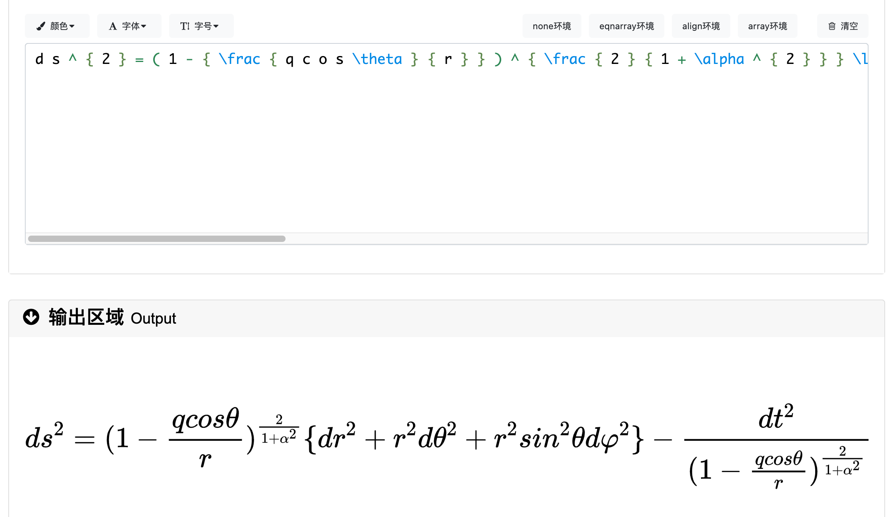
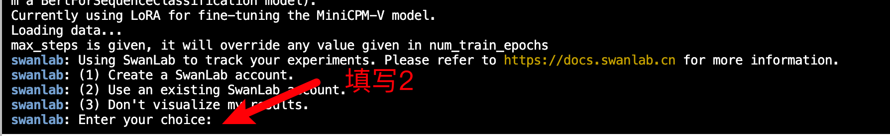
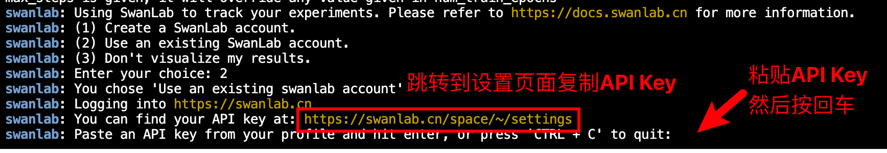
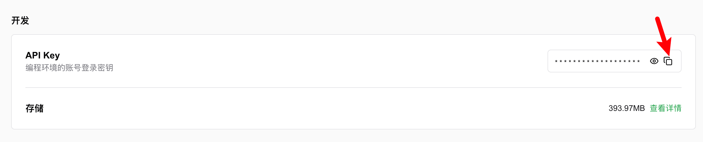
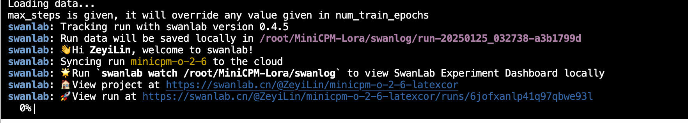
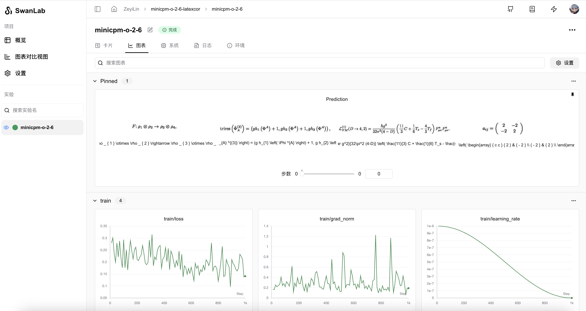
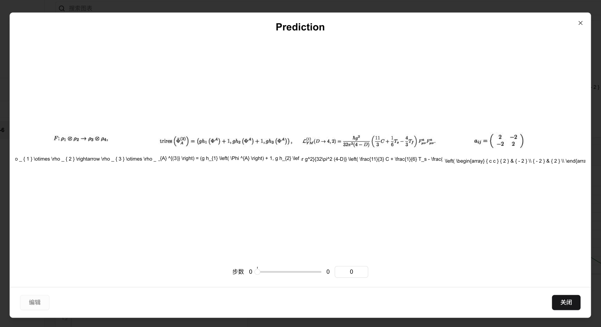
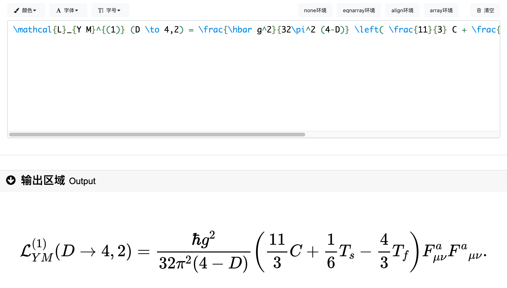

# MiniCPM-o-2.6 Lora 微调

[MiniCPM-o-2.6](https://modelscope.cn/models/OpenBMB/MiniCPM-o-2_6)是OpenBMB（面壁智能）团队最近开源的多模态大语言模型。以MiniCPM-o-2.6作为基座多模态大模型，通过**指令微调**的方式实现特定场景下的OCR，是学习**多模态LLM微调**的入门任务。


本文我们将简要介绍基于 transformers、peft 等框架，使用 MiniCPM-O-2.6 模型在**LaTeX_OCR** 上进行Lora微调训练，同时使用 [SwanLab](https://github.com/swanhubx/swanlab) 监控训练过程与评估模型效果。

> LoRA 是一种高效微调方法，深入了解其原理可参见博客：[知乎|深入浅出 LoRA]([text](https://zhuanlan.zhihu.com/p/650197598))。

* 训练过程：[ZeyiLin/minicpm-o-2-6-latexcor](https://swanlab.cn/@ZeyiLin/minicpm-o-2-6-latexcor/runs/iap4t0w75otvng2e8bss4/chart)
* 代码：见此文档同目录下文件夹`04-MiniCPM-0-2.6 Lora微调 参考代码`
* 数据集：[LaTeX_OCR](https://modelscope.cn/datasets/AI-ModelScope/LaTeX_OCR/summary)
* 模型：[MiniCPM-o-2.6](https://modelscope.cn/models/OpenBMB/MiniCPM-o-2_6)
* 在线LaTex公式预览网站：[latexlive](https://www.latexlive.com/)
* 显存占用：约25GB，建议租A100（40GB显存）进行微调


## 目录

- [MiniCPM-o-2.6 Lora 微调](#minicpm-o-26-lora-微调)
  - [目录](#目录)
- [📖 知识点：视觉大模型微调的场景与用法](#-知识点视觉大模型微调的场景与用法)
  - [👋 SwanLab简介](#-swanlab简介)
  - [🌍 环境配置](#-环境配置)
  - [📚 准备数据集](#-准备数据集)
  - [🤖 模型下载与加载](#-模型下载与加载)
  - [🐦‍ 集成SwanLab](#-集成swanlab)
  - [🚀 开始微调](#-开始微调)
  - [💻 训练结果演示](#-训练结果演示)
  - [🧐 推理LoRA微调后的模型](#-推理lora微调后的模型)
  - [](#)
  - [补充](#补充)
    - [注意](#注意)


# 📖 知识点：视觉大模型微调的场景与用法

视觉大模型是指能够支持**图片/视频输入**的大语言模型，能够极大丰富与LLM的交互方式。

对视觉大模型做微调的一个典型场景，是让它特化成一个更强大、更智能的**计算机视觉模型**，执行图像分类、目标检测、语义分割、OCR、图像描述任务等等。

并且由于视觉大模型强大的基础能力，所以训练流程变得非常统一——无论是分类、检测还是分割，只需要构建好数据对（图像 -> 文本），都可以用同一套代码完成，**相比以往针对不同任务就要构建迥异的训练代码而言，视觉大模型微调要简单粗暴得多，而且效果还更好。**

当然，硬币的另一面是要承担更高的计算开销，但在大模型逐渐轻量化的趋势下，可以预想这种训练范式将逐渐成为主流。


## 👋 SwanLab简介


[SwanLab](https://github.com/swanhubx/swanlab) 是一个开源的模型训练记录工具，常被称为"中国版 Weights&Biases + Tensorboard"。SwanLab面向AI研究者，提供了训练可视化、自动日志记录、超参数记录、实验对比、多人协同等功能。在SwanLab上，研究者能基于直观的可视化图表发现训练问题，对比多个实验找到研究灵感，并通过在线链接的分享与基于组织的多人协同训练，打破团队沟通的壁垒。

**为什么要记录训练？**

相较于软件开发，模型训练更像一个实验科学。一个品质优秀的模型背后，往往是成千上万次实验。研究者需要不断尝试、记录、对比，积累经验，才能找到最佳的模型结构、超参数与数据配比。在这之中，如何高效进行记录与对比，对于研究效率的提升至关重要。

**可视化的价值在哪里？**

机器学习模型训练往往伴随着大量的超参数、指标、日志等数据，很多关键信息往往存在于实验的中间而非结尾，如果不对连续的指标通过图表进行可视化，往往会错失发现问题的最佳时机，甚至错过关键信息。同时不进行可视化，也难以对比多个实验之间的差异。
可视化也为AI研究者提供了良好的交流基础，研究者们可以基于图表进行沟通、分析与优化，而非以往看着枯燥的终端打印。这打破了团队沟通的壁垒，提高了整体的研发效率。


## 🌍 环境配置

环境配置分为三步：

1. 确保你的电脑上至少有一张英伟达显卡，并已安装好了CUDA环境。
2. 安装Python（版本>=3.8）以及能够调用**CUDA加速的PyTorch**。
3. 安装与MiniCPM-O-2.6微调相关的第三方库，可以使用以下命令：

```shellscript
python -m pip install --upgrade pip
# 更换 pypi 源，加速库的安装
pip config set global.index-url https://pypi.tuna.tsinghua.edu.cn/simple

pip install modelscope==1.20.1
pip install transformers==4.44.2
pip install sentencepiece==0.2.0
pip install accelerate==1.0.1
pip install datasets==2.18.0
pip install peft==0.12.0
pip install swanlab==0.4.5
pip install pandas==2.2.2
pip install vocos==0.1.0
pip install vector-quantize-pytorch==1.21.2
pip install timm==1.0.7
pip install soundfile==0.12.1
pip install numpy==1.26.4
pip install oss2
pip install addict
pip install decord
pip install moviepy
pip install librosa
```

> 考虑到部分同学配置环境可能会遇到一些问题，我们在 AutoDL 平台准备了 InternLM3-8b-Instruct 的环境镜像，点击下方链接并直接创建 AutoDL 示例即可。
> ***https://www.codewithgpu.com/i/datawhalechina/self-llm/self-llm-minicpm-o***

## 📚 准备数据集

本节使用的是 [LaTex\_OCR](https://modelscope.cn/datasets/AI-ModelScope/LaTeX_OCR/summary) 数据集，这个数据集包含了大量的数学公式图片，以及对应的LaTex语法字符串。可以看到，下图中的image就是学术公式图，text就是对应的LaTex语法字符串：


将这些LaTex语法字符串粘贴到[latexlive](https://www.latexlive.com/)中，可以预览对应的数学公式：



了解了数据集结构之后，我们需要做的是将这些数据整理成MiniCPM-O-2.6需要的json格式，下面是目标的格式：

```json
[
  {
    "id": "identity_1",
    "image": "图片路径",
    "conversations": [
      {
        "role": "user",
        "content": "<image>\n这张图对应的LaTex公式是什么？"
      },
      {
        "role": "assistant",
        "content": "LaTex公式"
      }
    ]  
  },
...
]
```

我们来解读一下这个json：

* **id**：数据对的编号
* **image**：输入的图像文件路径
* **conversations**：人类与LLM的对话，类型是列表
* **role**：角色，user代表人类，assistant代表模型
* **content**：对话发送的内容，其中user的content是图片标签`<image>`和提示词，assistant的回复是LaTex公式

---


**接下来让我们下载数据集并进行处理：**

1. **我们需要做四件事情：**
   * 通过Modelscope下载LaTex_OCR数据集
   * 加载数据集，将图像保存到本地
   * 将图像路径和对应的LaTex公式转换为一个csv文件
   * 将csv文件转换为json文件，并拆分为1个训练集和验证集
2. **运行下面的代码完成从数据下载到生成csv的过程：**

```bash
python data2csv.py
python csv2json.py
```

**此时目录下会多出3个文件：**

```
|———— latex_ocr_train.csv
|———— latex_ocr_train.json
|———— latex_ocr_val.json
```

至此，我们完成了数据集的准备。


## 🤖 模型下载与加载

这里我们使用modelscope下载MiniCPM-O-2.6模型，将其保存到本地路径：

```python
from modelscope import snapshot_download

snapshot_download('OpenBMB/MiniCPM-o-2_6', local_dir='/root/autodl-tmp/MiniCPM-o-2_6')
```

> 注意：记得修改 `local_dir` 为你自己的模型本地下载路径哦~


## 🐦‍ 集成SwanLab

SwanLab与Transformers已经做好了集成，用法是在Trainer的`callbacks`参数中添加`SwanLabCallback`实例，就可以自动记录超参数和训练指标，简化代码如下：

```python
from swanlab.integration.transformers import SwanLabCallback
from transformers import Trainer

swanlab_callback = SwanLabCallback()

trainer = Trainer(
    ...
    callbacks=[swanlab_callback],
)
```

首次使用SwanLab，需要先在[官网](https://swanlab.cn)注册一个账号，然后在用户设置页面复制你的API Key，然后在训练开始提示登录时粘贴即可，后续无需再次登录：





SwanLab API Key的位置：



更多用法可参考[快速开始](https://docs.swanlab.cn/zh/guide_cloud/general/quick-start.html)、[Transformers集成](https://docs.swanlab.cn/zh/guide_cloud/integration/integration-huggingface-transformers.html)。


## 🚀 开始微调

查看可视化训练过程：[ZeyiLin/MiniCPM-o-ft-latexocr](https://swanlab.cn/@ZeyiLin/minicpm-o-2-6-latexcor/runs/iap4t0w75otvng2e8bss4/chart)

代码在本文同目录下的`04-MiniCPM-0-2.6 Lora微调 参考代码`文件夹中，共有6个py文件，请将他们保存到同一目录下，想直接开始微调，请在完成 [准备数据集](#-准备数据集) 后，运行`python train.py`。

**本节代码做了以下几件事：**

1. 下载并加载MiniCPM-O-2.6模型
2. 加载数据集，取前996条数据参与训练，4条数据进行主观评测
3. 配置Lora，参数为r=64, lora\_alpha=16, lora\_dropout=0.05
4. 使用SwanLab记录训练过程，包括超参数、指标和最终的模型输出结果
5. 训练2个epoch

**开始执行代码时的目录结构应该是：**

```
|———— train.py
|———— minicpm_datasets.py
|———— trainer.py
|———— data2csv.py
|———— csv2json.py
|———— latex_ocr_train.csv
|———— latex_ocr_train.json
|———— latex_ocr_val.json
```

**train.py完整代码如下**

train.py：

```python
import json
from functools import partial
from typing import Dict
from torchvision import transforms
import torch
import transformers
from transformers import AutoModel, AutoTokenizer, TrainingArguments
from minicpm_datasets import SupervisedDataset, data_collator
from trainer import CPMTrainer
from peft import LoraConfig, get_peft_model, PeftModel
from modelscope import snapshot_download
import swanlab
from swanlab.integration.transformers import SwanLabCallback
import os
from PIL import Image

def make_supervised_data_module(
    tokenizer: transformers.PreTrainedTokenizer,
    data_path,
    transform,
    data_collator=None,
    llm_type="qwen",
    slice_config=None,
    patch_size=14,
    query_nums=64,
    batch_vision=False,
    max_length=2048,
) -> Dict:
    """Make dataset and collator for supervised fine-tuning."""
    print("Loading data...")

    train_json = json.load(open(data_path, "r"))
    train_dataset = SupervisedDataset(
        train_json,
        transform,
        tokenizer,
        slice_config=slice_config,
        llm_type=llm_type,
        patch_size=patch_size,
        query_nums=query_nums,
        batch_vision=batch_vision,
        max_length=max_length,
    )

    return dict(
        train_dataset=train_dataset,
        eval_dataset=None,
        data_collator= partial(data_collator, max_length=max_length),
    )


model_id = "OpenBMB/MiniCPM-o-2_6"
data_path="./latex_ocr_train.json"
output_dir="./output/minicpm-o-2-6-latexocr"

llm_type: str = "qwen"
tune_vision: bool = True
tune_llm: bool = False
use_lora: bool = True

max_steps: int = 1000
model_max_length: int = 2048
max_slice_nums: int = 9

lora_rank: int = 64
lora_alpha: int = 16
lora_dropout: float = 0.1

# 设置Transformers训练参数
training_args = TrainingArguments(
    output_dir=output_dir,
    bf16=True,
    logging_strategy="steps",
    per_device_train_batch_size=1,
    per_device_eval_batch_size=1,
    gradient_accumulation_steps=1,
    save_strategy="steps",
    save_steps=500,
    max_steps=max_steps,
    save_total_limit=10,
    learning_rate=1e-6,
    weight_decay=0.1,
    adam_beta2=0.95,
    warmup_ratio=0.01,
    lr_scheduler_type="cosine",
    logging_steps=10,
    gradient_checkpointing=True,
    label_names="labels",
    remove_unused_columns=False,
    gradient_checkpointing_kwargs={"use_reentrant":False},
    report_to="none",
)

# 下载模型
model_dir = snapshot_download(model_id, cache_dir="/root/autodl-tmp/", revision="master")

# 加载模型
model = AutoModel.from_pretrained(
    model_dir,
    trust_remote_code=True,
    torch_dtype=torch.bfloat16,
    device_map=None,
    init_vision=True,
    init_audio=False,
    init_tts=False,
)

# 加载tokenizer
tokenizer = AutoTokenizer.from_pretrained(model_dir, trust_remote_code=True)

# 参数冻结
if not tune_vision:
    model.vpm.requires_grad_(False)
if not tune_llm:
    model.llm.requires_grad_(False)
    
# 配置Lora
if use_lora:
    # 如果同时微调llm和使用lora，则报错
    if use_lora and tune_llm:
        raise ValueError("The model cannot simultaneously adjust LLM parameters and apply LoRA.")
    
    print("Currently using LoRA for fine-tuning the MiniCPM-V model.")
    # 冻结llm参数
    for name, param in model.llm.named_parameters():
        param.requires_grad = False
    # 设置需要保存的模块
    modules_to_save = ['embed_tokens','resampler']
    if tune_vision:
        modules_to_save.append('vpm')
        
    # 设置lora配置
    lora_config = LoraConfig(
        r=lora_rank,
        lora_alpha=lora_alpha,
        target_modules="llm\..*layers\.\d+\.self_attn\.(q_proj|k_proj|v_proj|o_proj)",
        lora_dropout=lora_dropout,
    )
    # 将模型转换为peft模型
    model = get_peft_model(model, lora_config)
    # 启用输入梯度
    model.enable_input_require_grads()

    model.config.slice_config.max_slice_nums = max_slice_nums
    slice_config = model.config.slice_config.to_dict()
    batch_vision = model.config.batch_vision_input

# 设置数据集预处理
transform_func = transforms.Compose(
        [
            transforms.ToTensor(),
            transforms.Normalize(
                mean=(0.5, 0.5, 0.5) , std=(0.5, 0.5, 0.5)
            ),
        ]
    )

# 数据集模块
data_module = make_supervised_data_module(
    tokenizer=tokenizer,
    data_path=data_path,
    transform=transform_func,
    data_collator=data_collator,
    slice_config=slice_config,
    llm_type=llm_type,
    patch_size=model.config.patch_size,
    query_nums=model.config.query_num,
    batch_vision=batch_vision,
    max_length=model_max_length,
)

# 集成SwanLab训练可视化工具
swanlab_callback = SwanLabCallback(
    project="minicpm-o-2-6-latexcor",
    experiment_name="minicpm-o-2-6",
    config={
        "github_repo": "self-llm",
        "model": "https://modelscope.cn/models/OpenBMB/MiniCPM-o-2_6",
        "dataset": "https://modelscope.cn/datasets/AI-ModelScope/LaTeX_OCR/summary",
        "model_id": model_id,
        "train_dataset_json_path": data_path,
        "output_dir": "output/output__lora",
        "token_max_length": model_max_length,
        "lora_rank": lora_rank,
        "lora_alpha": lora_alpha,
        "lora_dropout": lora_dropout,
    }
)

trainer = CPMTrainer(
    model=model,
    tokenizer=tokenizer,
    args=training_args,
    use_lora=use_lora,
    callbacks=[swanlab_callback],
    **data_module,
)

trainer.train()


# ========== 主观测试 ==========

# 释放trainer中的model显存
trainer.model.cpu()
del trainer.model
if torch.cuda.is_available():
    torch.cuda.empty_cache()

# 获取测试模型，从output_dir中获取最新的checkpoint
load_model_path = f"{output_dir}/checkpoint-{max([int(d.split('-')[-1]) for d in os.listdir(output_dir) if d.startswith('checkpoint-')])}"
print(f"load_model_path: {load_model_path}")

origin_model = AutoModel.from_pretrained(model_dir, trust_remote_code=True)
val_lora_model = PeftModel.from_pretrained(
    origin_model,
    load_model_path,
    device_map="auto",
    trust_remote_code=True
).eval().cuda()

# 读取测试数据
with open("./latex_ocr_val.json", "r") as f:
    test_dataset = json.load(f)

test_image_list = []
for item in test_dataset:
    image_file_path = item["image"]
    label = item["conversations"][1]["content"]
    
    image = Image.open(image_file_path).convert('RGB')

    question = "这张图对应的LaTex公式是什么？"
    msgs = [{'role': 'user', 'content': [image, question]}]

    answer = val_lora_model.chat(
        msgs=msgs,
        tokenizer=tokenizer
    )

    print(f"predict:{answer}")
    print(f"gt:{label}\n")

    test_image_list.append(swanlab.Image(image_file_path, caption=answer))

swanlab.log({"Prediction": test_image_list})

# 在Jupyter Notebook中运行时要停止SwanLab记录，需要调用swanlab.finish()
swanlab.finish()
```

我们运行`python train.py`，可以看到下面的进度条即代表训练开始：




## 💻 训练结果演示

详细训练过程请看这里：[ZeyiLin/MiniCPM-o-2-6-latexcor](https://swanlab.cn/@ZeyiLin/minicpm-o-2-6-latexcor/runs/iap4t0w75otvng2e8bss4/chart)



从SwanLab图表中我们可以看到，学习率的下降策略是`Cosine`，loss随step逐渐下降。

在`Prediction`图表中记录着模型最终的输出结果，可以看到模型在回答的风格已经是标准的LaTex语法。



我们来对结果进行验证。我们选择图片`LaTeX_OCR/998.jpg`：


让lora微调前后的模型进行回答。

没有微调模型的回答：
```
图像中的LaTeX公式为：

\[ \mathcal{L}_{YM}^{(1)}(D\rightarrow 4,2) = \frac{\hbar g^2}{32\pi^2(4-D)} \left( \frac{11}{3}C + \frac{1}{6}T_s - \frac{4}{3}T_f \right) F^\mu_{\mu\nu}F^a_{\mu\nu} \]

解释：
- \(\mathcal{L}_{YM}\) 表示规范场理论的拉格朗日量。
- \(g\) 和 \(\hbar\) 分别是耦合常数和约化普朗克常数。
- \(C\)、\(T_s\) 和 \(T_f\) 是与规范场相关的张量。
- \(F^\mu_{\mu\nu}\) 和 \(F^a_{\mu\nu}\) 分别表示标量场和规范场的场强度。

这个公式描述了从 \(D\) 维到 \(4\) 维的规范场理论的拉格朗日量，考虑了 \(D\) 维空间中规范场的行为。
```

Lora微调后模型的回答：

```
\mathrm{tr}\mathrm{i}\mathrm{r}_{s} \left( \bar{\Phi } _{A} ^{(3)} \right) = (g h_{1} \left( \Phi ^{A} \right) + 1, g h_{2} \left( \Phi ^{A} \right) + 1, g h_{3} \left( \Phi ^{A} \right) ) ,
```

可以看到没有微调的模型，对于输出的风格不是我们想要的，并且公式有存在一些错误（比如在右边第二个F的上标应该是a，但原模型给了u）

而微调后的模型，有着非常完美表现：




## 🧐 推理LoRA微调后的模型

加载lora微调后的模型，并进行推理：

```python
from peft import PeftModel
from transformers import AutoModel, AutoTokenizer
from PIL import Image

model_path=  "/root/autodl-tmp/OpenBMB/MiniCPM-o-2_6"
path_to_adapter="./output/minicpm-o-2-6-latexocr/checkpoint-1000"

model =  AutoModel.from_pretrained(
        model_path,
        trust_remote_code=True,
        )

lora_model = PeftModel.from_pretrained(
    model,
    path_to_adapter,
    device_map="auto",
    trust_remote_code=True
).eval().cuda()

tokenizer = AutoTokenizer.from_pretrained(model_path, trust_remote_code=True)

image = Image.open('./LaTeX_OCR/998.jpg').convert('RGB')

question = "这张图对应的LaTex公式是什么？"
msgs = [{'role': 'user', 'content': [image, question]}]

answer = lora_model.chat(
    msgs=msgs,
    tokenizer=tokenizer
)
print(answer)
```

##

## 补充

### 注意

* 在微调脚本中，`path_to_adapter`加载的是一共固定的checkpoint文件，如果你添加了数据或超参数，请根据实际情况修改checkpoint文件路径。