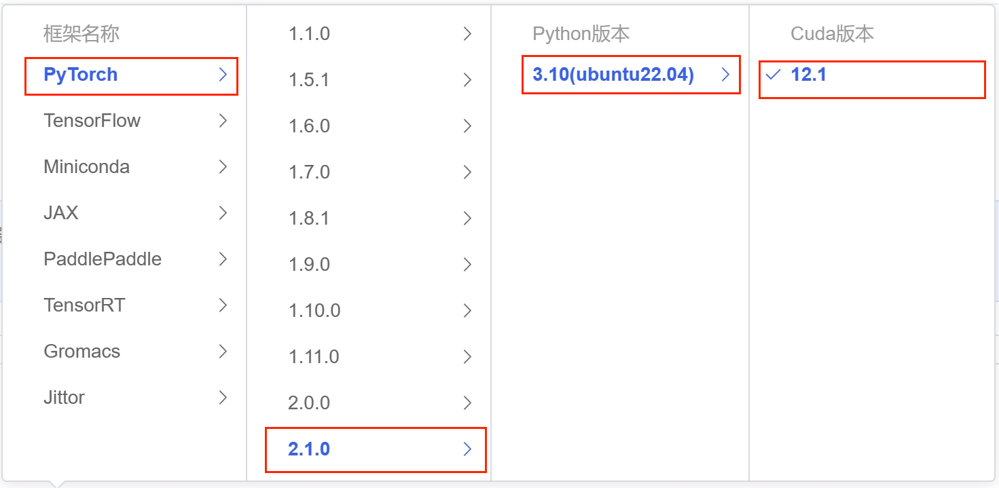

# MiniCPM-2B-chat transformers 部署调用

## MiniCPM-2B-chat 介绍

MiniCPM 是面壁智能与清华大学自然语言处理实验室共同开源的系列端侧大模型，主体语言模型 MiniCPM-2B 仅有 24亿（2.4B）的非词嵌入参数量。

经过 SFT 后，MiniCPM 在公开综合性评测集上，MiniCPM 与 Mistral-7B相近（中文、数学、代码能力更优），整体性能超越 Llama2-13B、MPT-30B、Falcon-40B 等模型。
经过 DPO 后，MiniCPM 在当前最接近用户体感的评测集 MTBench上，MiniCPM-2B 也超越了 Llama2-70B-Chat、Vicuna-33B、Mistral-7B-Instruct-v0.1、Zephyr-7B-alpha 等众多代表性开源大模型。
以 MiniCPM-2B 为基础构建端侧多模态大模型 MiniCPM-V，整体性能在同规模模型中实现最佳，超越基于 Phi-2 构建的现有多模态大模型，在部分评测集上达到与 9.6B Qwen-VL-Chat 相当甚至更好的性能。
经过 Int4 量化后，MiniCPM 可在手机上进行部署推理，流式输出速度略高于人类说话速度。MiniCPM-V 也直接跑通了多模态大模型在手机上的部署。
一张1080/2080可高效参数微调，一张3090/4090可全参数微调，一台机器可持续训练 MiniCPM，二次开发成本较低。

## 环境准备
在autodl平台中租一个**单卡3090等24G**显存的显卡机器，如下图所示镜像选择PyTorch-->2.1.0-->3.10(ubuntu22.04)-->12.1
接下来打开刚刚租用服务器的JupyterLab， 图像 并且打开其中的终端开始环境配置、模型下载和运行演示。 


接下来打开刚刚租用服务器的`JupyterLab`，并且打开其中的终端开始环境配置、模型下载和运行`demo`。

pip换源和安装依赖包

```shell
# 升级pip
python -m pip install --upgrade pip
# 更换 pypi 源加速库的安装
pip config set global.index-url https://pypi.tuna.tsinghua.edu.cn/simple
pip install modelscope transformers sentencepiece accelerate 

MAX_JOBS=8 pip install flash-attn --no-build-isolation
```

> 注意：flash-attn 安装会比较慢，大概需要十几分钟。

## 模型下载

使用 `modelscope` 中的`snapshot_download`函数下载模型，第一个参数为模型名称，参数`cache_dir`为模型的下载路径。

在 `/root/autodl-tmp` 路径下新建 `download.py` 文件并在其中输入以下内容，粘贴代码后记得保存文件，如下图所示。并运行 `python /root/autodl-tmp/download.py`执行下载，模型大小为 10 GB，下载模型大概需要 5~10 分钟

```python
import torch
from modelscope import snapshot_download, AutoModel, AutoTokenizer
import os
model_dir = snapshot_download('OpenBMB/MiniCPM-2B-sft-fp32', cache_dir='/root/autodl-tmp', revision='master')
```

## 代码准备

在/root/autodl-tmp路径下新建trains.py文件并在其中输入以下内容
```python
from transformers import AutoModelForCausalLM, AutoTokenizer  # 从transformers库导入所需的类
import torch  # 导入torch库，用于深度学习相关操作

torch.manual_seed(0)  # 设置随机种子以确保结果的可复现性

# 定义模型路径
path = '/root/autodl-tmp/OpenBMB/MiniCPM-2B-sft-fp32'

# 从模型路径加载分词器，
tokenizer = AutoTokenizer.from_pretrained(path)

# 从模型路径加载模型，设置为使用bfloat16精度以优化性能，并将模型部署到支持CUDA的GPU上,trust_remote_code=True允许加载远程代码
model = AutoModelForCausalLM.from_pretrained(path, torch_dtype=torch.bfloat16, device_map='cuda', trust_remote_code=True)

# 使用模型进行聊天，提出问题并设置生成参数，如temperature、top_p值和repetition_penalty（重复惩罚因子）
responds, history = model.chat(tokenizer, "山东省最高的山是哪座山, 它比黄山高还是矮？差距多少？", temperature=0.5, top_p=0.8, repetition_penalty=1.02)

# 显示生成的回答
print(responds)
```
### 部署

在终端输入以下命令运行trains.py，即实现MiniCPM-2B-chat的Transformers部署调用

```shell
cd /root/autodl-tmp
python trains.py
```
观察命令行中，等待模型加载完成产生对话，如下图所示

