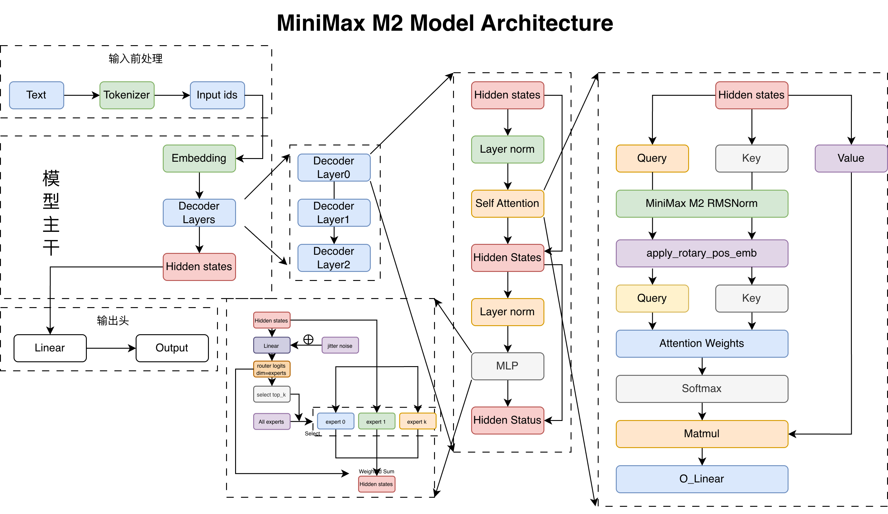
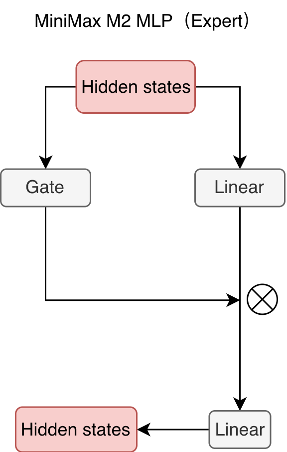
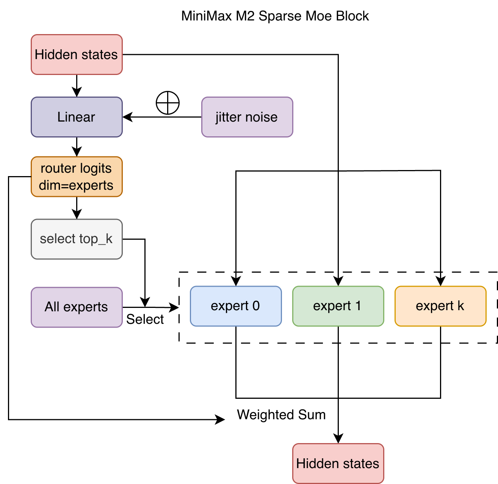

# 2-MiniMax-M2 模型架构解析 Blog

MiniMax-M2 在2025年10月27日发布，模型参数为 230B，激活参数仅为 10B。
该模型为 transfomers 仓库提交了 PR 并合并。可以通过阅读该 PR 学习 MiniMax-M2 的模型架构。  
链接为：[https://github.com/huggingface/transformers/pull/42028](https://github.com/huggingface/transformers/pull/42028)

模型架构图如下：

  
MiniMax-M2 的模型架构和 Qwen3 MoE 比较类似。其主要区别是：
1. 专家路由权重从直接 Softmax 变成了 Sigmoid 再除总和。
2. 训练时在专家路由门控前增加了抖动噪声。
3. 使用了专家权重得分修正：e_score_correction_bias


## MLP
MLP 模块主要用于专家路由后的专家计算，代码如下：
```python
class MiniMaxM2MLP(nn.Module):
    def __init__(self, config: MiniMaxM2Config):
        super().__init__()
        self.ffn_dim = config.intermediate_size
        self.hidden_dim = config.hidden_size

        self.w1 = nn.Linear(self.hidden_dim, self.ffn_dim, bias=False)
        self.w2 = nn.Linear(self.ffn_dim, self.hidden_dim, bias=False)
        self.w3 = nn.Linear(self.hidden_dim, self.ffn_dim, bias=False)

        self.act_fn = ACT2FN[config.hidden_act]

    def forward(self, hidden_states):
        current_hidden_states = self.act_fn(self.w1(hidden_states)) * self.w3(hidden_states)
        current_hidden_states = self.w2(current_hidden_states)
        return current_hidden_states
```
可视化如图所示：

hidden states 同时通过两个线性层，一个作为投影、一个作为门控，然后两者按元素相乘，得到新的 hidden states。

## 专家路由

专家模块，输入为 hidden_states、选中的专家索引与权重，输出的 hidden states 使用选中的专家计算后进行加权求和。代码如下：
```python
class MiniMaxM2Experts(nn.ModuleList):
    ...
    def forward(...):
        final_hidden_states = torch.zeros_like(hidden_states)
        expert_mask = torch.nn.functional.one_hot(top_k_index, num_classes=self.num_experts).permute(2, 1, 0)

        expert_hit = torch.greater(expert_mask.sum(dim=(-1, -2)), 0).nonzero()
        for expert_idx in expert_hit:
            idx, top_x = torch.where(expert_mask[expert_idx].squeeze(0))
            current_state = hidden_states[None, top_x].reshape(-1, hidden_states.shape[-1])
            current_hidden_states = self[expert_idx](current_state) * top_k_weights[top_x, idx, None]
            final_hidden_states.index_add_(0, top_x, current_hidden_states.to(hidden_states.dtype))
        return final_hidden_states

```


专家路由模块，先使用门控层计算专家路由权重，然后使用上述的专家模块进行计算。如果是训练模式，会增加抖动噪声，防止专家的激活过于集中。代码如下：
```python
class MiniMaxM2SparseMoeBlock(nn.Module):
    ...
    
    def __init__(self, config):
        ...
        # 定义专家路由门控层（线性层）
        self.gate = nn.Linear(config.hidden_size, config.num_local_experts, bias=False)
        
        # 定义上述的专家模块
        self.experts = MiniMaxM2Experts(config)
        
        # 定义专家路由权重修正 bias
        self.register_buffer("e_score_correction_bias", torch.zeros(config.num_local_experts))

    def route_tokens_to_experts(self, router_logits):
        ...
    
    def forward(...):
        ...
        # 训练时增加噪声
        if self.training and self.jitter_noise > 0:
            hidden_states *= torch.empty_like(hidden_states).uniform_(1.0 - self.jitter_noise, 1.0 + self.jitter_noise)
        ...
        # 计算专家路由权重
        router_logits = self.gate(hidden_states)
        top_k_index, top_k_weights = self.route_tokens_to_experts(router_logits)
        
        # 计算专家输出
        hidden_states = self.experts(hidden_states, top_k_index, top_k_weights.to(hidden_states.dtype))
        ...
        return hidden_states
```

