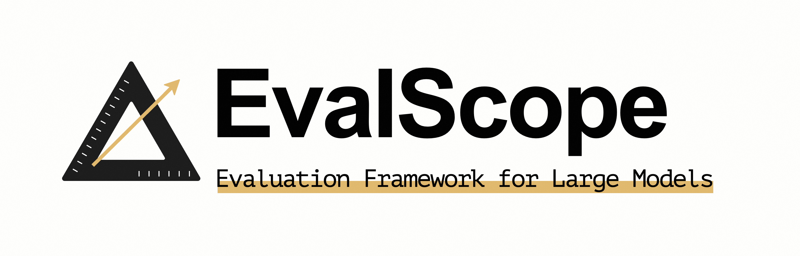
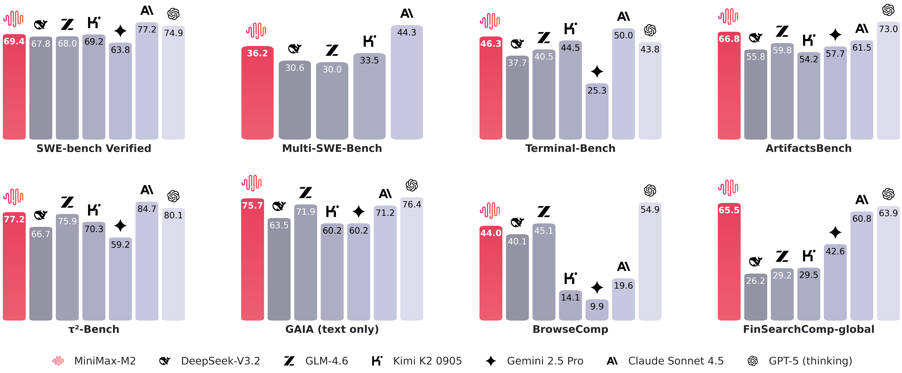

# 4-MiniMax-M2 EvalScope

## 模型评测的意义和价值
模型评测是将模型从“可用”走向“可用且可信”的关键环节。一方面，系统化的基准测试与压力测试能量化模型在知识、推理、对齐与安全等维度的真实表现，帮助发现能力短板、数据偏差与鲁棒性问题，避免带着未知风险上线；另一方面，统一的指标与可复现实验能为模型选型、版本迭代和资源配置提供可比依据，指导工程优化（如上下文长度、并发、推理参数）以达成更优的性价比和用户体验。对业务而言，高质量的评测不仅降低决策与运维成本，还可持续监测回归与漂移，形成“训练—评测—部署—监控”的闭环，加速模型价值落地。
## EvalScope 简介



EvalScope 是魔搭官方推出的模型评测与性能基准测试框架，内置多个常用测试基准和评测指标，如 MMLU、CMMLU、C-Eval、GSM8K、ARC、HellaSwag、TruthfulQA、MATH 和 HumanEval 等；支持多种类型的模型评测，包括 LLM、VLM、embedding 模型和 reranker 模型。EvalScope 还适用于多种评测场景，如端到端 RAG 评测、竞技场模式和模型推理性能压测等。此外，通过 ms-swift 训练框架的无缝集成，可一键发起评测，实现了模型训练到评测的全链路支持。 

## EvalScope 评测使用方法

> 为了更方便的使用模型，并提升推理速度，我们使用 SGLang 启动一个 OpenAI 格式兼容的服务。

1. 安装相关依赖：
	

```Bash
pip install sglang==0.5.5
pip install modelscope==1.31.0
pip install evalscope==1.1.1
pip install bfcl-eval==2025.10.27.1 
```

> 考虑到部分同学配置环境可能会遇到一些问题，我们在AutoDL平台准备了MiniMax-M2的环境镜像，点击下方链接并直接创建Autodl示例即可。
> ***https://www.codewithgpu.com/i/datawhalechina/self-llm/mimimax-m2***

2. 启动模型服务
	

```Bash
python -m sglang.launch_server \
  --model-path MiniMaxAI/MiniMax-M2 \
  --tp-size 8 \
  --ep-size 8 \
  --tool-call-parser minimax-m2 \
  --trust-remote-code \
  --host 0.0.0.0 \
  --reasoning-parser minimax-append-think \
  --port 8000 \
  --mem-fraction-static 0.85
```

## MiniMax-M2 表现



如上图所示，可以发现模型在使用工具和深度搜索的能力都非常接近了海外最好的模型，在编程上逊色于海外最好的模型，但是也已经到了国内最好的一档。我们不妨自己动手来测试一下模型在其他任务上的表现如何。

## IQuiz测试

下面我们对模型进行**智商情商评测**。

我们将使用 EvalScope 模型评测框架，在 IQuiz 数据集上进行评测，这个数据集中收集了 40 道 IQ 测试和 80 道 EQ 测试选择题，其中包括一些大模型时代的经典问题：

- 数字 9.8 和 9.11 哪个大？

- 单词 strawberry 和 blueberry 中一共有多少个 r ？

- 刘雨正在休假，突然被要求开车送领导去机场，他正为休假计划的泡汤而懊恼，因此在送领导时，刹车踩得比较用力。在车上，领导突然说：“小刘啊，这不愧是有着悠久历史的西安，我这坐车有一种回到古代坐马车的感觉。” 领导是什么意思？

可以点击[这里](https://modelscope.cn/datasets/AI-ModelScope/IQuiz/dataPeview)试试看作为人类的你能答对多少。

在终端输入以下命令：

```bash
evalscope eval \
  --model MiniMaxAI/MiniMax-M2 \
  --api-url http://localhost:8000/v1 \
  --api-key EMPTY \
  --eval-type server \
  --eval-batch-size 16 \
  --datasets iquiz \
  --work-dir outputs/iquiz/MiniMax-M2
```

测试结果如下：

```
+------------+-----------+----------+----------+-------+---------+---------+
| Model      | Dataset   | Metric   | Subset   |   Num |   Score | Cat.0   |
+============+===========+==========+==========+=======+=========+=========+
| MiniMax-M2 | iquiz     | mean_acc | IQ       |    40 |  0.825  | default |
+------------+-----------+----------+----------+-------+---------+---------+
| MiniMax-M2 | iquiz     | mean_acc | EQ       |    80 |  0.6375 | default |
+------------+-----------+----------+----------+-------+---------+---------+
| MiniMax-M2 | iquiz     | mean_acc | OVERALL  |   120 |  0.7    | -       |
+------------+-----------+----------+----------+-------+---------+---------+
```


## 数学能力测试

> 这里我们选取 AIME2025 为例测试模型的数学能力。

AIME（American Invitational Mathematics Examination）是面向中学到奥数进阶水平的数学竞赛，AIME2025 聚焦代数、几何、数论与组合等核心主题，强调多步推理与严谨计算，常需要中长链条的思考过程。该基准适合评估模型在复杂数学问题上的分析、分解与推导能力，是衡量“推理深度”和“计算准确性”的重要参考。

```bash
from evalscope import TaskConfig, run_task

task_cfg = TaskConfig(
    model='MiniMaxAI/MiniMax-M2',
    api_url='http://localhost:8000/v1',
    api_key='EMPTY',
    eval_type='server',
    datasets=['aime25'],
    eval_batch_size=16,
    dataset_args={
        'aime25': {
            # 选择要评测的子集（AIME2025-I 或 AIME2025-II，或两者都评测）
            'subset_list': [
                'AIME2025-I',      # 可以只选择其中一个子集
                # 'AIME2025-II',   # 取消注释以评测第二个子集
            ],
        }
    },
    generation_config={
        'temperature': 0,
        'max_tokens': 65536,  # AIME 数学题需要较长的输出来展示推理过程
    },
    use_cache='outputs/aime25/MiniMax-M2',  # 缓存目录
    limit=5,  # 限制只评测前 5 题
)

run_task(task_cfg=task_cfg)
```

测试结果如下：

```
+------------+-----------+----------+------------+-------+---------+---------+
| Model      | Dataset   | Metric   | Subset     |   Num |   Score | Cat.0   |
+============+===========+==========+============+=======+=========+=========+
| MiniMax-M2 | aime25    | mean_acc | AIME2025-I |     5 |       1 | default |
+------------+-----------+----------+------------+-------+---------+---------+
```


## 代码能力测试

LiveCodeBench 是面向“可执行验证”的代码生成评测基准，通过真实或贴近真实的编程题与单元测试进行判定，关注端到端的功能正确性与鲁棒性。该基准能够反映模型在理解需求、合成可运行代码、通过测试用例以及处理边界条件等方面的综合工程能力。

```bash
evalscope eval \
  --model MiniMaxAI/MiniMax-M2 \
  --api-url http://localhost:8000/v1 \
  --api-key EMPTY \
  --eval-type server \
  --eval-batch-size 16 \
  --datasets live_code_bench \
  --work-dir outputs/live_code_bench/MiniMax-M2
  --limit 10
```

测试结果如下：

```
+------------+-----------------+----------+----------------+-------+---------+---------+
| Model      | Dataset         | Metric   | Subset         |   Num |   Score | Cat.0   |
+============+=================+==========+================+=======+=========+=========+
| MiniMax-M2 | live_code_bench | pass@1   | release_latest |    10 |       0 | default |
+------------+-----------------+----------+----------------+-------+---------+---------+
```


## Agent能力测试

BFCL V4（Berkeley Function Calling Leaderboard V4）是一个针对大型语言模型（LLM）评估其调用函数（工具）能力的基准测试平台。其主要目的是测试模型在执行功能调用时的准确性，尤其是在复杂的编程和工具调用任务中。BFCL V4的核心是评估LLM在与编程语言及其相关工具的交互中的表现，涉及多个领域和应用。

BFCL V4有两个主要的版本或焦点：

1. **基本功能调用测试**：该版本评估模型在调用特定函数时的准确性，包括处理编程语言（如Python、Java、JavaScript等）和REST API等工具调用的能力 。

2. **Agentic版本**：BFCL V4的Agentic版本扩展了基础版本，特别关注工具调用如何作为智能体系统（Agentic systems）的基础。该版本要求LLM在噪声和程序性错误（如服务器错误、请求限制、权限问题等）下能够执行任务，模拟真实世界的操作环境 。此外，它还引入了多跳Web搜索功能评估，测试模型在复杂问题回答时的能力 。

BFCL V4不仅是对函数调用能力的基本评估，还挑战了LLM在更复杂、动态环境下的表现，尤其是在智能体系统中模拟和执行函数调用的能力，非常适合用来评估模型的Agent能力。

```python
from evalscope import TaskConfig, run_task

task_cfg = TaskConfig(
    model='MiniMaxAI/MiniMax-M2',
    api_url='http://localhost:8000/v1',
    api_key='EMPTY',
    eval_type='server',
    datasets=['bfcl_v4'],
    eval_batch_size=10,
    dataset_args={
        'bfcl_v4': {
            # 评测子任务列表
            'subset_list': [ 
                'simple_python',
                'simple_java',
                'simple_javascript',
                'multiple',
                'parallel',
                'parallel_multiple'
            ],
            'extra_params':{
                # 模型在函数名称中拒绝使用点号（`.`）；设置此项，以便在评估期间自动将点号转换为下划线。
                'underscore_to_dot': True,
                # 模式是否为函数调用模型（Function Calling Model），如果是则会启用函数调用相关的配置；否则会使用prompt绕过函数调用。
                'is_fc_model': True,
            }
        }
    },
    generation_config={
        'temperature': 0
    },
    use_cache='outputs/bfcl_v4', # 建议设置缓存目录，评测出错时可以加快重跑速度
    limit=3,  # 限制评测数量，便于快速测试，正式评测时建议去掉此项
)
run_task(task_cfg=task_cfg)
```

测试结果如下：

```
+------------+-----------+----------+-------------------+-------+---------+---------+
| Model      | Dataset   | Metric   | Subset            |   Num |   Score | Cat.0   |
+============+===========+==========+===================+=======+=========+=========+
| MiniMax-M2 | bfcl_v4   | acc      | multiple          |     3 |  1      | default |
+------------+-----------+----------+-------------------+-------+---------+---------+
| MiniMax-M2 | bfcl_v4   | acc      | parallel          |     3 |  1      | default |
+------------+-----------+----------+-------------------+-------+---------+---------+
| MiniMax-M2 | bfcl_v4   | acc      | parallel_multiple |     3 |  0.6667 | default |
+------------+-----------+----------+-------------------+-------+---------+---------+
| MiniMax-M2 | bfcl_v4   | acc      | simple_java       |     3 |  0.3333 | default |
+------------+-----------+----------+-------------------+-------+---------+---------+
| MiniMax-M2 | bfcl_v4   | acc      | simple_javascript |     3 |  0.3333 | default |
+------------+-----------+----------+-------------------+-------+---------+---------+
| MiniMax-M2 | bfcl_v4   | acc      | simple_python     |     3 |  1      | default |
+------------+-----------+----------+-------------------+-------+---------+---------+
| MiniMax-M2 | bfcl_v4   | acc      | NON_LIVE          |    18 |  0.8055 | -       |
+------------+-----------+----------+-------------------+-------+---------+---------+
| MiniMax-M2 | bfcl_v4   | acc      | OVERALL           |    18 |  0.0806 | -       |
+------------+-----------+----------+-------------------+-------+---------+---------+ 
```


## 可视化评估结果

首先，需要额外安装支持可视化的 package

```bash
pip install 'evalscope[app]'
```

然后启动服务，访问 `http://127.0.0.1:7861` 来观察之前评测结果的直观显示

```bash
evalscope app
```

