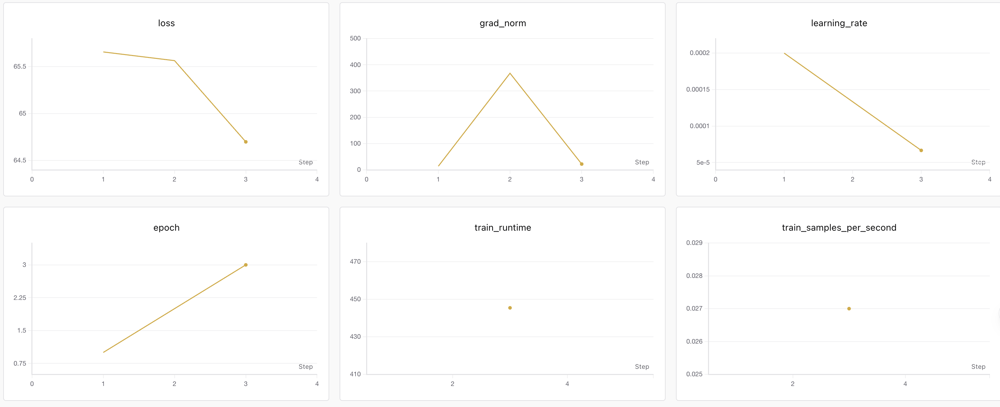

# MiniMax-M3 BF16 8 卡 LoRA 微调及 SwanLab 可视化

本教程介绍如何在 8 张 NVIDIA RTX PRO 6000 Blackwell Server Edition 上，使用 Transformers、PEFT 和 DeepSpeed ZeRO-3 CPU Offload 对 MiniMax-M3 BF16 进行 LoRA 微调，并使用 SwanLab 记录训练过程、tmux 保持任务运行、ServerChan 推送最终成功或失败状态。

本文延续 [datawhalechina/self-llm](https://github.com/datawhalechina/self-llm) 的教程组织方式，但不是只给出理论配置：文中的硬件占用、失败原因和训练指标均来自一次真实单步 smoke test。

> 本次结果证明该方案可以完成 forward、backward、optimizer step 和 adapter 保存。4 条样本、1 个 step 只用于验证训练链路，不代表模型已经完成有效收敛。

## 目录

- [1. 实验结论](#1-实验结论)
- [2. 硬件与软件环境](#2-硬件与软件环境)
- [3. 代码结构](#3-代码结构)
- [4. 模型下载](#4-模型下载)
- [5. 环境配置](#5-环境配置)
- [6. 安装 ZeRO-3 流式加载补丁](#6-安装-zero-3-流式加载补丁)
- [7. 构建指令数据](#7-构建指令数据)
- [8. LoRA 与 ZeRO-3 配置](#8-lora-与-zero-3-配置)
- [9. SwanLab 与 ServerChan](#9-swanlab-与-serverchan)
- [10. 使用 tmux 启动训练](#10-使用-tmux-启动训练)
- [11. 训练结果](#11-训练结果)
- [12. 扩展为正式训练](#12-扩展为正式训练)
- [13. 常见问题](#13-常见问题)
- [14. 限制与复现边界](#14-限制与复现边界)

## 1. 实验结论

MiniMax-M3 BF16 共有约 4270.6 亿参数，59 个 safetensors 分片，权重目录约 796 GiB。8 张卡的总显存仍小于 BF16 权重体积，因此不能使用普通的 GPU-only LoRA。

本教程采用以下组合：

1. DeepSpeed ZeRO-3 将参数切分到 8 个 rank。
2. `offload_param=cpu` 将 ZeRO 参数分片放入内存。
3. 定制 Transformers 5.12.1 的 ZeRO-3 加载路径，避免每个 rank 合并全部 59 个分片。
4. LoRA 只训练语言模型 attention 的 `q_proj`、`k_proj`、`v_proj` 和 `o_proj`。
5. 使用 reentrant gradient checkpointing 控制训练显存。

最终 smoke test 成功完成：

| 项目 | 结果 |
| --- | --- |
| 总参数 | 427,060,285,184 |
| LoRA 可训练参数 | 20,152,320（0.0047%） |
| 最大序列长度 | 128 |
| 训练 step | 1 |
| Loss | 65.6567 |
| Grad norm | 13.2417 |
| 单个训练 step | 约 189.85 秒 |
| Trainer 总时间 | 约 313.1 秒，包含 checkpoint 保存 |
| Adapter 大小 | 40,376,216 字节，约 38.5 MiB |

SwanLab 实验记录：<https://swanlab.cn/@lolicon/minimax-m3-prep/runs/zk40929o>

## 2. 硬件与软件环境

### 2.1 硬件

| 资源 | 实测配置 |
| --- | --- |
| GPU | 8 x NVIDIA RTX PRO 6000 Blackwell Server Edition |
| 单卡显存 | 97,887 MiB，约 95.6 GiB |
| CPU | Intel Xeon Platinum 8470Q，208 vCPU |
| 物理内存 | 约 1 TiB |
| 容器内存上限 | 944,892,805,120 字节，约 880 GiB |
| Swap | 无 |
| 本地数据盘 | XFS，约 1.2 TiB |

加载阶段每张卡约使用 17.4 GiB，容器内存一度接近 880 GiB 上限；训练阶段每张卡约使用 63.4 GiB。该配置几乎没有内存余量，不建议在训练时运行其他大内存任务。

### 2.2 软件

```text
Python        3.12
torch         2.11.0+cu130
transformers  5.12.1
accelerate    1.14.0
datasets      5.0.0
peft          0.19.1
deepspeed     0.18.9
swanlab       0.8.4
modelscope    1.38.0
safetensors   0.8.0
tokenizers    0.22.2
```

## 3. 代码结构

```text
models/MiniMax-M3/
├── 4-MiniMax-M3-BF16-LoRA及SwanLab可视化.md
└── finetune/
    ├── requirements.txt
    ├── bin/
    │   ├── apply_transformers_patch.sh
    │   ├── download_model.py
    │   ├── send_serverchan.py
    │   └── source_env.sh
    ├── data/
    │   └── tiny_qa.jsonl
    ├── patches/
    │   └── transformers-5.12.1-zero3-streaming.patch
    ├── secrets/
    │   └── env.example
    └── train/
        ├── deepspeed_zero3_cpu_offload.json
        ├── finetune_m3_bf16_zero3.py
        └── run_m3_bf16_zero3_tmux.sh
```

将代码同步到训练机：

```bash
rsync -av models/MiniMax-M3/finetune/ \
  auto:/root/autodl-fs/experiments/minimax-m3-8gpu/
```

模型权重、训练输出、日志和密钥不包含在本目录中。

## 4. 模型下载

本次使用 ModelScope 上的 `MiniMax/MiniMax-M3`，直接下载到 1.2 TiB 本地数据盘：

```bash
cd /root/autodl-fs/experiments/minimax-m3-8gpu
python bin/download_model.py \
  --model-id MiniMax/MiniMax-M3 \
  --output /root/autodl-tmp/models/MiniMax-M3-BF16 \
  --workers 8
```

全量模型约 796 GiB。新下载建议至少准备 850 GiB 空闲空间，并确认得到 59 个权重分片：

```bash
du -sh /root/autodl-tmp/models/MiniMax-M3-BF16
find /root/autodl-tmp/models/MiniMax-M3-BF16 \
  -maxdepth 1 -name 'model-*.safetensors' | wc -l
```

预期第二条命令输出 `59`。

> 本教程必须使用 BF16 基座。NVFP4/FP8 推理 checkpoint 不能直接替代为普通 PEFT/Trainer 训练基座。

## 5. 环境配置

创建独立环境：

```bash
conda create -y -p /root/miniconda3/envs/minimax-m3-bf16-lora python=3.12
conda activate /root/miniconda3/envs/minimax-m3-bf16-lora
```

先使用平台镜像或 PyTorch 官方 CUDA 13.0 安装方式准备 `torch==2.11.0+cu130`，再安装其余依赖：

```bash
python -m pip install -r requirements.txt
```

核对环境：

```bash
python - <<'PY'
from importlib.metadata import version
import torch

print("torch", torch.__version__)
for package in ["transformers", "deepspeed", "peft", "swanlab"]:
    print(package, version(package))
print("gpu_count", torch.cuda.device_count())
PY
```

需要看到 8 张 GPU，且版本与第 2 节一致。

## 6. 安装 ZeRO-3 流式加载补丁

### 6.1 为什么需要补丁

Transformers 5.12.1 的默认 ZeRO-3 加载路径会先把所有 checkpoint shard 合并为一个完整 `state_dict`。对于约 796 GiB 的 MiniMax-M3，这会使每个 rank 尝试物化完整权重并被系统杀死。

本目录中的补丁做了三件事：

1. 仅由 rank 0 逐组读取 safetensors，其他 rank 接收 key 和必要 buffer。
2. 将跨物理 shard 的同一 MoE expert layer 组成完整加载组，避免 expert 数量不匹配。
3. 每组通过 ZeRO-3 collective 写入参数分片后立即释放临时 `state_dict`。

该补丁只匹配 Transformers `5.12.1`，并包含 MiniMax-M3 权重 key 规则，不应直接应用到其他版本或模型。

### 6.2 应用补丁

```bash
cd /root/autodl-fs/experiments/minimax-m3-8gpu
source bin/source_env.sh
bash bin/apply_transformers_patch.sh
```

脚本会检查版本、保存 `modeling_utils.py.minimax-m3.orig` 备份，并支持重复执行。

## 7. 构建指令数据

训练数据使用 JSON Lines，每行包含 `instruction` 和 `response`：

```json
{"instruction":"用一句话解释为什么实验需要记录随机种子。","response":"记录随机种子可以帮助复现实验结果并定位结果波动的来源。"}
```

示例数据位于 [`finetune/data/tiny_qa.jsonl`](finetune/data/tiny_qa.jsonl)，共 4 条，只用于 smoke test。训练脚本使用 MiniMax-M3 的 chat template 拼接 user/assistant 消息，再生成 `input_ids` 和 `labels`。

正式训练时应替换为任务数据，并先独立检查：

```bash
python - <<'PY'
import json

path = "data/tiny_qa.jsonl"
with open(path, encoding="utf-8") as handle:
    rows = [json.loads(line) for line in handle if line.strip()]
assert rows and all({"instruction", "response"} <= row.keys() for row in rows)
print("samples", len(rows))
PY
```

## 8. LoRA 与 ZeRO-3 配置

### 8.1 LoRA target

MiniMax-M3 是 MoE 模型。为了控制参数量和训练风险，本教程冻结全部 expert，仅匹配语言模型 attention projection：

```python
target_modules = (
    r"^model\.language_model\.layers\.\d+\.self_attn\."
    r"(q_proj|k_proj|v_proj|o_proj)$"
)
```

LoRA 参数为：

```text
r=8
lora_alpha=16
lora_dropout=0.05
task_type=CAUSAL_LM
```

完整代码见 [`finetune/train/finetune_m3_bf16_zero3.py`](finetune/train/finetune_m3_bf16_zero3.py)。

### 8.2 DeepSpeed ZeRO-3 CPU Offload

核心配置如下：

```json
{
  "bf16": {"enabled": "auto"},
  "train_micro_batch_size_per_gpu": "auto",
  "gradient_accumulation_steps": "auto",
  "train_batch_size": "auto",
  "zero_optimization": {
    "stage": 3,
    "offload_param": {"device": "cpu", "pin_memory": false},
    "stage3_param_persistence_threshold": 100000,
    "stage3_max_live_parameters": 200000000,
    "stage3_max_reuse_distance": 200000000,
    "stage3_prefetch_bucket_size": 50000000,
    "stage3_gather_16bit_weights_on_model_save": false
  }
}
```

`pin_memory=false` 是有意设置：本实验内存已经接近容器上限，额外锁页会进一步压缩可用空间。

### 8.3 必须使用 reentrant checkpointing

实测配置为：

```python
gradient_checkpointing=True
gradient_checkpointing_kwargs={"use_reentrant": True}
```

同时执行：

```python
model.enable_input_require_grads()
model.gradient_checkpointing_enable(
    gradient_checkpointing_kwargs={"use_reentrant": True}
)
```

关闭 gradient checkpointing 会让 forward 阶段每卡使用约 92.35 GiB，随后因还需申请 4.50 GiB 而 CUDA OOM。使用 `use_reentrant=False` 则会在 backward 重算时与 ZeRO-3 参数释放冲突，出现 checkpoint tensor 从正常 shape 变成 `[0]` 的错误。

## 9. SwanLab 与 ServerChan

### 9.1 SwanLab

将 SwanLab API Key 写入本地 secret 文件：

```bash
mkdir -p secrets
cat > secrets/.env.local <<'EOF'
SWANLAB_API_KEY=替换为自己的_API_Key
EOF
chmod 600 secrets/.env.local
```

脚本只在 rank 0 初始化 SwanLab，避免 8 个 rank 创建重复实验。`swanlab.finish(async_log_timeout=30)` 用于限制异步日志收尾等待；本次原始 smoke run 在 adapter 保存后曾卡在无超时的 `finish()`，因此教程代码增加了该参数。

3 epoch 实验的 SwanLab 指标曲线如下：



### 9.2 ServerChan

ServerChan 只推送最终成功或失败，不推送模型加载中的中间状态：

```bash
cat > secrets/serverchan.env <<'EOF'
SERVERCHAN_SENDKEY=替换为自己的_SendKey
EOF
chmod 600 secrets/serverchan.env
```

SendKey 不应写入教程、日志或 Git。

## 10. 使用 tmux 启动训练

先做 1 step smoke test：

```bash
cd /root/autodl-fs/experiments/minimax-m3-8gpu
chmod +x bin/*.sh train/*.sh

RUN_ID="$(date +%Y%m%d-%H%M)-reentrant-smoke" \
MAX_STEPS=1 \
MAX_LENGTH=128 \
TMUX_SESSION=minimax-m3-bf16-zero3-smoke \
bash train/run_m3_bf16_zero3_tmux.sh
```

按 3 个 epoch 运行并在 SwanLab 中记录每个 step：

```bash
RUN_ID="$(date +%Y%m%d-%H%M)-3epoch" \
MAX_STEPS=-1 \
NUM_TRAIN_EPOCHS=3 \
MAX_LENGTH=128 \
TMUX_SESSION=minimax-m3-bf16-zero3-3epoch \
bash train/run_m3_bf16_zero3_tmux.sh
```

`MAX_STEPS` 大于 0 时优先按 step 停止；设置为 `-1` 时才使用 `NUM_TRAIN_EPOCHS`。

启动器会立即返回 tmux session、日志和输出目录。查看状态：

```bash
tmux ls
tmux attach -t minimax-m3-bf16-zero3-smoke
```

不进入 tmux 也可以查看日志：

```bash
tail -f logs/minimax-m3-bf16-zero3-lora-<RUN_ID>.log
```

检查资源：

```bash
nvidia-smi
cat /sys/fs/cgroup/memory.current
cat /sys/fs/cgroup/memory.max
cat /sys/fs/cgroup/memory.events
```

终态文件：

```bash
cat output/minimax-m3-bf16-zero3-lora-<RUN_ID>/.terminal_status
```

`0` 表示成功，非 `0` 表示失败。无文件表示训练仍在运行或启动器尚未收尾。

## 11. 训练结果

成功运行的关键日志：

```text
trainable params: 20,152,320 || all params: 427,060,285,184 || trainable%: 0.0047
100%|██████████| 1/1 [03:09<00:00, 189.85s/it]
{'loss': '65.66', 'grad_norm': '13.24', 'learning_rate': '0.0002', 'epoch': '1'}
{'train_runtime': '313.1', 'train_samples_per_second': '0.026',
 'train_steps_per_second': '0.003', 'train_loss': '65.66', 'epoch': '1'}
```

主要输出：

```text
adapter_model.safetensors
adapter_config.json
tokenizer.json
run_metadata.json
checkpoint-1/
```

本次 adapter 的 SHA-256：

```text
c51e4c35bf7eb7a16208f7ed7baa31685fce2a5a276498ca9e65dd62f95bd98a
```

验证输出：

```bash
out=output/minimax-m3-bf16-zero3-lora-<RUN_ID>
test -s "$out/adapter_model.safetensors"
test -s "$out/adapter_config.json"
sha256sum "$out/adapter_model.safetensors"
```

## 12. 扩展为正式训练

smoke test 通过后，通过 `DATA_PATH` 替换数据并增加步数：

```bash
RUN_ID="$(date +%Y%m%d-%H%M)-train" \
MAX_STEPS=50 \
MAX_LENGTH=256 \
DATA_PATH=/root/autodl-tmp/data/train.jsonl \
TMUX_SESSION=minimax-m3-bf16-zero3-train \
bash train/run_m3_bf16_zero3_tmux.sh
```

按 smoke test 的单步时间粗略外推，50 step 的纯训练时间约 2.6 小时，另需约 20 至 30 分钟加载模型和保存；真实时间会随序列长度与数据变化。

正式实验至少应增加：

1. 独立训练集和验证集。
2. 合理的 epoch/step、warmup 和学习率计划。
3. 固定随机种子并记录数据版本。
4. 定期 checkpoint 与恢复训练验证。
5. 训练后任务指标和生成质量评估。

## 13. 常见问题

### 13.1 加载时进程被 SIGKILL

若使用未打补丁的 Transformers 5.12.1，每个 rank 会合并全部模型分片，内存远超上限。确认第 6 节补丁已经应用，并检查 `memory.events`。

### 13.2 MoE expert tensor 数量不一致

MiniMax-M3 的一个 expert layer 可能横跨两个物理 safetensors。不能简单地逐文件调用 ZeRO loader；本教程补丁会按完整 MoE layer 分组。

### 13.3 `CheckpointError` 中 recomputed shape 为 `[0]`

这是 non-reentrant gradient checkpointing 与 ZeRO-3 参数释放冲突。确认两处配置均为 `use_reentrant=True`。

### 13.4 CUDA OOM，尝试申请 4.50 GiB

这通常表示 gradient checkpointing 被关闭。实测无 checkpointing 时每卡已使用约 92.35 GiB，只剩约 2.61 GiB。

### 13.5 SwanLab 页面迟迟不出现

本脚本在模型加载、LoRA 注入之后才调用 `swanlab.init()`。约 796 GiB 权重的首次加载实测需要 20 分钟以上，因此加载期间看不到 run 属于正常现象。

### 13.6 已保存 adapter，但 tmux 不退出

检查是否停在 `swanlab.finish()`。教程代码已设置 `async_log_timeout=30`；如果仍出现问题，先确认 adapter、checkpoint、`trainer_state.json` 和 `run_metadata.json` 已落盘，再排查 SwanLab 网络或升级兼容版本，不要直接把训练结果判为失败。

## 14. 限制与复现边界

1. 本教程验证的是 8 卡、约 880 GiB 容器内存上限的特定机器，较小内存实例大概率无法加载。
2. Transformers 补丁绑定 `5.12.1` 和 MiniMax-M3 权重命名；升级前必须重新审查上游加载实现。
3. 当前仅完成 4 样本、1 step smoke test，没有验证模型质量提升。
4. 没有在本次实验中重新加载 adapter 做完整生成评估；推理验证应作为正式训练后的独立步骤。
5. CPU offload 的代价是加载和训练速度较慢，但它避免了 GPU-only 无法容纳 BF16 基座的问题。

## 参考资料

- [datawhalechina/self-llm](https://github.com/datawhalechina/self-llm)
- [MiniMax-M3 GitHub](https://github.com/MiniMax-AI/MiniMax-M3)
- [MiniMax-M3 ModelScope](https://modelscope.cn/models/MiniMax/MiniMax-M3)
- [Transformers](https://github.com/huggingface/transformers)
- [DeepSpeed ZeRO](https://www.deepspeed.ai/tutorials/zero/)
- [PEFT](https://github.com/huggingface/peft)
- [SwanLab](https://github.com/SwanHubX/SwanLab)
