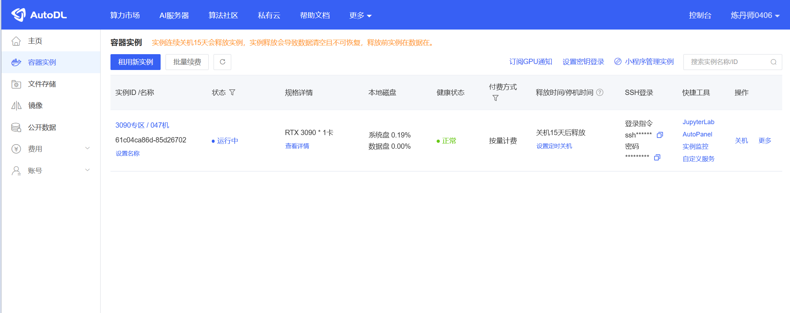

# Qwen2-7B-Instruct FastApi 部署调用

## 环境准备

本文基础环境如下：

```
----------------
ubuntu 22.04
python 3.10
cuda 12.1
pytorch 2.1.0
----------------
```
> 本文默认学习者已安装好以上 Pytorch(cuda) 环境，如未安装请自行安装。

首先`pip`换源加速下载并安装依赖包

```bash
python -m pip install --upgrade pip
# 更换 pypi 源加速库的安装
pip config set global.index-url https://pypi.tuna.tsinghua.edu.cn/simple

pip install modelscope==1.16.1
pip install transformers==4.42.4
pip install fastapi==0.111.1
pip install uvicorn==0.30.3
pip install SentencePiece==0.2.0
pip install accelerate==0.33.0
```

> 考虑到部分同学配置环境可能会遇到一些问题，我们在AutoDL平台准备了OpenELM的环境镜像，点击下方链接并直接创建Autodl实例即可。
> ***https://www.codewithgpu.com/i/datawhalechina/self-llm/OpenELM-3B-Instruct***


## 模型下载  

使用 modelscope 命令行下载模型，参数model为模型名称，参数 local_dir 为模型的下载路径。  
注：由于OpenELM使用的是Llama2的Tokenizer，所以我们在下载Llama2-7b时可将权重排除在外
打开终端输入以下命令下载模型和Tokenizer

```shell
modelscope download --model shakechen/Llama-2-7b-hf  --local_dir /root/autodl-tmp/Llama-2-7b-hf --exclude ".bin" "*.safetensors" "configuration.json" 
modelscope download --model LLM-Research/OpenELM-3B-Instruct --local_dir /root/autodl-tmp/OpenELM-3B-Instruct
```  

## 代码准备  

在 /root/autodl-tmp 路径下新建 api.py 文件并在其中输入以下内容，粘贴代码后请及时保存文件。
下面的代码有很详细的注释，大家如有不理解的地方，欢迎提出 issue。  

```python
from fastapi import FastAPI, Request
from transformers import AutoTokenizer, AutoModelForCausalLM, GenerationConfig
import uvicorn
import json
import datetime
import torch

# 设置设备参数
DEVICE = "cuda"  # 使用CUDA
DEVICE_ID = "0"  # CUDA设备ID，如果未设置则为空
CUDA_DEVICE = f"{DEVICE}:{DEVICE_ID}" if DEVICE_ID else DEVICE  # 组合CUDA设备信息

# 清理GPU内存函数
def torch_gc():
    if torch.cuda.is_available():  # 检查是否可用CUDA
        with torch.cuda.device(CUDA_DEVICE):  # 指定CUDA设备
            torch.cuda.empty_cache()  # 清空CUDA缓存
            torch.cuda.ipc_collect()  # 收集CUDA内存碎片

# 创建FastAPI应用
app = FastAPI()

# 处理POST请求的端点
@app.post("/")
async def create_item(request: Request):
    global model, tokenizer  # 声明全局变量以便在函数内部使用模型和分词器
    json_post_raw = await request.json()  # 获取POST请求的JSON数据
    json_post = json.dumps(json_post_raw)  # 将JSON数据转换为字符串
    json_post_list = json.loads(json_post)  # 将字符串转换为Python对象
    prompt = json_post_list.get('prompt')  # 获取请求中的提示

    # 调用模型进行对话生成
    model_inputs = tokenizer(prompt, add_special_tokens=True, return_tensors="pt")['input_ids'].cuda()
    generated_ids = model.generate(model_inputs, max_length=384)
    response = tokenizer.decode(generated_ids[0], skip_special_tokens=True)
    now = datetime.datetime.now()  # 获取当前时间
    time = now.strftime("%Y-%m-%d %H:%M:%S")  # 格式化时间为字符串
    # 构建响应JSON
    answer = {
        "response": response,
        "status": 200,
        "time": time
    }
    # 构建日志信息
    log = "[" + time + "] " + '", prompt:"' + prompt + '", response:"' + repr(response) + '"'
    print(log)  # 打印日志
    torch_gc()  # 执行GPU内存清理
    return answer  # 返回响应

# 主函数入口
if __name__ == '__main__':
    # 加载预训练的分词器和模型
    model_path = '/root/autodl-tmp/OpenELM-3B-Instruct'
    tokenizer_path = '/root/autodl-tmp/Llama-2-7b-hf'
    tokenizer = AutoTokenizer.from_pretrained(tokenizer_path, use_fast=False, trust_remote_code=True)
    model = AutoModelForCausalLM.from_pretrained(model_path, device_map="auto", torch_dtype=torch.bfloat16, trust_remote_code=True)

    # 启动FastAPI应用
    # 用6006端口可以将autodl的端口映射到本地，从而在本地使用api
    uvicorn.run(app, host='0.0.0.0', port=6006, workers=1)  # 在指定端口和主机上启动应用
```

## Api 部署  

在终端输入以下命令启动api服务：  

```shell  
cd /root/autodl-tmp
python api.py
```  

```shell
python /root/api.py
```  

加载完毕后出现如下信息说明成功。


默认部署在 6006 端口，通过 POST 方法进行调用，可以使用 curl 调用，如下所示：  

```shell
curl -X POST "http://127.0.0.1:6006" \
     -H 'Content-Type: application/json' \
     -d '{"prompt": "Once upon a time there was"}'
```  


也可以使用 python 中的 requests 库进行调用，如下所示：

```python
import requests
import json

def get_completion(prompt):
    headers = {'Content-Type': 'application/json'}
    data = {"prompt": prompt}
    response = requests.post(url='http://127.0.0.1:6006', headers=headers, data=json.dumps(data))
    print(json.dumps(response.json()))
    return response.json()['response']

if __name__ == '__main__':
    response = get_completion('Once upon a time there was')
```

得到的返回值如下所示：

```json
{"response": "Once upon a time there was a little girl named Rosie. Rosie loved to play dress-up, and her favorite costume was a princess dress. Rosie's mommy and daddy dressed her up in her princess dress every chance they got. Rosie loved her princess dress so much, she even wore it to bed! Rosie's mommy and daddy loved Rosie very much, and they wanted Rosie to have the best life possible.\n\nOne day Rosie's mommy and daddy took Rosie to visit their friends, the Johnsons. Rosie's mommy and daddy told Rosie all about their friends, and Rosie couldn't wait to meet them. Rosie's mommy and daddy dropped Rosie off at the Johnsons' house, and Rosie ran inside to find her princess dress waiting for her. Rosie put on her princess dress and tiptoed upstairs to meet her friends.\n\nWhen Rosie walked into the Johnsons' living room, she saw her friends sitting on the couch, dressed in jeans and t-shirts. Rosie smiled and ran over to give her friends a hug. Rosie's friends were so happy to see her dressed up like a princess! They asked Rosie lots of questions about her princess dress, and Rosie told them all about her mommy and daddy's special tradition. Rosie's friends loved hearing all about her princess dress, and they promised to wear their princess dresses whenever Rosie visited them.\n\nAfter playing dress-up for a while, Rosie's friends asked Rosie if she wanted to play outside. Rosie loved playing with her friends, but she also loved playing princess dress-up.", "status": 200, "time": "2024-08-24 21:28:34"}
```  
