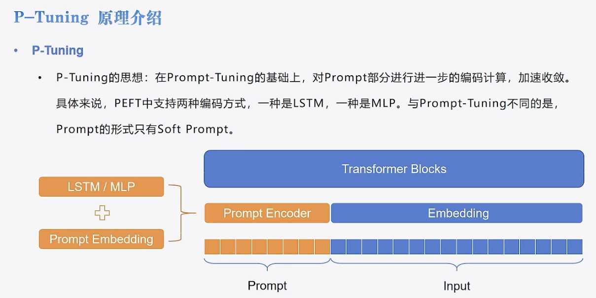

# 05-Qwen-7B-Chat Ptuning 微调


## Ptuning原理
参考[transformers-code](https://github.com/zyds/transformers-code)

数据加载与模型配置与[LoRa](./04-Qwen-7B-Chat%20Lora%20微调.md)一致,在此具体讲一下Ptuning的细节:  
基本原理为冻结主模型全部参数,在训练数据前加入一小段Prompt,之训练Prompt的嵌入层。在Ptuning中，只有soft prompt,是自动学习的,不用人工设置。
- 在`Prompt-tuning`的时候，前面只是增加了一个`Prompt Embedding`.
- 在Ptuning这里替换为了`Prompt Encoder`，新加了`LSTM/MLP+Embedding`.




## Ptuning PEFT模块  
- `PromptEncoderReparameterizationType`来决定到底是用LSTM还是MLP
- 可调的参数有：`num_virtual_tokens`、`encoder_reparameterization_type`、`encoder_dropout`、`encoder_num_layers`、`encoder_hidden_size`
- 注意,`encoder_num_layers`设置层数,但MLP设置层数固定为2,此参数只对LSTM时有效。

```python
from peft import PromptEncoderConfig, TaskType, get_peft_model, PromptEncoderReparameterizationType

config = PromptEncoderConfig(task_type=TaskType.CAUSAL_LM, num_virtual_tokens=10,
                             encoder_reparameterization_type=PromptEncoderReparameterizationType.MLP,
                             encoder_dropout=0.1, encoder_num_layers=5, encoder_hidden_size=1024)
config
'''
PromptEncoderConfig(peft_type=<PeftType.P_TUNING: 'P_TUNING'>, auto_mapping=None, base_model_name_or_path=None, revision=None, task_type=<TaskType.CAUSAL_LM: 'CAUSAL_LM'>, inference_mode=False, num_virtual_tokens=10, token_dim=None, num_transformer_submodules=None, num_attention_heads=None, num_layers=None, encoder_reparameterization_type=<PromptEncoderReparameterizationType.MLP: 'MLP'>, encoder_hidden_size=1024, encoder_num_layers=5, encoder_dropout=0.1)
'''
```

其余可见目录下[微调脚本](./05-Qwen-7B-Chat%20Ptuning%20微调.py)
