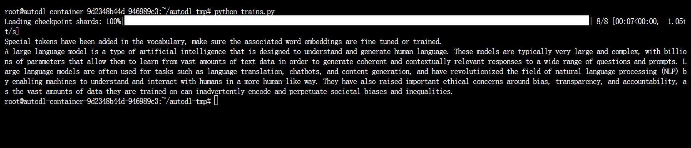

# Qwen1.5-MoE-Chat Transformers 部署调用
## Qwen1.5-MoE-Chat介绍
Qwen1.5-MoE-chat仅使用2.7B激活参数，达到和目前最先进的7B模型如Mistral 7B和Qwen1.5-7B模型相当的能力。相比Qwen1.5-7B，Qwen1.5-MoE-A2.7B的训练成本降低了75%，推理速度则提升至1.74倍。

相较于Mixtral-MoE模型，Qwen1.5-MoE在模型结构上有以下改进：使用了finegrained experts，利用已有的Qwen1.8B初始化模型，使用shared experts和routing experts等新的routing机制。

完整介绍参照官方blog：[Qwen1.5-MoE:1/3的激活参数量达到7B模型的性能](https://qwenlm.github.io/zh/blog/qwen-moe/)


## 讲讲显存计算

显存计算的考虑会随着模型类型不同，任务不同而变化

这里的Transformers部署调用是推理任务，因而只需要考虑模型参数、KV Cache、中间结果和输入数据。这里的模型为MoE模型，考虑完整模型参数（14.3B）；使用了bf16加载，再考虑中间结果、输入数据和KV Cache等，大概是 `2x1.2x14.3` 的显存需求，所以我们后面会选择双卡共48G显存

更完整的显存计算参照这个blog：[【Transformer 基础系列】手推显存占用](https://zhuanlan.zhihu.com/p/648924115)


## 环境准备

本文基础环境如下：

```
----------------
ubuntu 22.04
python 3.12
cuda 12.1
pytorch 2.3.0
----------------
```

> 本文默认学习者已安装好以上 PyTorch(cuda) 环境，如未安装请自行安装。

接下来开始环境配置、模型下载和运行演示 ~

`pip` 换源加速下载并安装依赖包

```shell
# 因为涉及到访问github因此最好打开autodl的学术镜像加速
source /etc/network_turbo
# 升级pip
python -m pip install --upgrade pip
# 更换 pypi 源加速库的安装
pip config set global.index-url https://pypi.tuna.tsinghua.edu.cn/simple
# 从transformers的github仓库中安装包含qwen1.5-moe的新版本
pip install git+https://github.com/huggingface/transformers
# 安装需要的python包
pip install modelscope sentencepiece accelerate fastapi uvicorn requests streamlit transformers_stream_generator
# 安装flash-attention
pip install https://github.com/Dao-AILab/flash-attention/releases/download/v2.4.2/flash_attn-2.4.2+cu122torch2.1cxx11abiFALSE-cp310-cp310-linux_x86_64.whl
```


## 模型下载

使用 `modelscope` 中的 `snapshot_download` 函数下载模型，第一个参数为模型名称，参数 `cache_dir` 为自定义的模型下载路径，参数`revision`为模型仓库分支版本，`master `代表主分支，也是一般模型上传的默认分支。

先切换到 `autodl-tmp` 目录，`cd /root/autodl-tmp` 

然后新建名为 `model_download.py` 的 `python` 文件，并在其中输入以下内容并保存

```python
# model_download.py
from modelscope import snapshot_download

model_dir = snapshot_download('qwen/Qwen1.5-MoE-A2.7B-Chat', cache_dir='/root/autodl-tmp', revision='master')
```

然后在终端中输入 `python model_download.py` 执行下载，注意该模型权重文件比较大，因此这里需要耐心等待一段时间直到模型下载完成。

> 注意：记得修改 `cache_dir` 为你的模型下载路径哦~


## 代码准备

在/root/autodl-tmp路径下新建 `trains.py` 文件并在其中输入以下内容
```python
import torch  # 导入torch库，用于深度学习相关操作
from transformers import AutoTokenizer, AutoModelForCausalLM, GenerationConfig  # 三个类分别用于加载分词器、加载因果语言模型和加载生成配置

# 将模型路径设置为刚刚下载的模型路径
model_name = "/root/autodl-tmp/qwen/Qwen1.5-MoE-A2.7B-Chat"

# 加载语言模型，设置数据类型为bfloat16即混合精度格式以优化性能并减少显存使用，将推理设备设置为`auto`自动选择最佳的设备进行推理，如果没有可用的GPU，它可能会回退到CPU
model = AutoModelForCausalLM.from_pretrained(model_name, torch_dtype=torch.bfloat16, device_map="auto")

# 加载分词器
tokenizer = AutoTokenizer.from_pretrained(model_name)

# 定义input字符串
prompt = "Give me a short introduction to large language model."
messages = [
    {"role": "system", "content": "You are a helpful assistant."},
    {"role": "user", "content": prompt}
]
# 使用分词器的apply_chat_template方法来处理messages，转换格式
text = tokenizer.apply_chat_template(
    messages,
    tokenize=False,
    add_generation_prompt=True # 在消息前添加生成提示
)
# 将text变量中的文本转换为模型输入的格式，指定返回的张量为PyTorch张量（"pt"）
model_inputs = tokenizer([text], return_tensors="pt").to(device)
# 使用模型的generate方法来生成文本
generated_ids = model.generate(
    model_inputs.input_ids,
    max_new_tokens=512
)
# 从生成的ID中提取出除了原始输入之外的新生成的token
generated_ids = [
    output_ids[len(input_ids):] for input_ids, output_ids in zip(model_inputs.input_ids, generated_ids)
]
# 使用分词器的batch_decode方法将生成的token ID转换回文本
response = tokenizer.batch_decode(generated_ids, skip_special_tokens=True)[0]
# 显示生成的回答
print(response)
```
运行结果如下图所示，模型生成了与代码中prompt对应的结果:

