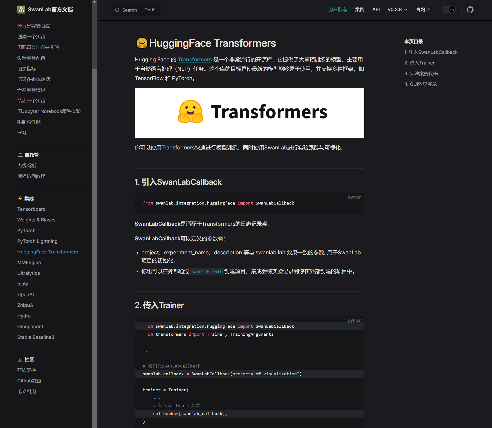
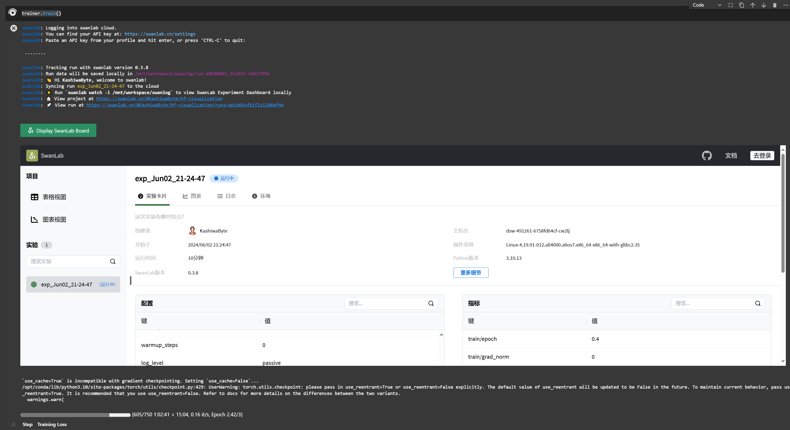

# Qwen1.5-7B-chat Lora 微调 接入SwanLab实验管理平台

本节我们会在前面微调训练的基础上，来加入模型实验管理工具，实现实验训练情况的检测。简要介绍如何基于swanlab、transformers、peft 等框架，对 Qwen1.5-7B-chat 模型进行 Lora 微调。Lora 是一种高效微调方法，深入了解其原理可参见博客：[知乎|深入浅出Lora](https://zhuanlan.zhihu.com/p/650197598)。

SwanLab是一款开源、轻量级的AI实验跟踪工具，提供了一个跟踪、比较、和协作实验的平台,具体内容详见[SwanLab官方文档](https://docs.swanlab.cn/zh/guide_cloud/general/what-is-swanlab.html)


这个教程同样会在同目录下给大家提供一个 [nodebook](./08-Qwen1.5-7B-chat%20Lora微调接入实验管理.ipynb) 文件，来让大家更好的学习。

## 环境配置

本文基础环境如下：

```
----------------
ubuntu 22.04
python 3.12
cuda 12.1
pytorch 2.3.0
----------------
```

> 本文默认学习者已安装好以上 Pytorch(cuda) 环境，如未安装请自行安装。

首先 `pip` 换源加速下载并安装依赖包

```shell
# 升级pip
python -m pip install --upgrade pip
# 更换 pypi 源加速库的安装
pip config set global.index-url https://pypi.tuna.tsinghua.edu.cn/simple

pip install modelscope==1.16.1
pip install transformers==4.43.2
pip install accelerate==0.32.1
pip install peft==0.11.1
pip install datasets==2.20.0
```

> 考虑到部分同学配置环境可能会遇到一些问题，我们在AutoDL平台准备了Qwen1.5的环境镜像，该镜像适用于该仓库除Qwen-GPTQ和vllm外的所有部署环境。点击下方链接并直接创建Autodl示例即可。
> ***https://www.codewithgpu.com/i/datawhalechina/self-llm/self-llm-Qwen1.5***

在本节教程里，我们将微调数据集放置在根目录 [/dataset](../../dataset/huanhuan.json)。


## 指令集构建

LLM 的微调一般指指令微调过程。所谓指令微调，是说我们使用的微调数据形如：

```json
{
    "instruction":"回答以下用户问题，仅输出答案。",
    "input":"1+1等于几?",
    "output":"2"
}
```

其中，`instruction` 是用户指令，告知模型其需要完成的任务；`input` 是用户输入，是完成用户指令所必须的输入内容；`output` 是模型应该给出的输出。

即我们的核心训练目标是让模型具有理解并遵循用户指令的能力。因此，在指令集构建时，我们应针对我们的目标任务，针对性构建任务指令集。例如，在本节我们使用由笔者合作开源的 [Chat-甄嬛](https://github.com/KMnO4-zx/huanhuan-chat) 项目作为示例，我们的目标是构建一个能够模拟甄嬛对话风格的个性化 LLM，因此我们构造的指令形如：

```json
{
    "instruction": "你是谁？",
    "input":"",
    "output":"家父是大理寺少卿甄远道。"
}
```

我们所构造的全部指令数据集在根目录下。


## 数据格式化

`Lora` 训练的数据是需要经过格式化、编码之后再输入给模型进行训练的，如果是熟悉 `Pytorch` 模型训练流程的同学会知道，我们一般需要将输入文本编码为 input_ids，将输出文本编码为 `labels`，编码之后的结果都是多维的向量。我们首先定义一个预处理函数，这个函数用于对每一个样本，编码其输入、输出文本并返回一个编码后的字典：

```python
def process_func(example):
    MAX_LENGTH = 384    # Llama分词器会将一个中文字切分为多个token，因此需要放开一些最大长度，保证数据的完整性
    input_ids, attention_mask, labels = [], [], []
    instruction = tokenizer(f"<|im_start|>system\n现在你要扮演皇帝身边的女人--甄嬛<|im_end|>\n<|im_start|>user\n{example['instruction'] + example['input']}<|im_end|>\n<|im_start|>assistant\n", add_special_tokens=False)  # add_special_tokens 不在开头加 special_tokens
    response = tokenizer(f"{example['output']}", add_special_tokens=False)
    input_ids = instruction["input_ids"] + response["input_ids"] + [tokenizer.pad_token_id]
    attention_mask = instruction["attention_mask"] + response["attention_mask"] + [1]  # 因为eos token咱们也是要关注的所以 补充为1
    labels = [-100] * len(instruction["input_ids"]) + response["input_ids"] + [tokenizer.pad_token_id]  
    if len(input_ids) > MAX_LENGTH:  # 做一个截断
        input_ids = input_ids[:MAX_LENGTH]
        attention_mask = attention_mask[:MAX_LENGTH]
        labels = labels[:MAX_LENGTH]
    return {
        "input_ids": input_ids,
        "attention_mask": attention_mask,
        "labels": labels
    }
```

`Qwen1.5` 采用的`Prompt Template`格式如下：

```text
<|im_start|>system
You are a helpful assistant.<|im_end|>
<|im_start|>user
你是谁？<|im_end|>
<|im_start|>assistant
我是一个有用的助手。<|im_end|>
```


## 加载tokenizer和半精度模型

模型以半精度形式加载，如果你的显卡比较新的话，可以用`torch.bfolat`形式加载。对于自定义的模型一定要指定`trust_remote_code`参数为`True`。

```python
tokenizer = AutoTokenizer.from_pretrained('./qwen/Qwen1.5-7B-Chat/', use_fast=False, trust_remote_code=True)

model = AutoModelForCausalLM.from_pretrained('./qwen/Qwen1.5-7B-Chat/', device_map="auto",torch_dtype=torch.bfloat16)
```


## 定义LoraConfig

`LoraConfig`这个类中可以设置很多参数，但主要的参数没多少，简单讲一讲，感兴趣的同学可以直接看源码。

- `task_type`：模型类型
- `target_modules`：需要训练的模型层的名字，主要就是`attention`部分的层，不同的模型对应的层的名字不同，可以传入数组，也可以字符串，也可以正则表达式。
- `r`：`lora`的秩，具体可以看`Lora`原理
- `lora_alpha`：`Lora alaph`，具体作用参见 `Lora` 原理 

`Lora`的缩放是啥嘞？当然不是`r`（秩），这个缩放就是`lora_alpha/r`, 在这个`LoraConfig`中缩放就是4倍。

```python
config = LoraConfig(
    task_type=TaskType.CAUSAL_LM, 
    target_modules=["q_proj", "k_proj", "v_proj", "o_proj", "gate_proj", "up_proj", "down_proj"],
    inference_mode=False, # 训练模式
    r=8, # Lora 秩
    lora_alpha=32, # Lora alaph，具体作用参见 Lora 原理
    lora_dropout=0.1# Dropout 比例
)
```


## 自定义 TrainingArguments 参数

`TrainingArguments`这个类的源码也介绍了每个参数的具体作用，当然大家可以来自行探索，这里就简单说几个常用的。

- `output_dir`：模型的输出路径
- `per_device_train_batch_size`：顾名思义 `batch_size`
- `gradient_accumulation_steps`: 梯度累加，如果你的显存比较小，那可以把 `batch_size` 设置小一点，梯度累加增大一些。
- `logging_steps`：多少步，输出一次`log`
- `num_train_epochs`：顾名思义 `epoch`
- `gradient_checkpointing`：梯度检查，这个一旦开启，模型就必须执行`model.enable_input_require_grads()`，这个原理大家可以自行探索，这里就不细说了。

```python
args = TrainingArguments(
    output_dir="./output/DeepSeek",
    per_device_train_batch_size=4,
    gradient_accumulation_steps=4,
    logging_steps=10,
    num_train_epochs=3,
    save_steps=100,
    learning_rate=1e-4,
    save_on_each_node=True,
    gradient_checkpointing=True
)
```


## 利用SwanLab实现模型实验管理

在配置完参数后我们推荐使用模型实验管理工具来记录实验的训练情况，这样我们就不需要待在服务器命令行前盯着打印的结果了。

[SwanLab](https://swanlab.cn/)是一个高效，好用的模型实验管理python库，可以很方便地对我们的训练任务进行记录，并提供可视化的分析图表.


SwanLab的使用流程也非常简单，只需以下三步即可：

首先我们需要通过以下命令下载SwanLab库

```
pip install swanlab
```

然后我们需要去SwanLab的官方网站注册一个账号（通过手机注册即可，非常方便）

接着进入我们的个人设置界面获取 API-Key（这是将我们的数据上传到云端的关键）


目前SwanLab已经对十几个主流的开源框架进行了集成，让我们可以通过几行代码轻松实现日志记录。我们通过查询它的官方文档可以发现，SwanLab目前已经支持了Transformers  Trainer的支持。




## 使用 Trainer 训练
引入SwanLab后，我们只需要实例化一个回调类，再将其传入Trainer中，即可实现微调训练的实验追踪

```python
from swanlab.integration.huggingface import SwanLabCallback

swanlab_callback = SwanLabCallback(project="hf-visualization")

trainer = Trainer(
    model=model,
    args=args,
    train_dataset=tokenized_id,
    data_collator=DataCollatorForSeq2Seq(tokenizer=tokenizer, padding=True),
    callbacks=[swanlab_callback],
)


trainer.train()
```

训练启动后会要求我们输入SwanLab的API-key，只需要输入我们在个人设置界面获得的API-key即可。


## 查看训练进展

SwanLab目前支持了在Jupyter界面中直接开启看板，来很方便的了解训练的情况。



当然也可以直接登录官网，在我们的个人账号下进行查看。


## 加载 lora 权重推理

训练好了之后可以使用如下方式加载`lora`权重进行推理：

```python
from transformers import AutoModelForCausalLM, AutoTokenizer
import torch
from peft import PeftModel

mode_path = './qwen/Qwen1.5-7B-Chat/'
lora_path = 'lora_path'

# 加载tokenizer
tokenizer = AutoTokenizer.from_pretrained(mode_path)

# 加载模型
model = AutoModelForCausalLM.from_pretrained(mode_path, device_map="auto",torch_dtype=torch.bfloat16)

# 加载lora权重
model = PeftModel.from_pretrained(model, model_id=lora_path, config=config)

prompt = "你是谁？"
messages = [
    {"role": "system", "content": "现在你要扮演皇帝身边的女人--甄嬛"},
    {"role": "user", "content": prompt}
]

text = tokenizer.apply_chat_template(messages, tokenize=False, add_generation_prompt=True)

model_inputs = tokenizer([text], return_tensors="pt").to('cuda')

generated_ids = model.generate(
    model_inputs.input_ids,
    max_new_tokens=512
)
generated_ids = [
    output_ids[len(input_ids):] for input_ids, output_ids in zip(model_inputs.input_ids, generated_ids)
]

response = tokenizer.batch_decode(generated_ids, skip_special_tokens=True)[0]

print(response)
```

