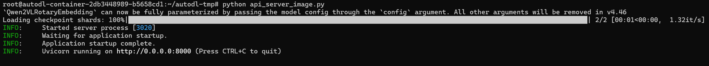
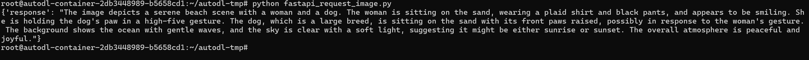
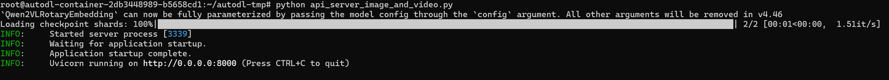
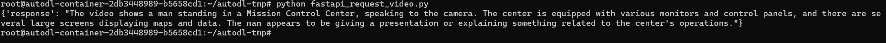
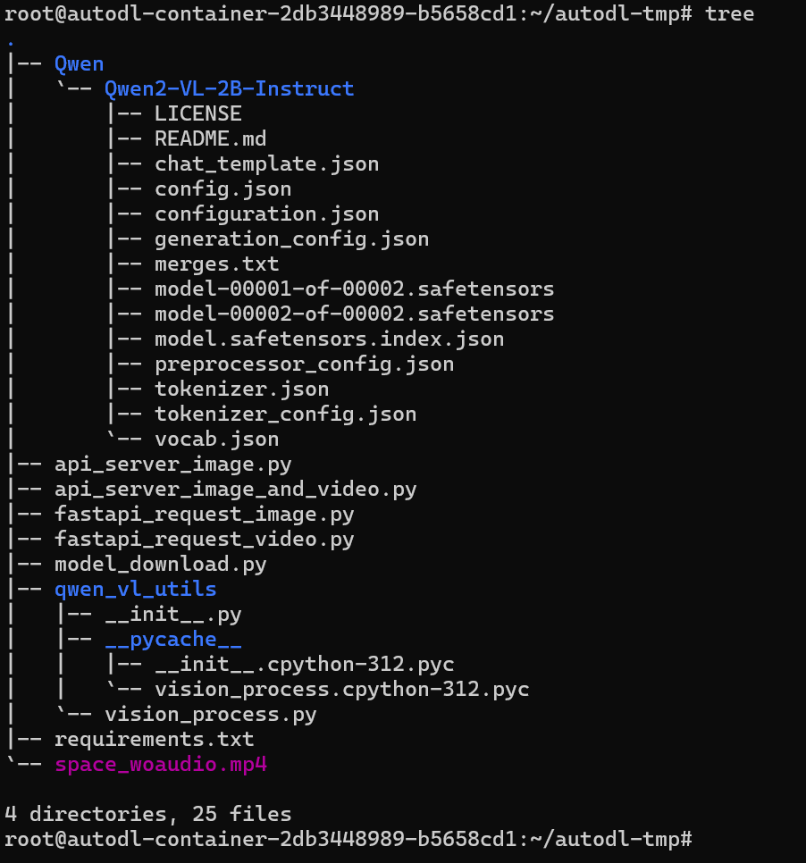

# Qwen2-VL-2B-Instruct FastApi 部署调用


## 环境准备  

基础环境：

```
----------------
ubuntu 22.04
python 3.12
cuda 12.1
pytorch 2.3.0
----------------
```
> 本文默认学习者已安装好以上 PyTorch (cuda) 环境，如未安装请自行安装。

首先 `pip` 换源加速下载并安装依赖包

```shell
pip config set global.index-url https://pypi.tuna.tsinghua.edu.cn/simple

pip install modelscope==1.20.0
pip install fastapi==0.115.4
pip install uvicorn==0.32.0
pip install transformers==4.46.2
pip install accelerate==1.1.1
pip install torchvision==0.19.0
pip install av==13.1.0
```

> 考虑到部分同学配置环境可能会遇到一些问题，我们在AutoDL平台准备了Qwen2-VL的环境镜像，点击下方链接并直接创建Autodl示例即可。
> ***https://www.codewithgpu.com/i/datawhalechina/self-llm/qwen2-vl***


## 模型下载  

使用 `modelscope` 中的 `snapshot_download` 函数下载模型，第一个参数为模型名称，参数 `cache_dir` 为模型的下载路径。

新建 `model_download.py` 文件输入以下代码，并运行 `python model_download.py` 执行下载。

此处使用 `modelscope` 提供的 `snapshot_download` 函数进行下载，该方法对国内的用户十分友好。

```python
# model_download.py
from modelscope import snapshot_download
model_dir = snapshot_download('Qwen/Qwen2-VL-2B-Instruct', cache_dir='/root/autodl-tmp', revision='master')
```

> 注意：请记得修改 `cache_dir` 为你自己的模型下载路径 ~


## 代码准备

新建 `api_image.py` 文件并在其中输入以下内容，粘贴代码后请记得及时保存文件。

```python
# api_server_image.py
from transformers import Qwen2VLForConditionalGeneration, AutoProcessor
from qwen_vl_utils.vision_process import process_vision_info
from fastapi import FastAPI, Request
import uvicorn
from pydantic import BaseModel
from typing import List, Dict, Union

# 创建FastAPI应用
app = FastAPI()

# 下载好的模型本地路径
model_name_or_path = '/root/autodl-tmp/Qwen/Qwen2-VL-2B-Instruct'

# 初始化模型和处理器
model = Qwen2VLForConditionalGeneration.from_pretrained(
    model_name_or_path, torch_dtype="auto", device_map="auto"
)
processor = AutoProcessor.from_pretrained(model_name_or_path)

# 定义请求体模型
class MessageContent(BaseModel):
    type: str
    text: str = None
    image: str = None

class ChatMessage(BaseModel):
    messages: List[Dict[str, Union[str, List[Dict[str, str]]]]]

# 处理POST请求的端点
@app.post("/generate")
async def generate_response(chat_message: ChatMessage):
    # 直接使用请求中的 messages
    text = processor.apply_chat_template(
        chat_message.messages,
        tokenize=False, 
        add_generation_prompt=True
    )
    
    # 预先写好的辅助函数，位于参考代码中
    image_inputs, video_inputs = process_vision_info(chat_message.messages)
    inputs = processor(
        text=[text],
        images=image_inputs,
        videos=video_inputs,
        padding=True,
        return_tensors="pt",
    )
    inputs = inputs.to("cuda")

    # 生成输出
    generated_ids = model.generate(**inputs, max_new_tokens=1024)
    generated_ids_trimmed = [
        out_ids[len(in_ids):] for in_ids, out_ids in zip(inputs.input_ids, generated_ids)
    ]
    output_text = processor.batch_decode(
        generated_ids_trimmed, 
        skip_special_tokens=True, 
        clean_up_tokenization_spaces=False
    )
    
    return {"response": output_text[0]}

if __name__ == "__main__":
    # 启动FastAPI应用，端口为8000
    uvicorn.run(app, host="0.0.0.0", port=8000)
```

> 注意：同样记得修改 `model_name_or_path` 为你自己的模型下载路径 ~


## 图像问答 API 服务启动

在终端输入以下命令启动 `api` 服务：  

```shell  
python api_server_image.py
```

加载完毕后出现如下信息说明成功。



我们可以使用 `Python` 中的 `requests` 库对api服务的端口进行请求从而调用 `Qwen2-VL-2B-Instruct` 的多模态图片理解能力来生成回复，示例代码如下——

```python
# fastapi_request_image.py
import requests

url = "http://localhost:8000/generate"
payload = {
    "messages": [
        {
            "role": "user",
            "content": [
                {
                    "type": "image",
                    "image": "https://qianwen-res.oss-cn-beijing.aliyuncs.com/Qwen-VL/assets/demo.jpeg"
                },
                {
                    "type": "text",
                    "text": "Describe this image."
                }
            ]
        }
    ]
}
response = requests.post(url, json=payload)
print(response.json())
```

```shell
python fastapi_request_image.py
```

执行后得到的返回结果如下所示：

```json
{'response': "The image depicts a serene beach scene with a woman and a dog. The woman is sitting on the sand, wearing a plaid shirt and black pants, and appears to be smiling. She is holding the dog's paw in a high-five gesture. The dog, which is a large breed, is sitting on the sand with its front paws raised, possibly in response to the woman's gesture. The background shows the ocean with gentle waves, and the sky is clear with a soft light, suggesting it might be either sunrise or sunset. The overall atmosphere is peaceful and joyful."}
```



我们再回过头来检查以下示例代码中的 `demo.jpeg` ，可以观察到模型的回复质量还是非常高的，正确且完整地叙述了图片。


## 进阶实践

由于 `Qwen2-VL-2B-Instruct` 具备强大的多模态能力，其除了对图片进行问答之外，同样也支持视频形式的交互。

我们需要对原先的 `api_image.py` 的代码做一些修改来使我们的 `FastApi` 服务支持视频流推理。新建 `api_server_image_and_video.py` ，复制如下代码——

```python
# api_server_image_and_video.py
from transformers import Qwen2VLForConditionalGeneration, AutoProcessor
from qwen_vl_utils.vision_process import process_vision_info
from fastapi import FastAPI, Request
import uvicorn
from pydantic import BaseModel
from typing import List, Dict, Union

app = FastAPI()

model_name_or_path = '/root/autodl-tmp/Qwen/Qwen2-VL-2B-Instruct'
model = Qwen2VLForConditionalGeneration.from_pretrained(
    model_name_or_path, torch_dtype="auto", device_map="auto"
)
processor = AutoProcessor.from_pretrained(model_name_or_path)

# 定义请求体模型
class MessageContent(BaseModel):
    type: str
    text: str = None
    image: str = None
    video: str = None # 添加对video的支持

class ChatMessage(BaseModel):
    messages: List[Dict[str, Union[str, List[Dict[str, str]]]]]

@app.post("/generate")
async def generate_response(chat_message: ChatMessage):
    # 直接使用请求中的 messages
    text = processor.apply_chat_template(
        chat_message.messages,
        tokenize=False, 
        add_generation_prompt=True
    )
    
    image_inputs, video_inputs = process_vision_info(chat_message.messages)
    inputs = processor(
        text=[text],
        images=image_inputs,
        videos=video_inputs,
        padding=True,
        return_tensors="pt",
    )
    inputs = inputs.to("cuda")

    # 生成输出
    generated_ids = model.generate(**inputs, max_new_tokens=1024)
    generated_ids_trimmed = [
        out_ids[len(in_ids):] for in_ids, out_ids in zip(inputs.input_ids, generated_ids)
    ]
    output_text = processor.batch_decode(
        generated_ids_trimmed, 
        skip_special_tokens=True, 
        clean_up_tokenization_spaces=False
    )
    
    return {"response": output_text[0]}

if __name__ == "__main__":
    uvicorn.run(app, host="0.0.0.0", port=8000)
```


## 视频问答 API 服务启动

在终端输入以下命令启动 `api` 服务：  

```shell  
python api_server_image_and_video.py
```

加载完毕后出现如下信息说明成功。



同样的，我们使用 `Python` 中的 `requests` 库对服务的端口进行请求从而调用 `Qwen2-VL-2B-Instruct` 的多模态能力来生成回复，示例代码如下——

```python
import requests

url = "http://localhost:8000/generate"
payload = {
    "messages": [
        {
            "role": "user",
            "content": [
                {
                    "type": "video",
                    "video": "./space_woaudio.mp4"
                },
                {
                    "type": "text",
                    "text": "Describe this video."
                }
            ]
        }
    ]
}

response = requests.post(url, json=payload)
print(response.json())
```

上述代码中，我们在 `messages.content` 中添加了一个视频，预览如下：


```shell
python fastapi_request_video.py
```

此时得到的模型的返回结果如下：

```json
{'response': "The video shows a man standing in a Mission Control Center, speaking to the camera. The center is equipped with various monitors and control panels, and there are several large screens displaying maps and data. The man appears to be giving a presentation or explaining something related to the center's operations."}
```




## 参考代码及其使用

本次教程涉及到的代码文件较多，因此额外提供了参考代码供读者参考，但依然建议初学者在理解的基础上妥善使用。

完成上述所有教程后的目录结构应该与下图类似，关于文件路径还请读者根据自己的实际存放情况进行修正。

