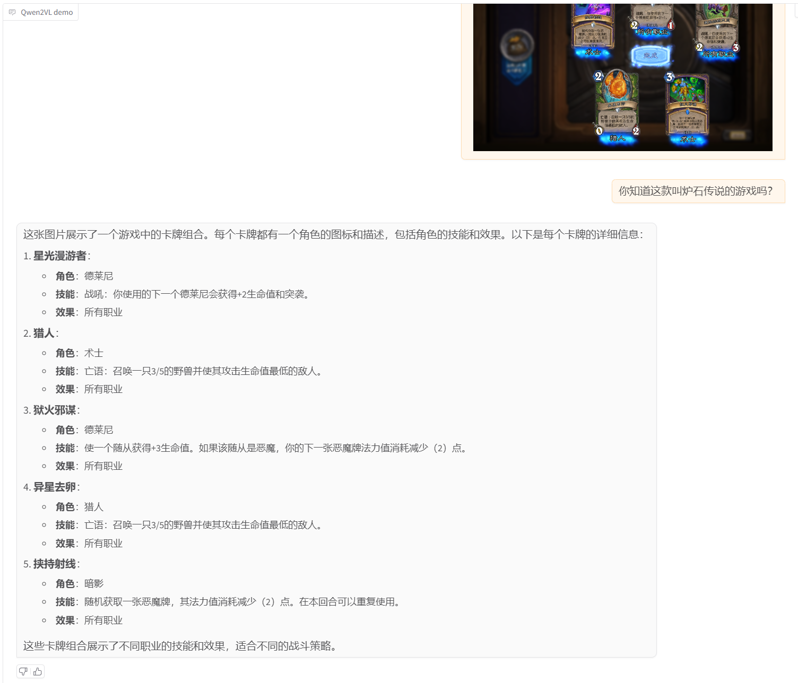
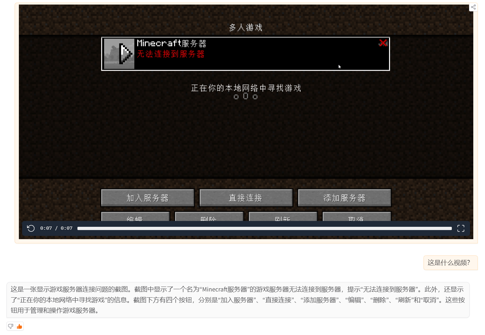

# Qwen2-VL-2B-Instruct WebDemo 部署


# 环境准备

```
----------------
ubuntu 22.04
python 3.10
cuda 11.8
pytorch 2.3.0
----------------
```

# 环境安装

```python
# 换源
python -m pip install --upgrade pip
pip config set global.index-url https://mirrors.tuna.tsinghua.edu.cn/pypi/web/simple

# 需要安装的库
# torchvision需要安装匹配对应torch的版本
pip install qwen_vl_utils==0.0.8 transformers==4.46.2 accelerate==1.1.0 gradio==5.5.0 torchvision==0.18.0 av==13.1.0

# 如需使用魔搭(国内推荐)下载模型, 需安装这个库
pip install modelscope==1.20.0

# 安装flash-attn(可选)
# 如显卡支持flash-attn，在确认对应python、pytorch、cuda版本后, 下载对应的release版本.
wegt https://github.com/Dao-AILab/flash-attention/releases/download/v2.7.0.post2/flash_attn-2.7.0.post2+cu12torch2.3cxx11abiFALSE-cp312-cp312-linux_x86_64.whl
# 镜像加速链接:
# wget https://github.moeyy.xyz/https://github.com/Dao-AILab/flash-attention/releases/download/v2.7.0.post2/flash_attn-2.7.0.post2+cu12torch2.3cxx11abiFALSE-cp312-cp312-linux_x86_64.whl
pip install flash_attn-2.7.0.post2+cu12torch2.3cxx11abiFALSE-cp312-cp312-linux_x86_64.whl
```
> 完整的pip列表(包含依赖)请参考[02-Qwen2-VL-2B-Instruct Web Demo 参考代码/requirements.txt](./02-Qwen2-VL-2B-Instruct%20Web%20Demo%20参考代码/requirements.txt)
>
> 考虑到部分同学配置环境可能会遇到一些问题，我们在AutoDL平台准备了Qwen2-VL的环境镜像，点击下方链接并直接创建Autodl示例即可。
> ***https://www.codewithgpu.com/i/datawhalechina/self-llm/qwen2-vl***

# 下载模型(两种下载方法二选一即可~)
## 1. 借助 modelscope 下载
使用 `modelscope` 中的 `snapshot_download` 函数下载模型，第一个参数为模型名称，参数 `cache_dir` 为模型的下载路径。

新建 `model_download.py` 文件输入以下代码，并运行 `python model_download.py` 执行下载。

此处使用 `modelscope` 提供的 `snapshot_download` 函数进行下载，该方法对国内的用户十分友好。

```python
# model_download.py
from modelscope import snapshot_download
model_dir = snapshot_download('Qwen/Qwen2-VL-2B-Instruct', cache_dir='/root/autodl-tmp', revision='master')
```

> 注意：请记得修改 `cache_dir` 为你自己的模型下载路径 ~

## 2. 借助 git lfs 下载
```python
# 进入autodl-tmp/ 或者你要保存的路径
cd autodl-tmp/

# 首先安装lfs，便于通过git直接下载模型。
curl -s https://packagecloud.io/install/repositories/github/git-lfs/script.deb.sh | sudo bash
sudo apt-get install git-lfs

# 需要下载的模型
MODEL=Qwen2-VL-2B-Instruct
# MODEL=Qwen2-VL-7B-Instruct
# MODEL=Qwen2-VL-72B-Instruct

# # huggingface 下载
# URL="https://huggingface.co/Qwen/"
# git clone "${URL}/${MODEL}"

# 魔搭下载（国内推荐）
URL="https://www.modelscope.cn/Qwen"
git clone "${URL}/${MODEL}.git"

# 返回根目录
cd ..
```

# 运行Demo

```python
# 可以使用 python mm_qwen2vl.py -h 或查看代码来查看命令帮助
# Ampere/Ada/Hopper架构显卡可以启用flash attn2加速推理，autodl要通过6006端口对外访问。(没安装flash-attn库的忽略)
# python mm_qwen2vl.py --flash-attn2 --model-path ./autodl-tmp/Qwen2-VL-2B-Instruct --host 0.0.0.0 --port 6006
python mm_qwen2vl.py --model-path ./autodl-tmp/Qwen2-VL-2B-Instruct --host 0.0.0.0 --port 6006
```
> 完整代码及详细注释请参考[mm_qwen2vl.py](./02-Qwen2-VL-2B-Instruct%20Web%20Demo%20参考代码/mm_qwen2vl.py)

# 测试效果
## 图片

## 视频


> 如果觉得2B理解能力较差, 建议用7B以上模型.