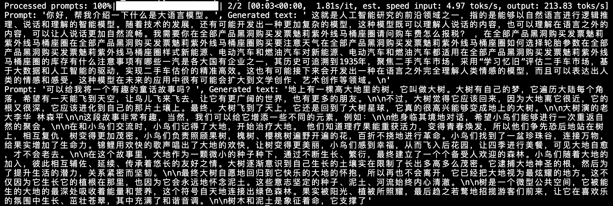
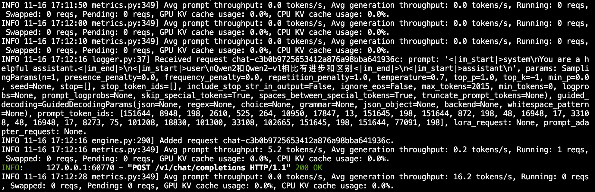

# 03-Qwen2-vl-2B vLLM 部署调用

`vLLM` 框架是一个高效的大语言模型**推理和部署服务系统**，具备以下特性：

- **高效的内存管理**：通过 `PagedAttention` 算法，`vLLM` 实现了对 `KV` 缓存的高效管理，减少了内存浪费，优化了模型的运行效率。
- **高吞吐量**：`vLLM` 支持异步处理和连续批处理请求，显著提高了模型推理的吞吐量，加速了文本生成和处理速度。
- **易用性**：`vLLM` 与 `HuggingFace` 模型无缝集成，支持多种流行的大型语言模型，简化了模型部署和推理的过程。兼容 `OpenAI` 的 `API` 服务器。
- **分布式推理**：框架支持在多 `GPU` 环境中进行分布式推理，通过模型并行策略和高效的数据通信，提升了处理大型模型的能力。
- **开源共享**：`vLLM` 由于其开源的属性，拥有活跃的社区支持，这也便于开发者贡献和改进，共同推动技术发展。

## 环境准备

本文基础环境如下：

```
----------------
ubuntu 22.04
python 3.10
cuda 12.1
pytorch 2.4.0
----------------
```

> 本文默认学习者已配置好以上 `Pytorch (cuda)` 环境，如未配置请先自行安装。

首先 `pip` 换源加速下载并安装依赖包

```bash
python -m pip install --upgrade pip
pip config set global.index-url https://pypi.tuna.tsinghua.edu.cn/simple

pip install modelscope==1.20.0
pip install openai==1.54.4
pip install tqdm==4.67.0
pip install transformers==4.46.2
pip install vllm==0.6.3.post1
pip install wen-vl-utils==0.0.8
```

> 考虑到部分同学配置环境可能会遇到一些问题，我们在AutoDL平台准备了Qwen2-VL的环境镜像，点击下方链接并直接创建Autodl示例即可。
> ***https://www.codewithgpu.com/i/datawhalechina/self-llm/qwen2-vl***

## 模型下载  

使用 `modelscope` 中的 `snapshot_download` 函数下载模型，第一个参数为模型名称，参数 `cache_dir`为模型的下载路径。

先切换到 `autodl-tmp` 目录，`cd /root/autodl-tmp` 

然后新建名为 `model_download.py` 的 `python` 脚本，并在其中输入以下内容并保存

```python
# model_download.py
from modelscope import snapshot_download
model_dir = snapshot_download('Qwen/Qwen2-VL-2B-Instruct', cache_dir='/root/autodl-tmp', revision='master')
```

然后在终端中输入 `python model_download.py` 执行下载，这里需要耐心等待一段时间直到模型下载完成。

> 注意：记得修改 `cache_dir` 为你的模型下载路径哦~

## **代码准备**

### **Python脚本**

在 `/root/autodl-tmp` 路径下新建 `vllm_model.py` 文件并在其中输入以下内容，粘贴代码后请及时保存文件。下面的代码有很详细的注释，如有不理解的地方，欢迎大家提 `issue`。

首先从 `vLLM` 库中导入 `LLM` 和 `SamplingParams` 类。`LLM` 类是使用 `vLLM` 引擎运行离线推理的主要类。`SamplingParams` 类指定采样过程的参数，用于控制和调整生成文本的随机性和多样性。

`vLLM` 提供了非常方便的封装，我们直接传入模型名称或模型路径即可，不必手动初始化模型和分词器。

我们可以通过这个代码示例熟悉下 ` vLLM` 引擎的使用方式。被注释的部分内容可以丰富模型的能力，但不是必要的，大家可以按需选择，自己多多动手尝试 ~

```python
# vllm_model.py
from vllm import LLM, SamplingParams
from transformers import AutoProcessor
import os
import json

# 自动下载模型时，指定使用modelscope; 否则，会从HuggingFace下载
os.environ['VLLM_USE_MODELSCOPE']='True'

def get_completion(prompts, model, tokenizer=None, max_tokens=512, temperature=0.8, top_p=0.95, max_model_len=2048):
    stop_token_ids = [151329, 151336, 151338]
    # 创建采样参数。temperature 控制生成文本的多样性，top_p 控制核心采样的概率
    sampling_params = SamplingParams(temperature=temperature, top_p=top_p, max_tokens=max_tokens, stop_token_ids=stop_token_ids)
    # 初始化 vLLM 推理引擎
    llm = LLM(model=model, tokenizer=tokenizer, max_model_len=max_model_len,trust_remote_code=True)
    outputs = llm.generate(prompts, sampling_params)
    return outputs


if __name__ == "__main__":    
    # 初始化 vLLM 推理引擎
    model='/root/autodl-tmp/Qwen/Qwen2-VL-2B-Instruct' # 指定模型路径
    tokenizer = None
    # 加载分词器后传入vLLM 模型，但不是必要的。
    processor = AutoProcessor.from_pretrained(model)
    
    
    messages = [
    	{"role": "system", "content": "你是一个有用的助手。"},
    	{"role": "user", "content": [
        {"type": "image_url", 
         "image_url": {
           "url": "https://modelscope.oss-cn-beijing.aliyuncs.com/resource/qwen.png"}
        },
        {"type": "text", "text": "插图中的文本是什么？"}
    	]
      }
    ]

    prompt = processor.apply_chat_template(
      messages,
      tokenize=False,
      add_generation_prompt=True,
		)

    outputs = get_completion(prompt, model, tokenizer=tokenizer, max_tokens=512, temperature=1, top_p=1, max_model_len=2048)

    # 输出是一个包含 prompt、生成文本和其他信息的 RequestOutput 对象列表。
    # 打印输出。
    for output in outputs:
        prompt = output.prompt
        generated_text = output.outputs[0].text
        print(f"Prompt: {prompt!r}, Generated text: {generated_text!r}")
```

运行代码

```bash
cd /root/autodl-tmp && python vllm_model.py
```

结果如下：

```bash
Prompt: '<|im_start|>system\n你是一个有用的助手。<|im_end|>\n<|im_start|>user\n<|vision_start|><|image_pad|><|vision_end|>插图中的文本是什么？<|im_end|>\n<|im_start|>assistant\n', Generated text: '插图中是“.YEAR”以及“imestot-value”'
```



### 创建兼容 OpenAI API 接口的服务器

`Qwen` 兼容 `OpenAI API` 协议，所以我们可以直接使用 `vLLM` 创建 `OpenAI API` 服务器。`vLLM` 部署实现 `OpenAI API` 协议的服务器非常方便。默认会在 http://localhost:8000 启动服务器。服务器当前一次托管一个模型，并实现列表模型、`completions` 和 `chat completions` 端口。

- `completions`：是基本的文本生成任务，模型会在给定的提示后生成一段文本。这种类型的任务通常用于生成文章、故事、邮件等。
- `chat completions`：是面向对话的任务，模型需要理解和生成对话。这种类型的任务通常用于构建聊天机器人或者对话系统。

在创建服务器时，我们可以指定模型名称、模型路径、聊天模板等参数。

- `--host` 和 `--port` 参数指定地址。
- `--model` 参数指定模型名称。
- `--chat-template` 参数指定聊天模板。
- `--served-model-name` 指定服务模型的名称。
- `--max-model-len` 指定模型的最大长度。

```bash
python -m vllm.entrypoints.openai.api_server --model /root/autodl-tmp/Qwen/Qwen2-VL-2B-Instruct  --served-model-name Qwen2-VL-2B-Instruct --max-model-len=2048
```

加载完毕后出现如下信息说明服务成功启动


- 通过 `curl` 命令查看当前的模型列表

```bash
curl http://localhost:8000/v1/models
```

​	得到的返回值如下所示

```json
{
  "object":"list",
  "data":[
    {
      "id":"Qwen2-VL-2B-Instruct",
      "object":"model",
      "created":1731747181,
      "owned_by":"vllm",
      "root":"/root/autodl-tmp/Qwen/Qwen2-VL-2B-Instruct",
      "parent":null,
      "max_model_len":2048,
      "permission":[
        {
          "id":"modelperm-aa946b04d0f9463ebac64cec7f9b6313",
          "object":"model_permission",
          "created":1731747181,
          "allow_create_engine":false,
          "allow_sampling":true,
          "allow_logprobs":true,
          "allow_search_indices":false,
          "allow_view":true,
          "allow_fine_tuning":false,
          "organization":"*",
          "group":null,
          "is_blocking":false
        }
      ]
    }
  ]
}
```

- 使用 `curl` 命令测试 `OpenAI Completions API` 


```bash
curl http://localhost:8000/v1/chat/completions \
    -H "Content-Type: application/json" \
    -d '{
        "model": "Qwen2-VL-2B-Instruct",
        "messages": [
    	{"role": "system", "content": "你是一个有用的助手。"},
    	{"role": "user", "content": [
        {"type": "image_url", 
         "image_url": {
           "url": "https://modelscope.oss-cn-beijing.aliyuncs.com/resource/qwen.png"}
        },
        {"type": "text", "text": "插图中的文本是什么？"}
    	 ]
      }
    ]
 }'
```

​	得到的返回值如下所示

```json
{
  "id":"chat-505f8e3987384ba6b1f7a293217757da",
  "object":"chat.completion",
  "created":1731919906,
  "model":"Qwen2-VL-2B-Instruct",
  "choices":[
    {
      "index":0,
      "message":
      {
        "role":"assistant",
        "content":"插图中的文本是 \"TONGYI Qwen\"。",
        "tool_calls":[]
      },
      "logprobs":null,
      "finish_reason":"stop",
      "stop_reason":null
    }],
  "usage":
  {
    "prompt_tokens":71,
    "total_tokens":86,
    "completion_tokens":15
  },
  "prompt_logprobs":null
}
```

- 用 `Python` 脚本请求 `OpenAI Completions API` 


```python
# vllm_openai_completions.py
from openai import OpenAI
client = OpenAI(
    base_url="http://localhost:8000/v1",
    api_key="sk-xxx", # 随便填写，只是为了通过接口参数校验
)

completion = client.chat.completions.create(
  model="Qwen2-VL-2B-Instruct",
  messages = [
    	{"role": "system", "content": "你是一个有用的助手。"},
    	{"role": "user", "content": [
        {"type": "image_url", 
         "image_url": {
           "url": "https://modelscope.oss-cn-beijing.aliyuncs.com/resource/qwen.png"}
        },
        {"type": "text", "text": "插图中的文本是什么？"}
    	]
      }
    ]
)

print(completion.choices[0].message)
```

```shell
python vllm_openai_completions.py
```

​	得到的返回值如下所示

```
ChatCompletionMessage(content='插图中的文本是“TONGYI Qwen”。', refusal=None, role='assistant', audio=None, function_call=None, tool_calls=[])
```

- 用 `curl` 命令测试 `OpenAI Chat Completions API` 


```bash
curl http://localhost:8000/v1/chat/completions \
    -H "Content-Type: application/json" \
    -d '{
        "model": "Qwen2-VL-2B-Instruct",
        "messages":[
          {"role": "system", "content": "你是一个有用的助手。"},
          {"role": "user", "content": [
            {"type": "image_url", 
             "image_url": {
               "url": "https://modelscope.oss-cn-beijing.aliyuncs.com/resource/qwen.png"}
            },
            {"type": "text", "text": "插图中的文本是什么？"}
          ]
          }
        ]
    }'
```

得到的返回值如下所示

```json
{
  "id":"chat-67963afa27e541309cd40798d75bdab8",
  "object":"chat.completion",
  "created":1731920262,
  "model":"Qwen2-VL-2B-Instruct",
  "choices":[
    {
      "index":0,
      "message":
      {
        "role":"assistant",
        "content":"插图中的文本是“TONGYI Qwen”。",
        "tool_calls":[]
      },
      "logprobs":null,
      "finish_reason":"stop",
      "stop_reason":null
    }],
  "usage":
  {
    "prompt_tokens":71,
    "total_tokens":85,
    "completion_tokens":14},
  "prompt_logprobs":null
}
```

- 用 `Python` 脚本请求 `OpenAI Chat Completions API` 


```python
# vllm_openai_chat_completions.py
from openai import OpenAI
openai_api_key = "sk-xxx" # 随便填写，只是为了通过接口参数校验
openai_api_base = "http://localhost:8000/v1"

client = OpenAI(
    api_key=openai_api_key,
    base_url=openai_api_base,
)

chat_outputs = client.chat.completions.create(
    model="Qwen2-VL-2B-Instruct",
    messages = [
    	{"role": "system", "content": "你是一个有用的助手。"},
    	{"role": "user", "content": [
        {"type": "image_url", 
         "image_url": {
           "url": "https://modelscope.oss-cn-beijing.aliyuncs.com/resource/qwen.png"}
        },
        {"type": "text", "text": "插图中的文本是什么？"}
    	]
      }
    ]
)
print(chat_outputs)
```

```shell
python vllm_openai_chat_completions.py
```

得到的返回值如下所示

```
{"id":"chat-67963afa27e541309cd40798d75bdab8","object":"chat.completion","created":1731920262,"model":"Qwen2-VL-2B-Instruct","choices":[{"index":0,"message":{"role":"assistant","content":"插图中的文本是“TONGYI Qwen”。","tool_calls":[]},"logprobs":null,"finish_reason":"stop","stop_reason":null}],"usage":{"prompt_tokens":71,"total_tokens":85,"completion_tokens":14},"prompt_logpropython vllm_openai_chat_completions.py3d8-8d39a0b2:~/autodl-tChatCompletion(id='chat-13bb084e02d94d449f441c2c39ea4b00', choices=[Choice(finish_reason='stop', index=0, logprobs=None, message=ChatCompletionMessage(content='插图中的文本是“TONGYI Qwen”。', refusal=None, role='assistant', audio=None, function_call=None, tool_calls=[]), stop_reason=None)], created=1731920356, model='Qwen2-VL-2B-Instruct', object='chat.completion', service_tier=None, system_fingerprint=None, usage=CompletionUsage(completion_tokens=14, prompt_tokens=71, total_tokens=85, completion_tokens_details=None, prompt_tokens_details=None), prompt_logprobs=None)
```

另外，在以上所有的在请求处理过程中， `API` 后端都会打印相对应的日志和统计信息😊



