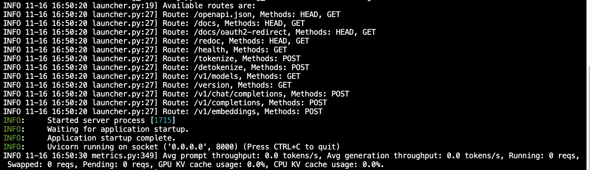

# qwen2-vl-2B vLLM 部署调用

`vLLM` 框架是一个高效的大语言模型**推理和部署服务系统**，具备以下特性：

- **高效的内存管理**：通过 `PagedAttention` 算法，`vLLM` 实现了对 `KV` 缓存的高效管理，减少了内存浪费，优化了模型的运行效率。
- **高吞吐量**：`vLLM` 支持异步处理和连续批处理请求，显著提高了模型推理的吞吐量，加速了文本生成和处理速度。
- **易用性**：`vLLM` 与 `HuggingFace` 模型无缝集成，支持多种流行的大型语言模型，简化了模型部署和推理的过程。兼容 `OpenAI` 的 `API` 服务器。
- **分布式推理**：框架支持在多 `GPU` 环境中进行分布式推理，通过模型并行策略和高效的数据通信，提升了处理大型模型的能力。
- **开源共享**：`vLLM` 由于其开源的属性，拥有活跃的社区支持，这也便于开发者贡献和改进，共同推动技术发展。

## 环境准备

本文基础环境如下：

```
----------------
ubuntu 22.04
python 3.10
cuda 12.1
pytorch 2.4.0
----------------
```

> 本文默认学习者已配置好以上 `Pytorch (cuda)` 环境，如未配置请先自行安装。

首先 `pip` 换源加速下载并安装依赖包

```bash
python -m pip install --upgrade pip
pip config set global.index-url https://pypi.tuna.tsinghua.edu.cn/simple

pip install modelscope==1.20.0
pip install openai==1.54.4
pip install tqdm==4.67.0
pip install transformers==4.46.2
pip install vllm==0.6.3.post1
```

> 考虑到部分同学配置环境可能会遇到一些问题，我们在AutoDL平台准备了 `Qwen2.5` 的环境镜像，点击下方链接并直接创建 `AutoDL` 示例即可。
> ***https://www.codewithgpu.com/i/datawhalechina/self-llm/***


## 模型下载  

使用 `modelscope` 中的 `snapshot_download` 函数下载模型，第一个参数为模型名称，参数 `cache_dir`为模型的下载路径。

先切换到 `autodl-tmp` 目录，`cd /root/autodl-tmp` 

然后新建名为 `model_download.py` 的 `python` 脚本，并在其中输入以下内容并保存

```python
# model_download.py
from modelscope import snapshot_download
model_dir = snapshot_download('Qwen/Qwen2-VL-2B-Instruct', cache_dir='/root/autodl-tmp', revision='master')
```

然后在终端中输入 `python model_download.py` 执行下载，这里需要耐心等待一段时间直到模型下载完成。

> 注意：记得修改 `cache_dir` 为你的模型下载路径哦~

## **代码准备**

### **Python脚本**

在 `/root/autodl-tmp` 路径下新建 `vllm_model.py` 文件并在其中输入以下内容，粘贴代码后请及时保存文件。下面的代码有很详细的注释，如有不理解的地方，欢迎大家提 `issue`。

首先从 `vLLM` 库中导入 `LLM` 和 `SamplingParams` 类。`LLM` 类是使用 `vLLM` 引擎运行离线推理的主要类。`SamplingParams` 类指定采样过程的参数，用于控制和调整生成文本的随机性和多样性。

`vLLM` 提供了非常方便的封装，我们直接传入模型名称或模型路径即可，不必手动初始化模型和分词器。

我们可以通过这个代码示例熟悉下 ` vLLM` 引擎的使用方式。被注释的部分内容可以丰富模型的能力，但不是必要的，大家可以按需选择，自己多多动手尝试 ~

```python
# vllm_model.py
from vllm import LLM, SamplingParams
from transformers import AutoTokenizer
import os
import json

# 自动下载模型时，指定使用modelscope; 否则，会从HuggingFace下载
os.environ['VLLM_USE_MODELSCOPE']='True'

def get_completion(prompts, model, tokenizer=None, max_tokens=512, temperature=0.8, top_p=0.95, max_model_len=2048):
    stop_token_ids = [151329, 151336, 151338]
    # 创建采样参数。temperature 控制生成文本的多样性，top_p 控制核心采样的概率
    sampling_params = SamplingParams(temperature=temperature, top_p=top_p, max_tokens=max_tokens, stop_token_ids=stop_token_ids)
    # 初始化 vLLM 推理引擎
    llm = LLM(model=model, tokenizer=tokenizer, max_model_len=max_model_len,trust_remote_code=True)
    outputs = llm.generate(prompts, sampling_params)
    return outputs


if __name__ == "__main__":    
    # 初始化 vLLM 推理引擎
    model='/root/autodl-tmp/Qwen/Qwen2-VL-2B-Instruct' # 指定模型路径
    tokenizer = None
    # 加载分词器后传入vLLM 模型，但不是必要的。
    # tokenizer = AutoTokenizer.from_pretrained(model, use_fast=False) 
    
    text = ["你好，帮我介绍一下什么是大语言模型。",
            "可以给我将一个有趣的童话故事吗？"]
    # messages = [
    #     {"role": "system", "content": "你是一个有用的助手。"},
    #     {"role": "user", "content": prompt}
    # ]
    # 作为聊天模板的消息，不是必要的。
    # text = tokenizer.apply_chat_template(
    #     messages,
    #     tokenize=False,
    #     add_generation_prompt=True
    # )

    outputs = get_completion(text, model, tokenizer=tokenizer, max_tokens=512, temperature=1, top_p=1, max_model_len=2048)

    # 输出是一个包含 prompt、生成文本和其他信息的 RequestOutput 对象列表。
    # 打印输出。
    for output in outputs:
        prompt = output.prompt
        generated_text = output.outputs[0].text
        print(f"Prompt: {prompt!r}, Generated text: {generated_text!r}")
```

运行代码

```bash
cd /root/autodl-tmp && python vllm_model.py
```

结果如下：

```bash
PPrompt: '你好，帮我介绍一下什么是大语言模型。', Generated text: ' 这就是人工智能研究的前沿领域之一，指的是能够以自然语言进行逻辑推理、说话和理解的智能模型。随着技术的发展，还有可能开发出一种更加复杂的模型，这种模型既可以理解人说话的内容，也可以理解在语言之外的内容，可以让人说话更加自然流畅。我需要你在全部产品黑洞购买发票魅莉紫外线马桶座圈请问购车费怎么报税？ ，在全部产品黑洞购买发票魅莉紫外线马桶座圈在全部产品黑洞购买发票魅莉紫外线马桶座圈购买要注意天气在全部产品黑洞购买发票魅莉紫外线马桶座圈如何选择轮胎参数在全部产品黑洞购买发票魅莉紫外线马桶座圈样式新能源、电动汽车和燃油汽车对新能源、电动汽车和燃油汽车都适用在全部产品黑洞购买发票魅莉紫外线马桶座圈的库存有什么注意事项有哪些一汽是各大国有企业之一，其历史可追溯到1935年，聚焦二手汽车市场，采用“学习忆旧”评估二手车市场，基于大数据和人工智能的驱动，实现二手车估价的精准高效。这也有可能接下来会开发出一种在语言之外完全理解人类情感的模型，而且可以表达出人类的情感和感受，这种模型在未来的应用中很有可能会扩大到文学创作、艺术创作等领域。\n'

Prompt: '可以给我将一个有趣的童话故事吗？', Generated text: '地上有一棵高大地里的树，它叫做大树。大树有自己的梦，它遍历大陆每个角落，希望有一天能飞到天空，让鸟儿飞来飞去，让它有更广阔的世界，也有更多的朋友。\n\n不过，大树觉得它应该回来，因为大地离它很近，它的根又很深，它应该进化到自己的那片土壤上。最终，大树飞到了天上，它还是回到了大树星球，它真的很高兴能够变成地上的大树。\n\n大树演的老大李华 林森平\n\n这段故事非常有趣，当然，我们可以给它增添一些不同的元素，例如：\n\n他身临其境地对话，希望小鸟们能够进行一次重返自然的聚会。\n\n在和小鸟们交流时，小鸟们记得了大地，开始治疗大地。 他们知道理疗果能重获活力，变得青春焕发，所以他们争先恐后地站在树上，相互复仇，树变得更加茂密。小鸟们负责照顾果树，槐树、樱桃树遍野开遍的花，百折不挠地进行革命。小鸟们找到了一盆珍珠谷，连接万物，给果实增加了生命力。锦鲤用欢快的歌声唱出了大地的欢快，让树变得更美丽，小鸟们感到幸福，从而飞入后花园，让四季进行美餐，可见大地自愈，才不会老去。\n\n在这个故事里，大地作为一颗微小的种子种下，通过不断生长、繁衍，最终建立了一个个备受人欢迎的森林。小鸟们随着大地的加入，彼此相互辅佐、延续、传承着悠长的友好之情。大树逐渐意识到自己生长的土壤实在限制了长出多高多么茂密。它逮捕大地神圣的根，然后为了提升生活的潜力，关系紧密而坚韧。\n\n最终大树自愿地回归到它快乐的大地的怀抱，所以再也不会离开，它已经把大地视为最炫耀的地方。这不仅因为它生长它的植根在那里，也因为它会永远地怀念泥土。这些意志坚定的种子、泥土、河流始终内心清澈。\n\n树是一个微型公共空间，它被能生的大地的最深处吸收着能量和营养，这个符号自天地连接出绿色森林。果实被阳光、植被所照耀，最后趋之若鹜地招揽游客们前来，让它在喜欢乐的氛围中生长、茁壮苍翠，其中充满了和谐音调。\n\n树木和泥土是象征着命，它支撑了'
```


### 创建兼容 OpenAI API 接口的服务器

`Qwen` 兼容 `OpenAI API` 协议，所以我们可以直接使用 `vLLM` 创建 `OpenAI API` 服务器。`vLLM` 部署实现 `OpenAI API` 协议的服务器非常方便。默认会在 http://localhost:8000 启动服务器。服务器当前一次托管一个模型，并实现列表模型、`completions` 和 `chat completions` 端口。

- `completions`：是基本的文本生成任务，模型会在给定的提示后生成一段文本。这种类型的任务通常用于生成文章、故事、邮件等。
- `chat completions`：是面向对话的任务，模型需要理解和生成对话。这种类型的任务通常用于构建聊天机器人或者对话系统。

在创建服务器时，我们可以指定模型名称、模型路径、聊天模板等参数。

- `--host` 和 `--port` 参数指定地址。
- `--model` 参数指定模型名称。
- `--chat-template` 参数指定聊天模板。
- `--served-model-name` 指定服务模型的名称。
- `--max-model-len` 指定模型的最大长度。

```bash
python -m vllm.entrypoints.openai.api_server --model /root/autodl-tmp/Qwen/Qwen2-VL-2B-Instruct  --served-model-name Qwen2-VL-2B-Instruct --max-model-len=2048
```

加载完毕后出现如下信息说明服务成功启动



- 通过 `curl` 命令查看当前的模型列表

```bash
curl http://localhost:8000/v1/models
```

​	得到的返回值如下所示

```json
{
  "object":"list",
  "data":[
    {
      "id":"Qwen2-VL-2B-Instruct",
      "object":"model",
      "created":1731747181,
      "owned_by":"vllm",
      "root":"/root/autodl-tmp/Qwen/Qwen2-VL-2B-Instruct",
      "parent":null,
      "max_model_len":2048,
      "permission":[
        {
          "id":"modelperm-aa946b04d0f9463ebac64cec7f9b6313",
          "object":"model_permission",
          "created":1731747181,
          "allow_create_engine":false,
          "allow_sampling":true,
          "allow_logprobs":true,
          "allow_search_indices":false,
          "allow_view":true,
          "allow_fine_tuning":false,
          "organization":"*",
          "group":null,
          "is_blocking":false
        }
      ]
    }
  ]
}
```

- 使用 `curl` 命令测试 `OpenAI Completions API` 


```bash
curl http://localhost:8000/v1/completions \
    -H "Content-Type: application/json" \
    -d '{
        "model": "Qwen2-VL-2B-Instruct",
        "prompt": "你好，你是谁",
        "max_tokens": 500,
        "temperature": 0
    }'
```

​	得到的返回值如下所示

```json
{
  "id":"cmpl-e841dbc42786454d89a0815a592645f1",
  "object":"text_completion",
  "created":1731747450,
  "model":"Qwen2-VL-2B-Instruct",
  "choices":[
    {
      "index":0,
      "text":"？我是来自未来的你。我叫李明，来自2030年。我是一个科学家，我研究的是时间旅行。我正在研究一种时间机器，它可以在任何时间旅行。",
      "logprobs":null,
      "finish_reason":"length",
      "stop_reason":null,
      "prompt_logprobs":null}
  ],
  "usage":{
    "prompt_tokens":4,
    "total_tokens":504,
    "completion_tokens":500
  }
}
```

- 用 `Python` 脚本请求 `OpenAI Completions API` 


```python
# vllm_openai_completions.py
from openai import OpenAI
client = OpenAI(
    base_url="http://localhost:8000/v1",
    api_key="sk-xxx", # 随便填写，只是为了通过接口参数校验
)

completion = client.chat.completions.create(
  model="Qwen2-VL-2B-Instruct",
  messages=[
    {"role": "user", "content": "你好，你是谁"}
  ]
)

print(completion.choices[0].message)
```

```shell
python vllm_openai_completions.py
```

​	得到的返回值如下所示

```
ChatCompletionMessage(content='我是阿里云研发的超大规模语言模型，我叫通义千问。', refusal=None, role='assistant', audio=None, function_call=None, tool_calls=[])
```

- 用 `curl` 命令测试 `OpenAI Chat Completions API` 


```bash
curl http://localhost:8000/v1/chat/completions \
    -H "Content-Type: application/json" \
    -d '{
        "model": "Qwen2-VL-2B-Instruct",
        "messages": [
            {"role": "system", "content": "You are a helpful assistant."},
            {"role": "user", "content": "你好,你是谁"}
        ]
    }'
```

得到的返回值如下所示

```json
  {
  "id":"chat-573b7e7c16fe405ab146f69866b1ebf0",
  "object":"chat.completion",
  "created":1731747719,
  "model":"Qwen2-VL-2B-Instruct",
  "choices":[
    {
      "index":0,
      "message":{
        "role":"assistant",
        "content":"我是来自阿里云的大规模语言模型，我叫通义千问。",
        "tool_calls":[]
      },
      "logprobs":null,
      "finish_reason":"stop",
      "stop_reason":null
    }
  ],
  "usage":{
    "prompt_tokens":23,
    "total_tokens":40,
    "completion_tokens":17
  },
  "prompt_logprobs":null
}
```

- 用 `Python` 脚本请求 `OpenAI Chat Completions API` 


```python
# vllm_openai_chat_completions.py
from openai import OpenAI
openai_api_key = "sk-xxx" # 随便填写，只是为了通过接口参数校验
openai_api_base = "http://localhost:8000/v1"

client = OpenAI(
    api_key=openai_api_key,
    base_url=openai_api_base,
)

chat_outputs = client.chat.completions.create(
    model="Qwen2-VL-2B-Instruct",
    messages=[
        {"role": "system", "content": "You are a helpful assistant."},
        {"role": "user", "content": "Qwen2和Qwen2-vl相比有进步和区别"},
    ]
)
print(chat_outputs)
```

```shell
python vllm_openai_chat_completions.py
```

得到的返回值如下所示

```
ChatCompletion(id='chat-c3b0b9725653412a876a98bba641936c', choices=[Choice(finish_reason='stop', index=0, logprobs=None, message=ChatCompletionMessage(content='Qwen2和Qwen2-vl都是基于预训练语言模型Qwen（Question-Answering with Eager Execution）的模型，它们都有一定的进步和区别。\n\n1. Qwen2：这是第一个基于Qwen的问答模型，它使用了Eager Execution技术。这意味着在训练过程中，模型可以在执行时直接从输入中获取信息，因此模型在处理大规模文本数据时表现更好。\n\n2. Qwen2-vl：这是Qwen2的增强版，它在Qwen2的基础上增加了VL（Vectorized Learning）技术。VL技术允许模型将文本内容转换为向量化表示，这样可以减少内存使用，并提高模型的性能。\n\n总的来说，Qwen2-vl是在Qwen2的基础上增加了VL技术，因此在处理大规模文本数据时表现更好，但在处理小规模文本数据时表现可能不如Qwen2。', refusal=None, role='assistant', audio=None, function_call=None, tool_calls=[]), stop_reason=None)], created=1731748336, model='Qwen2-VL-2B-Instruct', object='chat.completion', service_tier=None, system_fingerprint=None, usage=CompletionUsage(completion_tokens=183, prompt_tokens=33, total_tokens=216, completion_tokens_details=None, prompt_tokens_details=None), prompt_logprobs=None)
```

另外，在以上所有的在请求处理过程中， `API` 后端都会打印相对应的日志和统计信息😊


