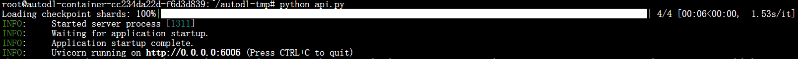
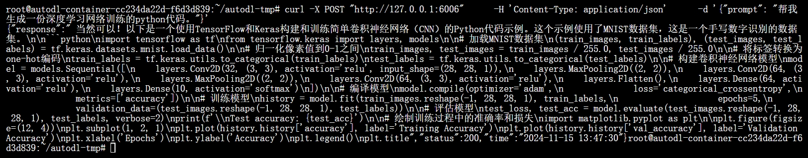
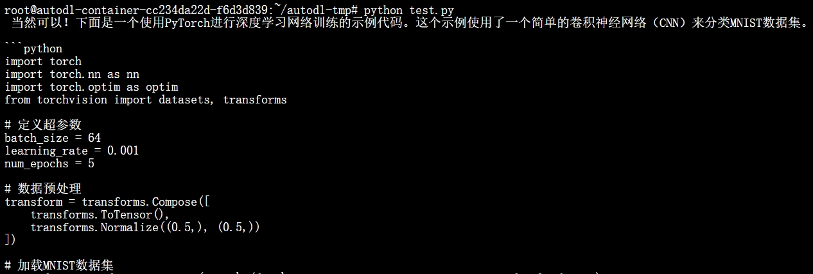

# Qwen2.5-7B-Instruct FastApi 部署调用

## 环境准备  

本文基础环境如下：

```
----------------
ubuntu 22.04
python 3.12
cuda 12.1
pytorch 2.3.0
----------------
```
> 本文默认学习者已安装好以上 Pytorch(cuda) 环境，如未安装请自行安装。

首先 `pip` 换源加速下载并安装依赖包

```shell
# 升级pip
python -m pip install --upgrade pip
# 更换 pypi 源加速库的安装
pip config set global.index-url https://pypi.tuna.tsinghua.edu.cn/simple

pip install requests==2.31.0
pip install fastapi==0.115.1
pip install uvicorn==0.30.6
pip install transformers==4.46.2
pip install huggingface-hub==0.26.2
pip install accelerate==0.34.2
pip install modelscope==1.20.0
```

> 考虑到部分同学配置环境可能会遇到一些问题，我们在AutoDL平台准备了Qwen2.5的环境镜像，点击下方链接并直接创建Autodl示例即可。
> ***https://www.codewithgpu.com/i/datawhalechina/self-llm/qwen2.5-coder***


## 模型下载  

使用 `modelscope` 中的 `snapshot_download` 函数下载模型，第一个参数为模型名称，参数 `cache_dir` 为模型的下载路径。

新建 `model_download.py` 文件并在其中输入以下内容，粘贴代码后请及时保存文件，如下图所示。并运行 `python model_download.py` 执行下载，模型大小为 15GB，下载模型大概需要 5 分钟。

```python
import torch
from modelscope import snapshot_download, AutoModel, AutoTokenizer
import os
model_dir = snapshot_download('qwen/Qwen2.5-Coder-7B-Instruct', cache_dir='/root/autodl-tmp', revision='master')
```

> 注意：记得修改 `cache_dir` 为你的模型下载路径哦~

## 代码准备  

新建 `api.py` 文件并在其中输入以下内容，粘贴代码后请及时保存文件。以下代码有很详细的注释，大家如有不理解的地方，欢迎提出 issue 。  

```python
from fastapi import FastAPI, Request
from transformers import AutoTokenizer, AutoModelForCausalLM, GenerationConfig
import uvicorn
import json
import datetime
import torch

# 设置设备参数
DEVICE = "cuda"  # 使用CUDA
DEVICE_ID = "0"  # CUDA设备ID，如果未设置则为空
CUDA_DEVICE = f"{DEVICE}:{DEVICE_ID}" if DEVICE_ID else DEVICE  # 组合CUDA设备信息

# 清理GPU内存函数
def torch_gc():
    if torch.cuda.is_available():  # 检查是否可用CUDA
        with torch.cuda.device(CUDA_DEVICE):  # 指定CUDA设备
            torch.cuda.empty_cache()  # 清空CUDA缓存
            torch.cuda.ipc_collect()  # 收集CUDA内存碎片

# 创建FastAPI应用
app = FastAPI()

# 处理POST请求的端点
@app.post("/")
async def create_item(request: Request):
    global model, tokenizer  # 声明全局变量以便在函数内部使用模型和分词器
    json_post_raw = await request.json()  # 获取POST请求的JSON数据
    json_post = json.dumps(json_post_raw)  # 将JSON数据转换为字符串
    json_post_list = json.loads(json_post)  # 将字符串转换为Python对象
    prompt = json_post_list.get('prompt')  # 获取请求中的提示

    messages = [
            {"role": "system", "content": "You are a helpful assistant."},
            {"role": "user", "content": prompt}
    ]

    # 调用模型进行对话生成
    input_ids = tokenizer.apply_chat_template(messages,tokenize=False,add_generation_prompt=True)
    model_inputs = tokenizer([input_ids], return_tensors="pt").to('cuda')
    generated_ids = model.generate(model_inputs.input_ids,max_new_tokens=512)
    generated_ids = [
        output_ids[len(input_ids):] for input_ids, output_ids in zip(model_inputs.input_ids, generated_ids)
    ]
    response = tokenizer.batch_decode(generated_ids, skip_special_tokens=True)[0]
    now = datetime.datetime.now()  # 获取当前时间
    time = now.strftime("%Y-%m-%d %H:%M:%S")  # 格式化时间为字符串
    # 构建响应JSON
    answer = {
        "response": response,
        "status": 200,
        "time": time
    }
    # 构建日志信息
    log = "[" + time + "] " + '", prompt:"' + prompt + '", response:"' + repr(response) + '"'
    print(log)  # 打印日志
    torch_gc()  # 执行GPU内存清理
    return answer  # 返回响应

# 主函数入口
if __name__ == '__main__':
    # 加载预训练的分词器和模型
    model_name_or_path = '/root/autodl-tmp/qwen/Qwen2___5-Coder-7B-Instruct'
    tokenizer = AutoTokenizer.from_pretrained(model_name_or_path, use_fast=False)
    model = AutoModelForCausalLM.from_pretrained(model_name_or_path, device_map="auto", torch_dtype=torch.bfloat16)

    # 启动FastAPI应用
    # 用6006端口可以将autodl的端口映射到本地，从而在本地使用api
    uvicorn.run(app, host='0.0.0.0', port=6006, workers=1)  # 在指定端口和主机上启动应用
```

> 注意：记得修改 `model_name_or_path` 为你的模型下载路径哦~

## Api 部署  

在终端输入以下命令启动api服务：  

```shell  
cd /root/autodl-tmp
python api.py
# or
python /root/autodl-tmp/api.py
```

加载完毕后出现如下信息说明成功。



默认部署在 6006 端口，通过 POST 方法进行调用，可以使用 curl 调用，如下所示：  

```shell
curl -X POST "http://127.0.0.1:6006" \
     -H 'Content-Type: application/json' \
     -d '{"prompt": "帮我生成一份深度学习网络训练的python代码。"}'
```

得到的返回值如下所示：
```json
{"response":" 当然可以！以下是一个使用TensorFlow和Keras构建和训练简单卷积神经网络（CNN）的Python代码示例。这个示例使用了MNIST数据集，这是一个手写数字识别的数据集。\n\n```python\nimport tensorflow as tf\nfrom tensorflow.keras import layers, models\n\n# 加载MNIST数据集\n(train_images, train_labels), (test_images, test_labels) = tf.keras.datasets.mnist.load_data()\n\n# 归一化像素值到0-1之间\ntrain_images, test_images = train_images / 255.0, test_images / 255.0\n\n# 将标签转换为one-hot编码\ntrain_labels = tf.keras.utils.to_categorical(train_labels)\ntest_labels = tf.keras.utils.to_categorical(test_labels)\n\n# 构建卷积神经网络模型\nmodel = models.Sequential([\n    layers.Conv2D(32, (3, 3), activation='relu', input_shape=(28, 28, 1)),\n    layers.MaxPooling2D((2, 2)),\n    layers.Conv2D(64, (3, 3), activation='relu'),\n    layers.MaxPooling2D((2, 2)),\n    layers.Conv2D(64, (3, 3), activation='relu'),\n    layers.Flatten(),\n    layers.Dense(64, activation='relu'),\n    layers.Dense(10, activation='softmax')\n])\n\n# 编译模型\nmodel.compile(optimizer='adam',\n              loss='categorical_crossentropy',\n              metrics=['accuracy'])\n\n# 训练模型\nhistory = model.fit(train_images.reshape(-1, 28, 28, 1), train_labels,\n                    epochs=5,\n                    validation_data=(test_images.reshape(-1, 28, 28, 1), test_labels))\n\n# 评估模型\ntest_loss, test_acc = model.evaluate(test_images.reshape(-1, 28, 28, 1), test_labels, verbose=2)\nprint(f'\\nTest accuracy: {test_acc}')\n\n# 绘制训练过程中的准确率和损失\nimport matplotlib.pyplot as plt\n\nplt.figure(figsize=(12, 4))\nplt.subplot(1, 2, 1)\nplt.plot(history.history['accuracy'], label='Training Accuracy')\nplt.plot(history.history['val_accuracy'], label='Validation Accuracy')\nplt.xlabel('Epochs')\nplt.ylabel('Accuracy')\nplt.legend()\nplt.title","status":200,"time":"2024-11-15 13:47:30"}
```

对应的python代码：
```python
import tensorflow as tf
from tensorflow.keras import layers, models

# 加载MNIST数据集
(train_images, train_labels), (test_images, test_labels) = tf.keras.datasets.mnist.load_data()

# 归一化像素值到0-1之间
train_images, test_images = train_images / 255.0, test_images / 255.0

# 将标签转换为one-hot编码
train_labels = tf.keras.utils.to_categorical(train_labels)
test_labels = tf.keras.utils.to_categorical(test_labels)

# 构建卷积神经网络模型
model = models.Sequential([
    layers.Conv2D(32, (3, 3), activation='relu', input_shape=(28, 28, 1)),
    layers.MaxPooling2D((2, 2)),
    layers.Conv2D(64, (3, 3), activation='relu'),
    layers.MaxPooling2D((2, 2)),
    layers.Conv2D(64, (3, 3), activation='relu'),
    layers.Flatten(),
    layers.Dense(64, activation='relu'),
    layers.Dense(10, activation='softmax')
])

# 编译模型
model.compile(optimizer='adam',
              loss='categorical_crossentropy',
              metrics=['accuracy'])

# 训练模型
history = model.fit(train_images.reshape(-1, 28, 28, 1), train_labels,
                    epochs=5,
                    validation_data=(test_images.reshape(-1, 28, 28, 1), test_labels))

# 评估模型
test_loss, test_acc = model.evaluate(test_images.reshape(-1, 28, 28, 1), test_labels, verbose=2)
print(f'\nTest accuracy: {test_acc}')

# 绘制训练过程中的准确率和损失
import matplotlib.pyplot as plt

plt.figure(figsize=(12, 4))
plt.subplot(1, 2, 1)
plt.plot(history.history['accuracy'], label='Training Accuracy')
plt.plot(history.history['val_accuracy'], label='Validation Accuracy')
plt.xlabel('Epochs')
plt.ylabel('Accuracy')
plt.legend()
plt.title
```



也可以使用 python 中的 requests 库进行调用，如下所示：

```python
import requests
import json

def get_completion(prompt):
    headers = {'Content-Type': 'application/json'}
    data = {"prompt": prompt}
    response = requests.post(url='http://127.0.0.1:6006', headers=headers, data=json.dumps(data))
    return response.json()['response']

if __name__ == '__main__':
    print(get_completion('帮我生成一份深度学习网络训练的python代码(pytorch)。'))
```

得到的返回值如下所示：

当然可以！下面是一个使用PyTorch进行深度学习网络训练的示例代码。这个示例使用了一个简单的卷积神经网络（CNN）来分类MNIST数据集。

```python
import torch
import torch.nn as nn
import torch.optim as optim
from torchvision import datasets, transforms

# 定义超参数
batch_size = 64
learning_rate = 0.001
num_epochs = 5

# 数据预处理
transform = transforms.Compose([
    transforms.ToTensor(),
    transforms.Normalize((0.5,), (0.5,))
])

# 加载MNIST数据集
train_dataset = datasets.MNIST(root='./data', train=True, transform=transform, download=True)
test_dataset = datasets.MNIST(root='./data', train=False, transform=transform)

# 创建数据加载器
train_loader = torch.utils.data.DataLoader(dataset=train_dataset, batch_size=batch_size, shuffle=True)
test_loader = torch.utils.data.DataLoader(dataset=test_dataset, batch_size=batch_size, shuffle=False)

# 定义卷积神经网络模型
class CNN(nn.Module):
    def __init__(self):
        super(CNN, self).__init__()
        self.conv1 = nn.Conv2d(1, 32, kernel_size=3, stride=1, padding=1)
        self.relu = nn.ReLU()
        self.pool = nn.MaxPool2d(kernel_size=2, stride=2, padding=0)
        self.fc1 = nn.Linear(32 * 14 * 14, 128)
        self.fc2 = nn.Linear(128, 10)

    def forward(self, x):
        out = self.conv1(x)
        out = self.relu(out)
        out = self.pool(out)
        out = out.view(out.size(0), -1)
        out = self.fc1(out)
        out = self.relu(out)
        out = self.fc2(out)
        return out

model = CNN()

# 定义损失函数和优化器
criterion = nn.CrossEntropyLoss()
optimizer = optim.Adam(model.parameters(), lr=learning_rate)

# 训练模型
for epoch in range(num_epochs):
    model.train()
    for i, (images, labels) in enumerate(train_loader):
        # 前向传播
        outputs = model(images)
        loss = criterion(outputs, labels)

        # 反向传播和优化
```
这里代码不完全是因为设置了max_new_tokens=512。

