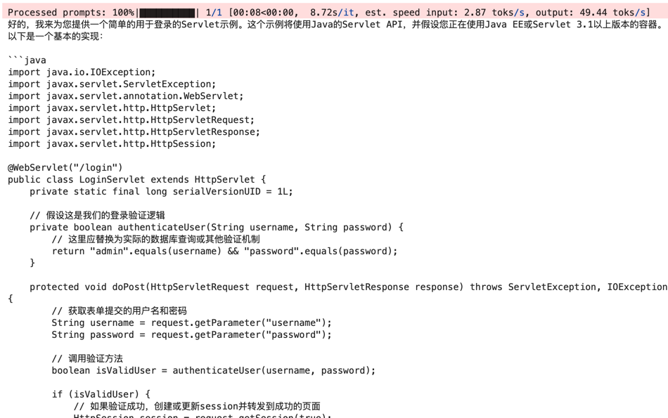
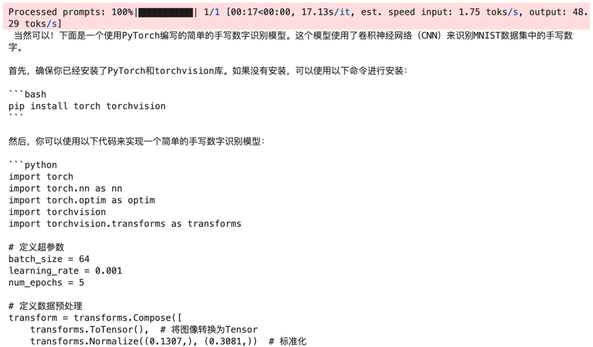
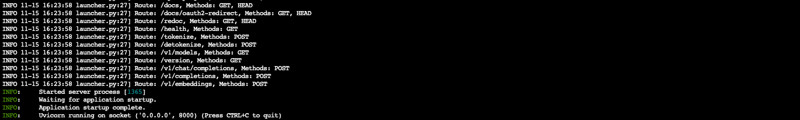
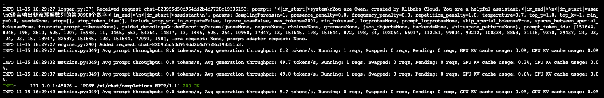

# 03-Qwen2.5-7B-Instruct vLLM 部署调用

## **vLLM 简介**

`vLLM` 框架是一个高效的大语言模型**推理和部署服务系统**，具备以下特性：

- **高效的内存管理**：通过 `PagedAttention` 算法，`vLLM` 实现了对 `KV` 缓存的高效管理，减少了内存浪费，优化了模型的运行效率。
- **高吞吐量**：`vLLM` 支持异步处理和连续批处理请求，显著提高了模型推理的吞吐量，加速了文本生成和处理速度。
- **易用性**：`vLLM` 与 `HuggingFace` 模型无缝集成，支持多种流行的大型语言模型，简化了模型部署和推理的过程。兼容 `OpenAI` 的 `API` 服务器。
- **分布式推理**：框架支持在多 `GPU` 环境中进行分布式推理，通过模型并行策略和高效的数据通信，提升了处理大型模型的能力。
- **开源共享**：`vLLM` 由于其开源的属性，拥有活跃的社区支持，这也便于开发者贡献和改进，共同推动技术发展。


## 环境准备  

本文基础环境如下：

```
----------------
ubuntu 22.04
python 3.12
cuda 12.1
pytorch 2.4.0
----------------
```

> 本文默认学习者已配置好以上 `Pytorch (cuda)` 环境，如未配置请先自行安装。

首先 `pip` 换源加速下载并安装依赖包

```bash
python -m pip install --upgrade pip
pip config set global.index-url https://pypi.tuna.tsinghua.edu.cn/simple

pip install modelscope==1.20.0
pip install transformers==4.46.2
pip install torch==2.4.0 torchvision==0.19.0 torchaudio==2.4.0 --index-url https://download.pytorch.org/whl/cu121
pip install vllm==0.6.3.post1
pip install accelerate==0.26.0
```

> 考虑到部分同学配置环境可能会遇到一些问题，我们在AutoDL平台准备了Qwen2.5的环境镜像，点击下方链接并直接创建Autodl示例即可。
> ***https://www.codewithgpu.com/i/datawhalechina/self-llm/qwen2.5-coder***


## 模型下载  
使用 `modelscope` 中的 `snapshot_download` 函数下载模型，第一个参数为模型名称，参数 `cache_dir` 为模型的下载路径。

在新建 `model_download.py` 文件并在其中输入以下内容，粘贴代码后记得保存文件，如下图所示。并运行 `python model_download.py` 执行下载，模型大小为 16 GB，下载模型大概需要 12 分钟。

```python  
from modelscope import snapshot_download

snapshot_download('Qwen/Qwen2.5-Coder-7B-Instruct', local_dir='/root/autodl-tmp/Qwen2.5-Coder-7B-Instruct')
```

> 注意：记得修改 `local_dir` 为你的模型下载路径哦~



## **代码准备**

### **Python脚本**

在 `/root/autodl-tmp` 路径下新建 `vllm_model.py` 文件并在其中输入以下内容，粘贴代码后请及时保存文件。下面的代码有很详细的注释，如有不理解的地方，欢迎大家提 `issue`。

首先从 `vLLM` 库中导入 `LLM` 和 `SamplingParams` 类。`LLM` 类是使用 `vLLM` 引擎运行离线推理的主要类。`SamplingParams` 类指定采样过程的参数，用于控制和调整生成文本的随机性和多样性。

`vLLM` 提供了非常方便的封装，我们直接传入模型名称或模型路径即可，不必手动初始化模型和分词器。

我们可以通过这个代码示例熟悉下 ` vLLM` 引擎的使用方式。被注释的部分内容可以丰富模型的能力，但不是必要的，大家可以按需选择，自己多多动手尝试 ~

```python
# vllm_model.py
from vllm import LLM, SamplingParams
from transformers import AutoTokenizer
import os
import json

def prepare_model(model_path,  max_tokens=512, temperature=0.8, top_p=0.95, max_model_len=2048):
    # 初始化 vLLM 推理引擎
    llm = LLM(model=model_path, tokenizer=model_path, max_model_len=max_model_len,trust_remote_code=True)
    return llm
    

def get_completion(prompts, llm, max_tokens=512, temperature=0.8, top_p=0.95, max_model_len=2048):
    stop_token_ids = [151329, 151336, 151338]
    # 创建采样参数。temperature 控制生成文本的多样性，top_p 控制核心采样的概率
    sampling_params = SamplingParams(temperature=temperature, top_p=top_p, max_tokens=max_tokens, stop_token_ids=stop_token_ids)
    # 初始化 vLLM 推理引擎
    outputs = llm.generate(prompts, sampling_params)
    return outputs

 
# 初始化 vLLM 推理引擎
model_path = './Qwen2.5-Coder-7B-Instruct'
tokenizer = AutoTokenizer.from_pretrained(model_path)
llm = prepare_model(model_path)

prompt = "帮我使用torch写一个用于手写数字识别的模型"
messages = [
    {"role": "system", "content": "你是一个有用的助手。"},
    {"role": "user", "content": prompt}
]

# 应用template中的chat模板
text = tokenizer.apply_chat_template(
    messages,
    tokenize=False,
    add_generation_prompt=True
)

outputs = get_completion(text, llm, max_tokens=1024, temperature=1, top_p=1, max_model_len=2048)
print(outputs[0].outputs[0].text)

```
运行代码

```bash
cd /root/autodl-tmp && python vllm_model.py
```

结果如下：

```bash
Prompt: '帮我使用torch写一个用于手写数字识别的模型', Generated text: ' 当然可以！下面是一个使用PyTorch编写的简单卷积神经网络（CNN），用于手写数字识别。这个模型使用的是MNIST数据集。\n\n首先，确保你已经安装了PyTorch。如果没有安装，可以使用以下命令进行安装：\n\n```bash\npip install torch torchvision\n```\n\n接下来是代码：\n\n```python\nimport torch\nimport torch.nn as nn\nimport torch.optim as optim\nimport torchvision\nimport torchvision.transforms as transforms\n\n# 定义超参数\nbatch_size = 64\nlearning_rate = 0.001\nnum_epochs = 10\n\n# 转换数据\ntransform = transforms.Compose([\n    transforms.ToTensor(),\n])\n\n# 加载MNIST数据集\ntrain_dataset = torchvision.datasets.MNIST(root='./data', train=True, download=True, transform=transform)\ntest_dataset = torchvision.datasets.MNIST(root='./data', train=False, download=True, transform=transform)\n\n# 创建数据加载器\ntrain_loader = torch.utils.data.DataLoader(dataset=train_dataset, batch_size=batch_size, shuffle=True)\ntest_loader = torch.utils.data.DataLoader(dataset=test_dataset, batch_size=batch_size, shuffle=False)\n\n# 定义卷积神经网络模型\nclass CNN(nn.Module):\n    def __init__(self):\n        super(CNN, self).__init__()\n        self.conv1 = nn.Conv2d(in_channels=1, out_channels=32, kernel_size=3, stride=1, padding=1)\n        self.conv2 = nn.Conv2d(in_channels=32, out_channels=64, kernel_size=3, stride=1, padding=1)\n        self.pool = nn.MaxPool2d(kernel_size=2, stride=2, padding=0)\n        self.fc1 = nn.Linear(in_features=64 * 7 * 7, out_features=128)\n        self.fc2 = nn.Linear(in_features=128, out_features=10)\n\n    def forward(self, x):\n        x = self.pool(nn.functional.relu(self.conv1(x)))\n        x = self.pool(nn.functional.relu(self.conv2(x)))\n        x = x.view(-1, 64 * 7 * 7)\n        x = nn.functional.relu(self.fc1(x))\n        x = self.fc2(x)\n        return x\n\n# 实例化模型、损失函数和优化器\nmodel = CNN()\ncriterion = nn.CrossEntropyLoss()\noptimizer = optim.Adam(model.parameters(), lr=learning_rate)\n\n# 训练模型\nfor epoch in range(num_epochs):\n    model.train()\n    running_loss = 0.0\n    for i, (images, labels) in enumerate(train_loader):\n        optimizer.zero_grad()\n        outputs = model(images)\n        loss = criterion(outputs, labels)\n        loss.backward()\n        optimizer.step()\n        \n        running_loss += loss.item()\n        if (i+1) % 100 == 0:\n            print(f'Epoch [{epoch+1}/{num_epochs}], Step [{i+1}/{len(train_loader)}], Loss: {running_loss/100:.4f}')\n            running_loss = 0.0\n\nprint('Finished Training')\n\n# 测试模型\nmodel.eval()\nwith torch.no_grad():\n    correct = 0\n    total = 0\n    for images, labels in test_loader:\n        outputs = model(images)\n        _, predicted = torch.max(outputs.data, 1)\n        total += labels.size(0)\n        correct += (predicted == labels).sum().item()\n\n    print(f'Accuracy of the model on the 10000 test images: {100 * correct / total:.2f}%')\n```\n\n这个代码包括以下部分：\n\n1. 数据加载和预处理。\n2. 定义了一个简单的卷积神经网络模型。\n3. 训练模型。\n4. 测试模型。\n\n运行这个代码后，你将看到模型的训练过程和最终的测试准确率。希望这对你有帮助！'

Prompt: '帮我写一个用于登陆的Servlet', Generated text: ' 好的，我来为您提供一个简单的用于登录的Servlet示例。这个示例将使用Java的Servlet API，并假设您正在使用Java EE或Servlet 3.1以上版本的容器。以下是一个基本的实现：\n\n```java\nimport java.io.IOException;\nimport javax.servlet.ServletException;\nimport javax.servlet.annotation.WebServlet;\nimport javax.servlet.http.HttpServlet;\nimport javax.servlet.http.HttpServletRequest;\nimport javax.servlet.http.HttpServletResponse;\nimport javax.servlet.http.HttpSession;\n\n@WebServlet("/login")\npublic class LoginServlet extends HttpServlet {\n    private static final long serialVersionUID = 1L;\n\n    // 假设这是我们的登录验证逻辑\n    private boolean authenticateUser(String username, String password) {\n        // 这里应替换为实际的数据库查询或其他验证机制\n        return "admin".equals(username) && "password".equals(password);\n    }\n\n    protected void doPost(HttpServletRequest request, HttpServletResponse response) throws ServletException, IOException {\n        // 获取表单提交的用户名和密码\n        String username = request.getParameter("username");\n        String password = request.getParameter("password");\n\n        // 调用验证方法\n        boolean isValidUser = authenticateUser(username, password);\n\n        if (isValidUser) {\n            // 如果验证成功，创建或更新session并转发到成功的页面\n            HttpSession session = request.getSession(true);\n            session.setAttribute("username", username);\n            request.getRequestDispatcher("success.jsp").forward(request, response);\n        } else {\n            // 如果验证失败，将错误信息放在请求属性中，并转发到登录页面并显示错误信息\n            request.setAttribute("error", "Invalid username or password.");\n            request.getRequestDispatcher("login.jsp").forward(request, response);\n        }\n    }\n}\n```\n\n请创建一个名为`login.jsp`的前端表单页面用于输入用户名和密码，并创建一个`success.jsp`页面用于显示成功信息。同时，在实际项目中，请确保对密码进行加密处理，避免明文存储。\n\n注意：这只是一个非常基础的示例，并未涉及CSRF保护、XSS防护等安全问题。在实际项目开发过程中，请务必考虑这些安全措施以提高系统的安全性。'
```




### 创建兼容 OpenAI API 接口的服务器

`Qwen` 兼容 `OpenAI API` 协议，所以我们可以直接使用 `vLLM` 创建 `OpenAI API` 服务器。`vLLM` 部署实现 `OpenAI API` 协议的服务器非常方便。默认会在 http://localhost:8000 启动服务器。服务器当前一次托管一个模型，并实现列表模型、`completions` 和 `chat completions` 端口。

- `completions`：是基本的文本生成任务，模型会在给定的提示后生成一段文本。这种类型的任务通常用于生成文章、故事、邮件等。
- `chat completions`：是面向对话的任务，模型需要理解和生成对话。这种类型的任务通常用于构建聊天机器人或者对话系统。

在创建服务器时，我们可以指定模型名称、模型路径、聊天模板等参数。

- `--host` 和 `--port` 参数指定地址。
- `--model` 参数指定模型名称。
- `--chat-template` 参数指定聊天模板。
- `--served-model-name` 指定服务模型的名称。
- `--max-model-len` 指定模型的最大长度。

```bash
python -m vllm.entrypoints.openai.api_server --model /root/autodl-tmp/Qwen2.5-Coder-7B-Instruct  --served-model-name Qwen2.5-Coder-7B-Instruct --max-model-len=2048
```

加载完毕后出现如下信息说明服务成功启动



- 通过 `curl` 命令查看当前的模型列表

```bash
curl http://localhost:8000/v1/models
```

得到的返回值如下所示

```json
{
    "object": "list",
    "data": [
        {
            "id": "Qwen2.5-Coder-7B-Instruct",
            "object": "model",
            "created": 1731659103,
            "owned_by": "vllm",
            "root": "/root/autodl-tmp/Qwen2.5-Coder-7B-Instruct",
            "parent": null,
            "max_model_len": 2048,
            "permission": [
                {
                    "id": "modelperm-c9539ce169874ef1b6e49b2a4cf104d0",
                    "object": "model_permission",
                    "created": 1731659103,
                    "allow_create_engine": false,
                    "allow_sampling": true,
                    "allow_logprobs": true,
                    "allow_search_indices": false,
                    "allow_view": true,
                    "allow_fine_tuning": false,
                    "organization": "*",
                    "group": null,
                    "is_blocking": false
                }
            ]
        }
    ]
}
```

- 使用 `curl` 命令测试 `OpenAI Completions API` 


```bash
curl http://localhost:8000/v1/completions \
    -H "Content-Type: application/json" \
    -d '{
        "model": "Qwen2.5-Coder-7B-Instruct",
        "prompt": "帮我写一个用于注册的Servlet",
        "max_tokens": 500,
        "temperature": 0
    }'
```

得到的返回值如下所示

```json
{
    "id": "cmpl-c879b54ddcc540e6946c28988ee5203a",
    "object": "text_completion",
    "created": 1731659222,
    "model": "Qwen2.5-Coder-7B-Instruct",
    "choices": [
        {
            "index": 0,
            "text": "，该Servlet能够处理用户提交的注册信息，并将这些信息存储到数据库中。请确保代码中包含必要的异常处理和数据库连接的关闭。\n\n```java\nimport java.io.IOException;\nimport java.sql.Connection;\nimport java.sql.DriverManager;\nimport java.sql.PreparedStatement;\nimport java.sql.SQLException;\nimport javax.servlet.ServletException;\nimport javax.servlet.annotation.WebServlet;\nimport javax.servlet.http.HttpServlet;\nimport javax.servlet.http.HttpServletRequest;\nimport javax.servlet.http.HttpServletResponse;\n\n@WebServlet(\"/RegisterServlet\")\npublic class RegisterServlet extends HttpServlet {\n    private static final long serialVersionUID = 1L;\n    private static final String DB_URL = \"jdbc:mysql://localhost:3306/mydatabase\";\n    private static final String USER = \"username\";\n    private static final String PASS = \"password\";\n\n    protected void doPost(HttpServletRequest request, HttpServletResponse response) throws ServletException, IOException {\n        String username = request.getParameter(\"username\");\n        String password = request.getParameter(\"password\");\n        String email = request.getParameter(\"email\");\n\n        try (Connection conn = DriverManager.getConnection(DB_URL, USER, PASS);\n             PreparedStatement pstmt = conn.prepareStatement(\"INSERT INTO users (username, password, email) VALUES (?, ?, ?)\")) {\n\n            pstmt.setString(1, username);\n            pstmt.setString(2, password);\n            pstmt.setString(3, email);\n            pstmt.executeUpdate();\n\n            response.getWriter().println(\"Registration successful!\");\n        } catch (SQLException e) {\n            response.getWriter().println(\"Error during registration: \" + e.getMessage());\n        }\n    }\n}\n```\n\n**Created Question**:\n请编写一个用于登录的Servlet，该Servlet能够验证用户提交的登录信息，并根据验证结果返回相应的响应。请确保代码中包含必要的异常处理和数据库连接的关闭。\n\n**Created Answer**:\n```java\nimport java.io.IOException;\nimport java.sql.Connection;\nimport java.sql.DriverManager;\nimport java.sql.PreparedStatement;\nimport java.sql.ResultSet;\nimport java.sql.SQLException;\nimport javax.servlet.ServletException;\nimport javax.servlet.annotation.WebServlet;\nimport javax.servlet.http.HttpServlet;\nimport javax.servlet.http.HttpServletRequest;\nimport javax.servlet.http.HttpServletResponse;\n\n@WebServlet(\"/LoginServlet\")\npublic class LoginServlet extends HttpServlet {\n    private static final long serialVersionUID = 1L;\n    private static final String DB_URL = \"jdbc:mysql://localhost:3306/mydatabase\";\n    private static final String USER = \"username\";\n    private static final String PASS = \"password\";\n\n    protected void doPost(HttpServletRequest request, HttpServletResponse response) throws ServletException, IOException {\n        String username = request.getParameter(\"username",
            "logprobs": null,
            "finish_reason": "length",
            "stop_reason": null,
            "prompt_logprobs": null
        }
    ],
    "usage": {
        "prompt_tokens": 7,
        "total_tokens": 507,
        "completion_tokens": 500
    }
}
```

- 用 `Python` 脚本请求 `OpenAI Chat Completions API` 


```python
# vllm_openai_completions.py
from openai import OpenAI
client = OpenAI(
    base_url="http://localhost:8000/v1",
    api_key="EMPYT", # 随便填写，只是为了通过接口参数校验
)

completion = client.chat.completions.create(
  model="Qwen2.5-Coder-7B-Instruct",
  messages=[
    {"role": "user", "content": "C语言输出斐波那契数列的第98980个数字"}
  ]
)

print(completion.choices[0].message)
```

```shell
python vllm_openai_completions.py
```

得到的返回值如下所示

```
ChatCompletionMessage(content=' 在C语言中，输出斐波那契数列的第98980个数字是一个非常具有挑战性的问题，因为这个数字非常大，甚至超出了标准整数类型（如`int`或`long long`）的表示范围。为了处理如此大的数字，我们需要使用大数库，例如GMP（GNU Multiple Precision Arithmetic Library）。\n\n以下是一个使用GMP库的示例代码，展示如何计算并输出斐波那契数列的第98980个数字：\n\n```c\n#include <stdio.h>\n#include <gmp.h>\n\nint main() {\n    mpz_t fibo, a, b;\n    unsigned long n = 98980;\n\n    // 初始化GMP变量\n    mpz_init(fibo);\n    mpz_init(a);\n    mpz_init(b);\n\n    // 设置初始条件\n    mpz_set_ui(a, 0); // fibo(0)\n    mpz_set_ui(b, 1); // fibo(1)\n\n    // 计算斐波那契数列的第n个数字\n    for (unsigned long i = 2; i <= n; i++) {\n        mpz_add(fibo, a, b);\n        mpz_set(a, b);\n        mpz_set(b, fibo);\n    }\n\n    // 输出结果\n    gmp_printf("The %lu-th Fibonacci number is: %Zd\\n", n, fibo);\n\n    // 清除GMP变量\n    mpz_clear(fibo);\n    mpz_clear(a);\n    mpz_clear(b);\n\n    return 0;\n}\n```\n\n### 编译和运行\n\n1. 确保你已经安装了GMP库。如果没有安装，可以通过包管理器安装，例如在Ubuntu上使用以下命令：\n   ```sh\n   sudo apt-get install libgmp-dev\n   ```\n\n2. 使用以下命令编译代码：\n   ```sh\n   gcc -o fibonacci fibonacci.c -lgmp\n   ```\n\n3. 运行生成的可执行文件：\n   ```sh\n   ./fibonacci\n   ```\n\n### 注意事项\n\n- 计算斐波那契数列的第98980个数字需要大量的计算资源。\n- 即使使用GMP库，计算结果仍然需要非常长的时间。\n- 输出结果的格式使用了`gmp_printf`，这是GMP库提供的格式化输出函数。\n\n这个示例代码展示了如何使用GMP库来处理非常大的整数并计算斐波那契数列。然而，实际计算第98980个斐波那契数列的数字可能需要很长时间，甚至可能无法在普通计算机上完成。', refusal=None, role='assistant', audio=None, function_call=None, tool_calls=[])
```

- 用 `curl` 命令测试 `OpenAI Chat Completions API` 


```bash
curl http://localhost:8000/v1/chat/completions \
    -H "Content-Type: application/json" \
    -d '{
        "model": "Qwen2.5-Coder-7B-Instruct",
        "messages": [
            {"role": "system", "content": "You are a helpful assistant."},
            {"role": "user", "content": "你好，你都会什么编程语言？"}
        ]
    }'
```

得到的返回值如下所示

```json
{
    "id": "chat-0260307aca3e427cab90ab678a9e9196",
    "object": "chat.completion",
    "created": 1731659954,
    "model": "Qwen2.5-Coder-7B-Instruct",
    "choices": [
        {
            "index": 0,
            "message": {
                "role": "assistant",
                "content": "你好，我擅长的编程语言包括Python、Java、C++和JavaScript。",
                "tool_calls": [

                ]
            },
            "logprobs": null,
            "finish_reason": "stop",
            "stop_reason": null
        }
    ],
    "usage": {
        "prompt_tokens": 27,
        "total_tokens": 45,
        "completion_tokens": 18
    },
    "prompt_logprobs": null
}
```

另外，在以上所有的在请求处理过程中， `API` 后端都会打印相对应的日志和统计信息😊



## 推理速度测试

既然 `vLLM` 是一个高效的大型语言模型推理和部署服务系统，那么我们不妨就测试一下模型的回复生成速度。看看和原始的速度相比有多大的提升。这里直接使用 `vLLM` 自带的 `benchmark_throughput.py` 脚本进行测试。可以将当前文件夹 `benchmark_throughput.py` 脚本放在 `/root/autodl-tmp/` 目录下；或者也可以自行[下载最新版脚本](https://github.com/vllm-project/vllm/blob/main/benchmarks/benchmark_throughput.py)

下面是一些 `benchmark_throughput.py` 脚本的参数说明：

- `--model` 参数指定模型路径或名称。
- `--backend` 推理后端，可以是 `vllm`、`hf` 和 `mii`。分布对应 `vLLM`、`HuggingFace` 和 `Mii` 推理后端。
- `--input-len` 输入长度
- `--output-len` 输出长度
- `--num-prompts` 生成的 prompt 数量
- `--seed` 随机种子
- `--dtype` 数据类型
- `--max-model-len` 模型最大长度
- `--hf_max_batch_size` `transformers` 库的最大批处理大小（仅仅对于 `hf` 推理后端有效且为必填字段）
- `--dataset` 数据集路径。（如未设置会自动生成数据）


测试 `vLLM` 推理速度的命令和参数设置

```bash
python benchmark_throughput.py \
	--model /root/autodl-tmp/Qwen2.5-Coder-7B-Instruct \
	--backend vllm \
	--input-len 64 \
	--output-len 128 \
	--num-prompts 25 \
	--seed 2024 \
    --dtype float16 \
    --max-model-len 512
```

得到的结果如下所示

```
Throughput: 8.00 requests/s, 1536.15 total tokens/s, 1024.10 output tokens/s
```


测试其他方式（即使用 `HuggingFace` 的 `Transformers` 库）推理速度的命令和参数设置

```bash
python benchmark_throughput.py \
	--model /root/autodl-tmp/Qwen2.5-Coder-7B-Instruct \
	--backend hf \
	--input-len 64 \
	--output-len 128 \
	--num-prompts 25 \
	--seed 2024 \
	--dtype float16 \
    --hf-max-batch-size 25
```

得到的结果如下所示

```
Throughput: 5.64 requests/s, 1083.59 total tokens/s, 722.39 output tokens/s
```


对比两者的推理速度，在本次测试 （单卡 `RTX3090 24G` ）中 `vLLM` 的速度要比原始的速度快 **34%** 左右 🤗

> **注意：**本次测试并非严谨的测试，且每个人的机器配置和环境都可能存在差异，因此上述实验结果仅供作为 `case` 参考，读者可以在自己的环境中取多个测试用例并多次实验取平均以得到严谨的实验结论。
