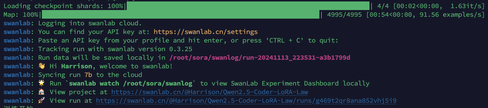
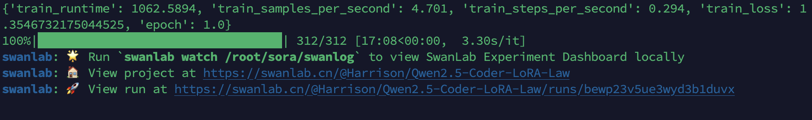
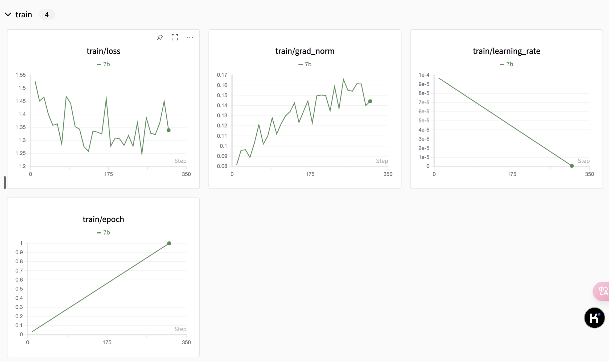

# Qwen2.5-Coder-7B-Instruct Lora 微调  SwanLab 可视化记录版

本节我们简要介绍如何基于 transformers、peft 等框架，对Qwen2.5-Coder-7B-Instruct 模型进行Lora微调。使用的数据集是**中文法律问答数据集 DISC-Law-SFT**，同时使用 [SwanLab](https://github.com/swanhubx/swanlab) 监控训练过程与评估模型效果。

Lora 是一种高效微调方法，深入了解其原理可参见博客：[知乎|深入浅出 Lora](https://zhuanlan.zhihu.com/p/650197598)。

训练过程：<a href="https://swanlab.cn/@Harrison/Qwen2.5-Coder-LoRA-Law/overview" target="_blank">Qwen2.5-Coder-LoRA-Law</a>


同时，这个教程会在同目录下给大家提供一个 [notebook](./05-Qwen2.5-Coder-7B-Instruct%20Lora%20微调%20SwanLab%20可视化记录版.ipynb)文件，方便大家快速上手。

## 目录

- [SwanLab简介](#swanlab简介)
- [环境配置](#环境配置)
- [准备数据集](#准备数据集)
- [模型下载与加载](#模型下载与加载)
- [集成SwanLab](#集成-swanlab)
- [开始微调（完整代码）](#开始微调)
- [训练结果展示](#训练结果展示)

## SwanLab简介


[SwanLab](https://github.com/swanhubx/swanlab) 是一个开源的模型训练记录工具，面向AI研究者，提供了训练可视化、自动日志记录、超参数记录、实验对比、多人协同等功能。在SwanLab上，研究者能基于直观的可视化图表发现训练问题，对比多个实验找到研究灵感，并通过在线链接的分享与基于组织的多人协同训练，打破团队沟通的壁垒。

**为什么要记录训练**

相较于软件开发，模型训练更像一个实验科学。一个品质优秀的模型背后，往往是成千上万次实验。研究者需要不断尝试、记录、对比，积累经验，才能找到最佳的模型结构、超参数与数据配比。在这之中，如何高效进行记录与对比，对于研究效率的提升至关重要。

## 环境配置

本文的基础环境如下：

```
----------------
ubuntu 22.04
python 3.12
cuda 12.1
pytorch 2.3.0
----------------
```

> **注意**：本文默认学习者已安装好以上环境

然后我们开始环境配置

```bash
python -m pip install --upgrade pip
# 更换 pypi 源加速库的安装
pip config set global.index-url https://pypi.tuna.tsinghua.edu.cn/simple

pip install modelscope==1.20.0
pip install transformers==4.46.2
pip install accelerate==1.1.1
pip install peft==0.13.2
pip install datasets==3.1.0
pip install swanlab==0.3.25
```

## 准备数据集
本节使用的是 [DISC-Law-SFT](https://huggingface.co/datasets/ShengbinYue/DISC-Law-SFT) 数据集，该数据集主要用于中文法律大语言模型的微调。

> HF README：在中国，法律智能系统需要结合各种能力，包括法律文本理解和生成。为了实现这一目标，我们构建了一个高质量的监督微调数据集，名为DISC-Law-SFT，涵盖了不同的法律场景，如法律信息提取、法律判决预测、法律文件摘要和法律问题回答。DISC-Law-SFT包括两个子集，DISC-Law-SFT-Pair和DISC-Law-SFT-Triplet。前者旨在向LLM引入法律推理能力，而后者有助于增强模型利用外部法律知识的能力。


在本节的任务中，我们主要使用其中的 [DISC-Law-SFT-Pair-QA-released](https://huggingface.co/datasets/ShengbinYue/DISC-Law-SFT/blob/main/DISC-Law-SFT-Pair-QA-released.jsonl) 子集，并对它进行格式调整，组合成如下格式的json文件：

```json
{
  "instruction": "你是一个法律专家，请根据用户的问题给出专业的回答",
  "input": "诈骗罪量刑标准是什么?",
  "output": "诈骗罪指的是以非法占有为目的，使用欺骗方法，骗取数额较大的公私财物的行为..."
}
```

其中，`instruction` 是用户指令，告知模型其需要完成的任务；`input` 是用户输入，即模拟真实场景下用户的问题；`output` 是模型应该给出的输出，即模型的回答。

**数据集下载与处理方式**
1. 在HuggingFace上直接下载[DISC-Law-SFT-Pair-QA-released.jsonl](https://huggingface.co/datasets/ShengbinYue/DISC-Law-SFT/blob/main/DISC-Law-SFT-Pair-QA-released.jsonl)，放到项目根目录下
2. 在同一目录下，用以下代码处理数据集，得到新数据集文件：
```python
import json

# 定义固定的instruction
INSTRUCTION = "你是一个法律专家，请根据用户的问题给出专业的回答"

def process_jsonl(input_file, output_file):
    with open(input_file, 'r', encoding='utf-8') as infile, open(output_file, 'w', encoding='utf-8') as outfile:
        for line in infile:
            # 读取每一行并解析JSON
            data = json.loads(line)
            
            # 创建新的字典，包含instruction, input和output
            new_data = {
                "instruction": INSTRUCTION,
                "input": data["input"],
                "output": data["output"]
            }
            
            # 将新的字典写入输出文件
            json.dump(new_data, outfile, ensure_ascii=False)
            outfile.write('\n')

# 使用示例
input_file = "DISC-Law-SFT-Pair-QA-released.jsonl"
output_file = "DISC-Law-SFT-Pair-QA-released-new.jsonl"

process_jsonl(input_file, output_file)
print(f"处理完成。输出文件：{output_file}")
```
至此，我们完成了数据集的准备


## 模型下载与加载
这里我们使用`modelscope`中的`snapshot_download`下载模型，然后加载到 Transformers 中进行训练：

```python
from modelscope import snapshot_download, AutoTokenizer
from transformers import AutoModelForCausalLM, TrainingArguments, Trainer, DataCollatorForSeq2Seq
import torch

# 在modelscope上下载Qwen模型到本地目录下
model_dir = snapshot_download("Qwen/Qwen2.5-Coder-7B-Instruct", cache_dir="/root/autodl-tmp", revision="master")

# Transformers加载模型权重
tokenizer = AutoTokenizer.from_pretrained("/root/autodl-tmp/Qwen/Qwen2___5-Coder-7B-Instruct/", use_fast=False, trust_remote_code=True)
model = AutoModelForCausalLM.from_pretrained("/root/autodl-tmp/Qwen/Qwen2___5-Coder-7B-Instruct/", device_map="auto", torch_dtype=torch.bfloat16)
model.enable_input_require_grads()  # 开启梯度检查点时，要执行该方法
```

模型大小为 15GB，下载模型我大概花了 15 分钟。


## 集成 SwanLab
SwanLab与Transformers已经做好了集成，用法是在Trainer的`callbacks`参数中添加`SwanLabCallback`实例，就可以自动记录超参数和训练指标，简化代码如下：

```python
from swanlab.integration.transformers import SwanLabCallback
from transformers import Trainer

swanlab_callback = SwanLabCallback()

trainer = Trainer(
    ...
    callbacks=[swanlab_callback],
)

```
首次使用SwanLab，需要先在[官网](https://swanlab.cn)注册一个账号，然后在用户设置页面复制你的API Key，然后在训练开始提示登录时粘贴即可，后续无需再次登录：


更多用法可参考[快速开始](https://docs.swanlab.cn/zh/guide_cloud/general/quick-start.html)、[Transformers集成](https://docs.swanlab.cn/zh/guide_cloud/integration/integration-huggingface-transformers.html)。

## 开始微调

查看可视化训练过程：<a href="https://swanlab.cn/@Harrison/Qwen2.5-Coder-LoRA-Law/overview" target="_blank">Qwen2.5-Coder-LoRA-Law</a>

**本节代码做了以下几件事：**
1. 下载并加载Qwen2.5-7B-Coder-Instruct模型
2. 加载数据集，取前5000条数据参与训练，5条数据进行主观评测
3. 配置Lora，参数为r=64, lora_alpha=16, lora_dropout=0.1
4. 使用SwanLab记录训练过程，包括超参数、指标和每个epoch的模型输出结果
5. 训练1个epoch

**完整代码如下**

```python
import json
import pandas as pd
import torch
from datasets import Dataset
from modelscope import snapshot_download, AutoTokenizer
from swanlab.integration.transformers import SwanLabCallback
from peft import LoraConfig, TaskType, get_peft_model
from transformers import (
    AutoModelForCausalLM,
    TrainingArguments,
    Trainer,
    DataCollatorForSeq2Seq,
)
import swanlab
        
        
def process_func(example):
    """
    将数据集进行预处理
    """
    MAX_LENGTH = 384
    input_ids, attention_mask, labels = [], [], []
    instruction = tokenizer(
        f"<|im_start|>system\n{example['instruction']}<|im_end|>\n<|im_start|>user\n{example['input']}<|im_end|>\n<|im_start|>assistant\n",
        add_special_tokens=False,
    )
    response = tokenizer(f"{example['output']}", add_special_tokens=False)
    input_ids = (
        instruction["input_ids"] + response["input_ids"] + [tokenizer.pad_token_id]
    )
    attention_mask = instruction["attention_mask"] + response["attention_mask"] + [1]
    labels = (
        [-100] * len(instruction["input_ids"])
        + response["input_ids"]
        + [tokenizer.pad_token_id]
    )
    if len(input_ids) > MAX_LENGTH:  # 做一个截断
        input_ids = input_ids[:MAX_LENGTH]
        attention_mask = attention_mask[:MAX_LENGTH]
        labels = labels[:MAX_LENGTH]
        
    return {"input_ids": input_ids, "attention_mask": attention_mask, "labels": labels}


def predict(messages, model, tokenizer):
    device = "cuda"
    text = tokenizer.apply_chat_template(
        messages, tokenize=False, add_generation_prompt=True
    )
    model_inputs = tokenizer([text], return_tensors="pt").to(device)

    generated_ids = model.generate(model_inputs.input_ids, max_new_tokens=512)
    generated_ids = [
        output_ids[len(input_ids) :]
        for input_ids, output_ids in zip(model_inputs.input_ids, generated_ids)
    ]

    response = tokenizer.batch_decode(generated_ids, skip_special_tokens=True)[0]

    return response


# 在modelscope上下载Qwen模型到本地目录下
model_dir = snapshot_download("Qwen/Qwen2.5-Coder-7B-Instruct", cache_dir="/root/autodl-tmp", revision="master")

# Transformers加载模型权重
tokenizer = AutoTokenizer.from_pretrained("/root/autodl-tmp/Qwen/Qwen2___5-Coder-7B-Instruct/", use_fast=False, trust_remote_code=True)
model = AutoModelForCausalLM.from_pretrained("/root/autodl-tmp/Qwen/Qwen2___5-Coder-7B-Instruct/", device_map="auto", torch_dtype=torch.bfloat16)
model.enable_input_require_grads()  # 开启梯度检查点时，要执行该方法

# 处理数据集
train_jsonl_path = "DISC-Law-SFT-Pair-QA-released-new.jsonl"
train_df = pd.read_json(train_jsonl_path, lines=True)[5:5000]
train_ds = Dataset.from_pandas(train_df)
train_dataset = train_ds.map(process_func, remove_columns=train_ds.column_names)
test_df = pd.read_json(train_jsonl_path, lines=True)[:5]

config = LoraConfig(
    task_type=TaskType.CAUSAL_LM,
    target_modules=[
        "q_proj",
        "k_proj",
        "v_proj",
        "o_proj",
        "gate_proj",
        "up_proj",
        "down_proj",
    ],
    inference_mode=False,  # 训练模式
    r=64,  # Lora 秩
    lora_alpha=16,  # Lora alaph，具体作用参见 Lora 原理
    lora_dropout=0.1,  # Dropout 比例
)

peft_model = get_peft_model(model, config)

args = TrainingArguments(
    output_dir="./output/Qwen2.5-Coder-7b",
    per_device_train_batch_size=2,
    gradient_accumulation_steps=8,
    logging_steps=10,
    num_train_epochs=1,
    save_steps=100,
    learning_rate=1e-4,
    save_on_each_node=True,
    gradient_checkpointing=True,
    report_to="none",
)

class HuanhuanSwanLabCallback(SwanLabCallback):   
    def on_train_begin(self, args, state, control, model=None, **kwargs):
        if not self._initialized:
            self.setup(args, state, model, **kwargs)
            
        print("训练开始")
        print("未开始微调，先取3条主观评测：")
        test_text_list = []
        for index, row in test_df[:3].iterrows():
            instruction = row["instruction"]
            input_value = row["input"]

            messages = [
                {"role": "system", "content": f"{instruction}"},
                {"role": "user", "content": f"{input_value}"},
            ]

            response = predict(messages, peft_model, tokenizer)
            messages.append({"role": "assistant", "content": f"{response}"})
                
            result_text = f"【Q】{messages[1]['content']}\n【LLM】{messages[2]['content']}\n"
            print(result_text)
            
            test_text_list.append(swanlab.Text(result_text, caption=response))

        swanlab.log({"Prediction": test_text_list}, step=0)
    
    def on_epoch_end(self, args, state, control, **kwargs):
        # ===================测试阶段======================
        test_text_list = []
        for index, row in test_df.iterrows():
            instruction = row["instruction"]
            input_value = row["input"]
            ground_truth = row["output"]

            messages = [
                {"role": "system", "content": f"{instruction}"},
                {"role": "user", "content": f"{input_value}"},
            ]

            response = predict(messages, peft_model, tokenizer)
            messages.append({"role": "assistant", "content": f"{response}"})
            
            if index == 0:
                print("epoch", round(state.epoch), "主观评测：")
                
            result_text = f"【Q】{messages[1]['content']}\n【LLM】{messages[2]['content']}\n【GT】 {ground_truth}"
            print(result_text)
            
            test_text_list.append(swanlab.Text(result_text, caption=response))

        swanlab.log({"Prediction": test_text_list}, step=round(state.epoch))
        
        
swanlab_callback = HuanhuanSwanLabCallback(
    project="Qwen2.5-Coder-LoRA-Law",
    experiment_name="7b",
    config={
        "model": "https://modelscope.cn/models/Qwen/Qwen2.5-Coder-7B-Instruct",
        "dataset": "https://huggingface.co/datasets/ShengbinYue/DISC-Law-SFT",
        "github": "https://github.com/datawhalechina/self-llm",
        "system_prompt": "你是一个法律专家，请根据用户的问题给出专业的回答",
        "lora_rank": 64,
        "lora_alpha": 16,
        "lora_dropout": 0.1,
    },
)

trainer = Trainer(
    model=peft_model,
    args=args,
    train_dataset=train_dataset,
    data_collator=DataCollatorForSeq2Seq(tokenizer=tokenizer, padding=True),
    callbacks=[swanlab_callback],
)

trainer.train()

# 在Jupyter Notebook中运行时要停止SwanLab记录，需要调用swanlab.finish()
swanlab.finish()
```

看到下面的进度条并成功登录 SwanLab 即代表训练开始：




## 训练结果展示
在我们设置的参数下，大约花了十七分钟就训练好了，训练结束后，在终端中可以看到如下的界面。



打开SwanLab，可以查看训练过程中记录的参数和指标：



更多训练细节请参考：<a href="https://swanlab.cn/@Harrison/Qwen2.5-Coder-LoRA-Law/overview" target="_blank">Qwen2.5-Coder-LoRA-Law</a>
