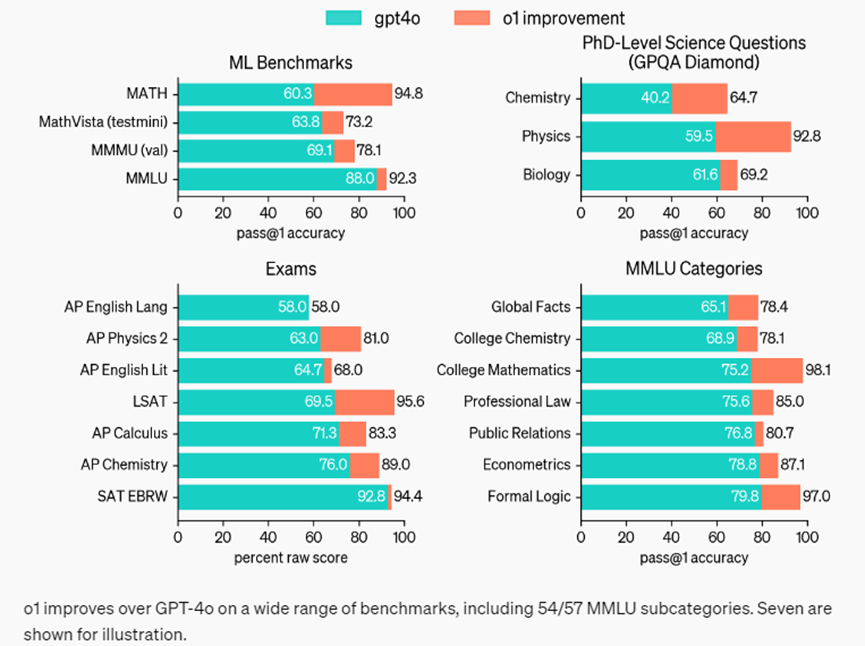
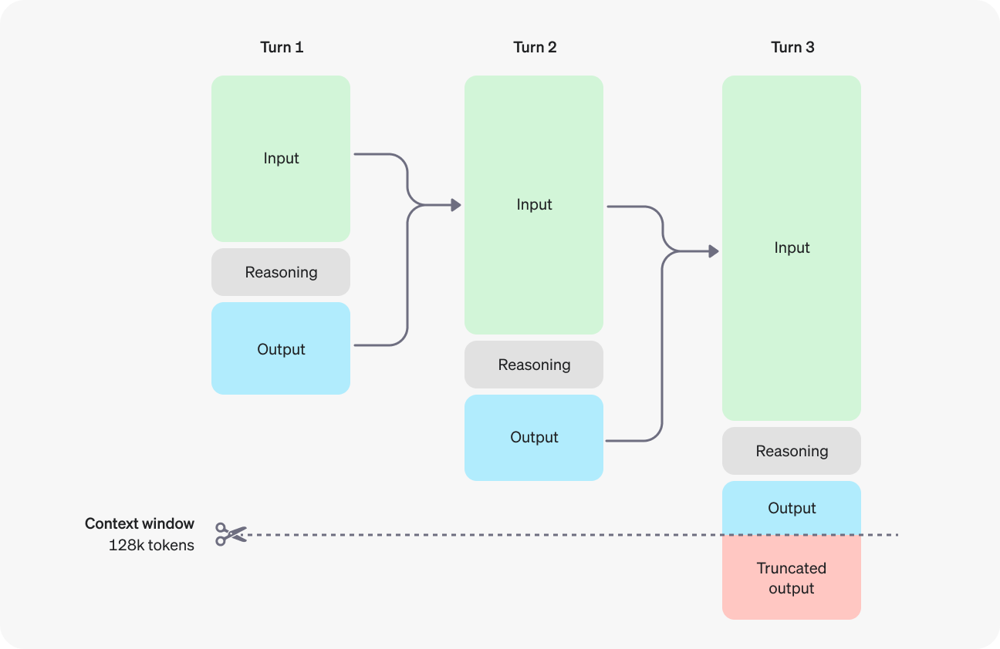
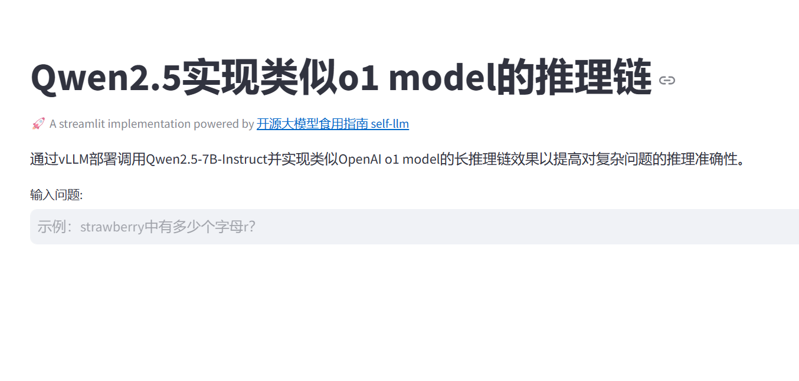
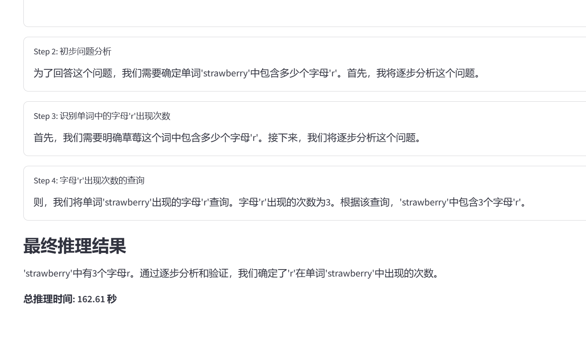
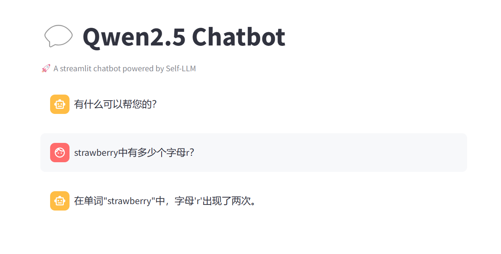

# 06-Qwen2.5-7B-Instruct o1-like 推理链实现

## **OpenAI o1 model 简介**

**OpenAI o1** 系列模型是使用强化学习训练的大语言模型，用于执行复杂推理。o1 模型在回答之前会思考，在向用户做出回应之前可以产生一个长的内部思维链。 o1 模型在科学推理方面表现出色，在编程竞赛（Codeforces）中排名 89%，在美国数学奥林匹克竞赛（AIME）的预选中位列前 500 名，在物理、生物学和化学问题基准测试（GPQA）中超越了人类博士水平。



**OpenAI o1** 系列模型不仅提高了模型的实用性，还为未来AI技术的发展开辟了新的道路。目前，o1模型包括 `o1-preview` 和` o1-mini` 两个版本，其中 `o1-preview` 适用于解决各个领域的复杂问题，而 `o1-mini` 则速度更快，性价比更高，且更擅长代码领域。


参考文档： 

[Reasoning - OpenAI API](https://platform.openai.com/docs/guides/reasoning/quickstart)

[o1 System Card | OpenAI](https://openai.com/index/openai-o1-system-card/)


## 环境准备  

本文基础环境如下：

```
----------------
ubuntu 22.04
python 3.12
cuda 12.1
pytorch 2.3.0
----------------
```

> 本文默认学习者已配置好以上 `Pytorch (cuda)` 环境，如未配置请先自行安装。

首先 `pip` 换源加速下载并安装依赖包

```bash
python -m pip install --upgrade pip
pip config set global.index-url https://pypi.tuna.tsinghua.edu.cn/simple

pip install modelscope==1.18.0
pip install openai==1.46.0
pip install tqdm==4.66.2
pip install transformers==4.44.2
pip install vllm==0.6.1.post2
pip install streamlit==1.38.0
```

> 考虑到部分同学配置环境可能会遇到一些问题，我们在AutoDL平台准备了 `Qwen2.5` 的环境镜像，点击下方链接并直接创建 `AutoDL` 示例即可。
> ***https://www.codewithgpu.com/i/datawhalechina/self-llm/Qwen2.5-self-llm***


## 模型下载  

使用 `modelscope` 中的 `snapshot_download` 函数下载模型，第一个参数为模型名称，参数 `cache_dir`为模型的下载路径。

先切换到 `autodl-tmp` 目录，`cd /root/autodl-tmp` 

然后新建名为 `model_download.py` 的 `python` 脚本，并在其中输入以下内容并保存

```python
# model_download.py
from modelscope import snapshot_download
model_dir = snapshot_download('qwen/Qwen2.5-7B-Instruct', cache_dir='/root/autodl-tmp', revision='master')
```

然后在终端中输入 `python model_download.py` 执行下载，这里需要耐心等待一段时间直到模型下载完成。

> 注意：记得修改 `cache_dir` 为你的模型下载路径哦~


## **代码准备**

#### **核心代码**

在 `/root/autodl-tmp` 路径下新建 `app_qwen.py` 文件并在其中输入以下内容，粘贴代码后请及时保存文件。

```python
# app_qwen.py
import os
import json
import time
import streamlit as st
from openai import OpenAI

client = OpenAI(
    api_key="sk-xxx",
    base_url="http://localhost:8000/v1",
)

def make_api_call(messages, max_tokens, is_final_answer=False):
    for attempt in range(3):
        try:
            response = client.chat.completions.create(
                model="Qwen2.5-7B-Instruct",
                messages=messages,
                max_tokens=max_tokens,
                temperature=0.2,
                response_format={"type": "json_object"}
            )
            content = response.choices[0].message.content
            print(f"Raw API response: {content}")  # 添加此行来打印原始响应
            try:
                return json.loads(content)
            except json.JSONDecodeError as json_error:
                print(f"JSON解析错误: {json_error}")
                # 如果JSON解析失败，返回一个包含原始内容的字典
                return {
                    "title": "API Response",
                    "content": content,
                    "next_action": "final_answer" if is_final_answer else "continue"
                }
        except Exception as e:
            if attempt == 2:
                return {
                    "title": "Error",
                    "content": f"Failed after 3 attempts. Error: {str(e)}",
                    "next_action": "final_answer"
                }
            time.sleep(1)  # 重试前等待1秒

def generate_response(prompt):
    messages = [
        {"role": "system", "content": """
        你是一位具有高级推理能力的专家。你的任务是提供详细的、逐步的思维过程解释。对于每一步:
        1. 提供一个清晰、简洁的标题,描述当前的推理阶段。
        2. 在内容部分详细阐述你的思维过程。
        3. 决定是继续推理还是提供最终答案。

        输出格式说明:
        输出请严格遵循JSON格式, 包含以下键: 'title', 'content', 'next_action'(值只能为'continue' 或 'final_answer'二者之一)

        关键指示:
        - 至少使用5个不同的推理步骤。
        - 承认你作为AI的局限性,明确说明你能做什么和不能做什么。
        - 主动探索和评估替代答案或方法。
        - 批判性地评估你自己的推理;识别潜在的缺陷或偏见。
        - 当重新审视时,采用根本不同的方法或视角。
        - 至少使用3种不同的方法来得出或验证你的答案。
        - 在你的推理中融入相关的领域知识和最佳实践。
        - 在适用的情况下,量化每个步骤和最终结论的确定性水平。
        - 考虑你推理中可能存在的边缘情况或例外。
        - 为排除替代假设提供清晰的理由。

        示例JSON输出:
        {
            "title": "初步问题分析",
            "content": "为了有效地解决这个问题,我首先会将给定的信息分解为关键组成部分。这涉及到识别...[详细解释]...通过这样构建问题,我们可以系统地解决每个方面。",
            "next_action": "continue"
        }

        记住: 全面性和清晰度至关重要。每一步都应该为最终解决方案提供有意义的进展。
        再次提醒: 输出请务必严格遵循JSON格式, 包含以下键: 'title', 'content', 'next_action'(值只能为'continue' 或 'final_answer'二者之一)
        """},
        {"role": "user", "content": prompt},
        {"role": "assistant", "content": "现在我将一步步思考，从分析问题开始并将问题分解。"}
    ]
    
    steps = []
    step_count = 1
    total_thinking_time = 0
    
    while True:
        start_time = time.time()
        step_data = make_api_call(messages, 1000)
        end_time = time.time()
        thinking_time = end_time - start_time
        total_thinking_time += thinking_time
        
        title = step_data.get('title', f'Step {step_count}')
        content = step_data.get('content', 'No content provided')
        next_action = step_data.get('next_action', 'continue')
        
        steps.append((f"Step {step_count}: {title}", content, thinking_time))
        
        messages.append({"role": "assistant", "content": json.dumps(step_data)})
        
        if next_action == 'final_answer' or step_count > 25: # 最多25步，以防止无限的思考。可以适当调整。
            break
        
        step_count += 1

        yield steps, None  # 在结束时生成总时间

    # 生成最终答案
    messages.append({"role": "user", "content": "请根据你上面的推理提供最终答案。"})
    
    start_time = time.time()
    final_data = make_api_call(messages, 1000, is_final_answer=True)
    end_time = time.time()
    thinking_time = end_time - start_time
    total_thinking_time += thinking_time
    
    final_content = final_data.get('content', '没有推理出最终结果')
    steps.append(("最终推理结果", final_content, thinking_time))

    yield steps, total_thinking_time

def main():
    st.set_page_config(page_title="Qwen2.5 o1-like Reasoning Chain", page_icon="💬", layout="wide")
    
    st.title("Qwen2.5实现类似o1 model的推理链")
    st.caption("🚀 A streamlit implementation powered by [开源大模型食用指南 self-llm](https://github.com/datawhalechina/self-llm)")
    
    st.markdown("""
    通过vLLM部署调用Qwen2.5-7B-Instruct并实现类似OpenAI o1 model的长推理链效果以提高对复杂问题的推理准确性。
    """)
    
    # 用户输入查询
    user_query = st.text_input("输入问题:", placeholder="示例：strawberry中有多少个字母r？")
    
    if user_query:
        st.write("正在生成推理链中...")
        
        # 创建空元素以保存生成的文本和总时间
        response_container = st.empty()
        time_container = st.empty()
        
        # 生成并显示响应
        for steps, total_thinking_time in generate_response(user_query):
            with response_container.container():
                for i, (title, content, thinking_time) in enumerate(steps):
                    if title.startswith("最终推理结果"):
                        st.markdown(f"### {title}")
                        st.markdown(content.replace('\n', '<br>'), unsafe_allow_html=True)
                    else:
                        with st.expander(title, expanded=True):
                            st.markdown(content.replace('\n', '<br>'), unsafe_allow_html=True)
            
            # 仅在结束时显示总时间
            if total_thinking_time is not None:
                time_container.markdown(f"**总推理时间: {total_thinking_time:.2f} 秒**")

if __name__ == "__main__":
    main()
```


#### 实现原理



注意：代码中只是尝试实现了 **`o1-like`** 的 `Reasoning Chain` 的效果，而并非是在 `pretrain` 过程中训练得到 `Chain of Thought` 内置能力的 o1 模型。


#### 创建兼容 OpenAI API 接口的服务

`Qwen` 兼容 `OpenAI API` 协议，所以我们可以直接使用 `vLLM` 创建 `OpenAI API` 服务器。`vLLM` 部署实现 `OpenAI API` 协议的服务器非常方便。默认会在 http://localhost:8000 启动服务器。服务器当前一次托管一个模型，并实现列表模型、`completions` 和 `chat completions` 端口。

- `completions`：是基本的文本生成任务，模型会在给定的提示后生成一段文本。这种类型的任务通常用于生成文章、故事、邮件等。
- `chat completions`：是面向对话的任务，模型需要理解和生成对话。这种类型的任务通常用于构建聊天机器人或者对话系统。

在创建服务器时，我们可以指定模型名称、模型路径、聊天模板等参数。

- `--host` 和 `--port` 参数指定地址。
- `--model` 参数指定模型名称。
- `--chat-template` 参数指定聊天模板。
- `--served-model-name` 指定服务模型的名称。
- `--max-model-len` 指定模型的最大长度。

```bash
python -m vllm.entrypoints.openai.api_server --model /root/autodl-tmp/qwen/Qwen2.5-7B-Instruct  --served-model-name Qwen2.5-7B-Instruct --max-model-len=32768 --port 8000
```

加载完毕后出现如下信息说明服务成功启动


#### 启动 Streamlit 界面

```shell
streamlit run /root/autodl-tmp/app_qwen.py --server.address 127.0.0.1 --server.port 6004
```

在本地浏览器中打开链接 http://127.0.0.1:6004/ ，即可进入部署的 `Streamlit` 界面。运行效果如下：



我们可以尝试示例中的问题，`strawberry中有多少个字母r？` 来让实现了推理链的 `Qwen2.5-7B-Instruct` 给出推理结果



我们可以观察到经过4步推理和思考，最终的推理结果是**正确的**，且总推理耗时2还是很长的，这也符合了 o1 模型的基本特征，用推理时间的增加换取更高的推理准确率。

**说明：**有读者可能会认为这个问题根本没有难度，但是实际上对于现阶段的大语言模型来说，很少有能够回答正确的，比如我们可以回到 [04-Qwen2.5-7B-Instruct WebDemo 部署](./04-Qwen2_5-7B-Instruct WebDemo部署.md) 来尝试一下提问相同的问题，最后得到的结果显然是**错误的**。

 