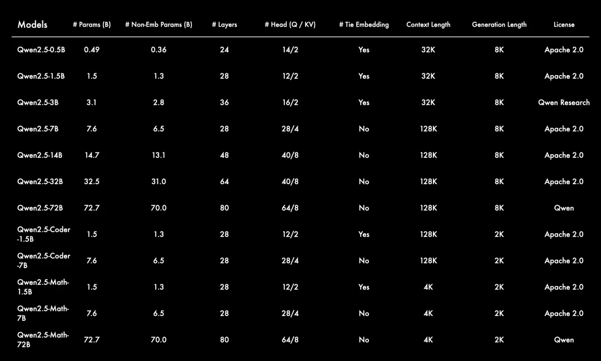

# Qwen2.5

在 Qwen2 发布后的过去三个月里，许多开发者基于 Qwen2 语言模型构建了新的模型，并提供了宝贵的反馈。在这段时间里，通义千问团队专注于创建更智能、更博学的语言模型。今天，Qwen 家族的最新成员：Qwen2.5系列正式开源！

- **更大的训练数据集**：Qwen2.5 语言模型的所有尺寸都在最新的大规模数据集上进行了预训练，该数据集包含多达 18T tokens。相较于 Qwen2，Qwen2.5 获得了显著更多的知识（MMLU：85+），并在编程能力（HumanEval 85+）和数学能力（MATH 80+）方面有了大幅提升。

- **更强的指令遵循能力**：新模型在指令执行、生成长文本（超过 8K 标记）、理解结构化数据（例如表格）以及生成结构化输出特别是 JSON 方面取得了显著改进。Qwen2.5 模型总体上对各种system prompt更具适应性，增强了角色扮演实现和聊天机器人的条件设置功能。

- **长文本支持能力**：与 Qwen2 类似，Qwen2.5 语言模型支持高达 128K tokens，并能生成最多 8K tokens的内容。

- **强大的多语言能力**：它们同样保持了对包括中文、英文、法文、西班牙文、葡萄牙文、德文、意大利文、俄文、日文、韩文、越南文、泰文、阿拉伯文等 29 种以上语言的支持。

- **专业领域的专家语言模型能力增强**，即用于编程的 Qwen2.5-Coder 和用于数学的 Qwen2.5-Math，相比其前身 CodeQwen1.5 和 Qwen2-Math 有了实质性的改进。具体来说，Qwen2.5-Coder 在包含 5.5 T tokens 编程相关数据上进行了训练，使即使较小的编程专用模型也能在编程评估基准测试中表现出媲美大型语言模型的竞争力。同时，Qwen2.5-Math 支持 中文 和 英文，并整合了多种推理方法，包括CoT（Chain of Thought）、PoT（Program of Thought）和 TIR（Tool-Integrated Reasoning）。

以下为 Qwen2.5 系列模型的详细信息。

