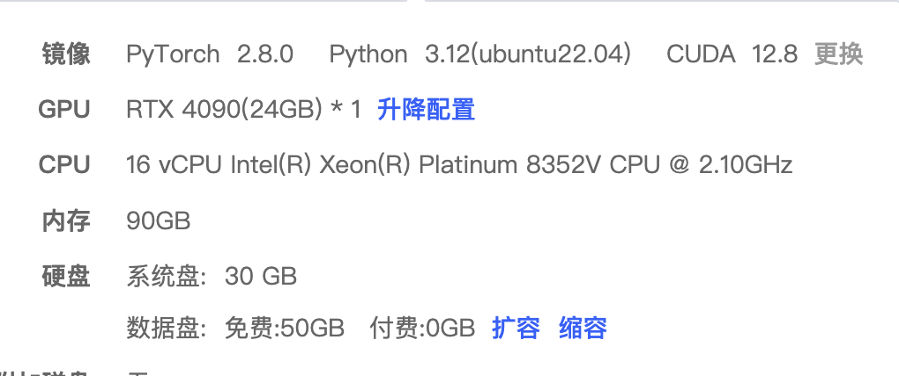
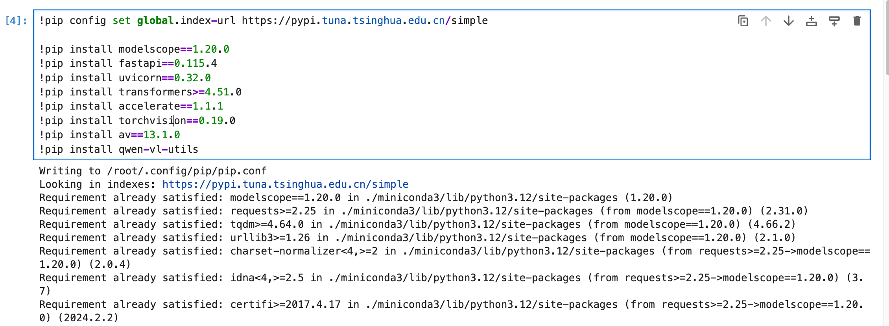
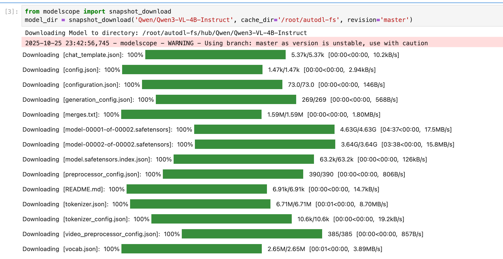
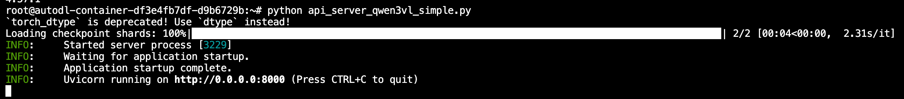
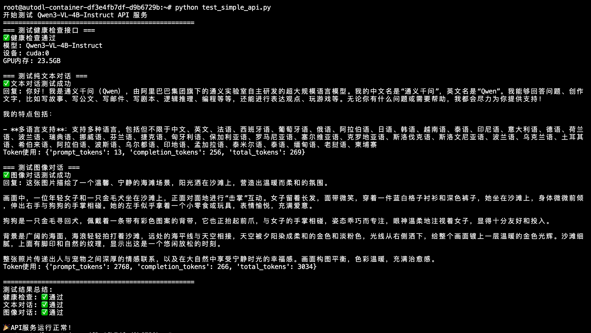
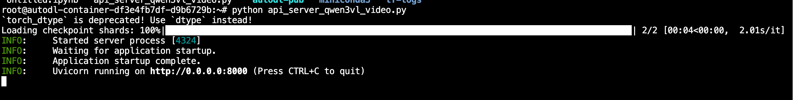
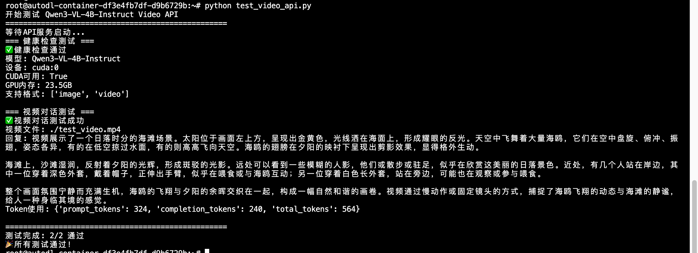

# Qwen3-VL-4B-Instruct FastApi 部署调用

## 环境准备

基础环境：

```
----------------
ubuntu 22.04
python 3.12
cuda 12.8
pytorch 2.8.0
----------------
```
> 本文默认学习者已安装好以上 PyTorch (cuda) 环境，如未安装请自行安装。

### 显卡配置说明

本教程基于**RTX 4090**显卡进行部署，该显卡具有24GB显存，完全满足Qwen3-VL-4B-Instruct模型的运行需求。



### 环境安装
首先 `pip` 换源加速下载并安装依赖包

```shell
pip config set global.index-url https://pypi.tuna.tsinghua.edu.cn/simple

pip install modelscope==1.20.0
pip install fastapi==0.115.4
pip install uvicorn==0.32.0
pip install transformers>=4.51.0
pip install accelerate==1.1.1
pip install torchvision==0.19.0
pip install av==13.1.0
pip install qwen-vl-utils
```



## 模型下载

使用 `modelscope` 中的 `snapshot_download` 函数下载模型，第一个参数为模型名称，参数 `cache_dir` 为模型的下载路径。

新建 `model_download.py` 文件输入以下代码，并运行 `python model_download.py` 执行下载。

```python
# model_download.py
from modelscope import snapshot_download
model_dir = snapshot_download('Qwen/Qwen3-VL-4B-Instruct', cache_dir='/root/autodl-fs', revision='master')
```

> 注意：请记得修改 `cache_dir` 为你自己的模型下载路径。建议使用 `/root/autodl-fs` 目录，这是持久化存储目录，重启机器后数据不会丢失。Qwen3-VL-4B-Instruct模型实际大小约为**9.2GB**（包含所有配置文件和权重文件），下载时间根据网络速度而定。



## 代码准备

### API服务端代码

创建API服务端文件 `api_server_qwen3vl_simple.py`，该文件包含了完整的FastAPI服务实现，支持文本和图像的多模态问答功能。

```python
#!/usr/bin/env python3
# -*- coding: utf-8 -*-

import os
import torch
from transformers import AutoProcessor, Qwen3VLForConditionalGeneration
from qwen_vl_utils import process_vision_info
from fastapi import FastAPI
import uvicorn
from pydantic import BaseModel
from typing import List, Dict, Any, Optional

# 设置环境变量
os.environ["TOKENIZERS_PARALLELISM"] = "false"
os.environ["CUDA_VISIBLE_DEVICES"] = "0"
torch.set_num_threads(8)

# 创建FastAPI应用
app = FastAPI(title="Qwen3-VL-4B Simple API", version="1.0.0")

# 模型路径
model_name_or_path = '/root/autodl-fs/Qwen/Qwen3-VL-4B-Instruct'

# 初始化模型和处理器
model = Qwen3VLForConditionalGeneration.from_pretrained(
    model_name_or_path,
    torch_dtype=torch.bfloat16,
    device_map="auto",
    trust_remote_code=True
)

processor = AutoProcessor.from_pretrained(
    model_name_or_path,
    trust_remote_code=True
)

# 请求模型
class ChatRequest(BaseModel):
    messages: List[Dict[str, Any]]
    max_tokens: Optional[int] = 512
    temperature: Optional[float] = 0.7
    top_p: Optional[float] = 0.9

# 响应模型
class ChatResponse(BaseModel):
    response: str
    model: str = "Qwen3-VL-4B-Instruct"
    usage: Dict[str, int]

@app.get("/")
async def root():
    return {"message": "Qwen3-VL-4B-Instruct API Server is running!"}

@app.get("/health")
async def health_check():
    return {
        "status": "healthy",
        "model": "Qwen3-VL-4B-Instruct",
        "device": str(model.device),
        "torch_version": torch.__version__,
        "cuda_available": torch.cuda.is_available(),
        "gpu_memory": f"{torch.cuda.get_device_properties(0).total_memory / 1024**3:.1f}GB" if torch.cuda.is_available() else "N/A"
    }

@app.post("/v1/chat/completions", response_model=ChatResponse)
async def chat_completions(request: ChatRequest):
    try:
        # 处理消息
        messages = request.messages
        
        # 处理视觉信息
        text = processor.apply_chat_template(
            messages, 
            tokenize=False, 
            add_generation_prompt=True
        )
        
        image_inputs, video_inputs = process_vision_info(messages)
        
        # 准备输入
        inputs = processor(
            text=[text],
            images=image_inputs,
            videos=video_inputs,
            padding=True,
            return_tensors="pt",
        )
        inputs = inputs.to(model.device)
        
        # 生成响应
        with torch.no_grad():
            generated_ids = model.generate(
                **inputs,
                max_new_tokens=request.max_tokens,
                temperature=request.temperature,
                top_p=request.top_p,
                do_sample=True,
                pad_token_id=processor.tokenizer.eos_token_id
            )
        
        # 解码响应
        generated_ids_trimmed = [
            out_ids[len(in_ids):] for in_ids, out_ids in zip(inputs.input_ids, generated_ids)
        ]
        
        response_text = processor.batch_decode(
            generated_ids_trimmed, 
            skip_special_tokens=True, 
            clean_up_tokenization_spaces=False
        )[0]
        
        # 计算token使用量
        input_tokens = inputs.input_ids.shape[1]
        output_tokens = len(generated_ids_trimmed[0])
        
        return ChatResponse(
            response=response_text,
            usage={
                "prompt_tokens": input_tokens,
                "completion_tokens": output_tokens,
                "total_tokens": input_tokens + output_tokens
            }
        )
        
    except Exception as e:
        return ChatResponse(
            response=f"Error: {str(e)}",
            usage={"prompt_tokens": 0, "completion_tokens": 0, "total_tokens": 0}
        )

if __name__ == "__main__":
    uvicorn.run(
        app, 
        host="0.0.0.0", 
        port=8000,
        log_level="info"
    )
```

> **重要提示**：根据实际情况修改 `model_name_or_path` 变量中的模型路径。

## 启动API服务

在终端中运行以下命令启动API服务：

```shell
python api_server_qwen3vl_simple.py
```

启动成功后，你将看到类似以下的输出：

```
INFO:     Started server process [12345]
INFO:     Waiting for application startup.
INFO:     Application startup complete.
INFO:     Uvicorn running on http://0.0.0.0:8000 (Press CTRL+C to quit)
```



### 测试API服务

### 测试客户端代码

创建测试脚本 `test_simple_api.py`，用于验证图像问答API服务的功能。

```python
#!/usr/bin/env python3
# -*- coding: utf-8 -*-

import requests
import json

# API服务地址
API_BASE_URL = "http://localhost:8000"

def test_health_check():
    """测试健康检查接口"""
    print("=== 测试健康检查接口 ===")
    try:
        response = requests.get(f"{API_BASE_URL}/health")
        if response.status_code == 200:
            result = response.json()
            print("✅ 健康检查通过")
            print(f"模型: {result.get('model')}")
            print(f"设备: {result.get('device')}")
            print(f"GPU内存: {result.get('gpu_memory')}")
            return True
        else:
            print(f"❌ 健康检查失败: {response.status_code}")
            return False
    except Exception as e:
        print(f"❌ 健康检查异常: {e}")
        return False

def test_text_chat():
    """测试纯文本对话"""
    print("\n=== 测试纯文本对话 ===")
    
    messages = [
        {
            "role": "user",
            "content": "你好，请介绍一下你自己。"
        }
    ]
    
    payload = {
        "messages": messages,
        "max_tokens": 256,
        "temperature": 0.7
    }
    
    try:
        response = requests.post(
            f"{API_BASE_URL}/v1/chat/completions",
            json=payload,
            headers={"Content-Type": "application/json"}
        )
        
        if response.status_code == 200:
            result = response.json()
            print("✅ 文本对话测试成功")
            print(f"回复: {result['response']}")
            print(f"Token使用: {result['usage']}")
            return True
        else:
            print(f"❌ 文本对话测试失败: {response.status_code}")
            print(f"错误信息: {response.text}")
            return False
            
    except Exception as e:
        print(f"❌ 文本对话测试异常: {e}")
        return False

def test_image_chat():
    """测试图像对话"""
    print("\n=== 测试图像对话 ===")
    
    # 使用在线图片进行测试
    image_url = "https://qianwen-res.oss-cn-beijing.aliyuncs.com/Qwen-VL/assets/demo.jpeg"
    
    try:
        messages = [
            {
                "role": "user",
                "content": [
                    {
                        "type": "image",
                        "image": image_url
                    },
                    {
                        "type": "text",
                        "text": "请描述这张图片的内容。"
                    }
                ]
            }
        ]
        
        payload = {
            "messages": messages,
            "max_tokens": 512,
            "temperature": 0.7
        }
        
        response = requests.post(
            f"{API_BASE_URL}/v1/chat/completions",
            json=payload,
            headers={"Content-Type": "application/json"}
        )
        
        if response.status_code == 200:
            result = response.json()
            print("✅ 图像对话测试成功")
            print(f"回复: {result['response']}")
            print(f"Token使用: {result['usage']}")
            return True
        else:
            print(f"❌ 图像对话测试失败: {response.status_code}")
            print(f"错误信息: {response.text}")
            return False
            
    except Exception as e:
        print(f"❌ 图像对话测试异常: {e}")
        return False

def main():
    """主测试函数"""
    print("开始测试 Qwen3-VL-4B-Instruct API 服务")
    print("=" * 50)
    
    # 执行测试
    health_ok = test_health_check()
    text_ok = test_text_chat()
    image_ok = test_image_chat()
    
    # 总结测试结果
    print("\n" + "=" * 50)
    print("测试结果总结:")
    print(f"健康检查: {'✅ 通过' if health_ok else '❌ 失败'}")
    print(f"文本对话: {'✅ 通过' if text_ok else '❌ 失败'}")
    print(f"图像对话: {'✅ 通过' if image_ok else '❌ 失败'}")
    
    if health_ok and text_ok:
        print("\n🎉 API服务运行正常！")
    else:
        print("\n⚠️  部分功能存在问题，请检查服务状态")

if __name__ == "__main__":
    main()
```

> **重要提示**：该测试脚本使用在线图片链接进行测试，无需本地图片文件，更加便于使用。测试图片来源：`https://qianwen-res.oss-cn-beijing.aliyuncs.com/Qwen-VL/assets/demo.jpeg`

执行后得到的返回结果如下所示：




## 常见问题

### Q1: 模型加载失败
**问题**: 出现 "CUDA out of memory" 错误
**解决方案**: 
- 确保RTX 4090有足够的显存空间
- 尝试使用量化配置减少显存占用
- 检查是否有其他程序占用显存

### Q2: 推理速度慢
**问题**: 模型推理响应时间过长
**解决方案**:
- 减少 `max_tokens` 参数值
- 使用量化模型
- 确保CUDA和PyTorch版本兼容


# 进阶：视频问答功能

## 视频问答API服务

除了基础的图像问答功能，Qwen3-VL-4B-Instruct还支持视频内容理解。我们可以创建一个增强版的API服务来支持视频输入。

### 创建视频问答服务

新建 `api_server_qwen3vl_video.py` 文件：

```python
#!/usr/bin/env python3
# -*- coding: utf-8 -*-

import os
import torch
from transformers import AutoProcessor, Qwen3VLForConditionalGeneration
from qwen_vl_utils import process_vision_info
from fastapi import FastAPI
import uvicorn
from pydantic import BaseModel
from typing import List, Dict, Any, Optional

# 设置环境变量
os.environ["TOKENIZERS_PARALLELISM"] = "false"
os.environ["CUDA_VISIBLE_DEVICES"] = "0"
torch.set_num_threads(8)

# 创建FastAPI应用
app = FastAPI(title="Qwen3-VL-4B Video API", version="1.0.0")

# 模型路径
model_name_or_path = '/root/autodl-fs/Qwen/Qwen3-VL-4B-Instruct'

# 初始化模型和处理器
model = Qwen3VLForConditionalGeneration.from_pretrained(
    model_name_or_path,
    torch_dtype=torch.bfloat16,
    device_map="auto",
    trust_remote_code=True
)

processor = AutoProcessor.from_pretrained(
    model_name_or_path,
    trust_remote_code=True
)

# 请求模型
class ChatRequest(BaseModel):
    messages: List[Dict[str, Any]]
    max_tokens: Optional[int] = 512
    temperature: Optional[float] = 0.7
    top_p: Optional[float] = 0.9

# 响应模型
class ChatResponse(BaseModel):
    response: str
    model: str = "Qwen3-VL-4B-Instruct"
    usage: Dict[str, int]

@app.get("/")
async def root():
    return {"message": "Qwen3-VL-4B-Instruct Video API Server is running!"}

@app.get("/health")
async def health_check():
    return {
        "status": "healthy",
        "model": "Qwen3-VL-4B-Instruct",
        "device": str(model.device),
        "torch_version": torch.__version__,
        "cuda_available": torch.cuda.is_available(),
        "gpu_memory": f"{torch.cuda.get_device_properties(0).total_memory / 1024**3:.1f}GB" if torch.cuda.is_available() else "N/A",
        "supported_formats": ["image", "video"]
    }

@app.post("/v1/chat/completions", response_model=ChatResponse)
async def chat_completions(request: ChatRequest):
    try:
        # 处理消息
        messages = request.messages
        
        # 处理视觉信息（包括图像和视频）
        text = processor.apply_chat_template(
            messages, 
            tokenize=False, 
            add_generation_prompt=True
        )
        
        image_inputs, video_inputs = process_vision_info(messages)
        
        # 准备输入
        inputs = processor(
            text=[text],
            images=image_inputs,
            videos=video_inputs,
            padding=True,
            return_tensors="pt",
        )
        inputs = inputs.to(model.device)
        
        # 生成响应
        with torch.no_grad():
            generated_ids = model.generate(
                **inputs,
                max_new_tokens=request.max_tokens,
                temperature=request.temperature,
                top_p=request.top_p,
                do_sample=True,
                pad_token_id=processor.tokenizer.eos_token_id
            )
        
        # 解码响应
        generated_ids_trimmed = [
            out_ids[len(in_ids):] for in_ids, out_ids in zip(inputs.input_ids, generated_ids)
        ]
        
        response_text = processor.batch_decode(
            generated_ids_trimmed, 
            skip_special_tokens=True, 
            clean_up_tokenization_spaces=False
        )[0]
        
        # 计算token使用量
        input_tokens = inputs.input_ids.shape[1]
        output_tokens = len(generated_ids_trimmed[0])
        
        return ChatResponse(
            response=response_text,
            usage={
                "prompt_tokens": input_tokens,
                "completion_tokens": output_tokens,
                "total_tokens": input_tokens + output_tokens
            }
        )
        
    except Exception as e:
        return ChatResponse(
            response=f"Error: {str(e)}",
            usage={"prompt_tokens": 0, "completion_tokens": 0, "total_tokens": 0}
        )

# 兼容原有的 /generate 接口
@app.post("/generate")
async def generate_response(request: ChatRequest):
    """兼容原有接口格式"""
    result = await chat_completions(request)
    return {"response": result.response}

if __name__ == "__main__":
    uvicorn.run(
        app, 
        host="0.0.0.0", 
        port=8000,
        log_level="info"
    )
```

### 启动视频问答服务

```bash
python api_server_qwen3vl_video.py
```



## 视频问答测试

### 创建测试脚本

新建 `test_video_api.py` 文件：

```python
#!/usr/bin/env python3
# -*- coding: utf-8 -*-

import requests
import json
import time

# API服务地址
API_BASE_URL = "http://localhost:8000"

def test_health_check():
    """测试健康检查接口"""
    print("=== 健康检查测试 ===")
    try:
        response = requests.get(f"{API_BASE_URL}/health")
        if response.status_code == 200:
            result = response.json()
            print("✅ 健康检查通过")
            print(f"模型: {result.get('model')}")
            print(f"设备: {result.get('device')}")
            print(f"CUDA可用: {result.get('cuda_available')}")
            print(f"GPU内存: {result.get('gpu_memory')}")
            print(f"支持格式: {result.get('supported_formats')}")
            return True
        else:
            print(f"❌ 健康检查失败: {response.status_code}")
            return False
    except Exception as e:
        print(f"❌ 健康检查异常: {e}")
        return False

def test_video_conversation():
    """测试视频对话"""
    print("\n=== 视频对话测试 ===")
    try:
        # 使用本地视频文件（请确保视频文件存在）
        video_path = "./test_video.mp4"
        
        payload = {
            "messages": [
                {
                    "role": "user",
                    "content": [
                        {
                            "type": "video",
                            "video": video_path,
                            "fps": 1.0,
                            "max_pixels": 360 * 420
                        },
                        {
                            "type": "text",
                            "text": "请描述这个视频的内容，包括主要场景和动作。"
                        }
                    ]
                }
            ],
            "max_tokens": 512,
            "temperature": 0.7
        }
        
        response = requests.post(
            f"{API_BASE_URL}/v1/chat/completions",
            json=payload,
            headers={"Content-Type": "application/json"}
        )
        
        if response.status_code == 200:
            result = response.json()
            print("✅ 视频对话测试成功")
            print(f"视频文件: {video_path}")
            print(f"回复: {result['response']}")
            print(f"Token使用: {result['usage']}")
            return True
        else:
            print(f"❌ 视频对话测试失败: {response.status_code}")
            print(f"错误信息: {response.text}")
            return False
            
    except Exception as e:
        print(f"❌ 视频对话测试异常: {e}")
        return False

def main():
    """主测试函数"""
    print("开始测试 Qwen3-VL-4B-Instruct Video API")
    print("=" * 50)
    
    # 等待服务启动
    print("等待API服务启动...")
    time.sleep(2)
    
    # 执行测试
    tests = [
        test_health_check,
        test_video_conversation
    ]
    
    passed = 0
    total = len(tests)
    
    for test_func in tests:
        if test_func():
            passed += 1
        time.sleep(1)  # 测试间隔
    
    print("\n" + "=" * 50)
    print(f"测试完成: {passed}/{total} 通过")
    
    if passed == total:
        print("🎉 所有测试通过！")
    else:
        print("⚠️  部分测试失败，请检查API服务状态")

if __name__ == "__main__":
    main()
```

### 运行测试

```bash
python test_video_api.py
```

