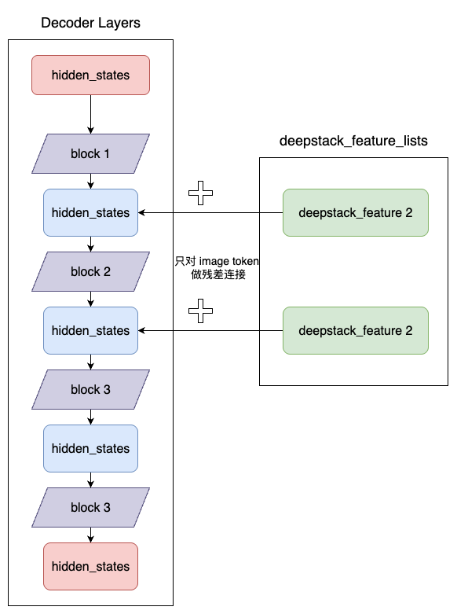

# Qwen3-VL 模型结构解析（DeepStack解析）

## Qwen3 VL MoE 和 Qwen2 VL 对比概述
1. Qwen3 VL MoE 的文本部分采用了专家混合架构，共有默认60个专家，每次只激活部分专家（如 top-k=4），还可以控制哪些层使用 MoE； Qwen2 VL 是全连接结构。
2. Qwen3 VL MoE 使用了 DeepStack 特征融合。在Qwen2 VL 中，只提取最后一层的视觉特征，在文本输入层一次性注入所有视觉信息；在 Qwen3 VL MoE 中，视觉提取部分采用了多阶段特征提取，在文本解码的不同层级逐步注入对应的视觉特征。

> 其中 MoE 和 Qwen3 MoE 类似，可参考：https://github.com/datawhalechina/self-llm/blob/master/models/Qwen3/01-Qwen3-%E6%A8%A1%E5%9E%8B%E7%BB%93%E6%9E%84%E8%A7%A3%E6%9E%90-Blog.md

## Qwen3 VL MoE 模型 DeepStack 架构详解

> DeepStack 论文原文：https://arxiv.org/pdf/2406.04334
> 本节主要讲述 Qwen3 VL MoE 模型是如何讲 DeepStack 的思想应用到模型中的。


### 特征抽取
```python
# class Qwen3VLMoeModel
def get_image_features(self, pixel_values: torch.FloatTensor, image_grid_thw: Optional[torch.LongTensor] = None):
    pixel_values = pixel_values.type(self.visual.dtype
    # 获取 image_embeds，deepstack_image_embeds
    image_embeds, deepstack_image_embeds = self.visual(pixel_values, grid_thw=image_grid_thw)
    split_sizes = (image_grid_thw.prod(-1) // self.visual.spatial_merge_size**2).tolist()
    image_embeds = torch.split(image_embeds, split_sizes)
    return image_embeds, deepstack_image_embeds
```

可以看到，使用 self.visual 方法获取到了 image_embeds 和 deepstack_image_embeds。image_embeds 直接放到 input tokens 中，而 deepstack_image_embeds 则在后续逐层加入。
接下来，我们看一下 self.visual 是如何实现的。
self.visual 默认是一个 Qwen3VLMoeVisionModel 对象（如果魔改模型的话可以替换成别的），forward 核心代码如下：


```python
def forward(self, hidden_states: torch.Tensor, grid_thw: torch.Tensor, **kwargs) -> torch.Tensor:
        ...
        # 定义 deepstack 特征列表
        deepstack_feature_lists = []
        for layer_num, blk in enumerate(self.blocks):
            # 特征提取
            hidden_states = blk(hidden_states, cu_seqlens=cu_seqlens, position_embeddings=position_embeddings, **kwargs)
            # 只在特定的层收集 deepstack 特征
            if layer_num in self.deepstack_visual_indexes:
                # 注意这里提取到的特征并不是直接用的，而是每个特征又经过了一个不同的 merger 层
                deepstack_feature = self.deepstack_merger_list[self.deepstack_visual_indexes.index(layer_num)](
                    hidden_states
                )
                # 记录 deepstack_feature
                deepstack_feature_lists.append(deepstack_feature)

        hidden_states = self.merger(hidden_states)

        return hidden_states, deepstack_feature_lists
```

特征成抽取流程图：


### 特征注入
代码详解：

```python
# class Qwen3VLMoeTextModel
def forward(..., deepstack_visual_embeds) -> Union[tuple, BaseModelOutputWithPast]:
    ...
    # decoder layers
    for layer_idx, decoder_layer in enumerate(self.layers):
        layer_outputs = decoder_layer(...)
        hidden_states = layer_outputs

        # 在前几层（取决于 deepstack 大小）的隐藏状态中添加 deepstack_feature_list 中的视觉特征
        if deepstack_visual_embeds is not None and layer_idx in range(len(deepstack_visual_embeds)):
            hidden_states = self._deepstack_process(
                hidden_states,
                visual_pos_masks,
                deepstack_visual_embeds[layer_idx],
            )

    hidden_states = self.norm(hidden_states)

    return BaseModelOutputWithPast(
        last_hidden_state=hidden_states,
        past_key_values=past_key_values,
    )


def _deepstack_process(
    self, hidden_states: torch.Tensor, visual_pos_masks: torch.Tensor, visual_embeds: torch.Tensor
):
    # 设备对齐：确保所有张量在同一设备上
    visual_pos_masks = visual_pos_masks.to(hidden_states.device)
    visual_embeds = visual_embeds.to(hidden_states.device, hidden_states.dtype)
    # 特征融合：残差连接，只在视觉token对应位置进行注入，保持文本token的原有特征
    local_this = hidden_states[visual_pos_masks, :].clone() + visual_embeds
    hidden_states[visual_pos_masks, :] = local_this
    return hidden_states
```
可以看到，在 Qwen3VLMoeTextModel 中，逐层进行 Decode，其中前 n 个（n 为 deepstack 的个数） decoder layer 分别使用上述的 deepstack_image_embeds 以残差连接的方式进行注入。
  
视觉特征注入流程图：  


