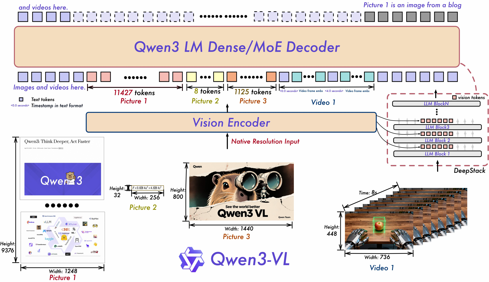
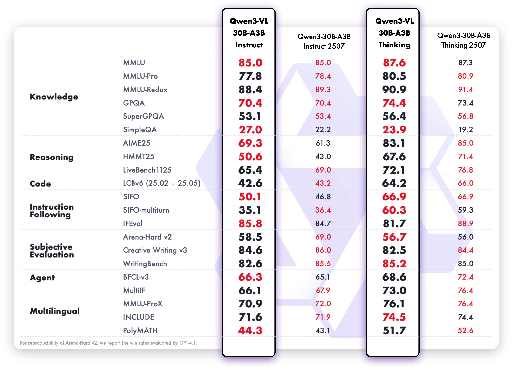

# 04-Qwen3-VL-30B-A3B-Instruct-vLLM


## **vLLM 简介**

`vLLM` 是一个高性能的大语言模型推理与服务框架，具备以下特点：

- 高效的 KV 缓存与内存管理：基于 `PagedAttention` 显著降低显存浪费，提升长文本与高并发场景下的吞吐。
- 兼容 OpenAI 接口：可直接以 `OpenAI API` 形式对外提供 `completions` 与 `chat completions` 能力，便于与现有生态集成。
- 多 GPU 并行与易扩展：支持 Tensor Parallel 等策略，参数简单、易于横向扩展吞吐与上下文长度上限。
- 生态良好：与 `HuggingFace`/`ModelScope` 模型仓库无缝衔接，支持多种推理优化与特性（如推理/思考内容解析、工具调用）。


## 环境准备

推荐基础环境如下：

> 显存预算建议：1 * NVIDIA H20

```
----------------
ubuntu 22.04
python 3.12
cuda 12.8
pytorch 2.8.0 
----------------
```

虚拟环境配置

```bash
pip install vllm==0.11.0
pip install openai==2.3.0
pip install modelscope==1.30.0
pip install qwen_vl_utils==0.0.14
```

> 提示：请确保本机 NVIDIA 驱动、CUDA 与 PyTorch CUDA 编译版本匹配，可用 `nvidia-smi` 与 `python -c "import torch; print(torch.version.cuda, torch.cuda.is_available())"` 进行快速自检。


## 模型下载

```python
# model_download.py
# 注意修改cache_dir为保存的路径
from modelscope import snapshot_download
model_dir = snapshot_download('Qwen/Qwen3-VL-30B-A3B-Instruct', cache_dir='请修改我！！！', revision='master')

print(f"模型下载完成，保存路径为：{model_dir}")
```


## **模型简介**



`Qwen3-VL-30B-A3B-Instruct` 是[Qwen3-VL](https://www.modelscope.cn/collections/Qwen3-VL-5c7a94c8cb144b)系列中的视觉语言模型，有着优秀的文本理解和生成能力、视觉感知和推理能力以及空间和视频动态理解能力。
模型采用MOE架构，激活3B参数，评测结果表明，该模型在STEM、VQA、OCR、视频理解、智能体等多个任务中与`GPT-5-Mini`和`Cluade-4-Sonnet`相媲美。
另外，该模型是非推理模型，如果想要体验更强且带有thinking mode的模型，可以下载同尺寸的[Qwen3-VL-30B-A3B-Thinking](https://www.modelscope.cn/models/Qwen/Qwen3-VL-30B-A3B-Thinking)或者更大的旗舰模型[Qwen3-VL-235B-A22B-Thinking](https://www.modelscope.cn/models/Qwen/Qwen3-VL-235B-A22B-Thinking-FP8)。

<p align="center">   
     
     
</p>


## **vLLM Serving**

### **Python命令行启动服务**

```bash
CUDA_VISIBLE_DEVICES=0 python -m vllm.entrypoints.openai.api_server \
  --model 请修改我！！！/Qwen/Qwen3-VL-30B-A3B-Instruct \
  --served-model-name Qwen3-VL-30B-A3B-Instruct \
  --max-model-len 8192 \
  --tensor-parallel-size 1 \
  --port 8085 \
  --trust_remote_code \
  --gpu_memory_utilization 0.9
```

#### 参数说明

- `CUDA_VISIBLE_DEVICES`: 指定可见的GPU。

- `--tensor-parallel-size`：张量并行划分数。使用多 GPU时使用；多卡可提升吞吐和可用上下文长度上限。
- `--max-model-len`：单请求最大上下文长度（输入+输出）。越大显存占用越高，易触发 OOM。可按显存情况下调，如 8192。
- `--gpu_memory_utilization`：vLLM 目标可用显存比例（0~1）。若 OOM 可尝试增加。
- `--served-model-name`：对外暴露的模型名。客户端需用同名 `model` 调用。
- `--port`/`--host`：服务监听端口/地址，默认为8080。
- `--trust_remote_code`：允许加载仓库中的自定义代码（必需，否则部分模型无法正确初始化）。

成功启动后，你将看到 `Application startup complete` 的输出如图：


我们通过上述 vLLM 启动的服务兼容 OpenAI 接口，因此可以很方便地通过 Python 的 OpenAI 库进行调用。下面我们通过日常问答，图片描述和视频推理的实际案例来测试 `Qwen3-VL-30B-A3B-Instruct` 的能力。


### **日常及图像描述测试**

```python
from openai import OpenAI

openai_api_key = "EMPTY"
openai_api_base = "http://127.0.0.1:8085/v1" # 使用正确的端口
daily_chat_message = "将“I love Qwen3-VL-30B-A3B-Instruct”这句话的所有内容反过来写"

# 实例化OpenAI client
client = OpenAI(
    api_key=openai_api_key,
    base_url=openai_api_base,
)

# 日常问答
daily_chat_response = client.chat.completions.create(
    model="Qwen3-VL-30B-A3B-Instruct",
    messages = [
        {
            "role": "user",
            "content": daily_chat_message
        }
    ]
)
print(f"Qwen3-VL-30B-A3B-Instruct日常问答: {daily_chat_response.choices[0].message.content}")
print("-"*100)

# 图片描述
image_des_response = client.chat.completions.create(
    model="Qwen3-VL-30B-A3B-Instruct",
    messages = [
        {
            "role": "user",
            "content": [
                {
                    "type": "image_url",
                    "image_url": {
                        "url": "https://qianwen-res.oss-cn-beijing.aliyuncs.com/Qwen-VL/assets/demo.jpeg"
                    }
                },
                {"type": "text", "text": "Describe this image."},
            ],
        }
    ]
)
print(f"Qwen3-VL-30B-A3B-Instruct图片描述: {image_des_response.choices[0].message.content}")

```


测试结果如下：
````bash
Qwen3-VL-30B-A3B-Instruct日常问答: 我们来一步一步地将这句话 "I love Qwen3-VL-30B-A3B-Instruct" 反过来写。

### 第一步：理解任务
我们要将整个句子**从后往前**重新排列，也就是把每个字符的位置倒过来。

原句是：
```
I love Qwen3-VL-30B-A3B-Instruct
```

### 第二步：逐个字符分析
我们先把这个句子拆成单个字符，注意空格和标点符号也要保留。

原句的字符顺序（从左到右）是：
```
I   l   o   v   e       Q   w   e   n   3   -   V   L   -   3   0   B   -   A   3   B   -   I   n   s   t   r   u   c   t
```

注意：最后一个字符是 `t`，然后我们从最后一个字符开始，一步一步往前写。

### 第三步：从后往前排列
我们从最后一个字符开始，依次写下来：

1. t  
2. c  
3. u  
4. r  
5. s  
6. t  
7. n  
8. I  
9. -  
10. B  
11. 3  
12. A  
13. -  
14. B  
15. 0  
16. 3  
17. -  
18. L  
19. V  
20. -  
21. 3  
22. n  
23. e  
24. w  
25. Q  
26. (空格)  
27. e  
28. v  
29. o  
30. l  
31. I

等等，我们来更仔细地列出所有字符，包括空格。

原句是：
```
I love Qwen3-VL-30B-A3B-Instruct
```

我们数一下字符（包括空格）：

- I
- (空格)
- l
- o
- v
- e
- (空格)
- Q
- w
- e
- n
- 3
- -
- V
- L
- -
- 3
- 0
- B
- -
- A
- 3
- B
- -
- I
- n
- s
- t
- r
- u
- c
- t

我们来确认一下长度：

从 "I" 开始，到 "t" 结束。

我们来逐个写出来：

原句：  
`I love Qwen3-VL-30B-A3B-Instruct`

我们把它拆成字符列表：

```
['I', ' ', 'l', 'o', 'v', 'e', ' ', 'Q', 'w', 'e', 'n', '3', '-', 'V', 'L', '-', '3', '0', 'B', '-', 'A', '3', 'B', '-', 'I', 'n', 's', 't', 'r', 'u', 'c', 't']
```

总共有 32 个字符（包括空格）。

现在我们从最后一个字符开始，倒序排列：

1. t  
2. c  
3. u  
4. r  
5. s  
6. t  
7. n  
8. I  
9. -  
10. B  
11. 3  
12. A  
13. -  
14. B  
15. 0  
16. 3  
17. -  
18. L  
19. V  
20. -  
21. 3  
22. n  
23. e  
24. w  
25. Q  
26. (空格)  
27. e  
28. v  
29. o  
30. l  
31. (空格)  
32. I

等等，我们漏了一个：原句中第一个是 "I"，最后一个是 "t"，我们从后往前写：

倒序后的字符列表：

从原句的最后一个字符开始：

- 原句第32个字符：t  
- 第31个：c  
- 第30个：u  
- 第29个：r  
- 第28个：s  
- 第27个：t  
- 第26个：n  
- 第25个：I  
- 第24个：-  
- 第23个：B  
- 第22个：3  
- 第21个：A  
- 第20个：-  
- 第19个：B  
- 第18个：0  
- 第17个：3  
- 第16个：-  
- 第15个：L  
- 第14个：V  
- 第13个：-  
- 第12个：3  
- 第11个：n  
- 第10个：e  
- 第9个：w  
- 第8个：Q  
- 第7个：(空格)  
- 第6个：e  
- 第5个：v  
- 第4个：o  
- 第3个：l  
- 第2个：(空格)  
- 第1个：I

我们把它们连起来：

从后往前写：

t c u r s t n I - B 3 A - B 0 3 - L V - 3 n e w Q   e v o l   I

现在连起来：

`tucrstnI-B3A-B03-LV-3newQ evol I`

但注意，空格也要保留。

我们来写：

从最后一个字符开始：

1. t  
2. c  
3. u  
4. r  
5. s  
6. t  
7. n  
8. I  
9. -  
10. B  
11. 3  
12. A  
13. -  
14. B  
15. 0  
16. 3  
17. -  
18. L  
19. V  
20. -  
21. 3  
22. n  
23. e  
24. w  
25. Q  
26. (空格)  
27. e  
28. v  
29. o  
30. l  
31. (空格)  
32. I

所以连起来是：

`tucrstnI-B3A-B03-LV-3newQ evol I`

等等，我们检查一下：

原句是：

`I love Qwen3-VL-30B-A3B-Instruct`

我们来写出来：

I love Qwen3-VL-30B-A3B-Instruct

我们倒过来：

从后往前：

t c u r s t n I - B 3 A - B 0 3 - L V - 3 n e w Q   e v o l   I

但注意：原句中 "Qwen3-VL-30B-A3B-Instruct" 是连在一起的，中间没有空格。

我们来逐个字符列出原句：

位置：  
1: I  
2: (空格)  
3: l  
4: o  
5: v  
6: e  
7: (空格)  
8: Q  
9: w  
10: e  
11: n  
12: 3  
13: -  
14: V  
15: L  
16: -  
17: 3  
18: 0  
19: B  
20: -  
21: A  
22: 3  
23: B  
24: -  
25: I  
26: n  
27: s  
28: t  
29: r  
30: u  
31: c  
32: t

所以倒序后：

32: t  
31: c  
30: u  
29: r  
28: s  
27: t  
26: n  
25: I  
24: -  
23: B  
22: 3  
21: A  
20: -  
19: B  
18: 0  
17: 3  
16: -  
15: L  
14: V  
13: -  
12: 3  
11: n  
10: e  
9: w  
8: Q  
7: (空格)  
6: e  
5: v  
4: o  
3: l  
2: (空格)  
1: I

现在我们把它们拼起来：

t c u r s t n I - B 3 A - B 0 3 - L V - 3 n e w Q   e v o l   I

连起来：

`tucrstnI-B3A-B03-LV-3newQ evol I`

但注意：原句中 "Qwen3-VL-30B-A3B-Instruct" 是从 Q 开始，到 t 结束。

倒序后，从 t 开始，到 I 结束。

所以最终结果是：

`tucrstnI-B3A-B03-LV-3newQ evol I`

但我们再检查一下，是不是有错误？

原句：  
`I love Qwen3-VL-30B-A3B-Instruct`

我们来手动倒序：

从后往前写：

t  
c  
u  
r  
s  
t  
n  
I  
-  
B  
3  
A  
-  
B  
0  
3  
-  
L  
V  
-  
3  
n  
e  
w  
Q  
(空格)  
e  
v  
o  
l  
(空格)  
I

所以连起来：

`tucrstnI-B3A-B03-LV-3newQ evol I`

但注意：原句中 "Qwen3-VL-30B-A3B-Instruct" 倒过来是 "tucrstnI-B3A-B03-LV-3newQ"

然后 "love" 倒过来是 "evol"，然后 "I" 倒过来是 "I"，但前面有个空格。

原句是：`I love Qwen3-VL-30B-A3B-Instruct`

所以倒序后：

从后往前：

- "Instruct" 倒过来是 "tucrstnI"  
- 然后是 "-"  
- "A3B" 倒过来是 "B3A"  
- 然后是 "-"  
- "30B" 倒过来是 "B03"  
- 然后是 "-"  
- "VL" 倒过来是 "LV"  
- 然后是 "-"  
- "3" 倒过来是 "3"  
- "Qwen" 倒过来是 "newQ"  
- 然后是空格  
- "love" 倒过来是 "evol"  
- 然后是空格  
- "I" 倒过来是 "I"

所以整体是：

`tucrstnI-B3A-B03-LV-3newQ evol I`

但我们发现，原句中 "Instruct" 是从 I 开始，t 结束，倒过来是 t 开始，I 结束，所以是 "tucrstnI"，但 "Instruct" 倒过来是 "tucrstnI"，正确。

"Qwen3-VL-30B-A3B-" 倒过来是 "-B3A-B03-LV-3newQ"

但原句中是 "Qwen3-VL-30B-A3B-Instruct"，所以倒过来是 "tucrstnI-B3A-B03-LV-3newQ"

然后前面是 "love" 和 "I"，但 "love" 倒过来是 "evol"，"I" 倒过来是 "I"，中间有空格。

原句是：`I love Qwen3-VL-30B-A3B-Instruct`

所以倒序后：

- "Instruct" → "tucrstnI"  
- "-" → "-"  
- "A3B" → "B3A"  
- "-" → "-"  
- "30B" → "B03"  
- "-" → "-"  
- "VL" → "LV"  
- "-" → "-"  
- "3" → "3"  
- "Qwen" → "newQ"  
- " " → " "  
- "love" → "evol"  
- " " → " "  
- "I" → "I"

所以连起来：

`tucrstnI-B3A-B03-LV-3newQ evol I`

但注意：原句中 "Qwen3" 倒过来是 "3newQ"，正确。

"30B" 倒过来是 "B03"，正确。

"VL" 倒过来是 "LV"，正确。

"3" 倒过来是 "3"，正确。

"Qwen" 倒过来是 "newQ"，正确。

"love" 倒过来是 "evol"，正确。

"I" 倒过来是 "I"，正确。

所以最终结果是：

`tucrstnI-B3A-B03-LV-3newQ evol I`

但我们要写成一个字符串。

我们再检查一下字符数：

原句：  
`I love Qwen3-VL-30B-A3B-Instruct`  
长度：32 个字符

倒序后：  
`tucrstnI-B3A-B03-LV-3newQ evol I`  
我们数一下：

t u c r s t n I - B 3 A - B 0 3 - L V - 3 n e w Q   e v o l   I

字符：  
1.t 2.c 3.u 4.r 5.s 6.t 7.n 8.I 9.- 10.B 11.3 12.A 13.- 14.B 15.0 16.3 17.- 18.L 19.V 20.- 21.3 22.n 23.e 24.w 25.Q 26. (空格) 27.e 28.v 29.o 30.l 31. (空格) 32.I

共32个字符，正确。

所以最终答案是：

**tucrstnI-B3A-B03-LV-3newQ evol I**

但注意：我们也可以写成一行。

最终答案：

`tucrstnI-B3A-B03-LV-3newQ evol I`
----------------------------------------------------------------------------------------------------
Qwen3-VL-30B-A3B-Instruct图片描述: Of course. Here is a detailed description of the image.

This is a heartwarming and serene photograph capturing a tender moment between a woman and her dog on a sandy beach during what appears to be sunrise or sunset.

- **Main Subjects and Interaction:** The central focus is a woman and a large, light-colored dog, likely a yellow Labrador Retriever, sitting on the sand. They are engaged in a playful and affectionate interaction. The dog is sitting upright, extending its right front paw to meet the woman's hand in a "high-five" gesture. The woman, sitting cross-legged, is smiling warmly and looking at the dog, reciprocating the high-five. Her expression conveys joy and affection.

- **Setting and Environment:** The scene is set on a wide, open beach. The sand is light-colored and appears soft, with gentle ripples and footprints visible. In the background, the ocean stretches out to the horizon, with a small, gentle wave breaking near the shore. The overall atmosphere is peaceful and tranquil.

- **Lighting and Atmosphere:** The image is bathed in the warm, golden light of the sun, which is low in the sky, likely just above the horizon. This creates a beautiful lens flare and a soft, hazy glow, particularly on the right side of the image where the sun is positioned. The light illuminates the woman's hair and the dog's fur, creating a warm and inviting ambiance. The sky is a bright, pale white, indicating the intensity of the sunlight.

- **Details and Attire:** The woman has long, dark brown hair and is wearing a black and white plaid flannel shirt over dark pants. She is barefoot, which adds to the relaxed and natural feel of the scene. The dog is wearing a blue harness adorned with a pattern of small, colorful paw prints. A red leash lies on the sand near the dog.

- **Composition:** The subjects are positioned slightly off-center, creating a balanced and dynamic composition. The shallow depth of field keeps the woman and dog in sharp focus while softly blurring the background, which draws the viewer's attention to their interaction. The overall mood of the image is one of happiness, companionship, and the simple joy of a shared moment with a beloved pet.
````

### **分析**

#### Q1

<p align="center">   
     
</p>

#### Q2

`I love Qwen3-VL-30B-A3B-Instruct` → `tucrstnI-B3A-B03-LV-3newQ evol I`

经过人工检验，这两个问题 `Qwen3-VL-30B-A3B-Instruct` 的回复都挺不错的，倒叙句子完全正确，图片描述非常详尽清晰且符合原图。同样的图片描述对比 `Qwen2-VL` 的测试结果可见 [self-llm Qwen2-VL-2B-Instruct FastApi 部署调用](https://github.com/datawhalechina/self-llm/blob/8f77c691403bc2a5be12dad994f1d60b67c15618/models/Qwen2-VL/01-Qwen2-VL-2B-Instruct%20FastApi%20%E9%83%A8%E7%BD%B2%E8%B0%83%E7%94%A8.md?plain=1#L180)。

| 评估维度               | Qwen3-VL-30B-A3B-Instruct                                    | Qwen2-VL-2B-Instruct                                         |
| ---------------------- | ------------------------------------------------------------ | ------------------------------------------------------------ |
| 细节丰富度与画面还原度 | 提供了极为详尽的视觉细节：包括狗的品种（黄色拉布拉多）、女子的发色（深棕色）、衣着（黑白格子法兰绒衬衫+深色裤子）、狗的配饰（蓝色带彩色爪印图案的胸背带）、 leash 的颜色（红色）以及沙滩上的脚印、波纹等环境细节。这些信息不仅增强了画面的真实感，也帮助读者在脑海中精准构建图像。 | 虽然也提到了基本元素（如格子衬衫、高举的狗爪、海洋背景），但描述较为笼统，缺乏具体特征（如狗的品种、颜色、配饰等），画面感较弱。 |
| 情感与氛围营造         | 不仅描述了“微笑”，还深入刻画了人物情绪（“温暖的笑容”，“喜悦与爱意”）和整体氛围（“宁静”，“温馨”，“简单快乐的陪伴”），并通过光线（“金色晨昏光”，“柔光晕染”，“镜头光晕”）强化了情感基调。 | 虽提到“平静而喜悦”，但情感表达较为表面，缺乏细腻的情绪层次和氛围渲染。 |
| 结构与逻辑性           | 采用清晰的分段结构（主体互动、环境、光线、服饰、构图），逻辑严谨，层次分明，便于读者系统理解图像内容。 | 则为一段式叙述，信息堆砌，缺乏组织，阅读体验不如前者流畅。   |
| 语言表现力             | 使用了更具文学性和画面感的词汇，如“沐浴在金色阳光中”“柔焦背景突出主体”“轻柔的波浪拍岸”等，语言生动、富有感染力。 | 语言较为平实，偏向功能性描述，缺乏美感和感染力。             |

`Qwen3-VL-30B-A3B-Instruct` 在**细节还原、情感表达、结构组织和语言表现力**四个方面均显著优于 `  Qwen2-VL-2B-Instruct`。不仅准确传达了图像内容，还成功唤起了读者的情感共鸣，作为图像描述显然质量更高。


### 视频推理测试

输入视频预览如下：


```python
import torch
from qwen_vl_utils import process_vision_info
from modelscope import AutoProcessor
from vllm import LLM, SamplingParams

import os
os.environ['VLLM_WORKER_MULTIPROC_METHOD'] = 'spawn'

def prepare_inputs_for_vllm(messages, processor):
    text = processor.apply_chat_template(messages, tokenize=False, add_generation_prompt=True)
    # qwen_vl_utils 0.0.14+ reqired
    image_inputs, video_inputs, video_kwargs = process_vision_info(
        messages,
        image_patch_size=processor.image_processor.patch_size,
        return_video_kwargs=True,
        return_video_metadata=True
    )
    print(f"video_kwargs: {video_kwargs}")

    mm_data = {}
    if image_inputs is not None:
        mm_data['image'] = image_inputs
    if video_inputs is not None:
        mm_data['video'] = video_inputs

    return {
        'prompt': text,
        'multi_modal_data': mm_data,
        'mm_processor_kwargs': video_kwargs
    }


if __name__ == '__main__':
    messages = [
        {
            "role": "user",
            "content": [
                {
                    "type": "video",
                    "video": "./space_woaudio.mp4",
                },
                {"type": "text", "text": "Describe this video. And guess what is the man going to do?"},
            ],
        }
    ]

    checkpoint_path = "请修改我！！！/Qwen/Qwen3-VL-30B-A3B-Instruct"
    processor = AutoProcessor.from_pretrained(checkpoint_path)
    inputs = [prepare_inputs_for_vllm(message, processor) for message in [messages]]

    llm = LLM(
        model=checkpoint_path,
        trust_remote_code=True,
        gpu_memory_utilization=0.99,
        enforce_eager=False,
        tensor_parallel_size=torch.cuda.device_count(),
        seed=0
    )

    sampling_params = SamplingParams(
        temperature=0,
        max_tokens=128,
        top_k=-1,
        stop_token_ids=[],
    )

    for i, input_ in enumerate(inputs):
        print()
        print('=' * 40)
        print(f"Inputs[{i}]: {input_['prompt']=!r}")
    print('\n' + '>' * 40)

    outputs = llm.generate(inputs, sampling_params=sampling_params)
    for i, output in enumerate(outputs):
        generated_text = output.outputs[0].text
        print()
        print('=' * 40)
        print(f"Generated Response: {generated_text!r}")
```

测试结果：

```bash
========================================
Inputs[0]: input_['prompt']='<|im_start|>user\n<|vision_start|><|video_pad|><|vision_end|>Describe this video. And guess what is the man going to do?<|im_end|>\n<|im_start|>assistant\n'

>>>>>>>>>>>>>>>>>>>>>>>>>>>>>>>>>>>>>>>>
Adding requests: 100%|██████████████████████████████████████████████████████████████████████████████████████████████████████████████████████████████████████████████████████████████████████████████████████████████████████████████████████████████████████████████████████████████████████| 1/1 [00:03<00:00,  3.58s/it]
Processed prompts: 100%|████████████████████████████████████████████████████████████████████████████████████████████████████████████████████████████████████████████████████████████████████████████████████████████████████████████| 1/1 [00:01<00:00,  1.64s/it, est. speed input: 1270.83 toks/s, output: 77.94 toks/s]

========================================
Generated Response: "Based on the provided video frames, here is a detailed description and a logical guess about the man's next action.\n\n### Video Description\n\nThe video is set inside a high-tech **Mission Control Center**, as indicated by the prominent sign above the main display. The environment is filled with advanced technology, suggesting a setting for monitoring and managing a space mission.\n\n- **The Man:** A middle-aged man with short, graying hair is the central figure. He is dressed in a dark blue polo shirt with a small NASA logo on the left chest and khaki pants. He is actively speaking and gesturing with both hands, indicating he is giving..." (备注：超出`max_tokens`后续被截断)
```

> 注意视频推理需要大量显存，单卡H20能够支持，但是需要设置**比较极限的推理参数**，例如上述代码中的max_tokens=128，gpu_memory_utilization=0.99，这也是测试被截断的原因。但是依然能够从已生成的内容中看出模型有非常好的视频理解和推理能力。

