# Qwen/Qwen3-VL-4B-Instruct  Lora 可视化微调案例 - LaTexOCR

[Qwen3-VL](https://huggingface.co/Qwen/Qwen3-VL-30B-A3B-Instruct)是截止2025年10月以来 Qwen 系列中最强的视觉语言模型。

Qwen3-VL在文本理解和生成、视觉感知和推理、扩展的上下文长度、增强的空间和视频动态理解方面都有显著改进。具有适用于从边缘到云的 Dense 和 MoE架构，并具有 Instruct 和推理增强型 Thinking 版本，可实现灵活的按需部署。

详情可以访问[Qwen3-VL](https://huggingface.co/Qwen/Qwen3-VL-30B-A3B-Instruct)。

值得注意的一个增强功能是OCR能力，模型卡片中介绍到模型能支持 32 种语言（从 19 种增加）；在弱光、模糊和倾斜条件下表现稳健；更适合处理稀有/古代字符和行话；改进了长文档结构解析。

本文我们将简要介绍基于 transformers、peft 等框架，使用 Qwen/Qwen3-VL-30B-A3B-Instruct 和 Qwen3-VL-4B-Instruct 模型在 LaTeX_OCR 上进行Lora微调训练，同时使用 SwanLab 监控训练过程与评估模型效果。

> 备注：本教程使用的代码同时支持 2.5 系列的模型，比如 Qwen/Qwen2.5-VL-3B-Instruct 在本脚本上可以正常运行。

- **训练使用代码**：在同级目录同名目录下
- **数据集**：[LaTeX_OCR](https://huggingface.co/datasets/linxy/LaTeX_OCR)
- **模型**：[Qwen3-VL-30B-A3B-Instruct](https://modelscope.cn/models/Qwen/Qwen3-VL-30B-A3B-Instruct/summary) & [Qwen3-VL-4B-Instruct](https://modelscope.cn/models/Qwen/Qwen3-VL-4B-Instruct/summary)
- **Qwen/Qwen3-VL-30B-A3B-Instruct 显存需求**：124+GB，如果显存不足，可以将per_device_train_batch_size调小，笔者使用两张 H20 进行训练，batch size 默认是8，基于此设置，大概需要 15 分钟，批次大小对时间有影响。
- **Qwen/Qwen2.5-VL-3B-Instruct 显存需求**：20+GB，笔者使用 1 张 H20 进行训练，你也可以使用 24 GB显存的显卡，比如 3090，4090 等，batch size 为 1 的时候需要消耗 5 分钟。

**目录**

- [Qwen/Qwen3-VL-4B-Instruct  Lora 可视化微调案例 - LaTexOCR](#qwenqwen3-vl-4b-instruct--lora-可视化微调案例---latexocr)
  - [环境配置](#环境配置)
  - [准备数据集](#准备数据集)
  - [模型下载](#模型下载)
  - [集成SwanLab](#集成swanlab)
  - [Lora 简介](#lora-简介)
  - [Lora 配置](#lora-配置)
  - [微调的完整代码](#微调的完整代码)
    - [代码](#代码)
    - [训练配置](#训练配置)
    - [模型路径设置](#模型路径设置)
  - [对比微调前后模型的输出结果](#对比微调前后模型的输出结果)
    - [代码](#代码-1)
    - [运行配置](#运行配置)
  - [模型微调效果](#模型微调效果)
    - [Qwen/Qwen3-VL-30B-A3B-Instruct](#qwenqwen3-vl-30b-a3b-instruct)
    - [Qwen/Qwen3-VL-4B-Instruct](#qwenqwen3-vl-4b-instruct)
    - [微调后模型效果展示](#微调后模型效果展示)
      - [Qwen/Qwen3-VL-30B-A3B-Instruct](#qwenqwen3-vl-30b-a3b-instruct-1)
      - [Qwen/Qwen3-VL-4B-Instruct](#qwenqwen3-vl-4b-instruct-1)
      - [总结](#总结)
  - [补充模型训练信息](#补充模型训练信息)
  - [常见错误解决办法](#常见错误解决办法)

## 环境配置

确保你的电脑上至少有一张英伟达显卡，并已安装好了CUDA环境。本次的训练的模型如果你选择的是Qwen/Qwen3-VL-30B-A3B-Instruct，那么是比较大的，需要大概124GB的显存，建议用两张H20才能够完成本次实验。

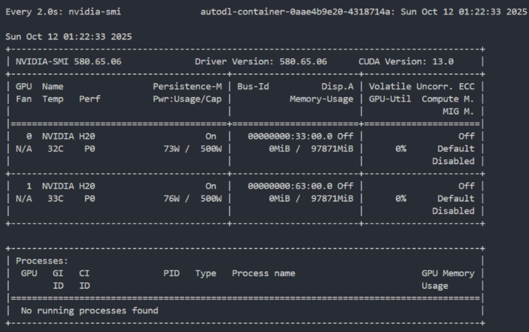

如果计算资源有限，建议使用 Qwen3-VL-4B-Instruct 完成本次实验，只需要一张 24 GB 的显卡即可完成本次实验。
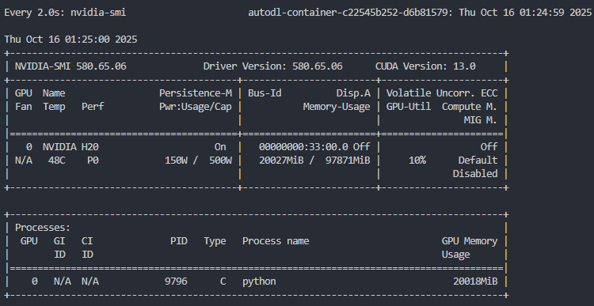

安装Python（版本>=3.12）以及能够调用CUDA加速的PyTorch，镜像采用 Pytorch2.8.0 Python3.12 CUDA12.8。

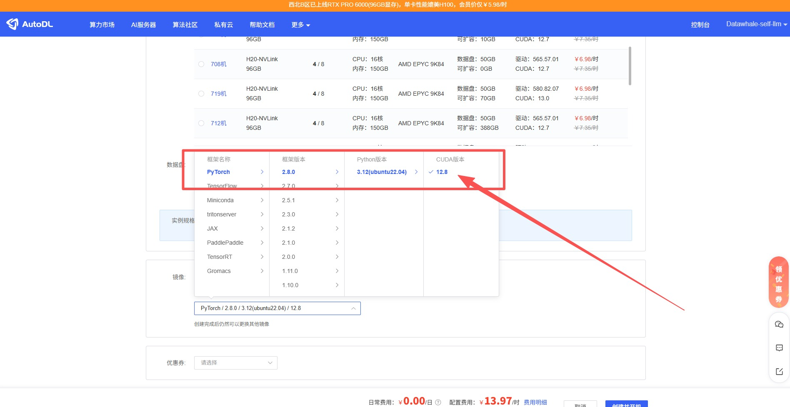

安装与Qwen3-VL微调相关的第三方库，可以使用以下命令：

```bash
python -m pip install --upgrade pip
```

更换 pypi 源，加速库的安装

```bash
pip config set global.index-url https://pypi.tuna.tsinghua.edu.cn/simple
```

我们本次主要用到的一些依赖库如下：

```
notebook==7.4.7
numpy<2.0
datasets==4.2.0
peft==0.17.1
accelerate==1.10.1
mpmath==1.3.0
networkx==3.4.2
regex==2025.9.18
sympy==1.14.0
tokenizers==0.22.1
torch==2.8.0
torchvision>=0.23.0
transformers>=4.41.2
triton==3.4.0
qwen-vl-utils==0.0.14
matplotlib>=3.10.7
modelscope==1.30.0
python-dotenv>=1.1.1
swanlab
```

你可以复制上面的内容，并写入到requirements.txt文件中，然后运行下面的命令安装所有依赖库：

```bash
pip install -r requirements.txt
```

## 准备数据集

本次使用的数据集是[linxy/LaTeX_OCR](https://huggingface.co/datasets/linxy/LaTeX_OCR)。
linxy/LaTeX_OCR是一个开源数据集，里面有五个数据集。

1. small 是小数据集，样本数 110 条，用于测试。
2. full 是印刷体约 100k 的完整数据集。实际上样本数略小于 100k，因为他们用 LaTeX 的抽象语法树剔除了很多不能渲染的 LaTeX。
3. synthetic_handwrite 是手写体 100k 的完整数据集，基于 full 的公式，使用手写字体合成而来，可以视为人类在纸上的手写体。样本数实际上略小于 100k，理由同上。
4. human_handwrite 是手写体较小数据集，更符合人类在电子屏上的手写体。主要来源于 CROHME。他们用 LaTeX 的抽象语法树校验过了。
5.human_handwrite_print 是来自 human_handwrite 的印刷体数据集，公式部分和 human_handwrite 相同，图片部分由公式用 LaTeX 渲染而来。

你可以去源数据集的页面查看数据集的子集，比如下图显示的就是数据集的各个子集字段名。
每个数据集基本都是只有两个字段，比如`text`和`image`。
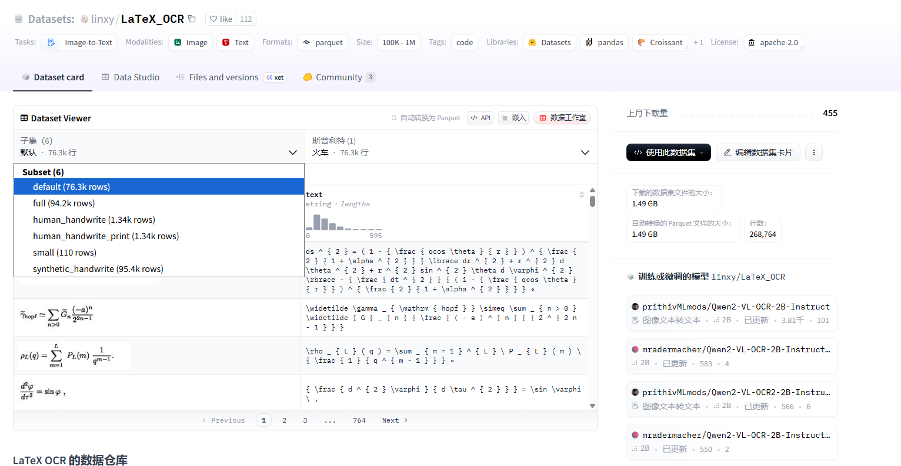

我们可以使用下面的代码进行数据集的加载。

为了便于实验，你可以在 `name` 中选择 `small`、`full`、`synthetic_handwrite`、`human_handwrite` 或 `human_handwrite_print`，并通过 `split` 指定 `train`、`validation`、`test` 等划分。

下面示例展示如何加载训练划分并快速检查样本：

```python
from datasets import load_dataset

train_dataset = load_dataset("linxy/LaTeX_OCR", name="small", split="train")
print(train_dataset[2]["text"])
print(train_dataset[2])
print(len(train_dataset))
```

输出：

```text

\rho _ { L } ( q ) = \sum _ { m = 1 } ^ { L } \ P _ { L } ( m ) \ { \frac { 1 } { q ^ { m - 1 } } } .

{
'image': <PIL.PngImagePlugin.PngImageFile image mode=RGB size=200x50 at 0x15A5D6CE210>,

'text': '\\rho _ { L } ( q ) = \\sum _ { m = 1 } ^ { L } \\ P _ { L } ( m ) \\ { \\frac { 1 } { q ^ { m - 1 } } } .'
}

50

```

若需同时获取训练、验证、测试三个划分，可直接加载整个 `DatasetDict`：

```python

from datasets import load_dataset

dataset = load_dataset("linxy/LaTeX_OCR", name="small")
print(dataset)
```

输出：

```text
DatasetDict({
    train: Dataset({
        features: ['image', 'text'],
        num_rows: 50
    })
    validation: Dataset({
        features: ['image', 'text'],
        num_rows: 30
    })
    test: Dataset({
        features: ['image', 'text'],
        num_rows: 30
    })
})
```

## 模型下载

在开始模型训练之前，我们需要下载对应的模型。

为了避免由于网络问题导致的模型下载失败，我们使用modelscope对模型进行下载。

模型的地址在：

- [Qwen/Qwen3-VL-30B-A3B-Instruct](https://modelscope.cn/models/Qwen/Qwen3-VL-30B-A3B-Instruct/summary)：<https://modelscope.cn/models/Qwen/Qwen3-VL-30B-A3B-Instruct/summary>
- [Qwen/Qwen3-VL-4B-Instruct](https://modelscope.cn/models/Qwen/Qwen3-VL-4B-Instruct/summary)：<https://modelscope.cn/models/Qwen/Qwen3-VL-4B-Instruct/summary>

你可以使用下面的命令，将模型下载到指定的目录下面，下面是以将模型下载到 `./Qwen3-VL-30B-A3B-Instruct` 目录下为例：

```bash
modelscope download --model Qwen/Qwen3-VL-30B-A3B-Instruct  --local_dir ./Qwen3-VL-30B-A3B-Instruct
```

或者是使用下面的命令，下载`Qwen/Qwen3-VL-4B-Instruct`模型到指定的目录下：

```bash
modelscope download --model Qwen/Qwen3-VL-4B-Instruct  --local_dir ./Qwen3-VL-4B-Instruct
```

> 需要注意的是，Qwen/Qwen3-VL-30B-A3B-Instruct 大概需要60GB的存储空间，Qwen/Qwen3-VL-4B-Instruct 大概需要8GB的存储空间，在开始下载之前，如果需要微调的是 30 B的模型，确保磁盘空间闲置大小在 65 GB 以上，如果是 4 B 的模型，存储空间大小要在 10 GB 以上。

如果你需要使用我的代码在AutoDL上直接运行，那么你需要将模型下载到`/root/autodl-fs/Qwen3-VL-30B-A3B-Instruct`。

fs会长时间占用用户的空间，如果用户没有及时清理的话会一直扣费，所以我建议你换成 auto-tmp 比较好，注意，换成了 auto-tmp 之后你需要修改下加载模型的代码。

## 集成SwanLab

SwanLab与Transformers已经做好了集成，用法是在Trainer的callbacks参数中添加SwanLabCallback实例，就可以自动记录超参数和训练指标，简化代码如下：

```python
from swanlab.integration.transformers import SwanLabCallback
from transformers import Trainer

swanlab_callback = SwanLabCallback()

trainer = Trainer(
    ...
    callbacks=[swanlab_callback],
)
```

首次使用SwanLab，需要先在[官网](https://swanlab.cn/space/~)注册一个账号，然后在用户设置页面复制你的API Key，然后在训练开始提示登录时粘贴即可，后续无需再次登录。

注意：SwanLab的使用是免费的，个人使用的情况下。

登录完成之后的页面是下图所示的样子。

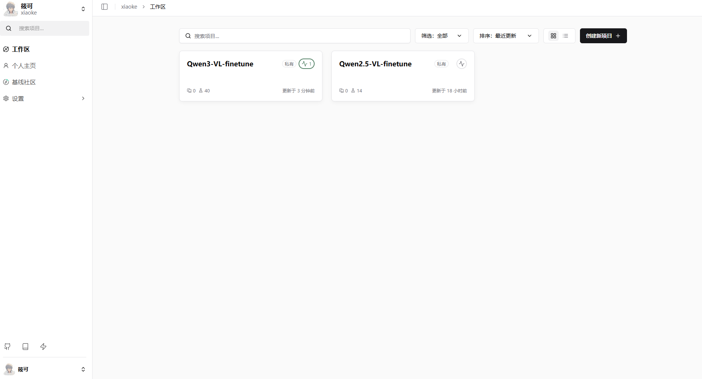

点击其中一个，你可以看到具体的实验训练详情。

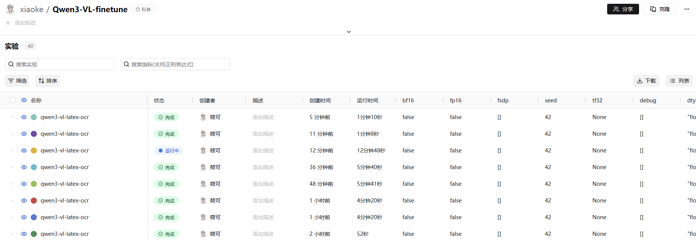

点击其中一个就会显示具体的loss变化，还有其他的一些指标。当然，SwanLab还有其他的指标可以进行监控，你可以去官网的文档中查看。

SwanLab地址：<https://swanlab.cn/>

在我的代码里面，api_key我设置成了从环境变量中加载，所以你需要创建一个名为.env的文件，并添加SWAN_LAB=你的API Key。

```text
SWAN_LAB=你的API Key
```

其中api_key可以在下面这个图中显示的位置上获取。
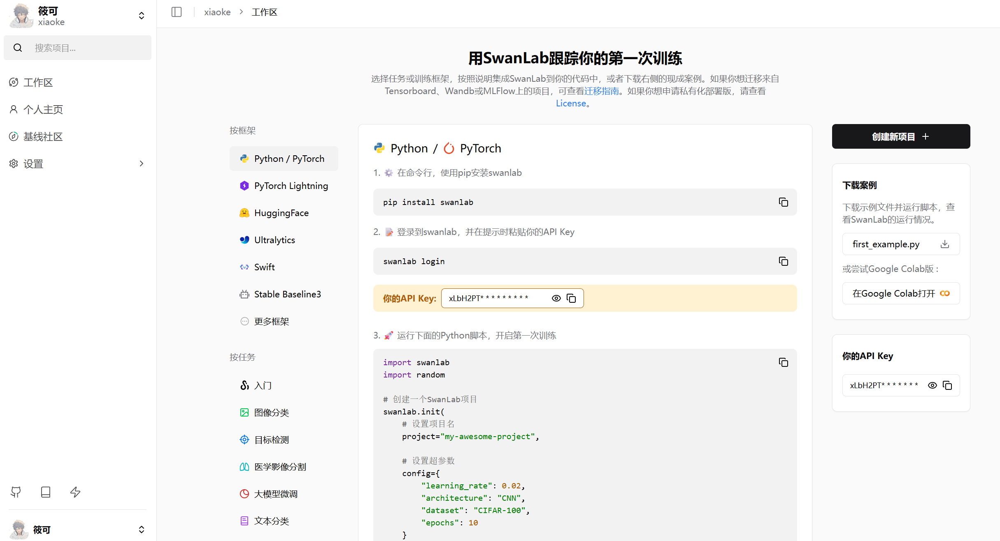

## Lora 简介

Lora 的全称是 Low-Rank Adaptation，也就是低秩适配。
传统的模型微调方法，也就是全参数微调，需要更新模型中所有的参数。

Lora的核心思想是权重变化矩阵 $\Delta W$ 可以被近似地分解为两个更小的矩阵的乘积，然后仅更新两个较小的矩阵。

它在推理时不会增加额外的计算延迟。这是因为它旁路的结构可以在推理前被合并回原始的权重矩阵中。

也就是说，我们可以通过简单的矩阵加法 $W' = W_0 + BA$，将适配器的权重融合进主干网络，从而得到一个新的权重矩阵。

>《LoRA: Low-Rank Adaptation of Large Language Models
》论文地址：<https://arxiv.org/abs/2106.09685>

## Lora 配置

```python
lora_config_dict = {
        "lora_rank": 128,
        "lora_alpha": 16,
        "lora_dropout": 0,
    }

    target_modules = ["q_proj", "k_proj", "v_proj", "o_proj"]
    config = LoraConfig(
        task_type=TaskType.CAUSAL_LM, 
        target_modules=target_modules,
        inference_mode=False,
        r=lora_config_dict["lora_rank"],
        lora_alpha=lora_config_dict["lora_alpha"],
        lora_dropout=lora_config_dict["lora_dropout"],
        bias="none",
    )
```

上面是我们创建Lora配置的代码。如果你需要调整，可以调整lora_config_dict和target_modules，主要是设置了他们。

target_modules：LoRA 适配器要作用于模型中的哪些模块。这里设置为 ["q_proj", "k_proj", "v_proj", "o_proj"].

这些都是 Transformer 模型自注意力机制中的 核心线性投射层，负责生成查询、键、值和输出。

r=128: 这是 LoRA 的 秩 rank。

lora_alpha=16: 这是 LoRA 的 缩放因子 alpha,也就是公式中的α 。

lora_dropout=0: 这个参数设置了 LoRA 层的 丢弃率 dropout rate。
论文中完整的前向传播公式是下面这样的。

$$h=W_{0}x+\Delta Wx=W_{0}x+BAx$$

α 是一个常量，这样做的好处是当改变秩 r 的大小时，可以减少重新调整超参数的需要 。

带上 α 的前向传播公式是下面这样的。

$$h = W_{0}x + \frac{α}{r}BAx$$

## 微调的完整代码

### 代码

<details><summary>点击展开/收起微调的完整代码</summary>

```python
import os

import torch
from typing import Any, Dict, List

from datasets import load_dataset
from qwen_vl_utils import process_vision_info
from peft import LoraConfig, TaskType, get_peft_model
from transformers import (
    TrainingArguments,
    Trainer,
    AutoProcessor,
    AutoTokenizer,
    AutoConfig,
)
import importlib
import matplotlib.pyplot as plt
from swanlab.integration.transformers import SwanLabCallback
from dotenv import load_dotenv


class Qwen3VLDataCollator:

    def __init__(self, tokenizer):
        self.tokenizer = tokenizer

    def __call__(self, features: List[Dict[str, Any]]) -> Dict[str, torch.Tensor]:
        input_id_tensors = [
            torch.as_tensor(sample["input_ids"], dtype=torch.long) for sample in features
        ]
        attention_tensors = [
            torch.as_tensor(sample["attention_mask"], dtype=torch.long) for sample in features
        ]
        label_tensors = [
            torch.as_tensor(sample["labels"], dtype=torch.long) for sample in features
        ]

        max_length = max(t.size(0) for t in input_id_tensors)
        pad_id = (
            self.tokenizer.pad_token_id
            if getattr(self.tokenizer, "pad_token_id", None) is not None
            else self.tokenizer.eos_token_id
        )
        if pad_id is None:
            raise ValueError("pad_token_id 与 eos_token_id 均为 None，无法进行padding。")

        input_ids = torch.full((len(features), max_length), pad_id, dtype=torch.long)
        attention_mask = torch.zeros((len(features), max_length), dtype=torch.long)
        labels = torch.full((len(features), max_length), -100, dtype=torch.long)

        for idx, (ids, attn, lbl) in enumerate(zip(input_id_tensors, attention_tensors, label_tensors)):
            length = ids.size(0)
            input_ids[idx, :length] = ids
            attention_mask[idx, :length] = attn
            labels[idx, :length] = lbl

        pixel_tensors = []
        for sample in features:
            pv = sample["pixel_values"]
            if not isinstance(pv, torch.Tensor):
                pv = torch.tensor(pv, dtype=torch.float32)
            pixel_tensors.append(pv)
        pixel_values = torch.cat(pixel_tensors, dim=0)

        image_grid_thw = torch.stack(
            [torch.as_tensor(sample["image_grid_thw"], dtype=torch.long).view(-1) for sample in features], dim=0
        )

        return {
            "input_ids": input_ids,
            "attention_mask": attention_mask,
            "labels": labels,
            "pixel_values": pixel_values,
            "image_grid_thw": image_grid_thw,
        }


PROMPT_TEXT = "Transcribe the LaTeX of this image."


def process_func(example, tokenizer, processor):
    MAX_LENGTH = 8192
    image = example["image"]
    output_content = example["text"]
    messages = [
        {
            "role": "user",
            "content": [
                {
                    "type": "image",
                    "image": image,
                },
                {"type": "text", "text": PROMPT_TEXT},
            ],
        }
    ]
    text = processor.apply_chat_template(
        messages, tokenize=False, add_generation_prompt=True
    )
    image_inputs, video_inputs = process_vision_info(messages)
    inputs = processor(
        text=[text],
        images=image_inputs,
        videos=video_inputs,
        do_resize=True,  
    )

    instruction_input_ids = inputs["input_ids"][0]

    instruction_attention_mask = inputs["attention_mask"][0]

    instruction_pixel_values = inputs["pixel_values"]

    instruction_image_grid_thw = inputs["image_grid_thw"][0]

    response = tokenizer(f"{output_content}", add_special_tokens=False)
    response_input_ids = response["input_ids"]
    response_attention_mask = response.get(
        "attention_mask", [1] * len(response_input_ids)
    )

    eos_token_id = tokenizer.eos_token_id
    if eos_token_id is not None:
        if not response_input_ids or response_input_ids[-1] != eos_token_id:
            response_input_ids = response_input_ids + [eos_token_id]
            response_attention_mask = response_attention_mask + [1]
    else:
        pad_token_id = tokenizer.pad_token_id
        if pad_token_id is None:
            raise ValueError("需要定义 eos_token_id 或 pad_token_id 才能结束响应序列。")
        response_input_ids = response_input_ids + [pad_token_id]
        response_attention_mask = response_attention_mask + [1]

    input_ids = instruction_input_ids + response_input_ids
    attention_mask = instruction_attention_mask + response_attention_mask
    labels = (
        [-100] * len(instruction_input_ids) + response_input_ids
    )
    if len(input_ids) > MAX_LENGTH:
        input_ids = input_ids[:MAX_LENGTH]
        attention_mask = attention_mask[:MAX_LENGTH]
        labels = labels[:MAX_LENGTH]

    return {
        "input_ids": input_ids,
        "attention_mask": attention_mask,
        "labels": labels,
        "pixel_values": instruction_pixel_values,
        "image_grid_thw": instruction_image_grid_thw,
    }


def main():
    load_dotenv()
    os.environ["SWANLAB_API_KEY"] = os.getenv("SWAN_LAB")

    data_fraction = 0.002

    ds = load_dataset("linxy/LaTeX_OCR", "synthetic_handwrite")

    ds = ds.shuffle(seed=222)

    train_data = ds["train"].select(range(int(len(ds["train"]) * data_fraction)))
    print(f"训练数据大小: {len(train_data)}")
    test_data = ds["test"].select(range(int(len(ds["test"]) * data_fraction)))
    print(f"测试数据大小: {len(test_data)}")

    # model_id = "/root/autodl-fs/Qwen3-VL-30B-A3B-Instruct"
    # model_id = "Qwen/Qwen2.5-VL-3B-Instruct"
    # output_dir = "/root/autodl-fs/output/Qwen3-VL-30B"
    
    model_id = "/root/autodl-tmp/Qwen3-VL-4B-Instruct"
    output_dir = "/root/autodl-tmp/Qwen3-VL-4B"
    

    tokenizer = AutoTokenizer.from_pretrained(model_id, cache_dir=os.environ.get("HF_HOME", "./"), use_fast=False, trust_remote_code=True)
    processor = AutoProcessor.from_pretrained(model_id, cache_dir=os.environ.get("HF_HOME", "./"), use_fast=False)

    config = AutoConfig.from_pretrained(model_id, cache_dir=os.environ.get("HF_HOME", "./"), trust_remote_code=True)
    arch = (config.architectures or [None])[0]
    module_name = f"transformers.models.{config.model_type}.modeling_{config.model_type}"
    module = importlib.import_module(module_name)
    model_cls = getattr(module, arch)
    model = model_cls.from_pretrained(
        model_id,
        cache_dir=os.environ.get("HF_HOME", "./"),
        device_map="auto",
        trust_remote_code=True,
    )

    model.to(dtype=torch.bfloat16)

    model.config.use_cache = False

    map_kwargs = {"tokenizer": tokenizer, "processor": processor}
    train_dataset = train_data.map(
        process_func,
        remove_columns=train_data.column_names,
        fn_kwargs=map_kwargs,
    )

    lora_config_dict = {
        "lora_rank": 128,
        "lora_alpha": 16,
        "lora_dropout": 0,
    }

    target_modules = ["q_proj", "k_proj", "v_proj", "o_proj"]
    config = LoraConfig(
        task_type=TaskType.CAUSAL_LM, 
        target_modules=target_modules,
        inference_mode=False,
        r=lora_config_dict["lora_rank"],
        lora_alpha=lora_config_dict["lora_alpha"],
        lora_dropout=lora_config_dict["lora_dropout"],
        bias="none",
    )

    peft_model = get_peft_model(model, config)

    peft_model.enable_input_require_grads()

    swanlab_callback = SwanLabCallback(
        project="Qwen3-VL-finetune",
        experiment_name="qwen3-vl-latex-ocr",
        config={
            "model": model_id,
            "dataset": "linxy/LaTeX_OCR",
            "prompt": PROMPT_TEXT,
            "train_data_number": len(train_data),
            "lora_rank": lora_config_dict["lora_rank"],
            "lora_alpha": lora_config_dict["lora_alpha"],
            "lora_dropout": lora_config_dict["lora_dropout"],
        },
    )

    args = TrainingArguments(
        output_dir=output_dir,
        per_device_train_batch_size=8, # 每个GPU的batch size
        gradient_accumulation_steps=1, # 梯度累积步数
        logging_steps=10, 
        logging_first_step=5, 
        num_train_epochs=8, # 训练轮数
        save_steps=50, # 每多少步保存一次模型 
        save_total_limit=3, # 最多保存模型数量 
        learning_rate=1e-4, # 学习率
        gradient_checkpointing=True, # 梯度检查点
        gradient_checkpointing_kwargs={"use_reentrant": False}, 
        report_to="none",
    )

    eval_dataset = test_data.map(
        process_func,
        remove_columns=test_data.column_names,
        fn_kwargs=map_kwargs,
    )

    trainer = Trainer(
        model=peft_model,
        args=args,
        train_dataset=train_dataset,
        eval_dataset=eval_dataset,
        data_collator=Qwen3VLDataCollator(tokenizer=tokenizer),
        callbacks=[swanlab_callback],
    )

    trainer.train()

    logs = trainer.state.log_history
    steps = [log['step'] for log in logs if 'loss' in log]
    losses = [log['loss'] for log in logs if 'loss' in log]
    plt.plot(steps, losses)
    plt.xlabel('Step')
    plt.ylabel('Loss')
    plt.title('Training Loss (Qwen3-VL-30B)')

    os.makedirs(output_dir, exist_ok=True)
    plt.savefig(os.path.join(output_dir, "training_loss.png"))

    trainer.model.save_pretrained(output_dir)
    tokenizer.save_pretrained(output_dir)
    processor.save_pretrained(output_dir)

if __name__ == "__main__":
    main()
```

</details>

### 训练配置

训练配置如下：

```python
args = TrainingArguments(
    output_dir=output_dir,
    per_device_train_batch_size=8, # 每个GPU的batch size
    gradient_accumulation_steps=1, # 梯度累积步数
    logging_steps=10,
    logging_first_step=5,
    num_train_epochs=8, # 训练轮数
    save_steps=50, # 每多少步保存一次模型
    save_total_limit=3, # 最多保存模型数量
    learning_rate=1e-4, # 学习率
    gradient_checkpointing=True, # 梯度检查点
    gradient_checkpointing_kwargs={"use_reentrant": False},
    report_to="none",
)
```

### 模型路径设置

模型路径设置的部分是：

```python
# model_id = "/root/autodl-fs/Qwen3-VL-30B-A3B-Instruct"
# model_id = "Qwen/Qwen2.5-VL-3B-Instruct"
# output_dir = "/root/autodl-fs/output/Qwen3-VL-30B"

model_id = "/root/autodl-tmp/Qwen3-VL-4B-Instruct"
output_dir = "/root/autodl-tmp/Qwen3-VL-4B"
```

你可以基于我原有的代码进行修改，可以替换成你想要进行微调的模型。

## 对比微调前后模型的输出结果

### 代码

我们可以使用下面的代码来对比微调前后模型的输出结果。
<details><summary>点击查看代码</summary>

```python

import os
import sys
from typing import List, Tuple

import torch
from datasets import load_dataset
from peft import PeftModel
from transformers import AutoProcessor, AutoTokenizer, AutoConfig
import importlib

from qwen_vl_utils import process_vision_info


PROMPT_TEXT = "Transcribe the LaTeX of this image."
# 使用本地基础模型与LoRA目录
# BASE_MODEL_ID = "/root/autodl-fs/Qwen3-VL-30B-A3B-Instruct"
# PEFT_DIR = "/root/autodl-fs/output/Qwen3-VL-30B"
BASE_MODEL_ID = "/root/autodl-tmp/Qwen3-VL-4B-Instruct"
PEFT_DIR = "/root/autodl-tmp/Qwen3-VL-4B"
# 是否在内存内合并LoRA（不落盘）
MERGE_LORA_IN_MEMORY = True
NUM_TEST_SAMPLES = 5

DEVICE = torch.device("cuda" if torch.cuda.is_available() else "cpu")
DTYPE = torch.bfloat16 if DEVICE.type == "cuda" else torch.float32


def load_backbone(model_id: str):
    tokenizer = AutoTokenizer.from_pretrained(model_id, cache_dir=os.environ.get("HF_HOME", "./"), use_fast=False, trust_remote_code=True)
    processor = AutoProcessor.from_pretrained(model_id, cache_dir=os.environ.get("HF_HOME", "./"), use_fast=False, trust_remote_code=True)

    config = AutoConfig.from_pretrained(model_id, cache_dir=os.environ.get("HF_HOME", "./"), trust_remote_code=True)
    arch = (config.architectures or [None])[0]
    module_name = f"transformers.models.{config.model_type}.modeling_{config.model_type}"
    module = importlib.import_module(module_name)
    model_cls = getattr(module, arch)

    model = model_cls.from_pretrained(
        model_id,
        cache_dir=os.environ.get("HF_HOME", "./"),
        device_map="auto" if DEVICE.type == "cuda" else None,
        trust_remote_code=True,
    )
    model.to(dtype=DTYPE)
    
    return model, tokenizer, processor


def load_lora_model(peft_dir: str, base_model_id: str = BASE_MODEL_ID):
    if not os.path.isdir(peft_dir):
        raise FileNotFoundError(f"未找到微调模型目录: {peft_dir}")

    # 基座
    base_model, _base_tok, _base_proc = load_backbone(base_model_id)

    # 先加载LoRA
    peft_model = PeftModel.from_pretrained(base_model, peft_dir)
    model = peft_model
    if MERGE_LORA_IN_MEMORY:
        try:
            model = peft_model.merge_and_unload()
            print("LoRA内存合并成功。")
        except Exception:
            print("警告: LoRA内存合并失败，继续使用未合并模型。")
            # 合并失败则退回未合并模型
            model = peft_model
    model.to(dtype=DTYPE)
    model.eval()


    # tokenizer/processor 优先从LoRA目录读取，保证chat_template与词表一致
    tokenizer = AutoTokenizer.from_pretrained(peft_dir, cache_dir=os.environ.get("HF_HOME", "./"), use_fast=False, trust_remote_code=True)
    processor = AutoProcessor.from_pretrained(peft_dir, cache_dir=os.environ.get("HF_HOME", "./"), use_fast=False, trust_remote_code=True)
    return model, tokenizer, processor


def build_inputs(processor, image, prompt_text: str):
    messages = [
        {
            "role": "user",
            "content": [
                {"type": "image", "image": image},
                {"type": "text", "text": prompt_text},
            ],
        }
    ]
    text = processor.apply_chat_template(messages, tokenize=False, add_generation_prompt=True)
    image_inputs, video_inputs = process_vision_info(messages)
    inputs = processor(text=[text], images=image_inputs, videos=video_inputs, do_resize=True)
    return inputs


def ensure_block_dollars(text: str) -> str:
    if text is None:
        return "$$$$"
    s = str(text).strip()
    if s.startswith("$$") and s.endswith("$$"):
        return s
    if s.startswith("$") and s.endswith("$") and not s.startswith("$$") and not s.endswith("$$"):
        inner = s[1:-1].strip()
        return f"$${inner}$$"
    if s.count("$$") >= 2:
        return s
    return f"$${s}$$"


@torch.inference_mode()
def generate_answer(model, tokenizer, processor, image, max_new_tokens: int = 512) -> str:
    inputs = build_inputs(processor, image, PROMPT_TEXT)

    input_ids = torch.as_tensor(inputs["input_ids"], device=DEVICE)
    if input_ids.ndim == 1:
        input_ids = input_ids.unsqueeze(0)
    attention_mask = inputs.get("attention_mask", None)
    if attention_mask is not None:
        attention_mask = torch.as_tensor(attention_mask, device=DEVICE)
        if attention_mask.ndim == 1:
            attention_mask = attention_mask.unsqueeze(0)

    pixel_values = inputs.get("pixel_values")
    pixel_values = torch.as_tensor(pixel_values, device=DEVICE)

    image_grid_thw = inputs.get("image_grid_thw")
    image_grid_thw = torch.as_tensor(image_grid_thw, device=DEVICE)

    gen_kwargs = {
        "input_ids": input_ids,
        "pixel_values": pixel_values,
        "max_new_tokens": max_new_tokens,
        "do_sample": False,
        "use_cache": True,
    }
    if attention_mask is not None:
        gen_kwargs["attention_mask"] = attention_mask
    if image_grid_thw is not None:
        gen_kwargs["image_grid_thw"] = image_grid_thw

    outputs = model.generate(**gen_kwargs)
    gen_seq = outputs[0].tolist()
    prompt_len = input_ids.shape[1]
    gen_ids = gen_seq[prompt_len:]
    text = tokenizer.decode(gen_ids, skip_special_tokens=True)
    return text.strip()


def main():
    print("Loading dataset linxy/LaTeX_OCR (synthetic_handwrite)...")
    ds = load_dataset("linxy/LaTeX_OCR", "synthetic_handwrite")
    ds = ds.shuffle(seed=222)
    # test_split = ds["train"].select(range(NUM_TEST_SAMPLES))
    test_split = ds["test"].select(range(NUM_TEST_SAMPLES))

    print("Loading base model...")
    base_model, base_tokenizer, base_processor = load_backbone(BASE_MODEL_ID)
    try:
        if hasattr(base_model, "gradient_checkpointing"):
            base_model.gradient_checkpointing_disable()
        if hasattr(base_model, "config"):
            base_model.config.use_cache = True
        if hasattr(base_model, "generation_config") and base_model.generation_config is not None:
            base_model.generation_config.use_cache = True
    except Exception:
        pass
    base_model.eval()

    print(f"Loading LoRA fine-tuned model from: {PEFT_DIR}")
    try:
        lora_model, lora_tokenizer, lora_processor = load_lora_model(PEFT_DIR, BASE_MODEL_ID)
        try:
            if hasattr(lora_model, "gradient_checkpointing"):
                lora_model.gradient_checkpointing_disable()
            if hasattr(lora_model, "config"):
                lora_model.config.use_cache = True
        except Exception:
            pass
    except Exception as e:
        print(f"加载微调模型失败: {e}")
        print("仅对基础模型进行推理对比。")
        lora_model = None
        lora_tokenizer = base_tokenizer
        lora_processor = base_processor

    print(f"\n===== Inference Comparison on {NUM_TEST_SAMPLES} samples =====\n")
    for idx, sample in enumerate(test_split):
        image = sample["image"]
        gt = sample.get("text", "")
        print(f"[Sample {idx}]------------------------------")
        print(f"GT: {ensure_block_dollars(gt)}")

        base_pred = ensure_block_dollars(generate_answer(base_model, base_tokenizer, base_processor, image))
        print(f"Base: {base_pred}")

        if lora_model is not None:
            lora_pred = ensure_block_dollars(generate_answer(lora_model, lora_tokenizer, lora_processor, image))
            print(f"LoRA: {lora_pred}")
        else:
            print("LoRA: <not loaded>")

        print()


if __name__ == "__main__":
    main()


```

</details>

### 运行配置

模型路径设置的位置和其他的一些设置项，在文件的开始部分代码中，具体如下。

```python
PROMPT_TEXT = "Transcribe the LaTeX of this image." # 使用的提示词。

# 使用本地基础模型与LoRA目录
# BASE_MODEL_ID = "/root/autodl-fs/Qwen3-VL-30B-A3B-Instruct"
# PEFT_DIR = "/root/autodl-fs/output/Qwen3-VL-30B"
BASE_MODEL_ID = "/root/autodl-tmp/Qwen3-VL-4B-Instruct"
PEFT_DIR = "/root/autodl-tmp/Qwen3-VL-4B"
# 是否在内存内合并LoRA（不落盘）
MERGE_LORA_IN_MEMORY = True
NUM_TEST_SAMPLES = 5 # 是使用的测试样本数
```

## 模型微调效果

### Qwen/Qwen3-VL-30B-A3B-Instruct

下面的图是`Qwen/Qwen3-VL-30B-A3B-Instruct`模型微调图表，使用的batch size为8。

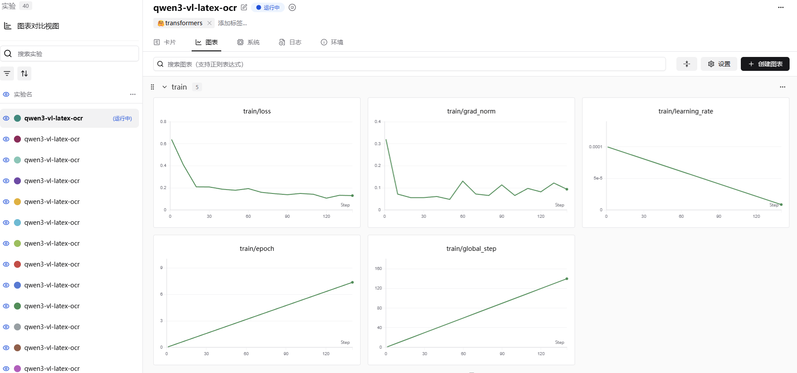

从图的效果看，loss基本都处于一个稳定下降的状态，证明我们的训练效果是在拟合数据集的。

### Qwen/Qwen3-VL-4B-Instruct

下面的图是`Qwen/Qwen3-VL-4B-Instruct`模型微调图表，batch size为1。

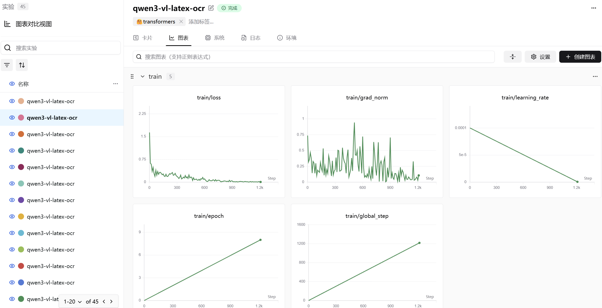

下面的图是`qwen/Qwen3-VL-4B-Instruct`模型微调图表，batch size为8。

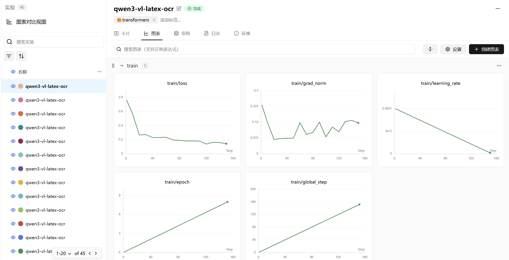

### 微调后模型效果展示

#### Qwen/Qwen3-VL-30B-A3B-Instruct

微调前后模型效果对比1。

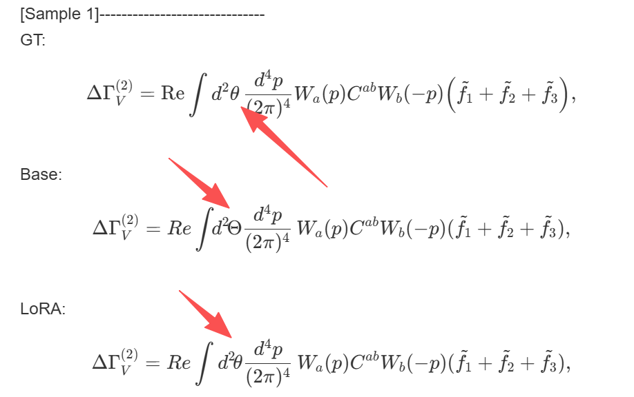

微调前后模型效果对比2。

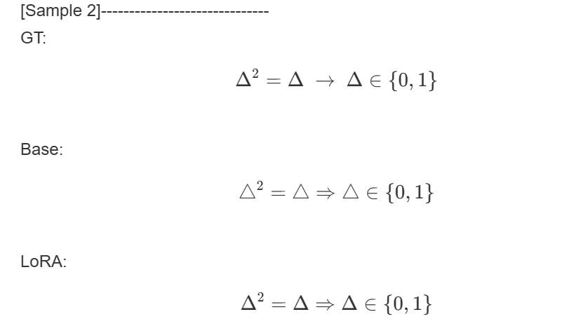
微调前后模型效果对比3。

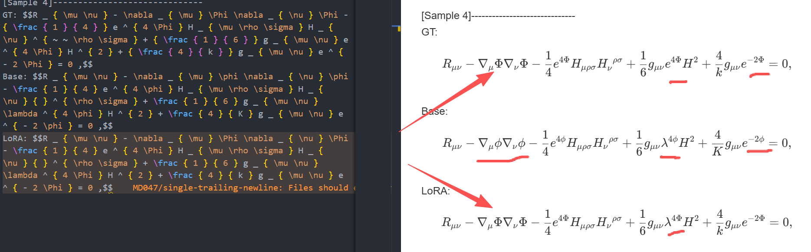

#### Qwen/Qwen3-VL-4B-Instruct

微调前后模型效果对比1，这里是使用batch size为1，训练出来的效果，可以看到这里是较差的提取效果。
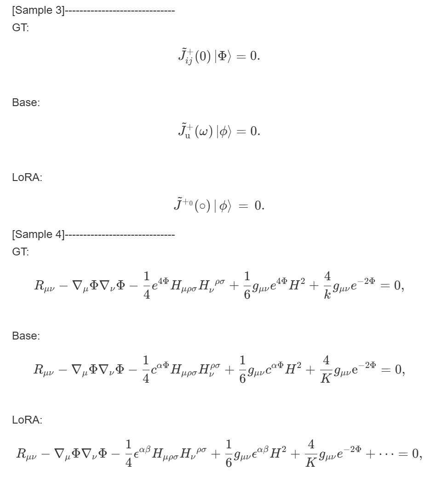

微调前后模型效果对比2，这里是使用batch size为8，训练出来的效果，可以看到效果比之前好很多。
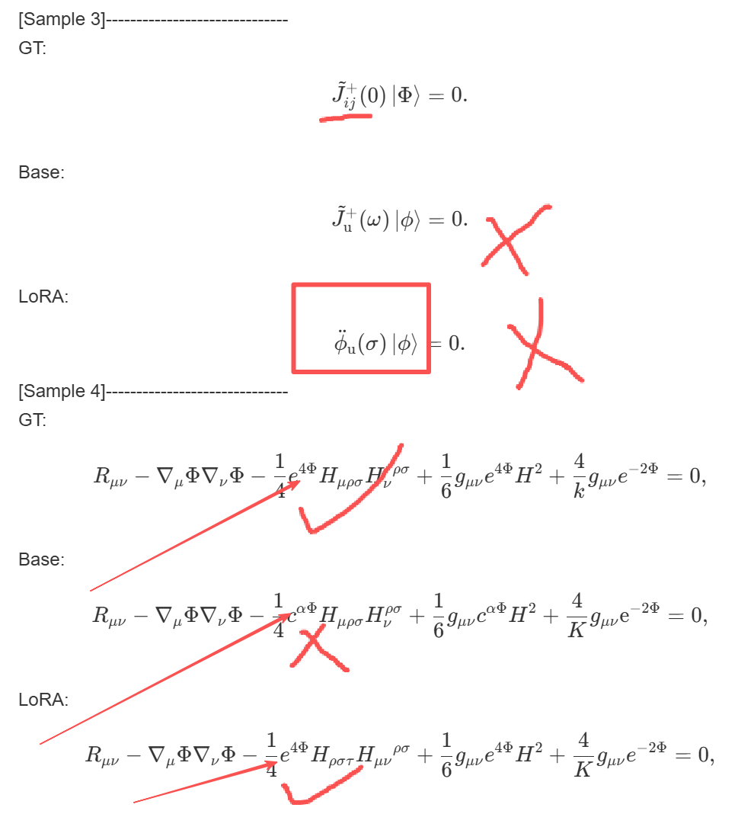

#### 总结

上面显示的是微调前后模型效果对比。

虽然看似 Qwen/Qwen3-VL-30B-A3B-Instruct 部分示例里面前后对比是有提升的，不过我也发现模型在微调之后出现了其他的问题。

比如偶尔有一些示例不如微调前的模型，我觉得是模型有点过拟合导致的。因为从微调的图表中就显示了，我们训练的轮次有些过于多了。

本次模型微调里面我也不仅仅微调了一次，而是多次。

刚开始我只是设置了一轮的微调，但是效果并不好，微调前后模型输出的内容几乎一模一样，两轮也是类似的。

接着我慢慢调整训练轮次，在轮次到9的时候，很明显loss不再是一直向下，反倒是有部分上升了，我觉得就先设置训练轮次为8了。

本来我是想要使用手写公式识别的数据集进行训练的。

不过训练的过程中，模型拟合似乎并不好，因为手写的公式数据集里面，不同的一个字符写法可能有很多种，如果我在仅仅使用少量数据集的情况下进行训练，模型微调的效果并不好，于是，换回了非手写的公式。

还有一点是 batch size 的设置，这个参数对训练结果有较大的影响，从 Qwen/Qwen3-VL-4B-Instruct 能看出来， batch size 设置为1的时候，模型训练的效果会差一些，我估计是过拟合了，batch size 设置为8的时候，效果相比来说比较好。

感兴趣的读者，可以试试其他的参数设置，比如rank，lora_alpha、学习率，batch_size等等,然后对比前后调整的差异。

## 补充模型训练信息

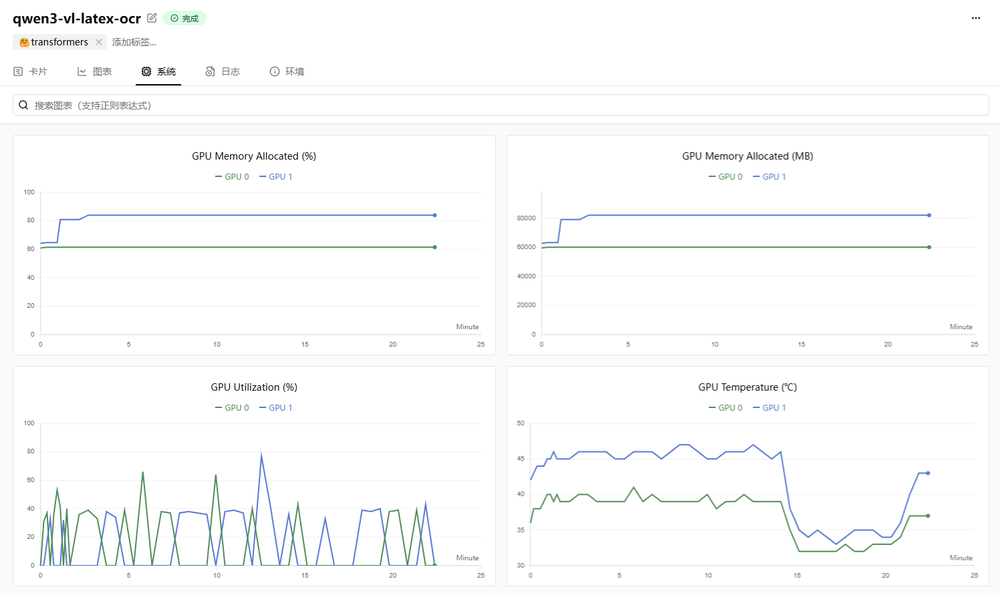

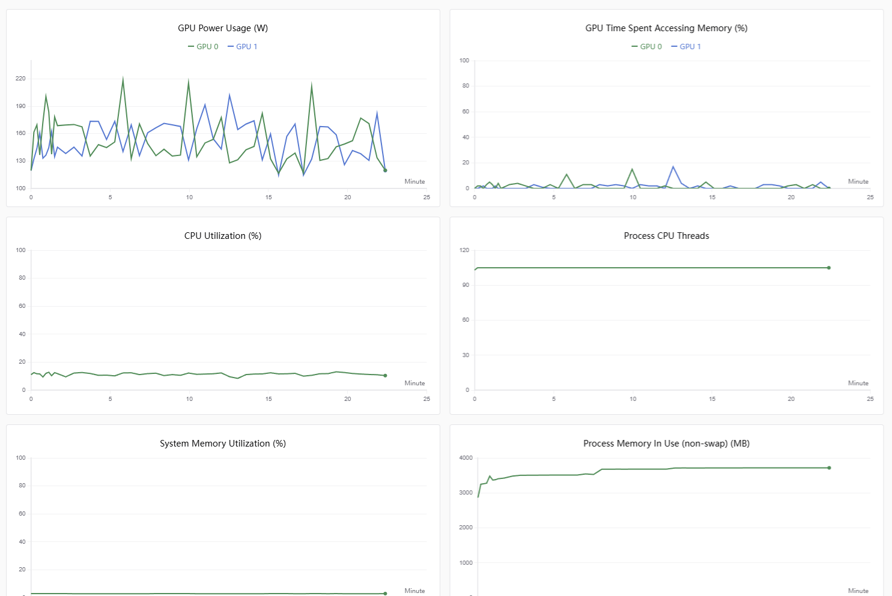

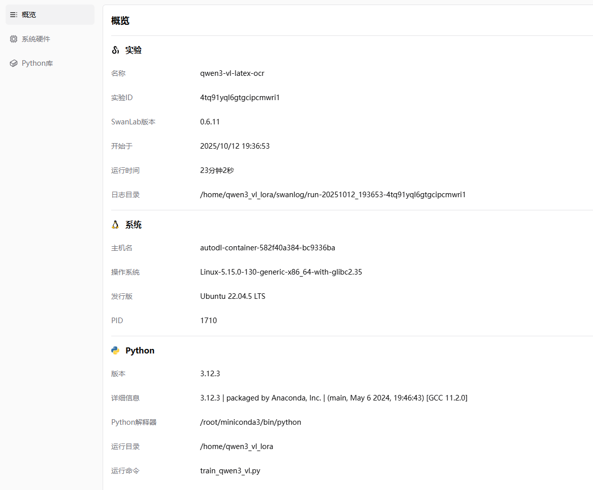

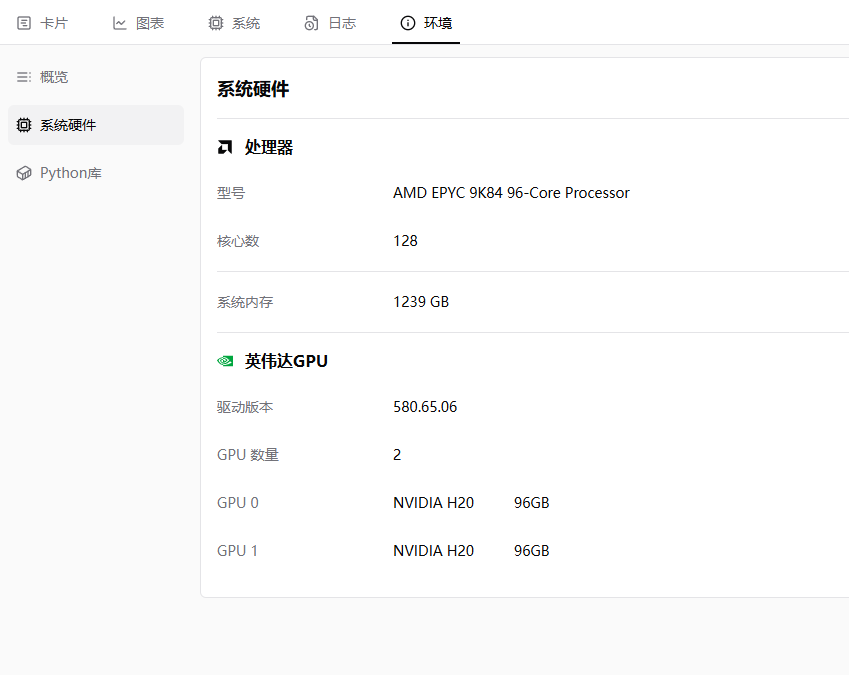

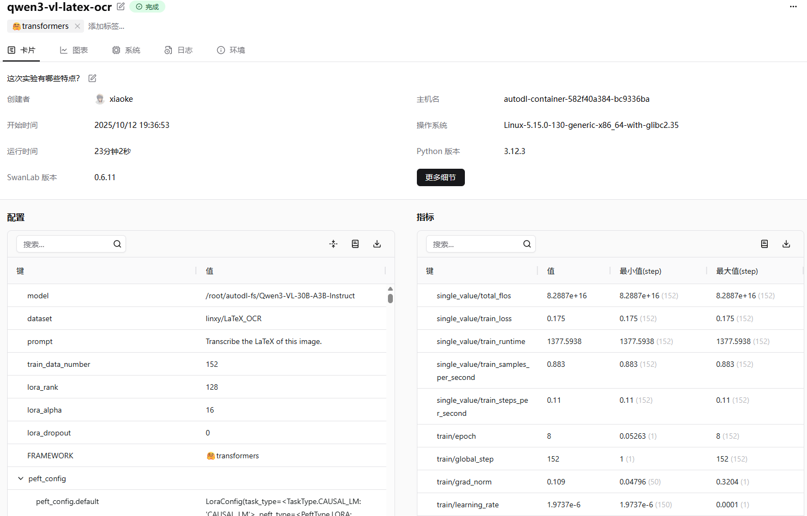

## 常见错误解决办法

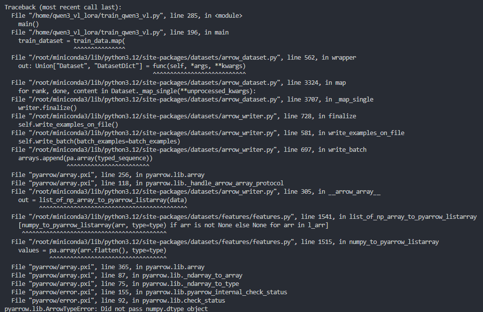
如果遇到上图所示的错误，也就是：

```bash
pyarrow.lib.ArrowTypeError: Did not pass numpy.dtype object
```

这种情况，我觉得是由于numpy的版本导致的。
你可以使用下面的命令进行版本修复：

```bash
pip install --upgrade numpy
```

运行这个命令，然后重新运行代码， 应该是可以修复这个错误的。
