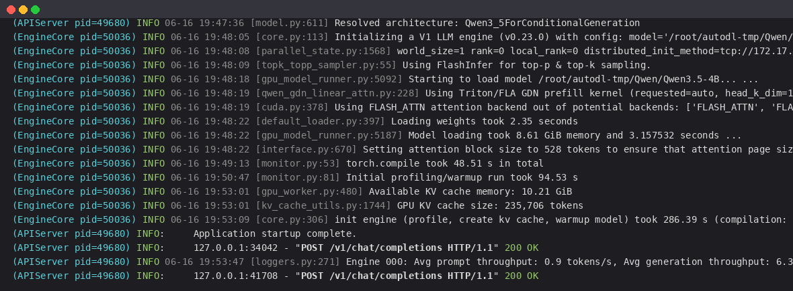
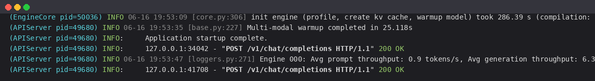

# 01-Qwen3.5-4B vLLM 部署调用

## vLLM 简介

`vLLM` 框架是一个高效的大语言模型**推理和部署服务系统**，具备以下特性：

- **高效的内存管理**：通过 `PagedAttention` 算法，`vLLM` 实现了对 `KV` 缓存的高效管理，减少了内存浪费，优化了模型的运行效率。
- **高吞吐量**：`vLLM` 支持异步处理和连续批处理请求，显著提高了模型推理的吞吐量，加速了文本生成和处理速度。
- **易用性**：`vLLM` 与 `HuggingFace` 模型无缝集成，支持多种流行的大型语言模型，简化了模型部署和推理的过程。兼容 `OpenAI` 的 `API` 服务器。
- **多模态**：`vLLM` 同时支持文本与多模态（图像/视频）推理，`Qwen3.5-4B` 作为统一视觉-语言底座，可在 `vLLM` 中直接提供图文服务。

> `Qwen3.5` 官方明确说明模型权重同时兼容 `Hugging Face Transformers`、`vLLM`、`SGLang`、`KTransformers` 等推理框架。本教程使用 `vLLM` 进行部署，**文中的启动日志与接口返回均为实测真实输出**。

## 关于 Qwen3.5-4B 架构

`Qwen3.5-4B` 采用**高效的混合架构**：将 **Gated Delta Network（门控增量网络，一种线性注意力）** 与传统全注意力（Full Attention）层交错堆叠（每 4 层中 3 层线性注意力 + 1 层全注意力），在保持强大能力的同时大幅降低长序列的推理显存与延迟。同时它默认开启**思维链（Thinking）**模式，在最终回答前生成 `<think> ... </think>` 推理过程。

> 由于该架构较新，请确保安装较新版本的 `vLLM`（本教程实测 `vLLM 0.23.0`）与 `transformers>=4.57`，以保证对 `qwen3_5` 模型类型的支持。vLLM 启动时会自动识别并选用 `Triton/FLA GDN` 线性注意力算子。

## 环境准备

本文实测基础环境如下：

```
----------------
ubuntu 22.04
python 3.12
NVIDIA 驱动 580.105.08（支持 CUDA 13.0）
GPU: RTX 4090 D (24G)
torch 2.11.0+cu128
vllm 0.23.0
----------------
```

> 本文默认学习者已配置好 `Pytorch (cuda)` 环境，如未配置请先自行安装。

首先 `pip` 换源加速下载并安装依赖包：

```bash
python -m pip install --upgrade pip
pip config set global.index-url https://pypi.tuna.tsinghua.edu.cn/simple

pip install modelscope
pip install "transformers>=4.57"
pip install openai
```

安装 `vLLM`。`vLLM 0.23.0` 是基于 **CUDA 13** 编译的版本，其编译扩展 `vllm._C` 依赖 `libcudart.so.13`；而默认从镜像源安装的 `torch` 是 CPU 版本，无法使用 GPU。因此需要先从 PyTorch 官方源安装带 CUDA 的 `torch 2.11.0`：

```bash
# 先装带 CUDA 的 torch（vLLM 0.23 需要 torch==2.11.0）
pip install torch==2.11.0 torchvision==0.26.0 torchaudio==2.11.0 \
    --index-url https://download.pytorch.org/whl/cu128

# 再装 vLLM（会自动拉取 flashinfer、cutlass-dsl、humming-kernels 等依赖）
pip install "vllm==0.23.0"
```

> **重要：设置 CUDA 库搜索路径**。由于 `vLLM 0.23.0` 是 CUDA 13 构建，而上面装的是 `torch+cu128`，启动时会报 `ImportError: libcudart.so.13: cannot open shared object file`。`vLLM` 的依赖已经把 CUDA 13 运行库装到了 `site-packages/nvidia/` 下，只需把这些路径加入 `LD_LIBRARY_PATH` 即可：
>
> ```bash
> # 写入 ~/.bashrc 永久生效
> NVLIB=$(find /root/miniconda3/lib/python3.12/site-packages/nvidia -type d -name lib | tr '\n' ':')
> echo "export LD_LIBRARY_PATH=\${NVLIB}\${LD_LIBRARY_PATH:-}" >> ~/.bashrc
> source ~/.bashrc
>
> # 验证 vLLM 可正常导入
> python -c "import vllm; print(vllm.__version__)"
> ```
>
> 若你的显卡驱动支持 CUDA 13（如本文 580.105.08），也可以直接安装 `torch+cu130`（`--index-url https://download.pytorch.org/whl/cu130`），与 `vLLM 0.23.0` 完全匹配，则无需上述 `LD_LIBRARY_PATH` 设置。

> 考虑到部分同学配置环境可能会遇到一些问题，我们在 AutoDL 平台准备了 Qwen3 的环境镜像，点击下方链接并直接创建 Autodl 示例即可。
> ***https://www.codewithgpu.com/i/datawhalechina/self-llm/Qwen3***

## 模型下载

使用 modelscope 中的 `snapshot_download` 函数下载模型，第一个参数为模型名称，参数 `cache_dir` 为模型的下载路径。

新建 `model_download.py` 文件并在其中输入以下内容，粘贴代码后记得保存文件。

```python
# model_download.py
from modelscope import snapshot_download

model_dir = snapshot_download('Qwen/Qwen3.5-4B', cache_dir='/root/autodl-tmp')
print(f"模型下载完成，保存路径为：{model_dir}")
```

然后在终端中输入 `python model_download.py` 执行下载，这里需要耐心等待一段时间直到模型下载完成。

> 注意：记得修改 `cache_dir` 为你的模型下载路径哦~

## 创建兼容 OpenAI API 接口的服务器

`Qwen3.5-4B` 兼容 `OpenAI API` 协议，我们可以直接使用 `vLLM` 创建 `OpenAI API` 服务器。默认会在 `http://localhost:8000` 启动服务器，实现模型列表、`completions` 和 `chat completions` 端口。

常用启动参数：

- `--host` / `--port`：指定地址与端口
- `--model`：模型路径
- `--served-model-name`：服务对外的模型名称
- `--max-model-len`：模型最大上下文长度（4B 模型在 24G 显存上建议 `4096`，显存富余可调大）
- `--gpu-memory-utilization`：GPU 显存占用比例（默认 0.9，显存紧张可调低）
- `--trust-remote-code`：信任远程代码

复制以下命令到终端，即可启动 Qwen3.5-4B 的 API 服务：

```bash
vllm serve /root/autodl-tmp/Qwen/Qwen3.5-4B \
    --served-model-name Qwen3.5-4B \
    --max-model-len 4096 \
    --gpu-memory-utilization 0.9 \
    --trust-remote-code \
    --host 0.0.0.0 --port 8000
```

启动过程中会打印大量日志，关键的实测启动日志如下（vLLM 识别出 `Qwen3_5ForConditionalGeneration` 架构，并为线性注意力层选用 GDN 算子）：



对应的关键日志行（已去除颜色码）：

```bash
(APIServer) INFO [model.py:611] Resolved architecture: Qwen3_5ForConditionalGeneration
(APIServer) INFO [model.py:1745] Using max model len 4096
(EngineCore) INFO [core.py:113] Initializing a V1 LLM engine (v0.23.0) ...
(EngineCore) INFO [topk_topp_sampler.py:55] Using FlashInfer for top-p & top-k sampling.
(EngineCore) INFO [gpu_model_runner.py:5092] Starting to load model /root/autodl-tmp/Qwen/Qwen3.5-4B...
(EngineCore) INFO [qwen_gdn_linear_attn.py:228] Using Triton/FLA GDN prefill kernel (requested=auto, head_k_dim=128).
(EngineCore) INFO [cuda.py:378] Using FLASH_ATTN attention backend out of potential backends: ['FLASH_ATTN', 'FLASHINFER', 'TRITON_ATTN', 'FLEX_ATTENTION'].
(EngineCore) INFO [default_loader.py:397] Loading weights took 2.35 seconds
(EngineCore) INFO [gpu_model_runner.py:5187] Model loading took 8.61 GiB memory and 3.16 seconds
(EngineCore) INFO [monitor.py:53] torch.compile took 48.51 s in total
(EngineCore) INFO [gpu_worker.py:480] Available KV cache memory: 10.21 GiB
(EngineCore) INFO [kv_cache_utils.py:1744] GPU KV cache size: 235,706 tokens
(EngineCore) INFO [core.py:306] init engine (profile, create kv cache, warmup model) took 286.39 s (compilation: 48.51 s)
(APIServer) INFO:     Application startup complete.
```

> 说明：首次启动会触发 `torch.compile` 编译与 profiling warmup（实测初始化耗时约 286s），编译结果会缓存到 `~/.cache/vllm/`，后续启动会明显加快。出现 `Application startup complete.` 即说明服务成功启动。

- 通过 `curl` 命令查看当前的模型列表

```bash
curl http://localhost:8000/v1/models
```

实测返回值如下所示：

```json
{
  "object": "list",
  "data": [
    {
      "id": "Qwen3.5-4B",
      "object": "model",
      "created": 1781610820,
      "owned_by": "vllm",
      "root": "/root/autodl-tmp/Qwen/Qwen3.5-4B",
      "parent": null,
      "max_model_len": 4096
    }
  ]
}
```

### 思考模式与非思考模式

`Qwen3.5` 默认开启思考模式。在 `chat/completions` 接口中，可通过 `chat_template_kwargs.enable_thinking` 按**请求**级别控制：

- **默认（思考模式）**：模型先输出 `<think> ... </think>` 推理过程，再给出最终答案
- **非思考模式**：传入 `enable_thinking=false`，模型不输出 `<think>` 标签

### 用 curl 测试 Chat Completions（思考模式）

```bash
curl http://localhost:8000/v1/chat/completions \
    -H "Content-Type: application/json" \
    -d '{
        "model": "Qwen3.5-4B",
        "messages": [
            {"role": "user", "content": "5的阶乘是多少？"}
        ],
        "temperature": 1.0,
        "top_p": 0.95,
        "max_tokens": 768,
        "extra_body": {"chat_template_kwargs": {"enable_thinking": true}}
    }'
```

实测返回值如下所示（`content` 中先是 `<think> ... </think>` 思考过程，其后是最终答案，`finish_reason` 为 `stop` 表示正常结束）：

```json
{
  "id": "chatcmpl-984a75743a984720",
  "object": "chat.completion",
  "model": "Qwen3.5-4B",
  "choices": [
    {
      "index": 0,
      "message": {
        "role": "assistant",
        "content": "Here's a thinking process that leads to the answer:\n\n1. **Analyze the Request:** 用户问的是 5 的阶乘 ...\n2. **Define Factorial:** n! = n × (n-1) × ... × 1\n3. **Calculate 5!:** 5 × 4 = 20, 20 × 3 = 60, 60 × 2 = 120, 120 × 1 = 120\n...\n</think>\n\n5 的阶乘（记作 5!）是 **120**。\n\n计算过程如下：\n$$5! = 5 \\times 4 \\times 3 \\times 2 \\times 1 = 120$$"
      },
      "finish_reason": "stop"
    }
  ],
  "usage": {
    "prompt_tokens": 16,
    "completion_tokens": 590,
    "total_tokens": 606
  }
}
```

可以看到，开启思考模式时，模型先在 `<think> ... </think>` 中给出推理过程，再输出最终答案 `5 的阶乘是 120`。

### 用 Python 脚本请求（非思考模式）

```python
# vllm_openai_chat_completions.py
from openai import OpenAI

client = OpenAI(
    api_key="sk-xxx",                       # 随便填写，只是为了通过接口参数校验
    base_url="http://localhost:8000/v1",
)

# 非思考模式：传入 enable_thinking=false
chat_outputs = client.chat.completions.create(
    model="Qwen3.5-4B",
    messages=[{"role": "user", "content": "用一句话介绍深度学习。"}],
    extra_body={"chat_template_kwargs": {"enable_thinking": False}},
)
print(chat_outputs.choices[0].message.content)
```

```bash
python vllm_openai_chat_completions.py
```

> 实测发现：`Qwen3.5-4B` 即使在非思考模式下，也可能在 `content` 开头先输出一段简短的「思考过程」文字（不再用 `<think>` 标签包裹），随后才给出最终回答，且小模型容易在 `max_tokens` 较小时被截断（`finish_reason: length`）。如需直接、简短的回答，可适当调大 `max_tokens` 或换用更大的型号。

### 运行时日志

在请求处理过程中，`API` 后端会持续打印对应的日志与统计信息（吞吐、显存占用等），便于观测服务状态。实测的运行时日志如下：



```bash
(EngineCore) INFO [core.py:306] init engine (profile, create kv cache, warmup model) took 286.39 s (compilation: 48.51 s)
(APIServer) INFO [base.py:227] Multi-modal warmup completed in 25.118s
(APIServer) INFO:     Application startup complete.
(APIServer) INFO:     127.0.0.1:34042 - "POST /v1/chat/completions HTTP/1.1" 200 OK
(APIServer) INFO [loggers.py:271] Engine 000: Avg prompt throughput: 0.9 tokens/s, Avg generation throughput: 6.3 tokens/s, Running: 1 reqs, Waiting: 0 reqs, GPU KV cache usage: 0.6%
(APIServer) INFO:     127.0.0.1:41708 - "POST /v1/chat/completions HTTP/1.1" 200 OK
```

### 多模态（图文）调用示例

由于 `Qwen3.5-4B` 自带视觉编码器，`vLLM` 部署后也支持图像输入：

```python
# vllm_multimodal.py
from openai import OpenAI

client = OpenAI(api_key="sk-xxx", base_url="http://localhost:8000/v1")

response = client.chat.completions.create(
    model="Qwen3.5-4B",
    messages=[{
        "role": "user",
        "content": [
            {"type": "image_url", "image_url": {"url": "https://example.com/image.jpg"}},
            {"type": "text", "text": "请描述这张图片的内容。"},
        ],
    }],
)
print(response.choices[0].message.content)
```

> 提示：多模态请求需要 vLLM 加载模型的视觉部分。若只需文本服务、希望进一步节省显存，可使用 `--limit-mm-per-prompt '{"image": 0}'` 关闭图像输入。

## 离线推理（可选）

除启动服务外，也可以直接用 `vLLM` 的 `LLM` 引擎做离线推理：

```python
# vllm_model.py
from vllm import LLM, SamplingParams
from transformers import AutoTokenizer

model = '/root/autodl-tmp/Qwen/Qwen3.5-4B'
tokenizer = AutoTokenizer.from_pretrained(model, use_fast=False)

messages = [{"role": "user", "content": "你是谁？"}]
text = tokenizer.apply_chat_template(
    messages, tokenize=False, add_generation_prompt=True,
    enable_thinking=False,   # 关闭思考模式
)

# 官方推荐非思考模式参数：temperature=0.7, top_p=0.8, top_k=20, presence_penalty=1.5
sampling_params = SamplingParams(temperature=0.7, top_p=0.8, top_k=20,
                                 max_tokens=512, presence_penalty=1.5)
llm = LLM(model=model, max_model_len=4096, trust_remote_code=True)
outputs = llm.generate([text], sampling_params)
print(outputs[0].outputs[0].text)
```

> **采样参数建议（来自 Qwen 官方）**：
> - 思考模式（通用任务）：`temperature=1.0, top_p=0.95, top_k=20, presence_penalty=1.5`
> - 思考模式（精确编码）：`temperature=0.6, top_p=0.95, top_k=20, presence_penalty=0.0`
> - 非思考模式（通用任务）：`temperature=0.7, top_p=0.8, top_k=20, presence_penalty=1.5`
>
> 注意：不同推理框架对采样参数的支持情况略有差异，请以实际为准。
