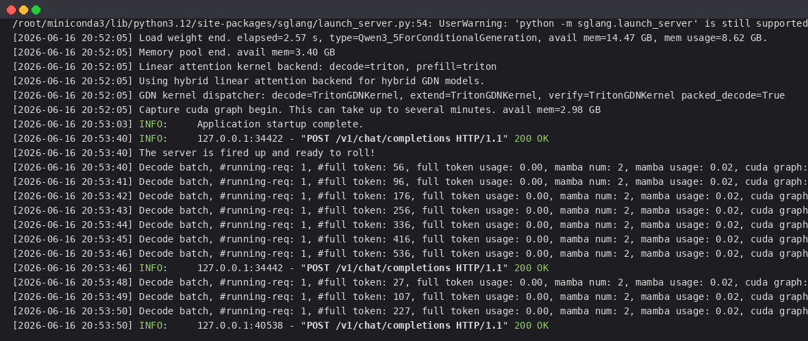
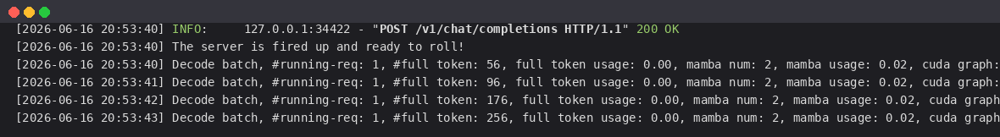

# 02-Qwen3.5-4B SGLang 部署调用

## SGLang 简介

`SGLang` 是一款专为大语言模型（LLM）/多模态模型设计的高性能推理与服务框架。它在提升大模型在复杂任务编排、长上下文处理及高并发请求下的执行效率方面表现出色，是连接底层硬件算力与上层 AI 应用的高效桥梁。对开发者而言，SGLang 极大简化了部署流程：

- **后端一键启动**：无需复杂的配置文件，一条命令即可完成环境适配与服务发布。
- **前端无缝对接**：直接沿用现有的 `OpenAI SDK` 或标准 `HTTP` 调用，无需额外的学习与适配成本。
- **高性能**：支持 `RadixAttention`（前缀复用）、连续批处理、CUDA Graph 等加速技术。
- **多模态**：原生支持视觉-语言模型，`Qwen3.5-4B` 可在其中提供图文服务。

> `Qwen3.5` 官方明确说明模型权重同时兼容 `Hugging Face Transformers`、`vLLM`、`SGLang`、`KTransformers` 等推理框架。本教程使用 `SGLang` 进行部署，**文中的启动日志与接口返回均为实测真实输出**。

## 关于 Qwen3.5-4B 架构

`Qwen3.5-4B` 采用**高效的混合架构**：将 **Gated Delta Network（门控增量网络，一种线性注意力）** 与传统全注意力（Full Attention）层交错堆叠（每 4 层中 3 层线性注意力 + 1 层全注意力）。SGLang 启动时会自动识别该混合架构，并为其选用 **Triton GDN 算子**（`TritonGDNKernel`），无需手动配置。

## 环境准备

本文实测基础环境如下：

```
----------------
ubuntu 22.04
python 3.12
NVIDIA 驱动 580.105.08（支持 CUDA 13.0）
GPU: RTX 4090 D (24G, sm89)
torch 2.11.0+cu128
sglang 0.5.13.post1
----------------
```

> 本文默认学习者已配置好 `Pytorch (cuda)` 环境，如未配置请先自行安装。

首先 `pip` 换源加速下载并安装依赖包：

```bash
python -m pip install --upgrade pip
pip config set global.index-url https://pypi.tuna.tsinghua.edu.cn/simple

pip install modelscope
pip install "transformers>=4.57"
pip install openai
```

安装 `SGLang`。`SGLang 0.5.13` 依赖 `torch==2.11.0`、`flashinfer==0.6.12` 等较重的栈，建议先装好带 CUDA 的 `torch`，再装 `sglang`：

```bash
# 1. 先装带 CUDA 的 torch（sglang 需要 torch==2.11.0）
pip install torch==2.11.0 torchvision==0.26.0 torchaudio==2.11.0 \
    --index-url https://download.pytorch.org/whl/cu128

# 2. 安装 sglang（会自动拉取 flashinfer、cutlass-dsl、humming-kernels 等依赖）
pip install "sglang[all]==0.5.13.post1"
```

> **关键：为 RTX 4090（sm89）安装匹配的 sglang-kernel**。默认从 PyPI 装的 `sglang-kernel` 是 CUDA 13 / sm90+（Hopper/Blackwell）构建，在 4090（sm89）上会报 `Could not load any common_ops library! Expected variant: SM89`。需要从 SGLang 官方的 `cu129` 索引安装 sm89 兼容版本：
>
> ```bash
> pip install sglang-kernel==0.4.3 --index-url https://docs.sglang.ai/whl/cu129/
> ```
>
> 若上述官方源下载较慢（GitHub releases），可借助代理镜像下载对应 wheel 后本地安装。

> **设置 CUDA 库搜索路径**。`SGLang` 的部分算子依赖 CUDA 运行库，需要把 `nvidia` 与 `torch` 的库目录加入 `LD_LIBRARY_PATH`：
>
> ```bash
> NVLIB=$(find /root/miniconda3/lib/python3.12/site-packages/nvidia -type d -name lib | tr '\n' ':')
> TLIB=/root/miniconda3/lib/python3.12/site-packages/torch/lib
> echo "export LD_LIBRARY_PATH=\${NVLIB}\${TLIB}:\${LD_LIBRARY_PATH:-}" >> ~/.bashrc
> source ~/.bashrc
> ```

> 考虑到部分同学配置环境可能会遇到一些问题，我们在 AutoDL 平台准备了运行的环境镜像，点击下方链接并直接创建 Autodl 示例即可。 https://www.autodl.art/i/datawhalechina/self-llm/Qwen3

## 模型下载

使用 modelscope 中的 `snapshot_download` 函数下载模型，第一个参数为模型名称，参数 `cache_dir` 为模型的下载路径。

新建 `model_download.py` 文件并在其中输入以下内容，粘贴代码后记得保存文件。

```python
# model_download.py
from modelscope import snapshot_download

model_dir = snapshot_download('Qwen/Qwen3.5-4B', cache_dir='/root/autodl-tmp')
print(f"模型下载完成，保存路径为：{model_dir}")
```

然后在终端中输入 `python model_download.py` 执行下载，这里需要耐心等待一段时间直到模型下载完成。

> 注意：记得修改 `cache_dir` 为你的模型下载路径哦~

## 启动 SGLang 服务

`Qwen3.5-4B` 为 4B 模型，单张 24G 显卡（如 RTX 4090）即可部署，无需张量并行。

### 命令行直接启动

```bash
python3 -m sglang.launch_server \
  --model-path /root/autodl-tmp/Qwen/Qwen3.5-4B \
  --served-model-name Qwen3.5-4B \
  --host 0.0.0.0 \
  --port 8000 \
  --mem-fraction-static 0.85 \
  --context-length 4096 \
  --trust-remote-code
```

> 新版 SGLang 推荐使用 `sglang serve ...` 入口（与 `python -m sglang.launch_server` 等价）。

常用参数说明：

- `--model-path`：模型路径
- `--served-model-name`：服务对外的模型名称
- `--mem-fraction-static`：静态显存占用比例（默认 0.88，显存紧张可调低，如 0.8）
- `--context-length`：最大上下文长度（4B 模型在 24G 显存上建议 `4096`，显存富余可调大）
- `--tp-size`：张量并行数，单卡部署无需设置；多卡可设为 GPU 数量
- `--trust-remote-code`：信任远程代码

启动过程中会打印大量日志，关键的实测启动日志如下（SGLang 识别出 `Qwen3_5ForConditionalGeneration`，并为混合架构的线性注意力层选用 Triton GDN 算子）：



对应的关键日志行（已去除颜色码）：

```bash
[20:52:05] Load weight end. elapsed=2.57 s, type=Qwen3_5ForConditionalGeneration, avail mem=14.47 GB, mem usage=8.62 GB.
[20:52:05] Memory pool end. avail mem=3.40 GB
[20:52:05] Linear attention kernel backend: decode=triton, prefill=triton
[20:52:05] Using hybrid linear attention backend for hybrid GDN models.
[20:52:05] GDN kernel dispatcher: decode=TritonGDNKernel, extend=TritonGDNKernel, verify=TritonGDNKernel packed_decode=True
[20:52:05] Capture cuda graph begin. This can take up to several minutes. avail mem=2.98 GB
[20:53:03] INFO:     Application startup complete.
[20:53:40] The server is fired up and ready to roll!
```

> 说明：首次启动会进行 CUDA graph 捕获（约 1 分钟），完成后出现 `The server is fired up and ready to roll!` 即说明服务成功启动。

### Python 启动脚本

也可用脚本启动，便于固定参数。新建 `start_server.py`：

```python
# start_server.py
from sglang.utils import launch_server_cmd, wait_for_server

cmd = (
    "python3 -m sglang.launch_server "
    "--model-path /root/autodl-tmp/Qwen/Qwen3.5-4B "
    "--served-model-name Qwen3.5-4B "
    "--host 0.0.0.0 --port 8000 "
    "--mem-fraction-static 0.85 "
    "--context-length 4096 "
    "--trust-remote-code"
)

server_process, port = launch_server_cmd(cmd, port=8000)
wait_for_server(f"http://127.0.0.1:{port}")
print(f"SGLang Server started: http://127.0.0.1:{port}")
```

```bash
python start_server.py
```

## 调用示例

以下示例均使用 `OpenAI` 官方 Python SDK 调用 SGLang 的 OpenAI 兼容接口。

### 查看模型列表

```bash
curl http://localhost:8000/v1/models
```

实测返回值如下所示（`owned_by` 为 `sglang`）：

```json
{
  "object": "list",
  "data": [
    {
      "id": "Qwen3.5-4B",
      "object": "model",
      "created": 1781614385,
      "owned_by": "sglang",
      "root": "Qwen3.5-4B",
      "parent": null,
      "max_model_len": 4096
    }
  ]
}
```

### 聊天对话（思考模式）

`Qwen3.5` 默认开启思考模式。在请求中通过 `chat_template_kwargs.enable_thinking` 控制：默认为 `True`（思考），设为 `False` 则不输出 `<think>` 标签。

```python
# test_chat.py
from openai import OpenAI

client = OpenAI(api_key="EMPTY", base_url="http://localhost:8000/v1")

# 思考模式（默认）：会先输出 <think> ... </think> 推理过程，再给出答案
response = client.chat.completions.create(
    model="Qwen3.5-4B",
    messages=[{"role": "user", "content": "5的阶乘是多少？"}],
    temperature=1.0,
    top_p=0.95,
    max_tokens=768,
    extra_body={"chat_template_kwargs": {"enable_thinking": True}},
)
print(response.choices[0].message.content)
```

```bash
python test_chat.py
```

实测输出包含 `<think> ... </think>` 思考过程与最终答案：

```
Here's a thinking process that leads to the answer:

1. **Analyze the Request:** 用户问的是 5 的阶乘 ...
2. **Define Factorial:** n! = n × (n-1) × ... × 1
3. **Calculate 5!:** 5 × 4 = 20, 20 × 3 = 60, 60 × 2 = 120, 120 × 1 = 120
...
</think>

5 的阶乘（记作 5!）是 **120**。

计算过程如下：
$$5! = 5 \times 4 \times 3 \times 2 \times 1 = 120$$
```

### 非思考模式

```python
response = client.chat.completions.create(
    model="Qwen3.5-4B",
    messages=[{"role": "user", "content": "用一句话介绍深度学习。"}],
    extra_body={"chat_template_kwargs": {"enable_thinking": False}},
)
print(response.choices[0].message.content)
```

> 实测发现：`Qwen3.5-4B` 即使在非思考模式下，也可能在 `content` 开头先输出一段简短的「思考过程」文字（不再用 `<think>` 标签包裹），随后才给出最终回答，且 `max_tokens` 较小时容易被截断（`finish_reason: length`）。如需直接、简短的回答，可适当调大 `max_tokens` 或换用更大的型号。

### 运行时日志

在请求处理过程中，SGLang 后端会持续打印解码批次的统计信息（运行请求数、token 用量、生成吞吐等）。实测运行时日志如下：



```bash
[20:53:40] INFO:     127.0.0.1:34422 - "POST /v1/chat/completions HTTP/1.1" 200 OK
[20:53:40] The server is fired up and ready to roll!
[20:53:41] Decode batch, #running-req: 1, #full token: 96, full token usage: 0.00, mamba num: 2, mamba usage: 0.02, cuda graph: True, gen throughput (token/s): 87.62, #queue-req: 0
[20:53:43] Decode batch, #running-req: 1, #full token: 256, ..., gen throughput (token/s): 86.93, #queue-req: 0
[20:53:46] INFO:     127.0.0.1:34442 - "POST /v1/chat/completions HTTP/1.1" 200 OK
```

> 日志中的 `mamba num: 2` 反映了混合架构中线性注意力（GDN/Mamba 式）状态的使用情况；`gen throughput (token/s): 87.62` 为实测单请求解码吞吐。

### 流式输出（Streaming）

```python
# test_streaming.py
from openai import OpenAI

client = OpenAI(api_key="EMPTY", base_url="http://localhost:8000/v1")

stream = client.chat.completions.create(
    model="Qwen3.5-4B",
    messages=[{"role": "user", "content": "请用三句话介绍量子计算。"}],
    stream=True,
    temperature=1.0,
    top_p=0.95,
    max_tokens=2048,
    extra_body={"chat_template_kwargs": {"enable_thinking": True}},
)

for chunk in stream:
    delta = chunk.choices[0].delta
    if delta and delta.content:
        print(delta.content, end="", flush=True)
```

```bash
python test_streaming.py
```

### 多模态（图文）调用示例

`Qwen3.5-4B` 自带视觉编码器，SGLang 部署后可直接接收图像输入：

```python
# test_multimodal.py
from openai import OpenAI

client = OpenAI(api_key="EMPTY", base_url="http://localhost:8000/v1")

response = client.chat.completions.create(
    model="Qwen3.5-4B",
    messages=[{
        "role": "user",
        "content": [
            {"type": "image_url", "image_url": {"url": "https://example.com/image.jpg"}},
            {"type": "text", "text": "请描述这张图片的内容。"},
        ],
    }],
)
print(response.choices[0].message.content)
```

> 提示：若只需文本服务、希望进一步节省显存，可在启动时通过 `--limit-mm-per-prompt` 关闭图像输入。

## 小结

| 推理框架 | 适用场景 | 特点 |
| --- | --- | --- |
| **vLLM** | 高吞吐文本/多模态服务 | PagedAttention、生态成熟、OpenAI 兼容 |
| **SGLang** | 复杂编排、长上下文、高并发 | RadixAttention 前缀复用、CUDA Graph、结构化输出 |

`Qwen3.5-4B` 作为高效的混合架构模型，在 `vLLM` 与 `SGLang` 中均可一键部署。两者都能自动识别其 GDN 线性注意力层（vLLM 用 `Triton/FLA GDN`，SGLang 用 `TritonGDNKernel`），并结合其默认的思维链能力与多模态底座，支撑对话、推理与图文理解等多种应用场景。
