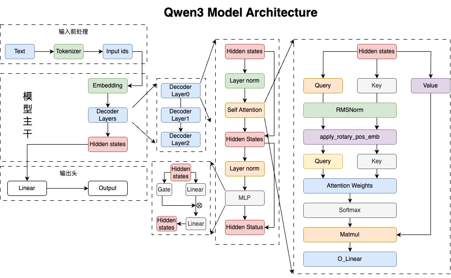
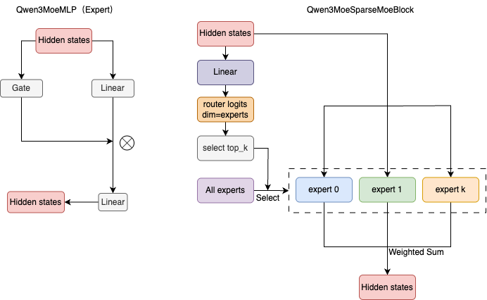
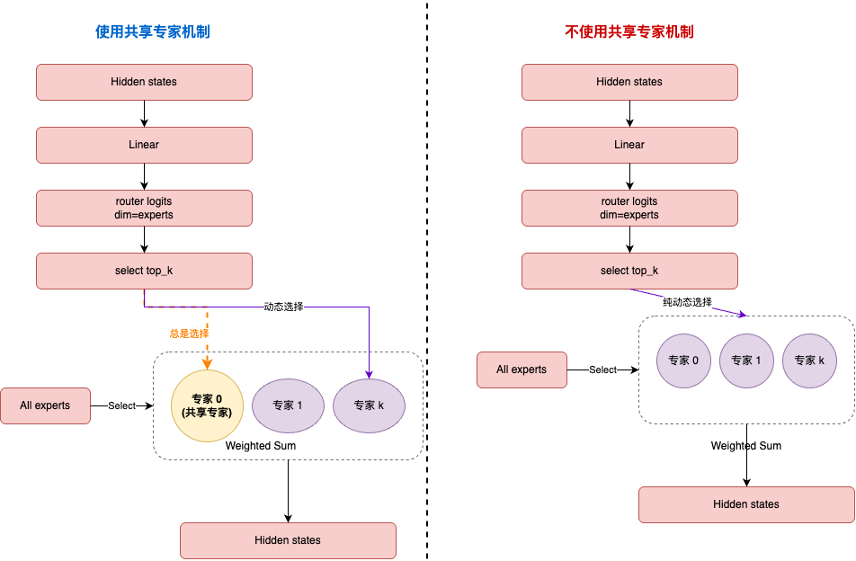

# Qwen3 模型结构解析 Blog

## Qwen3 模型结构详解



### 主干网络
大部分和Qwen2没有变化，可以参照：[https://github.com/datawhalechina/tiny-universe/tree/main/content/Qwen-blog](https://github.com/datawhalechina/tiny-universe/tree/main/content/Qwen-blog)


### 与Qwen2 对比分析

Qwen3Attention相较于Qwen2Attention增加了对q和k的标准化， 在计算q、k矩阵后进行RMSNorm。有助于消除不同token之间可能存在的尺度差异，使得注意力机制更加专注于token之间的相对关系而非绝对幅值，从而提升模型的稳定性与泛化能力。相较于LayerNorm而言，该处理既保持了归一化的好处，又降低了计算成本，更适合部署于高效模型中。

```python
# Qwen2Attention
query_states = self.q_proj(hidden_states).view(hidden_shape).transpose(1, 2)
key_states = self.k_proj(hidden_states).view(hidden_shape).transpose(1, 2)

# Qwen3Attention
self.q_norm = Qwen3RMSNorm(self.head_dim, eps=config.rms_norm_eps)
self.k_norm = Qwen3RMSNorm(self.head_dim, eps=config.rms_norm_eps)
# 推理时，在计算完q、k矩阵后进行RMSNorm
query_states = self.q_norm(self.q_proj(hidden_states).view(hidden_shape)).transpose(1, 2)
key_states = self.k_norm(self.k_proj(hidden_states).view(hidden_shape)).transpose(1, 2)
```


## Qwen3 MoE 结构详解

### MoE机制
MoE（Mixture of Experts）是一种用于提高模型泛化能力的技术。它的基本思想是将模型的计算任务分解成多个独立的专家（Experts），每个专家负责处理特定的任务，然后通过一个门控机制（Gate）来选择哪些专家来处理当前的输入。在LLM中，MoE通常应用于Attention之后的MLP层。

MLP层被分为若干个专家，每个专家是一个Qwen3MoeMLP实例
```python
class Qwen3MoeMLP(nn.Module):
    def __init__(self, config, intermediate_size=None):
        super().__init__()
        self.config = config
        self.hidden_size = config.hidden_size
        self.intermediate_size = intermediate_size if intermediate_size is not None else config.intermediate_size
        self.gate_proj = nn.Linear(self.hidden_size, self.intermediate_size, bias=False)
        self.up_proj = nn.Linear(self.hidden_size, self.intermediate_size, bias=False)
        self.down_proj = nn.Linear(self.intermediate_size, self.hidden_size, bias=False)
        self.act_fn = ACT2FN[config.hidden_act]

    def forward(self, x):
        down_proj = self.down_proj(self.act_fn(self.gate_proj(x)) * self.up_proj(x))
        return down_proj
```
在MoeMLP中，每个专家都有一个gate_proj和up_proj，而不是单纯的一个线性层（和非MoE模型的MLP层一样）。

`Qwen3MoeSparseMoeBlock`就是用于替换原始MLP层的模块，它包含多个`Qwen3MoeMLP`实例，每个实例对应一个专家。
```python
self.gate = nn.Linear(config.hidden_size, config.num_experts, bias=False)
"""
定义gate，用于选择哪些专家来处理当前的输入。
gate的输出是一个形状为(batch_size, seq_len, num_experts)的张量，
其中每个元素表示对应位置的输入应该分配给哪个专家。
"""
self.experts = nn.ModuleList(
    [Qwen3MoeMLP(config, intermediate_size=config.moe_intermediate_size) for _ in range(self.num_experts)]
)
"""
定义experts，是一个ModuleList，包含多个Qwen3MoeMLP实例。
每个Qwen3MoeMLP实例对应一个专家，负责处理特定的任务。
"""
```

Hidden States经过线性层后输出到Gate，Gate的输出是一个形状为(batch_size, seq_len, num_experts)的张量，其中每个元素表示对应位置的输入应该分配给哪个专家的概率。在每个专家计算完成后，将结果加权求和得到最终的输出。


MoE计算过程代码解读：
```python
router_logits = self.gate(hidden_states)  # 计算选中的专家的logits
routing_weights = F.softmax(router_logits, dim=1, dtype=torch.float)  # 归一化权重

# 遍历每个expert。（为什么不是遍历tokens？因为有很多tokens，为每个token都要分配若干的experts，所以几乎每个expert都会被用到。且由于expert数量往往小于token数量，这样可以增大并行性）
for expert_idx in range(self.num_experts):
    expert_layer = self.experts[expert_idx]
    idx, top_x = torch.where(expert_mask[expert_idx])  # 返回当前expert被选中的tokens的索引和排名

    current_state = hidden_states[None, top_x].reshape(-1, hidden_dim)
    current_hidden_states = expert_layer(current_state) * routing_weights[top_x, idx, None]

    final_hidden_states.index_add_(0, top_x, current_hidden_states.to(hidden_states.dtype))
```


### MoeAttention改进

### SparseMoeBlock


在 `Qwen3MoeSparseMoeBlock` 中，去除了 `Qwen2MoeSparseMoeBlock` 中的共享专家机制，简化了模型的结构。在 `Qwen2` 中，每次都使用一个共享的专家网络来处理输入，增加了计算的复杂性和额外的参数。而在 `Qwen3` 中，去除了共享专家部分，模型只依赖于通过门控机制选择的专家进行计算，从而减少了不必要的计算步骤和资源消耗。`Qwen3` 的计算更加高效，避免了不必要的冗余操作，可以提升整体的性能和速度。

代码解释：
```python
# Qwen2MoeSparseMoeBlock中，将选中的专家和共享专家一起使用；Qwen3MoeSparseMoeBlock中，只使用了选中的专家
final_hidden_states = final_hidden_states + shared_expert_output
```
