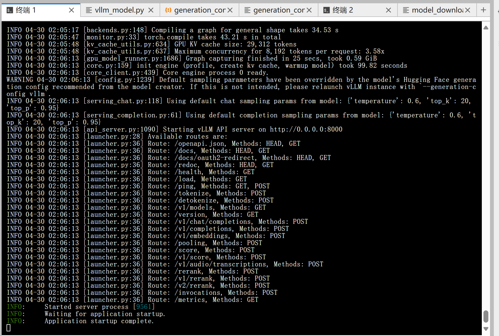
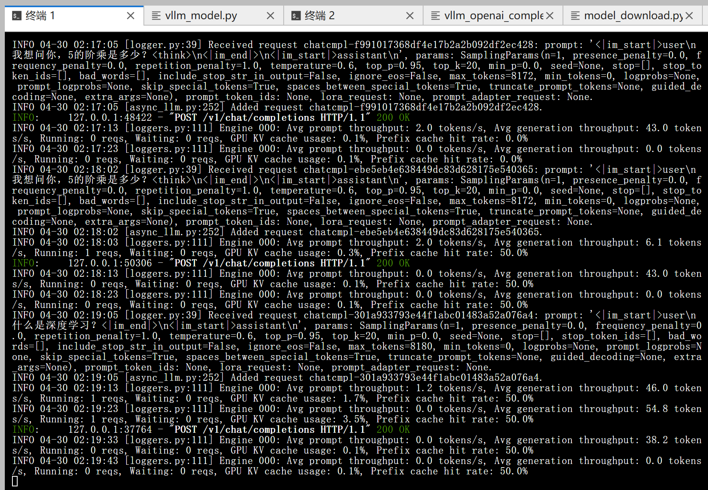

# 02-Qwen3-8B vLLM 部署调用

## **vLLM 简介**

`vLLM` 框架是一个高效的大语言模型**推理和部署服务系统**，具备以下特性：

- **高效的内存管理**：通过 `PagedAttention` 算法，`vLLM` 实现了对 `KV` 缓存的高效管理，减少了内存浪费，优化了模型的运行效率。
- **高吞吐量**：`vLLM` 支持异步处理和连续批处理请求，显著提高了模型推理的吞吐量，加速了文本生成和处理速度。
- **易用性**：`vLLM` 与 `HuggingFace` 模型无缝集成，支持多种流行的大型语言模型，简化了模型部署和推理的过程。兼容 `OpenAI` 的 `API` 服务器。
- **分布式推理**：框架支持在多 `GPU` 环境中进行分布式推理，通过模型并行策略和高效的数据通信，提升了处理大型模型的能力。
- **开源共享**：`vLLM` 由于其开源的属性，拥有活跃的社区支持，这也便于开发者贡献和改进，共同推动技术发展。

## 环境准备

本文基础环境如下：

```
----------------
ubuntu 22.04
python 3.12
cuda 12.4
pytorch 2.5.1
----------------
```

> 本文默认学习者已配置好以上 `Pytorch (cuda)` 环境，如未配置请先自行安装。

首先 `pip` 换源加速下载并安装依赖包

```bash
python -m pip install --upgrade pip
pip config set global.index-url https://pypi.tuna.tsinghua.edu.cn/simple

pip install modelscope
pip install vllm
```

> 考虑到部分同学配置环境可能会遇到一些问题，我们在 AutoDL 平台准备了 Qwen3 的环境镜像，点击下方链接并直接创建 Autodl 示例即可。
> ***https://www.codewithgpu.com/i/datawhalechina/self-llm/Qwen3***

## 模型下载

使用 modelscope 中的 snapshot_download 函数下载模型，第一个参数为模型名称，参数 cache_dir 为模型的下载路径。

新建 `model_download.py` 文件并在其中输入以下内容，粘贴代码后记得保存文件。

```python
from modelscope import snapshot_download

model_dir = snapshot_download('Qwen/Qwen3-8B', cache_dir='/root/autodl-tmp', revision='master')
```

然后在终端中输入 `python model_download.py` 执行下载，这里需要耐心等待一段时间直到模型下载完成。

> 注意：记得修改 `cache_dir` 为你的模型下载路径哦~

## **代码准备**

### **Python 脚本**

新建 `vllm_model.py` 文件并在其中输入以下内容，粘贴代码后请及时保存文件。下面的代码有很详细的注释，如有不理解的地方，欢迎大家提 `issue`。

首先从 `vLLM` 库中导入 `LLM` 和 `SamplingParams` 类。`LLM` 类是使用 `vLLM` 引擎运行离线推理的主要类。`SamplingParams` 类指定采样过程的参数，用于控制和调整生成文本的随机性和多样性。

`vLLM` 提供了非常方便的封装，我们直接传入模型名称或模型路径即可，不必手动初始化模型和分词器。

然后，通过使用分词器的 apply_chat_template 函数，将我们的 prompt（提示词）格式化为模型所需的输入格式。

默认情况下，Qwen3 启用了思考能力，类似于 QwQ-32B。这意味着该模型将利用其推理能力来提升生成回答的质量。例如，当在 tokenizer.apply_chat_template 中显式设置 enable_thinking=True 或保留其默认值时，模型将进入思考模式。

我们可以通过这个代码示例熟悉下 ` vLLM` 引擎的使用方式。被注释的部分内容可以丰富模型的能力，但不是必要的，大家可以按需选择，自己多多动手尝试 ~

```python
from vllm import LLM, SamplingParams
from transformers import AutoTokenizer
import os
import json

# 自动下载模型时，指定使用modelscope; 否则，会从HuggingFace下载
os.environ['VLLM_USE_MODELSCOPE']='True'

def get_completion(prompts, model, tokenizer=None, temperature=0.6, top_p=0.95, top_k=20, min_p=0, max_tokens=4096, max_model_len=8192):
    stop_token_ids = [151645, 151643]
    # 创建采样参数。temperature 控制生成文本的多样性，top_p 控制核心采样的概率，top_k 通过限制候选词的数量来控制生成文本的质量和多样性, min_p 通过设置概率阈值来筛选候选词，从而在保证文本质量的同时增加多样性
    sampling_params = SamplingParams(temperature=temperature, top_p=top_p, top_k=top_k, min_p=min_p, max_tokens=max_tokens, stop_token_ids=stop_token_ids)  # max_tokens 用于限制模型在推理过程中生成的最大输出长度
    # 初始化 vLLM 推理引擎
    llm = LLM(model=model, tokenizer=tokenizer, max_model_len=max_model_len,trust_remote_code=True)  # max_model_len 用于限制模型在推理过程中可以处理的最大输入和输出长度之和。
    outputs = llm.generate(prompts, sampling_params)
    return outputs


if __name__ == "__main__":
    # 初始化 vLLM 推理引擎
    model='/root/autodl-tmp/Qwen/Qwen3-8B' # 指定模型路径
    tokenizer = AutoTokenizer.from_pretrained(model, use_fast=False) # 加载分词器

    prompt = "给我一个关于大模型的简短介绍。"
    messages = [
        {"role": "user", "content": prompt}
    ]
    text = tokenizer.apply_chat_template(
        messages,
        tokenize=False,
        add_generation_prompt=True,
        enable_thinking=True  # 是否开启思考模式，默认为 True
    )

    outputs = get_completion(text, model, tokenizer=None, temperature=0.6, top_p = 0.95, top_k=20, min_p=0)  # 对于思考模式，官方建议使用以下参数：temperature = 0.6，TopP = 0.95，TopK = 20，MinP = 0。

    # 输出是一个包含 prompt、生成文本和其他信息的 RequestOutput 对象列表。
    # 打印输出。
    for output in outputs:
        prompt = output.prompt
        generated_text = output.outputs[0].text
        print(f"Prompt: {prompt!r}, \nResponse: {generated_text!r}")
```

运行代码

```bash
python vllm_model.py
```

结果如下：

```bash
Prompt: '<|im_start|>user\n给我一个关于大模型的简短介绍。<|im_end|>\n<|im_start|>assistant\n',
Response: '<think>\n好的，用户让我给他一个关于大模型的简短介绍。首先，我需要确定“大模型”指的是什么。通常来说，大模型指的是大规模预训练模型，比如像GPT、BERT这样的深度学习模型。用户可能对AI领域不太熟悉，所以需要解释清楚基本概念。\n\n接下来，我要考虑用户的需求。他们可能是在寻找一个简短的概述，不需要太技术性的术语，但又要涵盖关键点。可能需要包括定义、特点、应用领域以及优势。不过用户要求的是简短，所以不能太冗长。\n\n然后，我需要检查是否有遗漏的重要信息。比如，大模型的规模通常以参数量衡量，比如百亿或千亿参数。此外，它们通常使用Transformer架构，这可能需要提到。另外，应用场景如自然语言处理、图像识别、语音处理等也是重点。\n\n还要注意用户可能的背景。如果是普通用户，可能需要更通俗的解释，避免使用太多专业术语。但如果是技术人员，可能需要更详细的技术细节。不过用户没有说明，所以保持中立，简明扼要。\n\n另外，用户可能想知道大模型的优势，比如强大的泛化能力、多任务处理能力，以及在不同领域的应用实例。同时，可能存在的挑战，比如计算资源需求高、训练成本大，这些是否需要提及？但用户要的是简短介绍，可能不需要深入讨论缺点。\n\n最后，确保语言简洁，结构清晰，分点或分段说明。可能需要用一两句话概括定义，接着说明特点，然后应用领域，最后总结优势。这样用户能快速抓住重点。\n</think>\n\n大模型（Large Language Models, LLMs）是基于深度学习的先进人工智能技术，通过海量文本数据训练，具备强大的语言理解和生成能力。它们通常拥有数十亿至数千亿参数，能够完成文本生成、问答、翻译、编程等复杂任务，广泛应用于智能助手、内容创作、数据分析等领域，显著提升了人机交互的效率与智能化水平。'
```

模型的 response 由两部分组成，一部分是思考过程，用\<think>和\</think>包裹住，另一部分是最终答案，在\</think>标识符之后。

如果不需要开启思考模式，只需要将参数 ensure_thinking 设置为 False。例如：

```python
from vllm import LLM, SamplingParams
from transformers import AutoTokenizer
import os
import json

# 自动下载模型时，指定使用modelscope; 否则，会从HuggingFace下载
os.environ['VLLM_USE_MODELSCOPE']='True'

def get_completion(prompts, model, tokenizer=None, temperature=0.6, top_p=0.95, top_k=20, min_p=0, max_tokens=4096, max_model_len=8192):
    stop_token_ids = [151645, 151643]
    # 创建采样参数。
    sampling_params = SamplingParams(temperature=temperature, top_p=top_p, top_k=top_k, min_p=min_p, max_tokens=max_tokens, stop_token_ids=stop_token_ids)
    # 初始化 vLLM 推理引擎
    llm = LLM(model=model, tokenizer=tokenizer, max_model_len=max_model_len,trust_remote_code=True)
    outputs = llm.generate(prompts, sampling_params)
    return outputs


if __name__ == "__main__":
    # 初始化 vLLM 推理引擎
    model='/root/autodl-tmp/Qwen/Qwen3-8B' # 指定模型路径
    tokenizer = AutoTokenizer.from_pretrained(model, use_fast=False) # 加载分词器

    prompt = "你是谁？"
    messages = [
        {"role": "user", "content": prompt}
    ]
    text = tokenizer.apply_chat_template(
        messages,
        tokenize=False,
        add_generation_prompt=True,
        enable_thinking=False  # 是否开启思考模式，默认为 True
    )

    outputs = get_completion(text, model, tokenizer=None, temperature=0.7, top_p = 0.8, top_k=20, min_p=0)  # 对于非思考模式，官方建议使用以下参数：temperature = 0.7，TopP = 0.8，TopK = 20，MinP = 0。

    # 输出是一个包含 prompt、生成文本和其他信息的 RequestOutput 对象列表。
    # 打印输出。
    for output in outputs:
        prompt = output.prompt
        generated_text = output.outputs[0].text
        print(f"Prompt: {prompt!r},Response: {generated_text!r}")
```

结果如下：

```bash
Prompt: '<|im_start|>user\n你是谁？<|im_end|>\n<|im_start|>assistant\n<think>\n\n</think>\n\n',
Response: '我是通义千问，由通义实验室研发的超大规模语言模型。我能够回答各种问题、创作文字，比如写故事、写邮件、写剧本，还能进行逻辑推理、多语言理解、代码编写等。我旨在成为你最得力的助手，帮助你解决各种问题。有什么我可以帮你的吗？'
```

### 创建兼容 OpenAI API 接口的服务器

`Qwen3-8B` 兼容 `OpenAI API` 协议，所以我们可以直接使用 `vLLM` 创建 `OpenAI API` 服务器。`vLLM` 部署实现 `OpenAI API` 协议的服务器非常方便。默认会在 http://localhost:8000 启动服务器。服务器当前一次托管一个模型，并实现列表模型、`completions` 和 `chat completions` 端口。

- `completions`：是基本的文本生成任务，模型会在给定的提示后生成一段文本。这种类型的任务通常用于生成文章、故事、邮件等。
- `chat completions`：是面向对话的任务，模型需要理解和生成对话。这种类型的任务通常用于构建聊天机器人或者对话系统。

在创建服务器时，我们可以指定模型名称、模型路径、聊天模板等参数。

- `--host` 和 `--port` 参数指定地址。
- `--model` 参数指定模型名称。
- `--chat-template` 参数指定聊天模板。
- `--served-model-name` 指定服务模型的名称。
- `--max-model-len` 指定模型的最大长度。
- `--enable-reasoning` 开启思考模式
- `--reasoning-parser` 指定如何解析模型生成的推理内容。设置 --enable-reasoning 参数时，--reasoning-parser 是必需的。推理模型会在输出中包含一个额外的 reasoning_content 字段，该字段包含导致最终结论的推理步骤。通过指定合适的解析器，可以正确提取和格式化这些推理内容。例如 deepseek_r1 解析器适用于 DeepSeek R1 系列模型，能够解析 <think> ... </think> 格式的内容

我们复制以下命令到终端上，就可以成功启动 Qwen3-8 B 模型的 API 接口

```bash
VLLM_USE_MODELSCOPE=true vllm serve /root/autodl-tmp/Qwen/Qwen3-8B --served-model-name Qwen3-8B --max_model_len 8192 --enable-reasoning --reasoning-parser deepseek_r1
```

加载完毕后出现如下信息说明服务成功启动



- 通过 `curl` 命令查看当前的模型列表

```bash
curl http://localhost:8000/v1/models
```

​ 得到的返回值如下所示

```json
{
  "object": "list",
  "data": [
    {
      "id": "Qwen3-8B",
      "object": "model",
      "created": 1745950421,
      "owned_by": "vllm",
      "root": "/root/autodl-tmp/Qwen/Qwen3-8B",
      "parent": null,
      "max_model_len": 8192,
      "permission": [
        {
          "id": "modelperm-3f20f566536d445cbfbf5a9ddb115204",
          "object": "model_permission",
          "created": 1745950421,
          "allow_create_engine": false,
          "allow_sampling": true,
          "allow_logprobs": true,
          "allow_search_indices": false,
          "allow_view": true,
          "allow_fine_tuning": false,
          "organization": "*",
          "group": null,
          "is_blocking": false
        }
      ]
    }
  ]
}
```

- 使用 `curl` 命令测试 `OpenAI Completions API`

```bash
curl http://localhost:8000/v1/completions \
    -H "Content-Type: application/json" \
    -d '{
        "model": "Qwen3-8B",
        "prompt": "我想问你，5的阶乘是多少？<think>\n",
        "max_tokens": 1024,
        "temperature": 0
    }'
```

​ 得到的返回值如下所示

```json
{
  "id": "cmpl-fb7fa8e981164942b1e126afe43b2acf",
  "object": "text_completion",
  "created": 1745950506,
  "model": "Qwen3-8B",
  "choices": [
    {
      "index": 0,
      "text": "嗯，好的，我现在要算5的阶乘是多少。首先，我得回忆一下阶乘的定义。阶乘就是从1乘到那个数本身，对吧？比如n的阶乘就是n×(n-1)×(n-2)×…×1。那这样的话，5的阶乘应该是5×4×3×2×1。不过，我是不是应该再仔细确认一下这个定义有没有错误？\n\n让我再想想，比如3的阶乘是3×2×1=6，对吧？那4的阶乘就是4×3×2×1=24，对吗？那5的阶乘应该就是5×4×3×2×1。那这样的话，先算5×4=20，然后20×3=60，接着60×2=120，最后120×1=120。所以结果应该是120？\n\n不过，有没有可能我哪里算错了？比如，是不是有时候阶乘的定义是从0开始？比如0的阶乘是1？不过题目是问5的阶乘，所以应该没问题。那再检查一下每一步的乘法是否正确。\n\n首先，5×4=20，没错。然后20×3=60，对的。接下来60×2=120，没错。最后乘以1的话，结果还是120。所以应该是对的。\n\n或者有没有可能我漏掉了某个步骤？比如，是不是应该包括更多的数？比如，5的阶乘是不是应该包括5×4×3×2×1，而没有其他数？是的，没错。所以结果应该是120。\n\n不过，为了确保万无一失，我可以换一种方式计算。比如，先算4的阶乘是24，然后5的阶乘就是5×24=120。这样是不是更快捷？是的，这样算的话，结果也是一样的。所以两种方法都得到120，应该没错。\n\n或者，我可以使用计算器来验证一下，不过现在假设没有计算器的话，手动计算应该没问题。再试一次：5×4=20，20×3=60，60×2=120，120×1=120。没错，结果一致。\n\n所以，我觉得5的阶乘应该是120。不过，有没有可能我记错了阶乘的定义？比如，是不是有时候阶乘是从0开始的？比如，0! =1，1! =1，2! =2，3! =6，4! =24，5! =120。是的，这样看来是对的。所以答案应该是120。\n\n或者，有没有可能题目中的阶乘有其他定义？比如，某些特殊情况下有不同的定义？不过一般来说，阶乘的标准定义就是n! =n×(n-1)×…×1，所以应该没问题。\n\n总之，经过多次验证，我觉得5的阶乘是120。\n</think>\n\n5的阶乘（记作5!）是通过将从1到5的所有正整数相乘得到的。具体计算过程如下：\n\n$$\n5! = 5 \\times 4 \\times 3 \\times 2 \\times 1\n$$\n\n分步计算：\n1. $5 \\times 4 = 20$\n2. $20 \\times 3 = 60$\n3. $60 \\times 2 = 120$\n4. $120 \\times 1 = 120$\n\n因此，**5的阶乘是120**。\n\n**答案：120**",
      "logprobs": null,
      "finish_reason": "stop",
      "stop_reason": null,
      "prompt_logprobs": null
    }
  ],
  "usage": {
    "prompt_tokens": 12,
    "total_tokens": 797,
    "completion_tokens": 785,
    "prompt_tokens_details": null
  }
}
```

- 用 `Python` 脚本请求 `OpenAI Completions API`

```python
# vllm_openai_completions.py
from openai import OpenAI
client = OpenAI(
    base_url="http://localhost:8000/v1",
    api_key="sk-xxx", # 随便填写，只是为了通过接口参数校验
)

completion = client.chat.completions.create(
  model="Qwen3-8B",
  messages=[
    {"role": "user", "content": "我想问你，5的阶乘是多少？<think>\n"}
  ]
)

print(completion.choices[0].message)
```

```shell
python vllm_openai_completions.py
```

​ 得到的返回值如下所示

```
ChatCompletionMessage(content='\n\n5的阶乘（记作5!）是将1到5的所有正整数相乘的结果。计算过程如下：\n\n$$\n5! = 5 \\times 4 \\times 3 \\times 2 \\times 1 = 120\n$$\n\n**答案：** 5的阶乘是 **120**。', refusal=None, role='assistant', annotations=None, audio=None, function_call=None, tool_calls=[], reasoning_content='\n嗯，用户问的是5的阶乘是多少。首先，我得确认阶乘的定义。阶乘就是从1乘到那个数，对吧？比如n的阶乘是n×(n-1)×...×1。那5的阶乘就是5×4×3×2×1。\n\n不过，我得仔细检查一下，别搞错了。有时候可能会有计算错误，比如把某个数漏掉或者乘错。比如，5×4是20，然后20×3是60，接着60×2是120，最后120×1还是120。所以结果应该是120。\n\n但用户可能是个刚开始学数学的学生，或者对阶乘不太熟悉，所以需要确认是否理解正确。或者他们可能在做作业，需要快速得到答案。也有可能他们想确认自己计算的正确性，所以给出详细的步骤会更好。\n\n另外，有没有可能用户问的是其他类型的阶乘？比如递归定义或者其他变种？不过一般来说，阶乘都是指标准的n!，所以应该没问题。再想想，有没有可能用户输入有误？比如是不是5的阶乘还是别的数？不过问题明确说是5，所以应该没问题。\n\n再检查一遍计算过程：5×4=20，20×3=60，60×2=120，120×1=120。没错，结果确实是120。所以答案应该是120。不过为了确保万无一失，可以再用另一种方式计算，比如分步计算或者用计算器验证。但作为思考过程，这里已经足够详细了。\n')
```

- 用 `curl` 命令测试 `OpenAI Chat Completions API`

```bash
curl http://localhost:8000/v1/chat/completions \
    -H "Content-Type: application/json" \
    -d '{
        "model": "Qwen3-8B",
        "messages": [
            {"role": "user", "content": "我想问你，5的阶乘是多少？<think>\n"}
        ]
    }'
```

得到的返回值如下所示

```json
{
  "id": "chatcmpl-ebe5eb4e638449dc83d628175e540365",
  "object": "chat.completion",
  "created": 1745950682,
  "model": "Qwen3-8B",
  "choices": [
    {
      "index": 0,
      "message": {
        "role": "assistant",
        "reasoning_content": "\n嗯，用户问的是5的阶乘是多少。首先，我得确认阶乘的定义。阶乘就是从1乘到那个数，对吧？比如n的阶乘是n×(n-1)×...×1。所以5的阶乘应该是5×4×3×2×1。让我算一下，5乘4是20，然后20乘3是60，接着60乘2是120，最后120乘1还是120。所以答案应该是120。不过，我得再检查一遍，确保没有算错。或者有没有可能用户问的是别的什么？比如有时候可能会有其他数学概念混淆，但阶乘通常就是这个意思。再想想，有没有可能用户输入的时候有错别字？比如“阶乘”是不是别的词？不过看起来没问题。再确认一下计算步骤，5×4=20，没错；20×3=60，对的；60×2=120，没错；120×1=120。没错，应该是对的。或者有没有可能用户需要更详细的解释？比如阶乘的定义或者应用场景？不过问题直接问的是数值，所以直接回答结果应该就可以了。不过有时候用户可能不太清楚阶乘的概念，可能需要简单说明一下。不过根据问题，用户可能已经知道阶乘是什么，只是需要数值。所以直接给出答案120应该没问题。再想想有没有其他可能的错误，比如计算顺序或者乘法错误？比如有没有可能把5×4×3×2×1算成别的？比如5×4=20，20×3=60，60×2=120，120×1=120，没错。或者有没有可能用户问的是5的幂次？比如5的5次方是3125，但那是不同的概念。不过用户明确说是阶乘，所以应该没问题。总之，答案应该是120。\n",
        "content": "\n\n5的阶乘（记作5!）是5×4×3×2×1，计算结果为：\n\n**5! = 5 × 4 × 3 × 2 × 1 = 120**\n\n所以，5的阶乘是 **120**。",
        "tool_calls": []
      },
      "logprobs": null,
      "finish_reason": "stop",
      "stop_reason": null
    }
  ],
  "usage": {
    "prompt_tokens": 20,
    "total_tokens": 511,
    "completion_tokens": 491,
    "prompt_tokens_details": null
  },
  "prompt_logprobs": null
}
```

- 用 `Python` 脚本请求 `OpenAI Chat Completions API`

```python
# vllm_openai_chat_completions.py
from openai import OpenAI
openai_api_key = "sk-xxx" # 随便填写，只是为了通过接口参数校验
openai_api_base = "http://localhost:8000/v1"

client = OpenAI(
    api_key=openai_api_key,
    base_url=openai_api_base,
)

chat_outputs = client.chat.completions.create(
    model="Qwen3-8B",
    messages=[
        {"role": "user", "content": "什么是深度学习？"},
    ]
)
print(chat_outputs)
```

```shell
python vllm_openai_chat_completions.py
```

得到的返回值如下所示

```
ChatCompletion(id='chatcmpl-301a933793e44f1abc01483a52a076a4', choices=[Choice(finish_reason='stop', index=0, logprobs=None, message=ChatCompletionMessage(content='\n\n深度学习（Deep Learning）是**机器学习**的一个子领域，专注于通过模拟人脑神经网络的结构和功能来实现对复杂模式的识别和学习。它的核心思想是使用**多层神经网络**（即“深度”）来自动从数据中提取特征并进行决策，从而解决传统机器学习难以处理的问题。\n\n---\n\n### **核心概念**\n1. **神经网络（Neural Network）**  \n   深度学习的基础是**人工神经网络**（Artificial Neural Network, ANN），它由大量相互连接的节点（神经元）组成，分为输入层、隐藏层和输出层。每一层通过非线性变换将数据从低级特征逐步抽象到高级特征。\n\n2. **深度（Depth）**  \n   “深度”指的是网络中**隐藏层的数量**。传统神经网络可能只有1-2层，而深度学习通常使用**多层（如10层以上）**的网络，从而能捕捉更复杂的模式。\n\n3. **自动特征提取**  \n   与传统机器学习（如SVM、决策树）需要人工设计特征不同，深度学习通过多层网络**自动学习特征**。例如，识别图像中的猫时，网络会自动从像素中学习边缘、纹理、形状等特征，最终识别出猫。\n\n---\n\n### **关键特点**\n- **非线性建模**：通过激活函数（如ReLU、Sigmoid）实现复杂非线性关系的建模。\n- **端到端学习**：从原始数据直接到最终输出，无需人工干预中间步骤。\n- **大规模数据依赖**：需要大量数据训练，但通过数据增强和迁移学习可缓解这一问题。\n- **可解释性差**：模型内部的决策过程难以直观理解（“黑箱”问题）。\n\n---\n\n### **典型应用场景**\n1. **计算机视觉**  \n   - 图像分类（如ResNet、VGG）\n   - 目标检测（如YOLO、Faster R-CNN）\n   - 图像生成（如GAN、StyleGAN）\n\n2. **自然语言处理（NLP）**  \n   - 机器翻译（如Transformer、BERT）\n   - 文本生成（如GPT、T5）\n   - 情感分析\n\n3. **语音识别与合成**  \n   - 语音转文字（如DeepSpeech）\n   - 语音合成（如Tacotron）\n\n4. **推荐系统**  \n   - 基于用户行为数据的个性化推荐（如Netflix、Amazon）\n\n5. **强化学习**  \n   - 游戏AI（如AlphaGo、AlphaStar）\n   - 自动驾驶（如Waymo）\n\n---\n\n### **优势与挑战**\n- **优势**  \n  - 能处理高维、非结构化数据（如图像、文本、语音）。  \n  - 在复杂任务中表现优于传统方法（如人脸识别、医学影像分析）。  \n  - 通过迁移学习可减少对数据量的依赖。\n\n- **挑战**  \n  - 需要大量计算资源（GPU/TPU）和数据。  \n  - 模型训练时间长，调试复杂。  \n  - 可解释性差，可能带来伦理和安全风险（如算法偏见）。\n\n---\n\n### **与传统机器学习的区别**\n| 特性                | 传统机器学习              | 深度学习                  |\n|---------------------|---------------------------|---------------------------|\n| 特征工程            | 需要人工设计特征          | 自动学习特征              |\n| 模型复杂度          | 简单（如SVM、决策树）     | 复杂（多层神经网络）      |\n| 数据需求            | 小规模数据即可            | 需要大量数据              |\n| 可解释性            | 较高                      | 较低（黑箱模型）          |\n| 适用场景            | 结构化数据（如表格）      | 非结构化数据（如图像、文本） |\n\n---\n\n### **总结**\n深度学习通过模拟人脑的神经网络结构，实现了对复杂数据的高效建模和决策。它在图像识别、自然语言处理等领域取得了突破性进展，但也面临计算成本高、可解释性差等挑战。随着技术的发展，深度学习正逐步渗透到更多领域，成为人工智能的核心技术之一。', refusal=None, role='assistant', annotations=None, audio=None, function_call=None, tool_calls=[], reasoning_content='\n嗯，用户问的是“什么是深度学习？”。首先，我需要确定用户对深度学习的了解程度。可能他们刚开始接触这个概念，或者只是听说过但不太清楚具体含义。我应该从基础讲起，但也要保持简洁，避免过于技术化。\n\n首先，深度学习属于机器学习的一个子领域，这点很重要。要解释清楚机器学习和深度学习的关系，可能用户知道机器学习，但不知道深度学习的具体区别。需要提到神经网络，尤其是多层结构，这是深度学习的核心。\n\n然后，可能需要解释为什么叫“深度”，也就是多层网络，这和传统机器学习方法的不同之处。比如，传统方法可能需要手动设计特征，而深度学习自动学习特征，这点可能用户感兴趣，因为自动化的特征提取是深度学习的优势之一。\n\n接下来，应用场景是关键。用户可能想知道深度学习能用来做什么，比如图像识别、自然语言处理、语音识别等。举一些常见的例子，比如人脸识别、推荐系统，这样更具体，容易理解。\n\n还要提到深度学习的优缺点。优点比如处理复杂模式的能力，但缺点可能包括需要大量数据和计算资源，以及模型的可解释性差。用户可能关心实际应用中的挑战，比如数据需求和计算成本。\n\n另外，可能需要区分深度学习和其他机器学习方法，比如支持向量机、决策树等，说明深度学习在处理高维数据和非线性问题上的优势。但也要指出适用场景，不是所有问题都适合用深度学习。\n\n用户可能没有说出来的需求是，他们可能想了解深度学习的现状、发展趋势，或者如何入门。虽然问题只是定义，但可以简要提到这些方面，比如深度学习的广泛应用和当前研究热点，如生成对抗网络、Transformer模型等。\n\n还要注意避免使用太多术语，或者如果使用术语要解释清楚。比如“神经网络”、“激活函数”、“损失函数”等，可能需要简单带过，或者用更通俗的语言描述。\n\n最后，确保回答结构清晰，分点说明，让用户容易理解。可能需要先定义，再讲结构、特点、应用、优缺点，最后总结。这样逻辑清晰，用户能一步步理解。\n'), stop_reason=None)], created=1745950745, model='Qwen3-8B', object='chat.completion', service_tier=None, system_fingerprint=None, usage=CompletionUsage(completion_tokens=1390, prompt_tokens=12, total_tokens=1402, completion_tokens_details=None, prompt_tokens_details=None), prompt_logprobs=None)
```

另外，在以上所有的在请求处理过程中， `API` 后端都会打印相对应的日志和统计信息:


