# Qwen3-7B-Instruct Windows LMStudio 部署
## 1.引言

​    在本地运行大型语言模型（LLMs）已成为许多开发者和爱好者的热门选择，它提供了隐私性、定制化和离线使用的可能性。虽然像 Ollama 这样的工具提供了强大的命令行界面来管理和运行本地模型，但 **LM Studio** 则为寻求更图形化、更直观交互体验的用户提供了一个极具吸引力的替代方案。

​    相比于 Ollama，LM Studio 拥有更加**丰富的用户界面**，同样**强大的模型生态系统支持**，以及**更易于上手的交互体验**。其突出的优势之一在于它非常适合在**无网络环境下部署和使用**大模型，使其成为一个出色的本地 LLM 应用产品。

本教程将带您一步步了解如何开始使用 LM Studio。我们将涵盖：

1. **下载与安装**：快速获取并安装 LM Studio 应用程序。
2. **模型下载（在线）**：学习如何在 LM Studio 界面内搜索、选择（根据硬件推荐）并下载模型，以 Qwen3-8B 为例。
3. **模型安装（离线）**：针对网络不佳或希望手动管理模型文件的用户，展示如何从魔搭社区等来源下载模型文件，并将其正确放置到 LM Studio 的模型库中。
4. **模型测试**：通过 LM Studio 内建的聊天界面与下载好的 Qwen3-8B 模型进行交互。
5. **本地 API 调用**：设置 LM Studio 的本地服务器，并使用 Python 和 OpenAI 库通过 API 调用已加载的 Qwen3-8B 模型，实现程序化交互。

​    无论您是想探索本地 LLM 的新手，还是在寻找一个界面友好、支持离线运行的工具，本指南都将帮助您轻松上手 LM Studio，并成功部署和调用 Qwen3-8B 这样强大的模型。让我们开始吧！

## 2. LM Studio启动

​    相比于ollama，LM Studio拥有更加丰富的界面，一样强大的模型生态，更易用的交互体验。在无网路环境是一个很好的本地部署大模型应用产品。

### 2.1 下载LM Studio

进入LM Studio官网https://lmstudio.ai/，点击download即可。

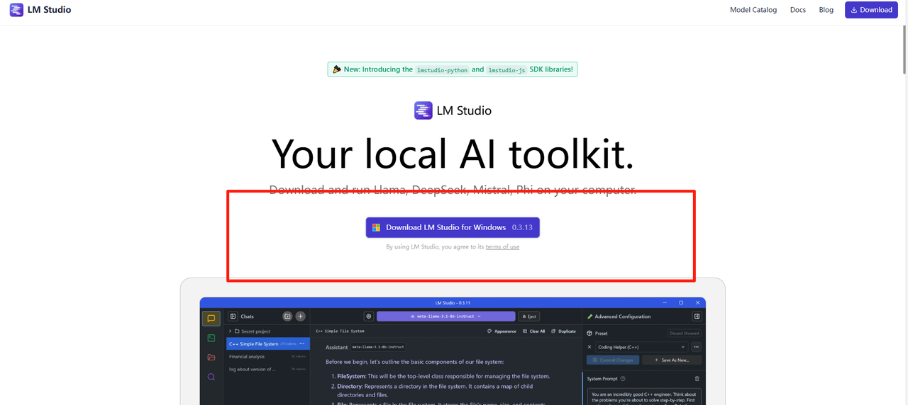

安装只需按照步骤点击下一步即可~

### 2.2 下载模型

这里我们以Qwen3-8B为例，安装并使用。

1. 打开左下角这个放大镜，查找模型。
2. 输入deepseek，找到Qwen3-8B版本，选择绿色小火箭模型即可。（简单介绍一下，LM Studio会根据你电脑配置推荐模型，如果是绿色火箭用起来体验会非常丝滑，没有火箭体验就比较缓慢，如果是红色说明完全没法运行）
3. 选择好后点击右下角下载即可

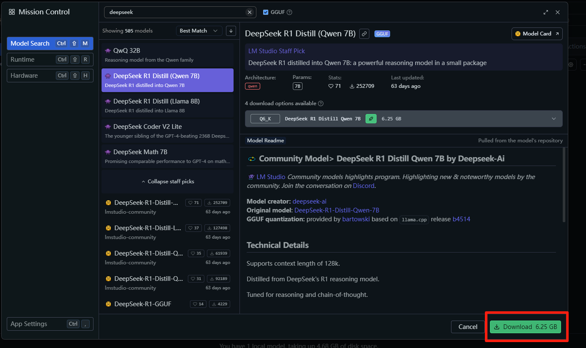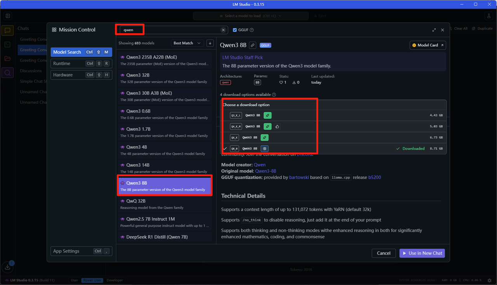

### 2.3 离线安装

有些小伙伴网络不佳，下载速度较慢。我们可以考虑使用魔搭社区的对应版本。

1. 按下图找到LM Studio的模型存储地址

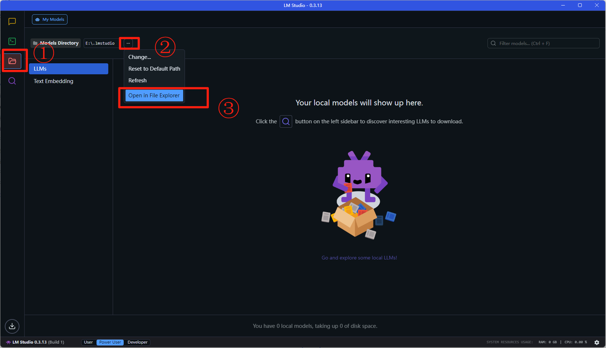

2. 在\lmstudio-community目录下创建Qwen3-8B-GGUF文件夹

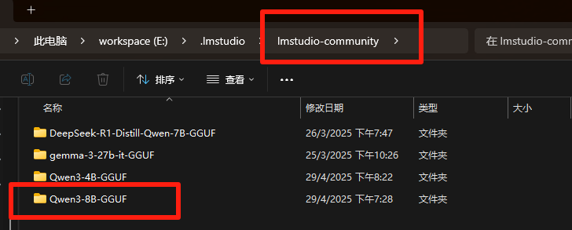

3. 进入魔搭社区下载对应的模型文件，下面是跳转链接：

https://www.modelscope.cn/models/unsloth/Qwen3-8B-GGUF/files

因为我电脑是4070ti可以运行所有模型，我选择Q8量化的对应文件：Qwen3-8B-Q8_0.gguf，大家如果是8G显存推荐使用Q4（Qwen3-8B-Q4_K_M.gguf）或Q3（Qwen3-8B-Q3_K_M.gguf）对应的模型。

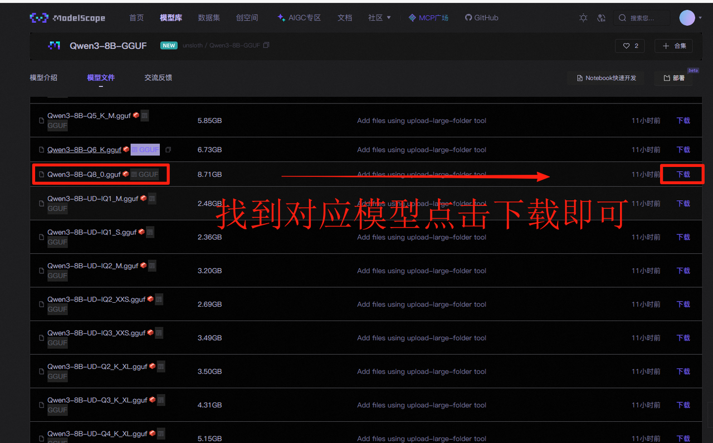

4. 下载文件并存入Qwen3-8B-GGUF文件夹之下

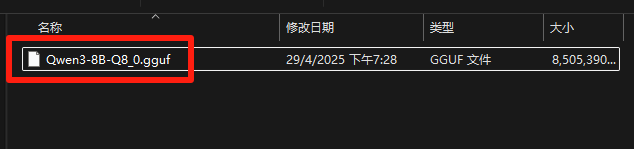

5. 打开刚才的LM Studio界面能看到模型已经成功上传


### 2.4 模型测试

1. 先点击黄色对话标签，然后点击“Select a model to load”（选择一个模型启动），下拉使用Qwen3-8b。

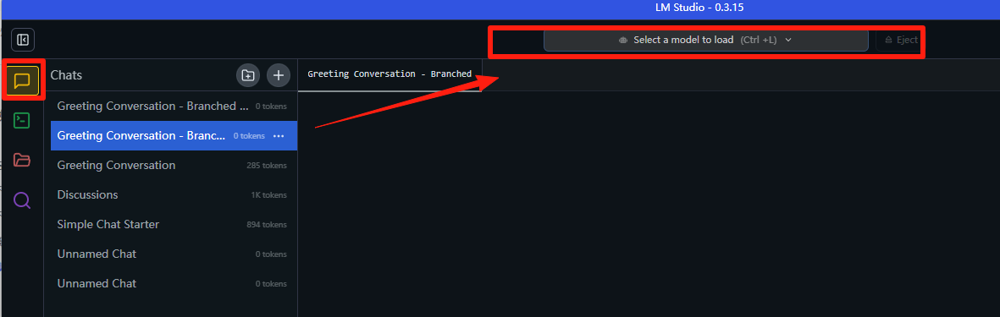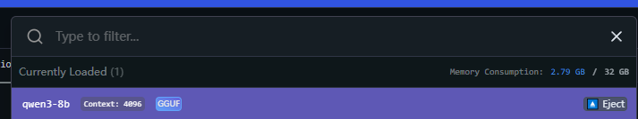

2. 当然你可以通过这样对话的方式快速使用Qwen3模型啦~

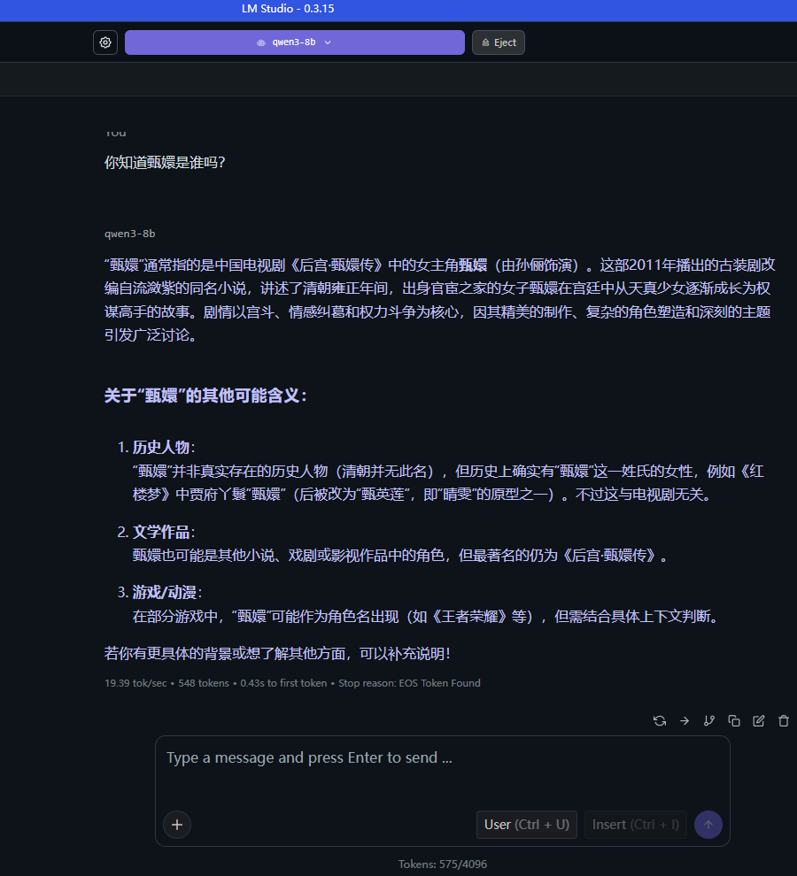

## 3. 调用本地Qwen3 api

### 3.1 首先准备好python环境及 Openai环境

保证python版本大于3.7及安装openai库

> python>=3.7
>
> pip install Openai

### 3.2 配置lmstudio

1. 打开绿色的terminal模块，然后点击Setting开始设置，打开Serve on Local Network即可。

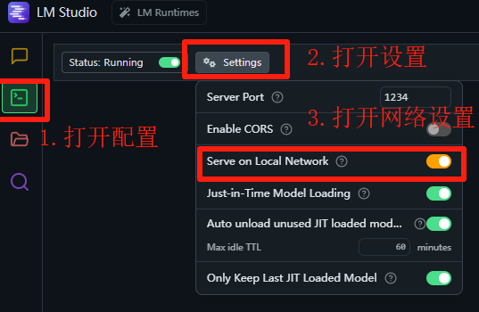

2. 然后选择并启动模型。

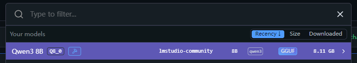

3. 查看右侧区域中，可以看到当前的模型名称和地址，划重点等会要用哦~

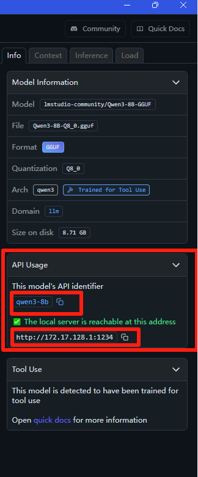

### 3.3 打开python代码编辑器测试qwen3 api调用

```python
from openai import OpenAI

# Point to the local server
client = OpenAI(base_url="http://localhost:1234/v1", api_key="lm-studio")

completion = client.chat.completions.create(
  model="qwen3-8b",
  messages=[
    {"role": "system", "content": "你是一个回答我日常问题的ai辅助机器人"},
    {"role": "user", "content": "如何做宫保鸡丁。"}
  ],
  temperature=0.7,
)

print(completion.choices[0].message.content)
```

上面是代码内容，我们主要模型使用qwen3-8b，接着lmstudio的部署在刚才的地址里。由于是本机部署可以是localhost中，如果是局域网的小伙伴们可以使用局域网ip即可，也就是刚才的ip~

运行结果如下~到这里我们就完成了目前的Qwen3本地部署及调用的任务啦~

```markdown
<think>

好的，用户问的是“如何做宫保鸡丁”。首先，我需要确认用户的需求是什么。可能他们想尝试在家做这道菜，或者对烹饪感兴趣。 接下来，我要考虑用户的背景，可能是初学者，所以步骤要详细易懂。

然后，我会回忆宫保鸡丁的基本材料和做法。记得主要食材是鸡肉、花生、辣椒等，调料有花椒、酱油、醋等。需要分步骤说明， 比如准备食材、腌制鸡肉、炒制过程等。

还要注意用户可能的疑问点，比如火候控制、调味比例，或者是否有替代食材。例如，有些人可能对花生过敏，或者没有花椒，是 否可以用其他香料代替。不过用户的问题比较直接，可能不需要涉及太多变通建议。

另外，要确保步骤清晰，避免专业术语过多，让初学者也能理解。同时提醒一些常见问题，比如鸡肉容易过老，需要控制火候；辣 椒和花椒的用量根据口味调整等。最后，可以加上小贴士，比如使用鸡腿肉更嫩，或者用淀粉腌制增加口感。

检查是否有遗漏的步骤或材料，确保所有必要的信息都包含在内。还要注意语言简洁明了，结构清晰，分点列出方便用户操作。最 后，确认回答是否符合用户的期望，是否需要进一步的帮助，比如视频教程链接或其他资源。

</think>

以下是制作宫保鸡丁的详细步骤：

\---

### **【材料准备】**

- 鸡胸肉/鸡腿肉 300g
- 花生米（或腰果）50g
- 干辣椒 8-10个（根据口味调整）
- 芹菜/青椒 适量（可选）
- 大蒜 3瓣
- 生姜 少许
- 花椒 1小把（约10粒）
- 酱油 2勺
- 醋 1勺
- 糖 1勺
- 料酒 1勺
- 淀粉 1勺（腌制鸡肉用）
- 盐、食用油 适量

\---

### **【步骤详解】**

#### **1. 处理食材**

- **鸡肉**：切丁，加入料酒、盐、淀粉抓匀腌制10分钟。
- **花生米**：提前用油炸至金黄酥脆（或水煮后晾干），备用。
- **辣椒**：剪成小段，去籽（若喜欢辣味可保留）。
- **蒜姜**：切片或末；芹菜/青椒切丁。

#### **2. 调制酱汁**

将以下调料混合成酱汁：

- 酱油 2勺
- 醋 1勺
- 糖 1勺
- 料酒 1勺
- 淀粉 1勺（增加浓稠度）
- 少许盐调味。

#### **3. 炒制过程**

1. **热锅凉油**：放入花椒，小火煸出香味后捞出（或保留）。
2. **炒鸡丁**：加入腌好的鸡肉快速翻炒至变色，盛出备用。
3. **炒配料**：用余油爆香蒜姜、干辣椒，加入芹菜/青椒炒软。
4. **混合食材**：倒入鸡丁、花生米，翻炒均匀。
5. **淋酱汁**：将调好的酱汁倒入锅中，快速翻炒收汁。
6. **出锅装盘**：最后撒上葱花或香菜点缀。

\---

### **【小贴士】**

1. **鸡肉选择**：鸡腿肉更嫩滑，鸡胸肉需切薄片避免柴。
2. **火候控制**：炒鸡丁时用大火快炒，避免过老。
3. **辣度调整**：干辣椒可换成小米椒或青椒，根据个人口味增减。
4. **酱汁比例**：糖和醋的比例为1:1，酸甜平衡是关键。

\---

### **【成品特点】**

- 鸡丁鲜嫩，花生酥脆，酱汁浓郁微辣，口感层次丰富。

如果你需要视频教程或替代食材建议（如素食版），可以告诉我哦！ 😊
```

