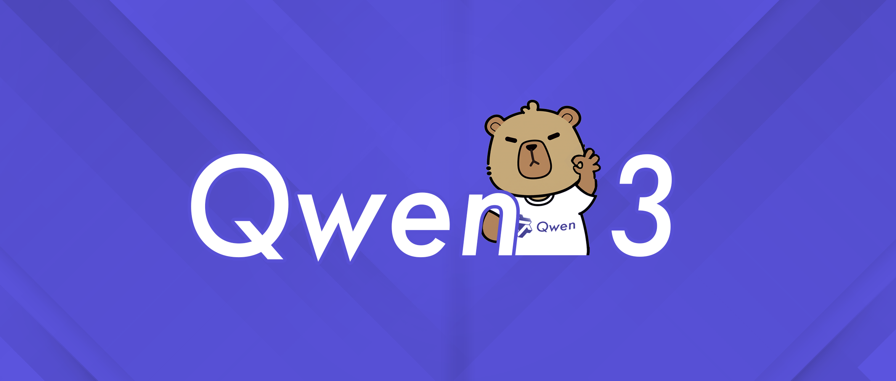
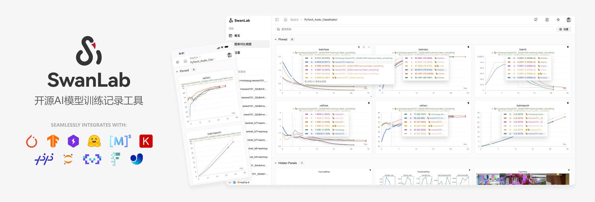
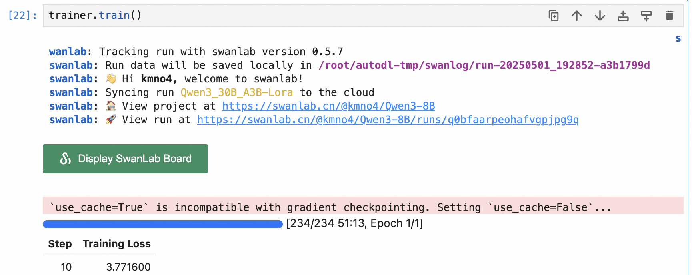
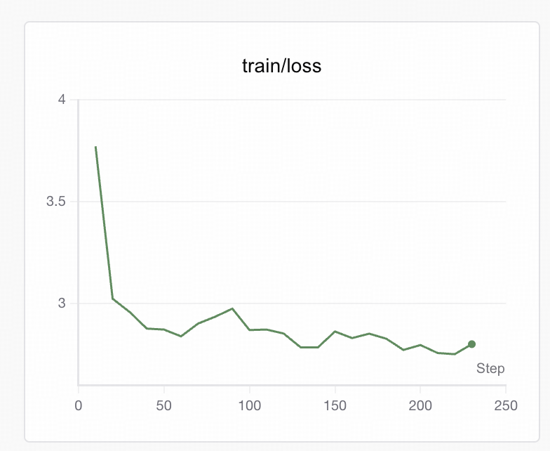

# 06-Qwen3-30B-A3B 微调及 SwanLab 可视化记录

本节我们简要介绍如何基于 transformers、peft 等框架，使用由笔者合作开源的 [Chat-甄嬛](https://github.com/KMnO4-zx/huanhuan-chat) 项目中的**嬛嬛数据集**作为微调数据集，对 Qwen3-30B-A3B 模型进行 LoRA 微调, 以构建一个能够模拟甄嬛对话风格的个性化 LLM , 数据集路径为[`../../dataset/huanhuan.json`](../../dataset/huanhuan.json)。同时使用 [SwanLab](https://github.com/swanhubx/swanlab) 监控训练过程与评估模型效果。



> **LoRA** 是一种高效微调方法，深入了解其原理可参见博客：[知乎|深入浅出 LoRA](https://zhuanlan.zhihu.com/p/650197598)。

> 本教程会在同目录下给大家提供一个 [**notebook 文件** Qwen3-30B-A3B 微调及 SwanLab 可视化记录.ipynb](./06-Qwen3-30B-A3B%20微调及%20SwanLab%20可视化记录.ipynb) ，来帮助大家更好的学习。

- 代码：文本的完整微调代码部分，或本目录下的 [06-Qwen3-30B-A3B 微调及 SwanLab 可视化记录.ipynb](./06-Qwen3-30B-A3B%20微调及%20SwanLab%20可视化记录.ipynb)
- 可视化训练过程：[KMnO4-zx/Qwen3-8B/Qwen3-30B-A3B-LoRA](https://swanlab.cn/@kmno4/Qwen3-8B/runs/q0bfaarpeohafvgpjpg9q/chart)
- 模型：[Qwen3-30B-A3B](https://modelscope.cn/models/Qwen/Qwen3-30B-A3B)
- 数据集：[huanhuan](../../dataset/huanhuan.json)
- 显存需求：约 85GB，如显存不足，请调低 per_device_train_batch_size。（模型本身占 60GB 左右，对显存要求较高，笔者采用一张 H20 进行训练）

<br>

## 目录

- [06-Qwen3-30B-A3B 微调及 SwanLab 可视化记录](#06-qwen3-30b-a3b-微调及-swanlab-可视化记录)
  - [目录](#目录)
  - [1. 环境配置](#1-环境配置)
  - [2. 模型下载](#2-模型下载)
  - [3. 指令集构建](#3-指令集构建)
  - [4. 数据格式化](#4-数据格式化)
  - [5. 加载 tokenizer 和半精度模型 (model)](#5-加载-tokenizer-和半精度模型-model)
  - [6. 定义 LoraConfig](#6-定义-loraconfig)
  - [7. 自定义 TrainingArguments 参数](#7-自定义-trainingarguments-参数)
  - [8. SwanLab 可视化](#8-swanlab-可视化)
    - [SwanLab 简介](#swanlab-简介)
    - [实例化 SwanLabCallback](#实例化-swanlabcallback)
  - [9. 使用 Trainer 训练](#9-使用-trainer-训练)
  - [10. 训练结果演示](#10-训练结果演示)
  - [11. 加载 LoRA 权重推理](#11-加载-lora-权重推理)

<br>

## 1. 环境配置

实验所依赖的基础开发环境如下：

```
----------------
ubuntu 22.04
Python 3.12.3
cuda 12.4
pytorch 2.5.1
----------------
```

> 本文默认学习者已安装好以上 Pytorch(cuda) 环境，如未安装请自行安装。

首先 `pip` 换源加速下载并安装依赖包：

```shell
# 升级pip
python -m pip install --upgrade pip
# 更换 pypi 源加速库的安装
pip config set global.index-url https://pypi.tuna.tsinghua.edu.cn/**simple**

pip install modelscope==1.25.0 # 用于模型下载和管理
pip install transformers==4.51.3 # Hugging Face 的模型库，用于加载和训练模型
pip install accelerate==1.6.0 # 用于分布式训练和混合精度训练
pip install datasets==3.5.1 # 用于加载和处理数据集
pip install peft==0.15.2 # 用于 LoRA 微调
pip install swanlab==0.5.7 # 用于监控训练过程与评估模型效果
```

> 考虑到部分同学配置环境可能会遇到一些问题，我们在 AutoDL 平台准备了 Qwen3 的环境镜像，点击下方链接并直接创建 Autodl 示例即可。
> ***https://www.codewithgpu.com/i/datawhalechina/self-llm/Qwen3***

## 2. 模型下载

`modelscope` 是一个模型管理和下载工具，支持从魔搭 (Modelscope) 等平台快速下载模型。

这里使用 `modelscope` 中的 `snapshot_download` 函数下载模型，第一个参数 `model_name_or_path` 为模型名称或者本地路径，第二个参数 `cache_dir` 为模型的下载路径，第三个参数 `revision` 为模型的版本号。

在 `/root/autodl-tmp` 路径下新建 `model_download.py` 文件并在其中粘贴以下代码，并保存文件。

```python
from modelscope import snapshot_download

model_dir = snapshot_download('/data/Qwen/Qwen3-30B-A3B', cache_dir='./', revision='master')
```

> 注意：记得修改 cache_dir 为你的模型下载路径哦~

在终端运行 `python /root/autodl-tmp/model_download.py` 执行下载，模型大小为 57GB 左右，下载时间较久。

## 3. 指令集构建

LLM 的微调一般指指令微调过程。所谓指令微调，是说我们使用的微调数据形如：

```json
{
  "instruction": "回答以下用户问题，仅输出答案。",
  "input": "1+1等于几?",
  "output": "2"
}
```

其中，`instruction` 是用户指令，告知模型其需要完成的任务；`input` 是用户输入，是完成用户指令所必须的输入内容；`output` 是模型应该给出的输出。

即我们的核心训练目标是让模型具有理解并遵循用户指令的能力。因此，在指令集构建时，我们应针对我们的目标任务，针对性构建任务指令集。

例如，在本节我们使用由笔者合作开源的 [**Chat-甄嬛**](https://github.com/KMnO4-zx/huanhuan-chat) 项目作为示例，我们的目标是构建一个能够模拟甄嬛对话风格的个性化 LLM，因此我们构造的指令形如：

```json
{
  "instruction": "你是谁？",
  "input": "",
  "output": "家父是大理寺少卿甄远道。"
}
```

我们所构造的全部指令数据集会被保存在根目录下。

## 4. 数据格式化

`LoRA` 训练的数据是需要经过格式化、编码之后再输入给模型进行训练的，如果是熟悉 `Pytorch` 模型训练流程的同学会知道，我们一般需要将输入文本编码为 `input_ids`，将输出文本编码为 `labels`，编码之后的结果都是多维的向量。

为了得到 Qwen3-30B-A3B 的 Prompt Template，使用 tokenizer 构建 messages 并打印， 查看 chat_template 的输出格式

由于 `Qwen3` 是混合推理模型，因此可以手动选择开启思考模式

不开启 `thinking mode`

```python
messages = [
            {"role": "system", "content": "You are a helpful assistant."},
            {"role": "user", "content": '你好呀'},
            {"role": "assistant", "content": '有什么可以帮你的？'}
            ]
# 使用chat_template将messages格式化并打印
text = tokenizer.apply_chat_template(
    messages,
    tokenize=False,
    add_generation_prompt=True,
    enable_thinking=False
)

print(text)
```

得到输出结果如下

```text
<|im_start|>system
You are a helpful assistant.<|im_end|>
<|im_start|>user
你好，你是谁？<|im_end|>
<|im_start|>assistant
<think>

</think>

我是一个AI助手，旨在帮助你解决问题<|im_end|>
<|im_start|>assistant
<think>

</think>
```

开启 `thinking mode`

```python
text = tokenizer.apply_chat_template(
    messages,
    tokenize=False,
    add_generation_prompt=True,
    enable_thinking=True
)

print(text)
```

输出如下

```text
<|im_start|>system
You are a helpful assistant.<|im_end|>
<|im_start|>user
你好，你是谁？<|im_end|>
<|im_start|>assistant
<think>

</think>

我是一个AI助手，旨在帮助你解决问题<|im_end|>
<|im_start|>assistant

```

然后我们就可以定义预处理函数 `process_func`，这个函数用于对每一个样本，编码其输入、输出文本并返回一个编码后的字典，方便模型使用：

```python
system_prompt = '现在你要扮演皇帝身边的女人--甄嬛'

def process_func(example):
    MAX_LENGTH = 384    # 分词器会将一个中文字切分为多个token，因此需要放开一些最大长度，保证数据的完整性
    input_ids, attention_mask, labels = [], [], []
    # 构建指令部分的输入, 可参考上面的输出格式进行调整和补充
    instruction = tokenizer(
        f"<s><|im_start|>system\n现在你要扮演皇帝身边的女人--甄嬛<|im_end|>\n"
        f"<|im_start|>user\n{example['instruction'] + example['input']}<|im_end|>\n"
        f"<|im_start|>assistant\n<think>\n\n</think>\n\n",
        add_special_tokens=False
    )
    response = tokenizer(f"{example['output']}", add_special_tokens=False)
    # 拼接指令和回复部分的 input_ids
    input_ids = instruction["input_ids"] + response["input_ids"] + [tokenizer.pad_token_id]
    attention_mask = instruction["attention_mask"] + response["attention_mask"] + [1]  # 因为eos token咱们也是要关注的所以 补充为1
    # 构建标签
    # 对于指令部分，使用 -100 忽略其损失计算；对于回复部分，保留其 input_ids 作为标签
    labels = [-100] * len(instruction["input_ids"]) + response["input_ids"] + [tokenizer.pad_token_id]
    # 如果总长度超过最大长度，进行截断
    if len(input_ids) > MAX_LENGTH:
        input_ids = input_ids[:MAX_LENGTH]
        attention_mask = attention_mask[:MAX_LENGTH]
        labels = labels[:MAX_LENGTH]
    return {
        "input_ids": input_ids,
        "attention_mask": attention_mask,
        "labels": labels
    }
```

## 5. 加载 tokenizer 和半精度模型 (model)

`tokenizer` 是将文本转换为模型 (`model`) 能理解的数字的工具，`model` 是根据这些数字生成文本的核心部分。

以半精度形式加载 `model`, 如果你的显卡比较新的话，可以用 `torch.bfolat` 形式加载。对于自定义模型，必须指定 `trust_remote_code=True` ，以确保加载自定义代码时不会报错。

```python
model_path = 'Qwen/Qwen3-30B-A3B'

tokenizer = AutoTokenizer.from_pretrained(model_path, use_fast=False, trust_remote_code=True)

model = AutoModelForCausalLM.from_pretrained(model_path, device_map="auto",
                                             torch_dtype=torch.bfloat16,
                                             trust_remote_code=True)
```

> 注意：此处要记得修改为自己的模型路径哦~

如果想要查看模型结构，可以打印模型：

```python
print(model)
```

输出结果如下

```text
Qwen3MoeForCausalLM(
  (model): Qwen3MoeModel(
    (embed_tokens): Embedding(151936, 2048)
    (layers): ModuleList(
      (0-47): 48 x Qwen3MoeDecoderLayer(
        (self_attn): Qwen3MoeAttention(
          (q_proj): Linear(in_features=2048, out_features=4096, bias=False)
          (k_proj): Linear(in_features=2048, out_features=512, bias=False)
          (v_proj): Linear(in_features=2048, out_features=512, bias=False)
          (o_proj): Linear(in_features=4096, out_features=2048, bias=False)
          (q_norm): Qwen3MoeRMSNorm((128,), eps=1e-06)
          (k_norm): Qwen3MoeRMSNorm((128,), eps=1e-06)
        )
        (mlp): Qwen3MoeSparseMoeBlock(
          (gate): Linear(in_features=2048, out_features=128, bias=False)
          (experts): ModuleList(
            (0-127): 128 x Qwen3MoeMLP(
              (gate_proj): Linear(in_features=2048, out_features=768, bias=False)
              (up_proj): Linear(in_features=2048, out_features=768, bias=False)
              (down_proj): Linear(in_features=768, out_features=2048, bias=False)
              (act_fn): SiLU()
            )
          )
        )
        (input_layernorm): Qwen3MoeRMSNorm((2048,), eps=1e-06)
        (post_attention_layernorm): Qwen3MoeRMSNorm((2048,), eps=1e-06)
      )
    )
    (norm): Qwen3MoeRMSNorm((2048,), eps=1e-06)
    (rotary_emb): Qwen3MoeRotaryEmbedding()
  )
  (lm_head): Linear(in_features=2048, out_features=151936, bias=False)
)

```

上面打印了 `Qwen3MoeForCausalLM` 的模型结构， 可以看到里面的 `self_attn` 和 `mlp` 是两个主要的模块， 因此可以考虑将这两个模块作为 **LoRA** 微调 的 `target_modules` , 包括 `q_proj`, `k_proj`, `v_proj`, `o_proj` 以及 `gate_proj`、`up_proj` 和 `down_proj` 。

通常我们只对 `self_attn` 模块中的 `q_proj`, `k_proj`, `v_proj`, `o_proj`进行微调， 本教程里我们也将对这四个模块进行微调演示， 感兴趣的同学可以自行尝试添加对 `mlp` 中的三个 `proj` 模块进行微调。

## 6. 定义 LoraConfig

`LoraConfig`类用于设置 LoRA 微调参数，虽然可以设置很多参数，但主要的参数没多少，简单讲一讲，感兴趣的同学可以直接看源码。

- `task_type`：模型类型
- `target_modules`：需要训练的模型层的名字，主要就是 `attention`部分的层，不同的模型对应的层的名字不同，可以传入数组，也可以字符串，也可以正则表达式。
- `r`：`LoRA`的秩，具体可以看 `LoRA`原理。
- `lora_alpha`：`LoRA alaph` ，具体作用参见 `LoRA` 原理。
- `lora_dropout`: `LoRA` 层的 `Dropout` 比例，用于防止过拟合，具体作用参见 `LoRA` 原理。

`LoRA`的缩放是啥嘞？当然不是 `r`（秩），这个缩放就是 `lora_alpha/r`, 在这个 `LoraConfig`中缩放就是 4 倍。

```python
from peft import LoraConfig, TaskType, get_peft_model

config = LoraConfig(
    task_type=TaskType.CAUSAL_LM,
    target_modules=["q_proj", "k_proj", "v_proj", "o_proj", "gate_proj", "up_proj", "down_proj"], # 可以自行添加更多微调的target_modules
    inference_mode=False,     # 训练模式
    r=8,                      # LoRA 秩
    lora_alpha=32,            # LoRA alaph，具体作用参见 LoRA 原理
    lora_dropout=0.1          # Dropout 比例
)
```

## 7. 自定义 TrainingArguments 参数

`TrainingArguments`类用于设置微调训练过程中的配置参数，这个类的源码也介绍了每个参数的具体作用，当然大家可以来自行探索，这里就简单说几个常用的。

- `output_dir`：模型的输出路径
- `per_device_train_batch_size`：顾名思义 `batch_size`，批量大小
- `gradient_accumulation_steps`: 梯度累加，如果你的显存比较小，那可以把 `batch_size` 设置小一点，梯度累加增大一些。
- `logging_steps`：多少步，输出一次 `log`
- `num_train_epochs`：顾名思义 `epoch`，训练轮次
- `gradient_checkpointing`：梯度检查，这个一旦开启，模型就必须执行 `model.enable_input_require_grads()`，这个原理大家可以自行探索，这里就不细说了。

```python
args = TrainingArguments(
    output_dir="./output/Qwen3_30B_A3B_lora",
    per_device_train_batch_size=16,
    gradient_accumulation_steps=1,
    logging_steps=10,
    num_train_epochs=1,
    save_steps=100,
    learning_rate=1e-4,
    save_on_each_node=True,
    gradient_checkpointing=True,
    report_to="none",
)
```

## 8. SwanLab 可视化

### SwanLab 简介



[SwanLab](https://github.com/swanhubx/swanlab) 是一个开源的模型训练记录工具，面向 AI 研究者，提供了训练可视化、自动日志记录、超参数记录、实验对比、多人协同等功能。在 `SwanLab` 上，研究者能基于直观的可视化图表发现训练问题，对比多个实验找到研究灵感，并通过在线链接的分享与基于组织的多人协同训练，打破团队沟通的壁垒。

**为什么要记录训练**

相较于软件开发，模型训练更像一个实验科学。一个品质优秀的模型背后，往往是成千上万次实验。研究者需要不断尝试、记录、对比，积累经验，才能找到最佳的模型结构、超参数与数据配比。在这之中，如何高效进行记录与对比，对于研究效率的提升至关重要。

### 实例化 SwanLabCallback

建议先在 [SwanLab 官网](https://swanlab.cn/) 注册账号，然后在训练初始化阶段选择

`(2) Use an existing SwanLab account` 并使用 private API Key 登录

SwanLab 与 Transformers 已经做好了集成，用法是在 Trainer 的 callbacks 参数中添加 SwanLabCallback 实例，就可以自动记录超参数和训练指标，简化代码如下：

```python
import swanlab
from swanlab.integration.transformers import SwanLabCallback

swanlab_callback = SwanLabCallback(
    project="Qwen3-8B",
    experiment_name="Qwen3-30B-A3B-Lora"
)
```

## 9. 使用 Trainer 训练

我们使用 `Trainer` 类来管理训练过程。`TrainingArguments` 用于设置训练参数，`Trainer` 则负责实际的训练逻辑。

```python
trainer = Trainer(
    model=model,                 # 要训练的模型
    args=args,                   # 训练参数
    train_dataset=tokenized_id,  # 训练数据集
    data_collator=DataCollatorForSeq2Seq(tokenizer=tokenizer, padding=True),
    callbacks=[swanlab_callback]
    # 数据整理器
)
trainer.train()                  # 开始训练
```

看到下面的进度条即代表训练开始：



<br>

## 10. 训练结果演示

访问可视化训练过程：[Qwen3-8B/Qwen3_30B_A3B-Lora](https://swanlab.cn/@datawhale-kmno4/Qwen3-Lora/overview)

在 SwanLab 上查看最终的训练结果：

可以看到在 1 个 epoch 之后，微调后的 Qwen3-30B-A3B 的 loss 降低到了不错的水平。



至此，你已经完成了 Qwen3-30B-A3B Lora 微调的训练！如果需要加强微调效果，可以尝试增加训练的数据量。

<br>

## 11. 加载 LoRA 权重推理

训练好了之后可以使用如下方式加载 `LoRA`权重进行推理：

```python
from transformers import AutoModelForCausalLM, AutoTokenizer
import torch
from peft import PeftModel

model_path = 'Qwen/Qwen3-30B-A3B'
lora_path = 'output/Qwen3_30B_A3B_lora/checkpoint-234' # 这里改称你的 lora 输出对应 checkpoint 地址

# 加载tokenizer
tokenizer = AutoTokenizer.from_pretrained(model_path, trust_remote_code=True)


# 加载模型
model = AutoModelForCausalLM.from_pretrained(model_path,
                                            device_map="auto",
                                            torch_dtype=torch.bfloat16,
                                            trust_remote_code=True).eval()

# 加载lora权重
model = PeftModel.from_pretrained(model, model_id=lora_path)
prompt = "你是谁？"
system_prompt = "现在你要扮演皇帝身边的女人--甄嬛"
print("prompt: ", prompt)
print("system_prompt: ", system_prompt)

inputs = tokenizer.apply_chat_template([{"role": "system", "content": system_prompt},
                                        {"role": "user", "content": prompt}],
                                       add_generation_prompt=True,
                                       tokenize=True,
                                       return_tensors="pt",
                                       return_dict=True
                                       ).to(model.device)  # 将 inputs 移动到模型所在的设备，确保设备一致性


gen_kwargs = {"max_length": 2500, "do_sample": True, "top_k": 1}
with torch.no_grad():
    outputs = model.generate(**inputs, **gen_kwargs)
    outputs = outputs[:, inputs['input_ids'].shape[1]:]
    print(tokenizer.decode(outputs[0], skip_special_tokens=True))
```

```text
prompt:  你是谁？
system_prompt:  现在你要扮演皇帝身边的女人--甄嬛
我是甄嬛，家父是大理寺少卿甄远道。
```

> 注意修改为自己的模型路径哦~

> 如果显示 `Some parameters are on the meta device because they were offloaded to the cpu.` 的报错，需要将实例关机，重启后单独运行本条代码。
