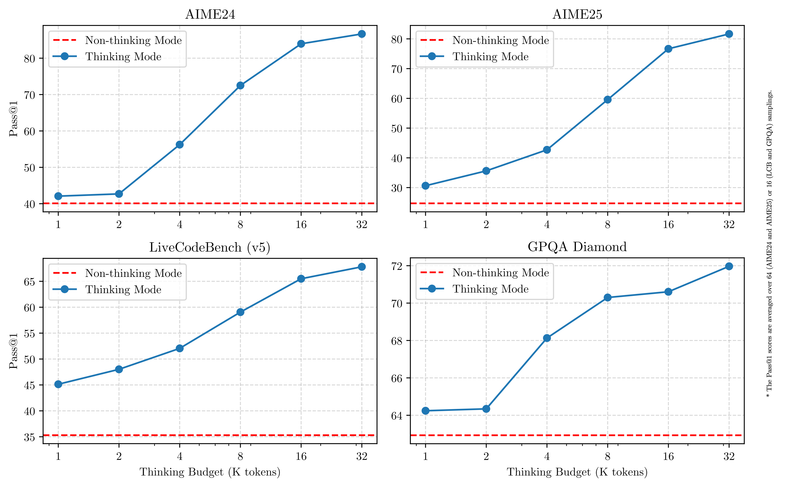
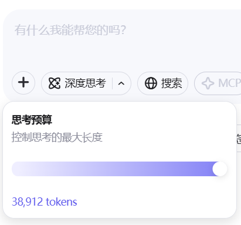
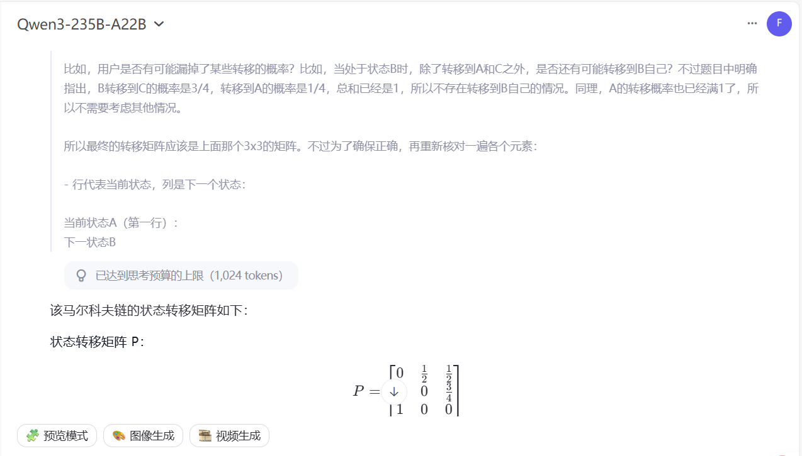

# Qwen3 Think 解密

在本次 Qwen3 的更新中，支持多种思考模式可谓是核心亮点之一。Qwen3 既可以在思考模式下深思熟虑，也可以在非思考模式中提供快速的响应。更重要的是，这两种模式的结合增强了 Qwen3 实现稳定且高效的“思考预算”控制能力。如下图所示，随着思考预算分配的提升，模型在评测集上的得分也逐渐提升。这样一来，用户可以根据不同的任务难度分配不同的预算，从而在速度与性能之间实现更优的平衡。

那么，**思考预算**和**思考模式切换**都是如何实现的呢？



## 思考预算原理

在 Qwen Chat 网页版 [chat.qwen.ai](chat.qwen.ai) 上，深度思考的思考预算是**可调节的**，粒度为 1024 tokens，最大可达 38912 tokens，也就是 38 * 1024 tokens，如下图所示。



那么，在解密思考预算调整的原理之前，我们先来看一个例子。下图展示了 Qwen3-235B-A22B 在 1024 tokens 的思考预算下回答问题的情况。（为了能让 Qwen3 可以思考到 1024 tokens 或者更多，这里使用了一个马尔科夫链的相关问题）



从上图中可以看到，Qwen3 在达到思考预算上限时，思考过程就戛然而止了。所以很难不让人相信，思考预算的实现原理就是，**统计思考过程中的（\<think\> 后） tokens 数量，达到思考预算上限时，立刻停止思考（强行截断停止），并补上 \</think\>，以进入输出阶段**。

## 思考模式切换

最后是 Qwen3 思考模式切换的原理。这部分原理相对透明，可以在 Qwen3 的 `tokenizer_config.json` 中的 `chat_template` 中看到。下面展示了 Jinja 格式的 Qwen3 对话模板。

<details><summary>Jinja 格式 Qwen3 对话模板完整版</summary>

```jinja=

    {{- '<|im_start|>system\n' }}
    
        {{- messages[0].content + '\n\n' }}
    
    {{- "# Tools\n\nYou may call one or more functions to assist with the user query.\n\nYou are provided with function signatures within <tools></tools> XML tags:\n<tools>" }}
    
        {{- "\n" }}
        {{- tool | tojson }}
    
    {{- "\n</tools>\n\nFor each function call, return a json object with function name and arguments within <tool_call></tool_call> XML tags:\n<tool_call>\n{\"name\": <function-name>, \"arguments\": <args-json-object>}\n</tool_call><|im_end|>\n" }}

    
        {{- '<|im_start|>system\n' + messages[0].content + '<|im_end|>\n' }}
    



    
    
        
        
    


    
        {{- '<|im_start|>' + message.role + '\n' + message.content + '<|im_end|>' + '\n' }}
    
        
        
        
            
        
            
                
                
            
        
        
            
                {{- '<|im_start|>' + message.role + '\n<think>\n' + reasoning_content.strip('\n') + '\n</think>\n\n' + content.lstrip('\n') }}
            
                {{- '<|im_start|>' + message.role + '\n' + content }}
            
        
            {{- '<|im_start|>' + message.role + '\n' + content }}
        
        
            
                
                    {{- '\n' }}
                
                
                    
                
                {{- '<tool_call>\n{"name": "' }}
                {{- tool_call.name }}
                {{- '", "arguments": ' }}
                
                    {{- tool_call.arguments }}
                
                    {{- tool_call.arguments | tojson }}
                
                {{- '}\n</tool_call>' }}
            
        
        {{- '<|im_end|>\n' }}
    
        
            {{- '<|im_start|>user' }}
        
        {{- '\n<tool_response>\n' }}
        {{- message.content }}
        {{- '\n</tool_response>' }}
        
            {{- '<|im_end|>\n' }}
        
    


    {{- '<|im_start|>assistant\n' }}
    
        {{- '<think>\n\n</think>\n\n' }}
    

```

</details>

我们直接来看最后几行，也就是 `add_generation_prompt` 部分。

```jinja

    {{- '<|im_start|>assistant\n' }}
    
        {{- '<think>\n\n</think>\n\n' }}
    

```

上面就是 `add_generation_prompt` 部分的代码。可以看到，如果传入了 `enable_thinking` 并且为 false 的情况下，模型就会在 `<|im_start|>assistant\n` 的后面再补上 `<think>\n\n</think>\n\n` 以让模型结束思考，直接进入输出阶段。

让我们再来看 QwQ 在 `add_generation_prompt` 时的行为，来更好地理解 Qwen3 的思考模式切换逻辑。

```jinja

    {{- '<|im_start|>assistant\n<think>\n\n' }}

```

可以看到 QwQ 通过补上额外的 \<think\> 来让模型强制进入思考阶段。而Qwen3 通过补上 `<think>\n\n</think>\n\n` 的方式告诉模型，思考阶段什么都没有，但是思考阶段已经结束了，需要进入最终输出阶段了，从而实现了思考模式切换。
