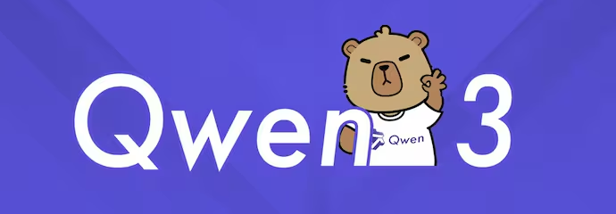
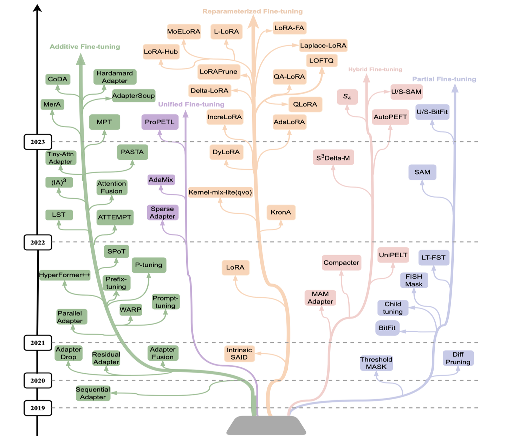
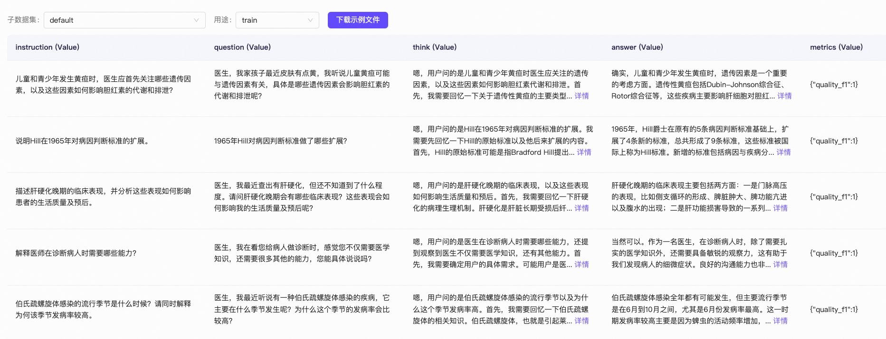
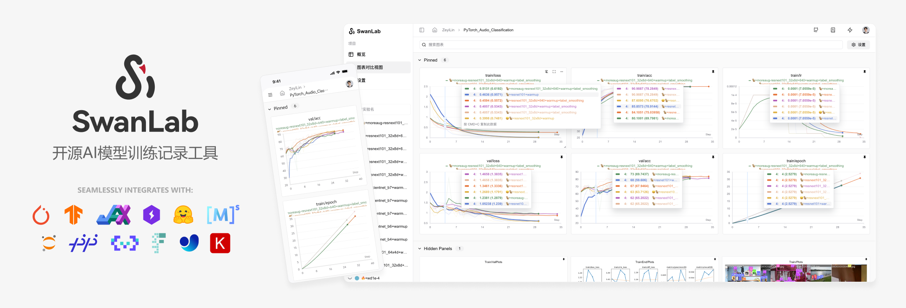
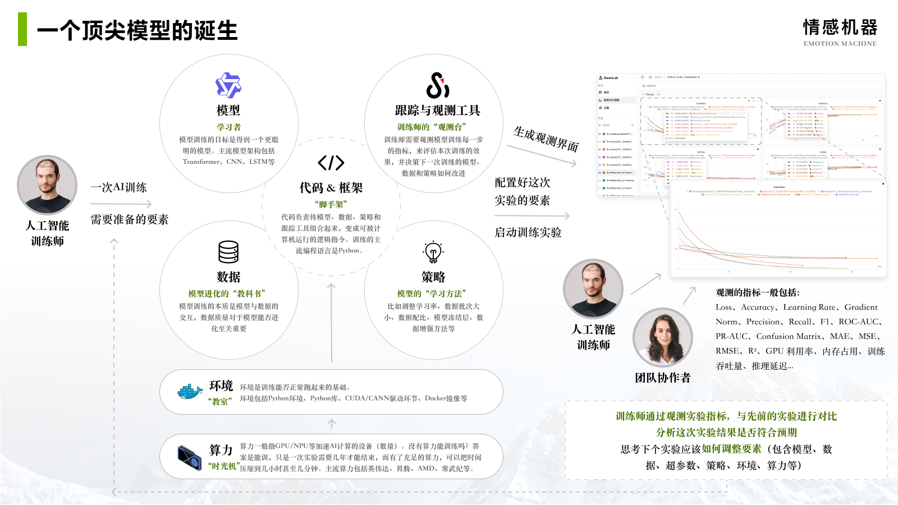
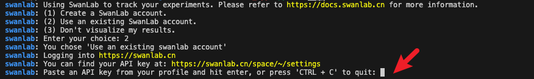
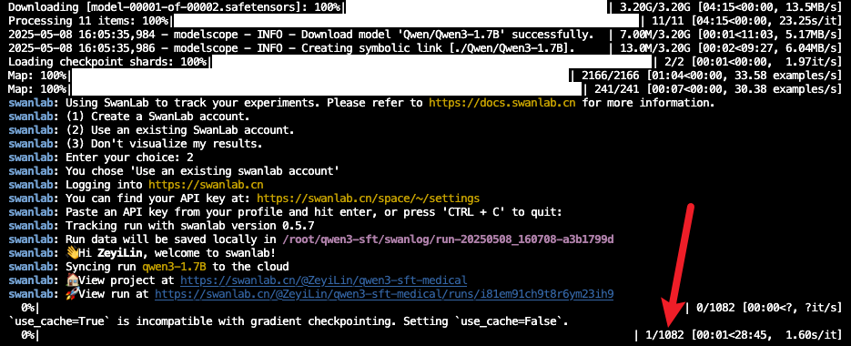
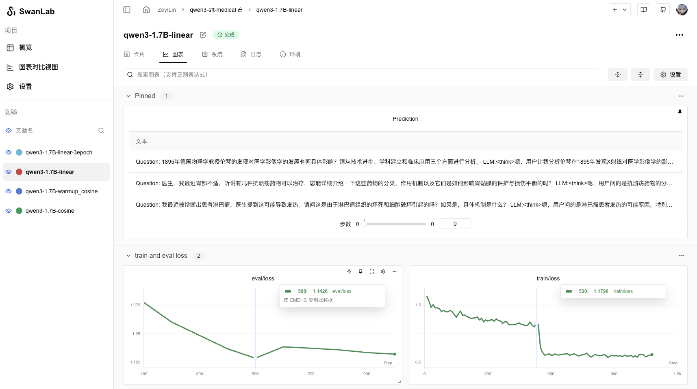
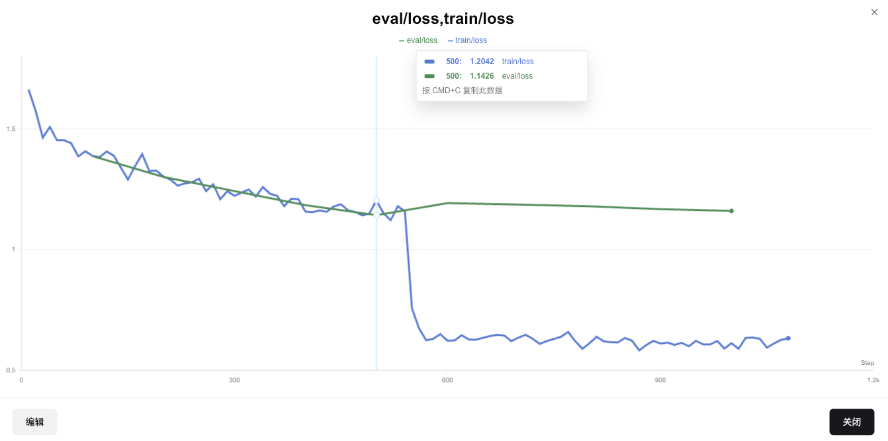
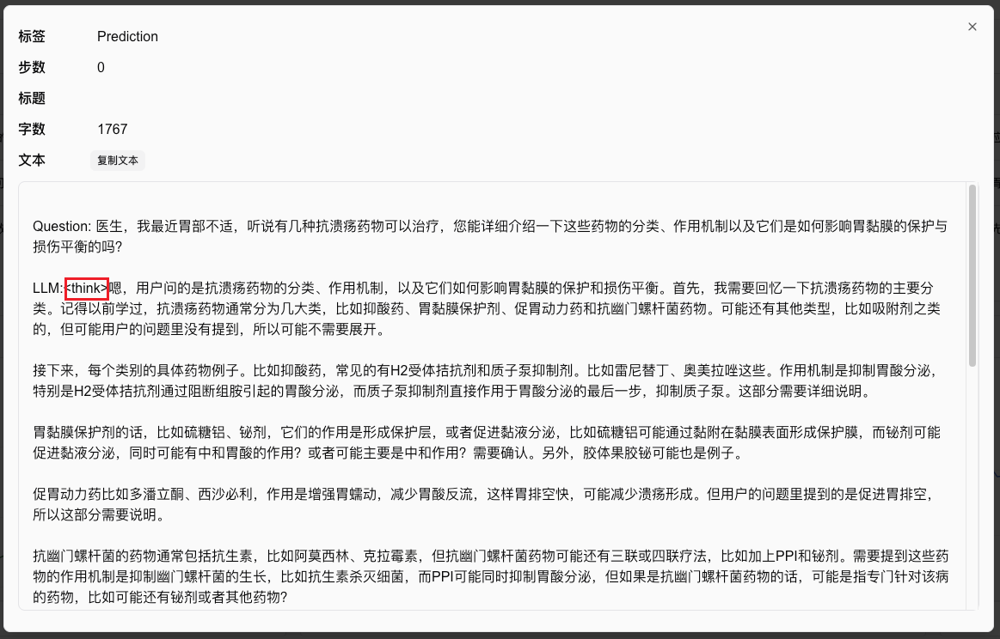

# 09-Qwen3-1.7B-医学推理式对话微调 及 SwanLab 可视化记录



[Qwen3](https://www.modelscope.cn/models?name=qwen3&page=1)是阿里通义实验室最近开源的大语言模型，发布时便登顶了开源LLM榜单第一名。同时，Qwen系列模型也超越LLaMA，成为了HuggingFace上最受欢迎的开源LLM。


可以说，不论是进行研究学习，还是应用落地，Qwen已经逐渐成为开发者的最优选项之一。

那么，以Qwen3作为基座大模型，通过**全参数微调**的方式，实现垂直专业领域聊天，甚至**支持DeepSeek R1 / QwQ式的带推理过程的对话**，是学习**LLM微调**的入门任务。

在本文中，我们会使用 [Qwen3-1.7b](https://www.modelscope.cn/models/Qwen/Qwen3-1.7B) 模型在 [delicate_medical_r1_data](https://modelscope.cn/datasets/krisfu/delicate_medical_r1_data) 数据集上做全参数微调训练，实现让微调后的Qwen3支持对医学问题进行DeepSeek R1式的推理回复。训练中用到了transformers、datasets等工具，同时使用[SwanLab](https://swanlab.cn)监控训练过程、评估模型效果。

> 全参数微调需要大约32GB显存，如果你的显存大小不足，可以使用Qwen3-0.6b，或Lora微调。

- **代码**：完整代码直接看本文第5节

- **实验日志过程**：[qwen3-1.7B-linear - SwanLab](https://swanlab.cn/@ZeyiLin/qwen3-sft-medical/runs/agps0dkifth5l1xytcdyk/chart)，或 [SwanLab基线社区](https://swanlab.cn/benchmarks) 搜索“qwen3-sft-medical”

- **模型**：[Modelscope](https://modelscope.cn/models/Qwen/Qwen3-1.7B)

- **数据集**：[delicate_medical_r1_data](https://modelscope.cn/datasets/krisfu/delicate_medical_r1_data)

- **SwanLab**：[https://swanlab.cn](https://swanlab.cn)

## 知识点：什么是全参数微调？

大模型全参数微调是指对预训练大模型的**所有参数**进行更新和优化，区别于部分参数微调和LoRA微调。

这种方法通过将**整个模型权重**（包括底层词嵌入、中间特征提取层和顶层任务适配层）在下游任务数据上进行梯度反向传播，使模型整体适应新任务的需求。**相比仅微调部分参数**，全参数微调能更充分地利用预训练模型的泛化能力，并针对特定任务进行深度适配，**通常在数据差异较大或任务复杂度较高的场景下表现更优。**



不过，全参数微调往往需要更高的计算资源和存储开销，且存在**过拟合风险**（尤其在小数据集上）。实际应用中常结合学习率调整、参数分组优化或正则化技术来缓解这些问题。

全参数微调多用于对模型表现性能要求较高的场景，例如专业领域知识问答或高精度文本生成。

更多微调技术可参考：https://zhuanlan.zhihu.com/p/682082440

下面是实战正片：

## 1. 环境安装

本案例基于**Python>=3.8**，请在您的计算机上安装好Python；

另外，您的计算机上至少要有一张英伟达/昇腾显卡（显存要求大概**32GB**左右可以跑）。

我们需要安装以下这几个Python库，在这之前，请确保你的环境内已安装了pytorch以及CUDA：

```
swanlab
modelscope==1.22.0
transformers>=4.50.0
datasets==3.2.0
accelerate
pandas
addict
```

一键安装命令：

```bash
pip install swanlab modelscope==1.22.0 "transformers>=4.50.0" datasets==3.2.0 accelerate pandas addict
```

> 本案例测试于modelscope==1.22.0、transformers==4.51.3、datasets==3.2.0、peft==0.11.1、accelerate==1.6.0、swanlab==0.5.7

## 2. 准备数据集

本案例使用的是 [delicate_medical_r1_data](https://modelscope.cn/datasets/krisfu/delicate_medical_r1_data) 数据集，该数据集主要被用于医学对话模型。

该数据集由2000多条数据组成，每条数据包含Instruction、question、think、answer、metrics六列：



这里我们只取`question`、`think`、`answer`这三列：

- `question`：用户提出的问题，即模型的输入
- `think`：模型的思考过程。大家如果用过DeepSeek R1的话，回复中最开始的思考过程就是这个。
- `answer`：模型思考完成后，回复的内容。

我们的训练任务，便是希望微调后的大模型，能够根据`question`，给用户一个`think`+`answer`的组合回复，并且think和answer直接在网页展示上是有区分的。

理清需求后，我们设计这样一个数据集样例：

```json
{
"question": "我父亲刚刚被诊断为活动性出血，医生说需要立即处理，我们该怎么做？", 
"think": "嗯，用户的问题是关于病人出现活动性出血时应采取哪些一般处理措施，...",
"answer": "首先，您父亲需要卧床休息，活动性出血期间暂时不要进食。为了...",
}
```

在训练代码执行时，会将`think`和`answer`按下面这样的格式组合成一条完整回复：

```
<think>
嗯，用户的问题是关于病人出现活动性出血时应采取哪些一般处理措施，...
</think>

首先，您父亲需要卧床休息，活动性出血期间暂时不要进食。为了...
```

---

接下来我们来下载数据集，并进行必要的格式转换。

这个流程非常简单，执行下面的代码即可：

```python
from modelscope.msdatasets import MsDataset
import json
import random

random.seed(42)

ds = MsDataset.load('krisfu/delicate_medical_r1_data', subset_name='default', split='train')
data_list = list(ds)
random.shuffle(data_list)

split_idx = int(len(data_list) * 0.9)

train_data = data_list[:split_idx]
val_data = data_list[split_idx:]

with open('train.jsonl', 'w', encoding='utf-8') as f:
    for item in train_data:
        json.dump(item, f, ensure_ascii=False)
        f.write('\n')

with open('val.jsonl', 'w', encoding='utf-8') as f:
    for item in val_data:
        json.dump(item, f, ensure_ascii=False)
        f.write('\n')

print(f"The dataset has been split successfully.")
print(f"Train Set Size：{len(train_data)}")
print(f"Val Set Size：{len(val_data)}")
```

完成后，你的代码目录下会出现训练集`train.jsonl`和验证集`val.jsonl`文件。

至此，数据集部分完成。

## 3. 加载模型

这里我们使用modelscope下载Qwen3-1.7B模型（modelscope在国内，所以下载不用担心速度和稳定性问题），然后把它加载到Transformers中进行训练：

```python
from modelscope import snapshot_download, AutoTokenizer
from transformers import AutoModelForCausalLM, TrainingArguments, Trainer, DataCollatorForSeq2Seq

# 在modelscope上下载Qwen模型到本地目录下
model_dir = snapshot_download("Qwen/Qwen3-1.7B", cache_dir="./", revision="master")

# Transformers加载模型权重
tokenizer = AutoTokenizer.from_pretrained("./Qwen/Qwen3-1.7B", use_fast=False, trust_remote_code=True)
model = AutoModelForCausalLM.from_pretrained("./Qwen/Qwen3-1.7B", device_map="auto", torch_dtype=torch.bfloat16)
```

## 4. 配置训练可视化工具

我们使用SwanLab来监控整个训练过程，并评估最终的模型效果。

SwanLab 是一款开源、轻量的 AI 模型训练跟踪与可视化工具，面向人工智能与深度学习开发者，提供了一个跟踪、记录、比较、和协作实验的平台，常被称为"中国版 Weights & Biases + Tensorboard"。SwanLab同时支持云端和离线使用，并适配了从PyTorch、Transformers、Lightning再到LLaMA Factory、veRL等30+ AI训练框架。




这里直接使用SwanLab和Transformers的集成来实现，更多用法可以参考[官方文档](https://link.zhihu.com/?target=https%3A//docs.swanlab.cn/zh/guide_cloud/integration/integration-huggingface-transformers.html)：

```python
from transformers import TrainingArguments, Trainer

args = TrainingArguments(
    ...,
    report_to="swanlab",
    run_name="qwen3-1.7B",
)

trainer = Trainer(..., args=args)
```

如果你是第一次使用SwanLab，那么还需要去[https://swanlab.cn](https://link.zhihu.com/?target=https%3A//swanlab.cn/)上注册一个账号，在用户设置页面复制你的API Key，然后在训练开始时，选择【2】，然后粘贴进去即可：




## 5. 完整代码

开始训练时的目录结构：

```
|--- train.py
|--- train.jsonl
|--- val.jsonl
```

train.py：

```python
import json
import pandas as pd
import torch
from datasets import Dataset
from modelscope import snapshot_download, AutoTokenizer
from transformers import AutoModelForCausalLM, TrainingArguments, Trainer, DataCollatorForSeq2Seq
import os
import swanlab

os.environ["SWANLAB_PROJECT"]="qwen3-sft-medical"
PROMPT = "你是一个医学专家，你需要根据用户的问题，给出带有思考的回答。"
MAX_LENGTH = 2048

swanlab.config.update({
    "model": "Qwen/Qwen3-1.7B",
    "prompt": PROMPT,
    "data_max_length": MAX_LENGTH,
    })

def dataset_jsonl_transfer(origin_path, new_path):
    """
    将原始数据集转换为大模型微调所需数据格式的新数据集
    """
    messages = []

    # 读取旧的JSONL文件
    with open(origin_path, "r") as file:
        for line in file:
            # 解析每一行的json数据
            data = json.loads(line)
            input = data["question"]
            output = f"<think>{data["think"]}</think> \n {data["answer"]}"
            message = {
                "instruction": PROMPT,
                "input": f"{input}",
                "output": output,
            }
            messages.append(message)

    # 保存重构后的JSONL文件
    with open(new_path, "w", encoding="utf-8") as file:
        for message in messages:
            file.write(json.dumps(message, ensure_ascii=False) + "\n")

def process_func(example):
    """
    将数据集进行预处理
    """ 
    input_ids, attention_mask, labels = [], [], []
    instruction = tokenizer(
        f"<|im_start|>system\n{PROMPT}<|im_end|>\n<|im_start|>user\n{example['input']}<|im_end|>\n<|im_start|>assistant\n",
        add_special_tokens=False,
    )
    response = tokenizer(f"{example['output']}", add_special_tokens=False)
    input_ids = instruction["input_ids"] + response["input_ids"] + [tokenizer.pad_token_id]
    attention_mask = (
        instruction["attention_mask"] + response["attention_mask"] + [1]
    )
    labels = [-100] * len(instruction["input_ids"]) + response["input_ids"] + [tokenizer.pad_token_id]
    if len(input_ids) > MAX_LENGTH:  # 做一个截断
        input_ids = input_ids[:MAX_LENGTH]
        attention_mask = attention_mask[:MAX_LENGTH]
        labels = labels[:MAX_LENGTH]
    return {"input_ids": input_ids, "attention_mask": attention_mask, "labels": labels}   

def predict(messages, model, tokenizer):
    device = "cuda"
    text = tokenizer.apply_chat_template(
        messages,
        tokenize=False,
        add_generation_prompt=True
    )
    model_inputs = tokenizer([text], return_tensors="pt").to(device)

    generated_ids = model.generate(
        model_inputs.input_ids,
        max_new_tokens=MAX_LENGTH,
    )
    generated_ids = [
        output_ids[len(input_ids):] for input_ids, output_ids in zip(model_inputs.input_ids, generated_ids)
    ]

    response = tokenizer.batch_decode(generated_ids, skip_special_tokens=True)[0]

    return response

# 在modelscope上下载Qwen模型到本地目录下
model_dir = snapshot_download("Qwen/Qwen3-1.7B", cache_dir="/root/autodl-tmp/", revision="master")

# Transformers加载模型权重
tokenizer = AutoTokenizer.from_pretrained("/root/autodl-tmp/Qwen/Qwen3-1.7B", use_fast=False, trust_remote_code=True)
model = AutoModelForCausalLM.from_pretrained("/root/autodl-tmp/Qwen/Qwen3-1.7B", device_map="auto", torch_dtype=torch.bfloat16)
model.enable_input_require_grads()  # 开启梯度检查点时，要执行该方法

# 加载、处理数据集和测试集
train_dataset_path = "train.jsonl"
test_dataset_path = "val.jsonl"

train_jsonl_new_path = "train_format.jsonl"
test_jsonl_new_path = "val_format.jsonl"

if not os.path.exists(train_jsonl_new_path):
    dataset_jsonl_transfer(train_dataset_path, train_jsonl_new_path)
if not os.path.exists(test_jsonl_new_path):
    dataset_jsonl_transfer(test_dataset_path, test_jsonl_new_path)

# 得到训练集
train_df = pd.read_json(train_jsonl_new_path, lines=True)
train_ds = Dataset.from_pandas(train_df)
train_dataset = train_ds.map(process_func, remove_columns=train_ds.column_names)

# 得到验证集
eval_df = pd.read_json(test_jsonl_new_path, lines=True)
eval_ds = Dataset.from_pandas(eval_df)
eval_dataset = eval_ds.map(process_func, remove_columns=eval_ds.column_names)

args = TrainingArguments(
    output_dir="/root/autodl-tmp/output/Qwen3-1.7B",
    per_device_train_batch_size=1,
    per_device_eval_batch_size=1,
    gradient_accumulation_steps=4,
    eval_strategy="steps",
    eval_steps=100,
    logging_steps=10,
    num_train_epochs=2,
    save_steps=400,
    learning_rate=1e-4,
    save_on_each_node=True,
    gradient_checkpointing=True,
    report_to="swanlab",
    run_name="qwen3-1.7B",
)

trainer = Trainer(
    model=model,
    args=args,
    train_dataset=train_dataset,
    eval_dataset=eval_dataset,
    data_collator=DataCollatorForSeq2Seq(tokenizer=tokenizer, padding=True),
)

trainer.train()

# 用测试集的前3条，主观看模型
test_df = pd.read_json(test_jsonl_new_path, lines=True)[:3]

test_text_list = []

for index, row in test_df.iterrows():
    instruction = row['instruction']
    input_value = row['input']

    messages = [
        {"role": "system", "content": f"{instruction}"},
        {"role": "user", "content": f"{input_value}"}
    ]

    response = predict(messages, model, tokenizer)

    response_text = f"""
    Question: {input_value}

    LLM:{response}
    """
    
    test_text_list.append(swanlab.Text(response_text))
    print(response_text)

swanlab.log({"Prediction": test_text_list})

swanlab.finish()
```

看到下面的进度条即代表训练开始：




## 6. 训练结果演示

在SwanLab上查看最终的训练结果：



可以看到核心要关注的指标有train loss和eval loss，同时还有在训练完成时记录的3条LLM生成测试结果。

让我们分析一下吧！使用**「创建折线图」**功能，把train loss和eval loss放到一张图上：




蓝色的是train loss，绿色的式eval loss，可以看到发生了经典的**过拟合**现象：train loss会在epoch的交替阶段，阶梯式下降；而val loss在第1轮epoch是下降的，但是第二轮反而上升了，符合机器学习中经典过拟合的定义。

这也说明，在2000条数据这个量级，全参微调做1个epoch就可以了，往后反而效果越来越差。

---

那我们接下来看看模型生成的效果：




可以看到，微调后的模型明确地有了思考过程，并且在思考过程的前后**增加了think标签**。

回答的质量也挺不错，不过我对医学不太了解，也希望如果有学医的同学可以一起看看！

一个example：

```
Question: 医生，我最近胃部不适，听说有几种抗溃疡药物可以治疗，您能详细介绍一下这些药物的分类、作用机制以及它们是如何影响胃黏膜的保护与损伤平衡的吗？

LLM:<think>嗯，用户问的是抗溃疡药物的分类、作用机制，以及它们如何影响胃黏膜的保护和损伤平衡。首先，我需要回忆一下抗溃疡药物的主要分类。记得以前学过，抗溃疡药物通常分为几大类，比如抑酸药、胃黏膜保护剂、促胃动力药和抗幽门螺杆菌药物。可能还有其他类型，比如吸附剂之类的，但可能用户的问题里没有提到，所以可能不需要展开。

接下来，每个类别的具体药物例子。比如抑酸药，常见的有H2受体拮抗剂和质子泵抑制剂。比如雷尼替丁、奥美拉唑这些。作用机制是抑制胃酸分泌，特别是H2受体拮抗剂通过阻断组胺引起的胃酸分泌，而质子泵抑制剂直接作用于胃酸分泌的最后一步，抑制质子泵。这部分需要详细说明。

胃黏膜保护剂的话，比如硫糖铝、铋剂，它们的作用是形成保护层，或者促进黏液分泌，比如硫糖铝可能通过黏附在黏膜表面形成保护膜，而铋剂可能促进黏液分泌，同时可能有中和胃酸的作用？或者可能主要是中和作用？需要确认。另外，胶体果胶铋可能也是例子。

促胃动力药比如多潘立酮、西沙必利，作用是增强胃蠕动，减少胃酸反流，这样胃排空快，可能减少溃疡形成。但用户的问题里提到的是促进胃排空，所以这部分需要说明。

抗幽门螺杆菌的药物通常包括抗生素，比如阿莫西林、克拉霉素，但抗幽门螺杆菌药物可能还有三联或四联疗法，比如加上PPI和铋剂。需要提到这些药物的作用机制是抑制幽门螺杆菌的生长，比如抗生素杀灭细菌，而PPI可能同时抑制胃酸分泌，但如果是抗幽门螺杆菌药物的话，可能是指专门针对该病的药物，比如可能还有铋剂或者其他药物？

不过用户的问题里提到抗幽门螺杆菌药物，可能需要明确是单独针对幽门螺杆菌，还是包括抗生素和PPI。可能需要指出，抗幽门螺杆菌药物通常包括抗生素和PPI，而PPI本身是抑酸药。所以可能需要说明这些药物如何通过抑制胃酸分泌和杀灭细菌来减少溃疡。

然后，关于作用机制如何影响胃黏膜的保护和损伤平衡。比如，抑酸药减少胃酸，从而减少对黏膜的侵蚀，同时保护剂形成保护层，促进黏液分泌，增强黏膜屏障。促胃动力药通过增加胃蠕动，减少胃酸反流，从而保护黏膜。而抗幽门螺杆菌药物通过减少胃酸分泌和杀灭细菌，减少损伤因素。

可能需要检查是否有遗漏的药物分类，比如吸附剂如活性炭，或者中和剂如氢氧化铝，但用户的问题可能只关注主要的四类。另外，是否需要提到铋剂的其他作用，比如促进黏液分泌和前列腺素合成？比如胶体果胶铋可能含有前列腺素，增强黏液分泌。

在解释机制时，要确保每个药物的作用点和如何影响保护和损伤。例如，抑酸药直接减少胃酸，而保护剂形成物理屏障。促胃动力药通过改变胃排空模式，减少反流，从而减少损伤。抗幽门螺杆菌药物通过减少胃酸和杀灭病原体，两者都减少损伤。

可能需要确认每个药物的正确分类和例子是否正确，比如西沙必利是否属于促胃动力药，或者是否属于H2受体拮抗剂？西沙必利其实是属于促胃动力药，因为它的作用是增强胃排空。而奥美拉唑是PPI，属于抑酸药。需要确保这些分类正确。

另外，用户提到自己胃部不适，可能需要建议就医，但答案里已经包含这点，所以没问题。

总结下来，结构应该是先分类，再每个类别下的药物例子和作用机制，然后说明这些机制如何影响保护和损伤平衡。需要确保每个部分都清晰，逻辑连贯，并且覆盖用户的问题点。

</think>

当然可以。抗溃疡药物主要分为四类：抑酸药、胃黏膜保护剂、促胃动力药和抗幽门螺杆菌药物。抑酸药如H₂受体拮抗剂和质子泵抑制剂，它们的作用是减少胃酸的分泌，从而减轻对胃黏膜的损伤。胃黏膜保护剂如硫糖铝和胶体果胶铋，它们能帮助形成一层保护膜，覆盖在胃黏膜表面，减少胃酸和胃蛋白酶对黏膜的侵蚀。促胃动力药如多潘立酮和西沙必利，通过增强胃部的蠕动，减少胃内食物的滞留时间，从而降低溃疡的风险。抗幽门螺杆菌药物则通过抑制幽门螺杆菌的生长，减少其对胃黏膜的伤害。这些药物的共同目标是通过不同的机制来平衡胃黏膜的保护因素和损伤因素，帮助溃疡愈合。如果您有具体的症状或担心某种药物，可以告诉我，我会为您推荐合适的治疗方案。

```

至此，你已经完成了qwen3微调！

## 7. 推理训练好的模型

训好的模型默认被保存在`./output/Qwen3`文件夹下。

推理模型的代码如下：

```python
import torch
from transformers import AutoModelForCausalLM, AutoTokenizer

def predict(messages, model, tokenizer):
    device = "cuda"

    text = tokenizer.apply_chat_template(messages, tokenize=False, add_generation_prompt=True)
    model_inputs = tokenizer([text], return_tensors="pt").to(device)

    generated_ids = model.generate(model_inputs.input_ids, max_new_tokens=2048)
    generated_ids = [output_ids[len(input_ids):] for input_ids, output_ids in zip(model_inputs.input_ids, generated_ids)]
    response = tokenizer.batch_decode(generated_ids, skip_special_tokens=True)[0]

    return response

# 加载原下载路径的tokenizer和model
tokenizer = AutoTokenizer.from_pretrained("./output/Qwen3-1.7B/checkpoint-1000", use_fast=False, trust_remote_code=True)
model = AutoModelForCausalLM.from_pretrained("./output/Qwen3-1.7B/checkpoint-1000", device_map="auto", torch_dtype=torch.bfloat16)

test_texts = {
    'instruction': "你是一个医学专家，你需要根据用户的问题，给出带有思考的回答。",
    'input': "医生，我最近被诊断为糖尿病，听说碳水化合物的选择很重要，我应该选择什么样的碳水化合物呢？"
}

instruction = test_texts['instruction']
input_value = test_texts['input']

messages = [
    {"role": "system", "content": f"{instruction}"},
    {"role": "user", "content": f"{input_value}"}
]

response = predict(messages, model, tokenizer)
print(response)
```

## 相关链接

- 代码：完整代码直接看本文第5节 或 [Github](https://github.com/Zeyi-Lin/Qwen3-Medical-SFT)
- 实验日志过程：[qwen3-1.7B-linear - SwanLab](https://swanlab.cn/@ZeyiLin/qwen3-sft-medical/runs/agps0dkifth5l1xytcdyk/chart)，或 [SwanLab基线社区](https://swanlab.cn/benchmarks) 搜索“qwen3-sft-medical”
- 模型：[Modelscope](https://modelscope.cn/models/Qwen/Qwen3-1.7B)
- 数据集：[delicate_medical_r1_data](https://modelscope.cn/datasets/krisfu/delicate_medical_r1_data)
- SwanLab：[https://swanlab.cn](https://swanlab.cn)

