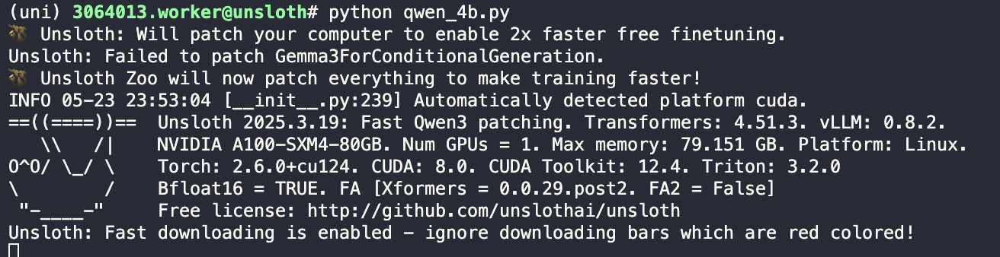
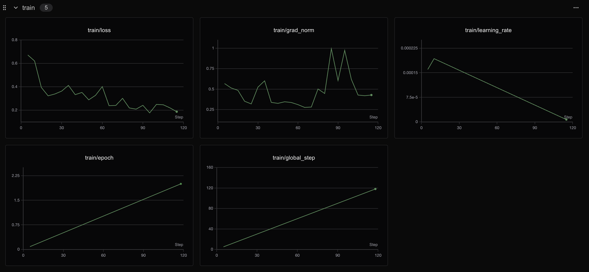
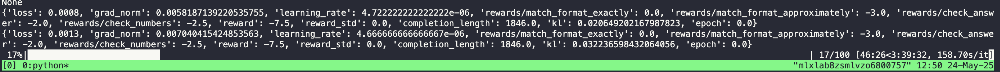
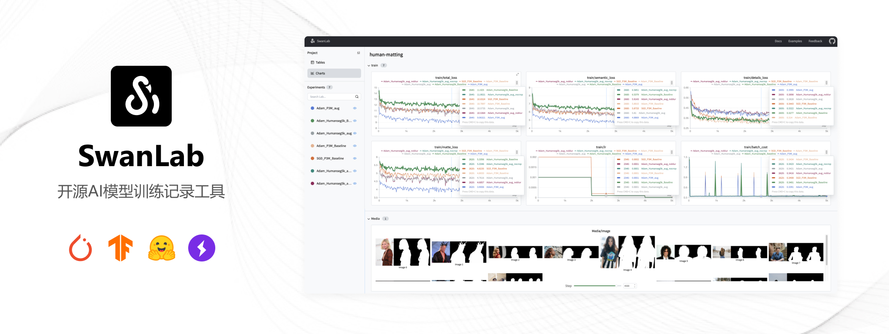
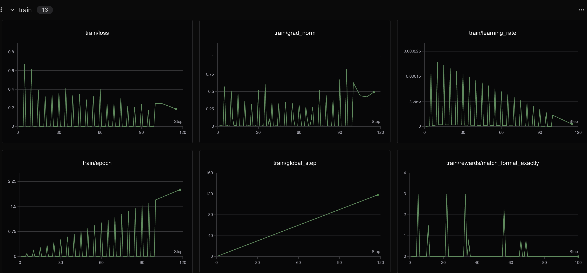

# Qwen3-8B GRPO微调及通过swanlab可视化

> 半小时学会使用 GRPO 通过 Unsloth 训练自己的类 DeepSeek-R1 推理模型。

# 强化学习（RL）

> 相信大家和我一样，刚刚接触RL会觉得很难且没有必要，为什么只做SFT不可以呢？
> 不妨想象一下，我们不是直接告诉机器“遇到A情况就做B”，而是让机器自己去“探索”，在不断“尝试”和“吸取教训”中学会如何做出最好的决策，就像我们人类学习新技能一样，往往可以收获意想不到的效果，让模型能够完成更加复杂的社会场景，贴近于人类理想中的“AI”，这就是强化学习的魅力所在。

## 为什么要做RL？

简单来说，强化学习致力于解决“**序贯决策（Sequential Decision Making）**”问题，也就是如何在一系列连续的步骤中做出最优决策，以达成一个长远的目标。

1. **解决复杂未知环境下的决策问题**：
	1. 在很多现实场景中，我们可能无法预先知道所有规则，或者环境本身就非常复杂多变。比如，让机器人学会在崎岖不平的地面上行走，我们很难手动编程所有可能遇到的情况和应对策略。强化学习允许机器在与环境的**互动**中自主学习，最近比较火的宇树科技和智元机器人，就大幅应用了强化学习算法。
		
	2. 再比如，下围棋（AlphaGo 就是一个经典例子）。棋盘状态千变万化，不可能穷举所有情况。RL可以让智能体通过自我对弈来学习高超的棋艺。
	
2. **实现真正的“AI”**：
	1. 传统的监督学习（SFT）需要大量的“标注数据”，往往这个量级至少是三位数起步，告诉模型“输入X对应输出Y”。但在很多任务中，获取这样的完美标注数据成本极高，甚至不可能（比如，如何标注一个“完美”的机器人行走姿态序列？标注琳琅满目的商品信息？）。
		
	2. 强化学习更接近人类学习的方式——通过**试错（Trial and Error）**。做得好就给“奖励”，做得不好就给“惩罚”（或者不给奖励），智能体在与环境的互动中，通过最大化累积奖励来学习最佳策略。
		
	3. 延迟奖励问题：很多时候，一个行为的好坏并不能立刻显现出来。比如，在游戏中，你现在走的一步棋，可能要到几十步之后才能看出是好是坏。强化学习的算法能够将最终的奖励/惩罚**回溯**分配给导致这一结果的一系列行为，从而学会长远规划。
	
3. **广泛的应用前景**：
	1. **游戏**AI**：比如TEG和天美对王者荣耀联合开发的NPC、网易的永劫无间语音队友，都应用了强化学习算法
		
	2. **机器人控制**：机器人行走-宇树科技和智元机器人、无人机飞行算法-DJI。
		
	3. **自动驾驶**：主要体现在决策系统，目前主流的自动驾驶厂商如momenta也在尝试RL算法。
		
	4. **推荐系统**：如何给用户推荐一系列内容，小红书、快手、字节都在这上面投入巨大。
		

## RL的核心思想是什么？

强化学习的核心思想可以概括为：**智能体（Agent）通过与环境（Environment）的互动，根据环境反馈的奖励（Reward）或惩罚（Punishment），学习一个最优策略（Policy），以最大化其长期累积奖励。** 
听起来有点抽象？我们把它拆解开来看：

1. **智能体** **(Agent)** 🤖：
	1. 这就是我们要训练的学习者和决策者。它可以是一个机器人、游戏中的角色、自动驾驶系统等。
		
	2. 智能体的目标是学习一个**策略 (Policy)**。
	
2. **环境 (Environment)** 🌳：
	1. 智能体所处的外部世界，它会响应智能体的行为并给出反馈。
		
	2. 环境有其自身的**状态 (State)**。
	
3. **状态 (State, S)** 📊：
	1. 对当前环境的一个描述。比如，在机器人行走任务中，状态可以是机器人各个关节的角度、速度；在游戏中，状态可以是当前的游戏画面。
		
	2. 智能体根据当前状态来决定下一步的行动。
	
4. **动作 (Action, A)** 🏃：
	1. 智能体在某个状态下可以执行的操作。比如，机器人可以控制某个关节转动，游戏角色可以向前走、跳跃、攻击。
	
5. **奖励 (Reward, R)** 🏆 / **惩罚** 💔：
	1. 当智能体在某个状态 S 执行了某个动作 A，转移到新的状态 S′ 后，环境会给出一个标量信号——奖励（或惩罚）。
		
	2. 这个奖励信号是指导智能体学习的关键。正奖励表示这个动作是好的，负奖励（惩罚）表示这个动作是坏的。
		
	3. **重要**：智能体的目标不是最大化瞬时奖励，而是**最大化未来的累积奖励** (Cumulative Reward)。比如，吃糖果（瞬时奖励）很开心，但如果因此导致蛀牙（未来惩罚），那可能就不是一个好策略。
	
6. **策略 (Policy, π)** 🗺️：
	1. 这是智能体学习的核心！策略定义了智能体在给定状态下应该采取什么动作。
		
	2. 它可以是确定性的（在状态 s，总是执行动作 a），也可以是随机性的（在状态 s，以一定概率执行动作 a1，以一定概率执行动作 a2 等）。
		
	3. 数学上通常表示为 π(a∣s)=P(At=a∣St=s)，即在状态 St 时采取动作 a 的概率。
	
7. **价值函数** **(Value Function, V(s) 或 Q(s,a))** 💰：
	1. 除了策略，智能体通常还会学习一个价值函数。
		
	2. 状态价值函数 **Vπ(s)**：表示从状态 s 开始，按照策略 π 继续下去，能够获得的期望累积奖励。它衡量了当前状态有多好。
		
	3. **状态-动作价值函数** **Qπ(s,a)**：表示在状态 s 执行动作 a 后，再按照策略 π 继续下去，能够获得的期望累积奖励。它衡量了在当前状态下执行某个特定动作有多好。这个 Q 函数（Q-value）在很多算法中非常关键。
		

总结来说，**强化学习**的核心思想就是**通过与环境的互动和试错，学习一个从状态到动作的映射（策略），以最大化智能体获得的长期累积奖励**。它提供了一个强大的框架，让机器能够像人类一样从经验中学习如何在复杂世界中做出明智的决策。

# GRPO

## GRPO相较于其他RL方法的优势是什么？

> 常见的强化学习方法包括：PPO（最早的）、DPO（最简单的）、GRPO（随着deepseek爆火的）等

**PPO** **(Proximal Policy Optimization,** **近端策略优化)**

- **核心思想**： PPO 是一种经典的强化学习算法，属于**Actor-Critic**架构。
	

**DPO** **(Direct Preference Optimization, 直接偏好优化)**

- **核心思想**： DPO 提出了一种更简洁的方法来进行基于人类偏好的 LLM 对齐。它巧妙地发现，RLHF 中的奖励最大化目标可以被转化为一个**直接基于偏好数据的分类问题**。 它不再需要显式地训练一个奖励模型，也不需要复杂的 Actor-Critic 循环和在线采样。
	

**GRPO (Group Relative Policy Optimization, 组相对策略优化)**

- **核心思想**： GRPO 可以看作是 PPO 的一种变体或改进，旨在提高训练效率和稳定性，特别是在大型模型上。DeepSeek的工作使这个方法受到关注。 它的一个核心特点是**尝试省去或简化价值模型 (Critic)**，并通过一种“组内相对比较”的方式来估计动作的优势 (Advantage)。
	
- **工作方式**：
	- **SFT** **和奖励模型**：通常仍然需要 SFT 模型作为基础，并且需要一个（可能是预训练好的，或者正在优化的）奖励模型来评估生成内容的质量。
		
	- **组采样和相对优势估计**：
		1. 对于一个给定的输入 (prompt)，模型会生成**一组 (group)** 多个候选输出。
			
		2. 奖励模型对这一组中的所有输出进行打分。
			
		3. GRPO 利用这些组内的打分信息来估计每个输出的相对优势。例如，可以将组内所有输出的平均奖励作为基线 (baseline)，高于平均奖励的输出被认为具有正优势，低于平均奖励的则具有负优势。
		
	- **策略更新**：基于这种相对优势估计来更新策略网络 (Actor)。
		1. 关键在于它可能**不需要一个独立的、需要迭代训练的价值网络 (Critic)** 来估计状态价值或状态-动作价值，从而降低了复杂性和计算量。
	
- **优点**：
	- **效率提升**：通过省去或简化价值模型，可以减少内存占用和计算开销，这对于非常大的模型尤其有利。
		
	- **稳定性可能更好**：组内相对比较可能提供更稳定的学习信号。
		
	- 与奖励模型的训练方式更契合：奖励模型通常也是通过比较成对输出来训练的，GRPO 的组内比较方式与此类似。
		

## GRPO的核心思想是什么？

> 那么你可能会注意到RL往往是在SFT之后作为一种post-traning的方法，那么直接RL可不可以呢？

DeepSeek 的研究人员在使用纯强化学习 (RL) 训练 R1-Zero 时，发现了一个“顿悟时刻”。该模型学会了通过重新评估其初始方法，延长其思考时间，而无需任何人工指导或预先定义的指令。

一个完整的GRPO流程往往如下：

1. 模型生成多组响应
	
2. 每个响应都根据正确性或由某些设定的奖励函数（而不是 LLM 奖励模型）创建的其他指标进行评分
	
3. 计算该组的平均分数
	
4. 每个回答的分数都会与小组平均分数进行比较
	
5. 模型得到强化，有利于获得更高得分的回应
	

最初，人们必须收集大量数据来填充推理过程/思维链。但 GRPO（DeepSeek 使用的算法）或其他强化学习算法可以引导模型自动展现推理能力并创建推理轨迹。相反，我们需要创建良好的奖励函数或验证器。例如，如果它得到了正确的答案，就给它 1 分。如果某些单词拼写错误，就减 0.1 分。等等！我们可以提供很多函数来奖励这个过程，也就代替了传统的LLM奖励模型，节约了大量的训练成本和资源消耗！

# RL框架的选择

## 常见的RL框架都有什么？

> TRL、VeRL、Unsloth等

TRL（Transformer Reinforcement Learning） 是由 Hugging Face 开发的一套基于强化学习（Reinforcement Learning, RL）的训练工具，专门用于优化和微调大规模语言模型（如 GPT、LLaMA 等）。它结合了 PPO（Proximal Policy Optimization） 等强化学习算法，使开发者能够高效地对预训练语言模型进行 RL 微调，以优化特定目标（如人类偏好对齐、任务性能提升等）。
VeRL是字节跳动在TRL的基础之上针对大规模分布式（ray）训练场景优化的强化学习框架，TRL能干的VeRL都能干，目前很多公司的强化学习框架都是基于VeRl改的。

不过这都不是本教程的主角，本教程的主角是Unsloth，为什么选择这个框架呢？我将其总结成了以下几点：

1. VeRL优化的是分布式场景，也就是卡的数量>=2用起来才会比较顺手，这不符合项目的初衷
	
2. ray的学习成本对于小白来讲过高
	
3. unsloth在单卡场景下即可对8b模型进行RL资源占用极低
	

RL原理可以利用极小的学习成本掌握，这不是好事成双嘛，接下来就一起看看Unsloth吧！

## Unsloth - 0基础学习最佳框架！


**官方文档：** https://docs.unsloth.ai/
**Github：** https://github.com/unslothai/unsloth
Unsloth 是一个极其强调资源节省的框架，把所有的资源节省做到了极致，具体来讲Unsloth能够将 Llama-3、Mistral、Phi-4 和 Gemma 等大型语言模型的微调速度提升 2 倍，内存占用减少 70%，并且准确率没有任何下降！
官方文档非常全面，详细指导了如何训练自己的定制模型。其中涵盖了安装和更新 Unsloth、创建数据集、运行和部署模型等基本要素。 Unsloth 让大家在本地或在 Google Colab 和 Kaggle 等平台上训练像 Llama 3 这样的模型变得极其简单。Unsloth简化了整个训练工作流程，包括模型加载、量化、训练、评估、运行、保存、导出，以及与 Ollama、llama.cpp 和 vLLM 等推理引擎的集成。
Unsloth定期与 Hugging Face、Google 和 Meta 的团队合作，以修复 LLM 训练和模型中的错误。因此，当使用 Unsloth 进行训练或使用模型时，可以期待获得最准确的结果。 Unsloth 具有高度可定制性，允许更改聊天模板或数据集格式等内容。Unsloth还为视觉、文本转语音 (TTS)、BERT、强化学习 (RL) 等提供了预构建的脚本！此外，Unsloth支持所有训练方法和所有基于 Transformer 的模型。

# GRPO微调Qwen3！

> 咳咳，有点啰嗦了，下面开始步入正题

本文使用的测试环境为单张A100，显存80GB，可根据需求切换不同参数量的模型，实测4B 24G显存 is enough！
unsloth使Qwen3(8B)微调速度提高2倍，VRAM使用减少70%，并且比所有使用Flash Attention 2的环境支持长8倍的上下文长度。使用unsloth，Qwen3–30B-A3B模型可以舒适地在仅17.5GB VRAM的环境中运行。
unsloth为Qwen3提供了Dynamic 2.0量化方法，在5-shot MMLU和KL散度基准测试中提供最佳性能。这意味着可以运行和微调量化后的Qwen3 LLM，同时保持最小的精度损失。unsloth还上传了支持原生128K上下文长度的Qwen3版本。

## Qwen3\_8b\_GRPO.ipynb

**安装软件包**

```Python
pip install unsloth==2025.3.19 vllm==0.8.2
```

**准备模型，设置参数**

```Python
from unsloth import FastLanguageModel
import torch

max_seq_length = 2048  # 最大序列长度，可以增加以支持更长的推理轨迹
lora_rank = 32         # LoRA 的秩，秩越大模型可能越智能，但训练和推理速度会变慢

# 从预训练模型加载模型和分词器
model, tokenizer = FastLanguageModel.from_pretrained(
    model_name="Qwen/Qwen3-8B",  # 要加载的预训练模型名称(官网版本/离线版本/unsloth版本均可)
    max_seq_length=max_seq_length,        # 设置模型的最大序列长度
    load_in_4bit=False,                   # 是否以4位加载模型，对于LoRA 16位训练，设置为False
    fast_inference=True,                  # 是否启用 vLLM 快速推理
    max_lora_rank=lora_rank,              # 设置 LoRA 的最大秩
    gpu_memory_utilization=0.7,           # GPU显存使用率，如果显存不足 (OOM)，可以降低此值
)

# 为模型添加 PEFT (Parameter-Efficient Fine-Tuning) 配置，这里使用 LoRA
model = FastLanguageModel.get_peft_model(
    model,
    r=lora_rank,  # LoRA 的秩 (r)，选择任何大于0的数字！建议值为 8, 16, 32, 64, 128
    target_modules=[  # 需要应用LoRA的模块名称列表
        "q_proj", "k_proj", "v_proj", "o_proj",  # 注意力机制中的查询、键、值、输出投影
        "gate_proj", "up_proj", "down_proj",     # 前馈网络中的门控、上行和下行投影
    ],
    lora_alpha=lora_rank * 2,  # LoRA 的 alpha 参数，设置为秩的2倍可以加速训练
    use_gradient_checkpointing="unsloth",  # 是否使用梯度检查点技术，"unsloth" 表示使用其优化版本以减少显存使用
    random_state=3407,                   # 随机种子，用于确保结果的可复现性
)
```


**设置CoT思考模版【让模型具备思考能力的必经之路】**

```Python
# 定义用于标记模型推理过程和最终解的字符串标记
reasoning_start = "<start_working_out>"     # 用于包裹模型的“思考过程”开始部分
reasoning_end   = "<end_working_out>"       # 用于包裹模型的“思考过程”结束部分
solution_start  = "<SOLUTION>"              # 用于包裹最终解答开始部分
solution_end    = "</SOLUTION>"             # 用于包裹最终解答结束部分

# 定义系统提示词，告诉模型应该如何组织回答：先推理，再给出答案
system_prompt = \
f"""You are given a problem.
Think about the problem and provide your working out.
Place it between {reasoning_start} and {reasoning_end}.
Then, provide your solution between {solution_start}{solution_end}"""

# 构建chat_template模板，控制如何拼接prompt
chat_template = \
    ""\
        "{{ messages[0]['content'] + eos_token }}"\  # 如果第一条是system提示，拼接它并添加eos标记
        ""\     # 剩下的消息设为循环体
    ""\
        "{{ '{system_prompt}' + eos_token }}"\        # 否则，插入默认system_prompt并添加eos
        ""\
    ""\
    ""\             # 遍历所有对话消息
        ""\
            "{{ message['content'] }}"\               # 用户消息直接添加
        ""\
            "{{ message['content'] + eos_token }}"\   # assistant消息后加eos
        ""\
    ""\
    "{{ '{reasoning_start}' }}"\  # 如果需要生成提示，添加开始思考标记
    ""

# 将模板中作为字符串存在的变量替换为实际变量值（避免模板中引号包住变量名）
chat_template = chat_template\
    .replace("'{system_prompt}'",   f"'{system_prompt}'")\
    .replace("'{reasoning_start}'", f"'{reasoning_start}'")

# 将chat_template应用到tokenizer（假设这是一个支持chat_template的tokenizer）
tokenizer.chat_template = chat_template

# 模拟一次tokenizer应用chat_template的过程（不进行tokenize，只展示结果）
tokenizer.apply_chat_template([
    {"role" : "user", "content" : "What is 1+1?"},
    {"role" : "assistant", "content" : f"{reasoning_start}I think it's 2.{reasoning_end}{solution_start}2{solution_end}"},
    {"role" : "user", "content" : "What is 2+2?"},
], tokenize = False, add_generation_prompt = True)
```

**加载数据集【这里使用一个数学推理的数据集】**

```Python
from datasets import load_dataset
import pandas as pd
import numpy as np

dataset = load_dataset("unsloth/OpenMathReasoning-mini", split = "cot")
dataset = dataset.to_pandas()[
    ["expected_answer", "problem", "generated_solution"]
]

is_number = pd.to_numeric(pd.Series(dataset["expected_answer"]), errors = "coerce").notnull()
dataset = dataset.iloc[np.where(is_number)[0]]

dataset
```

**处理数据集的格式（SFT的老生常谈）**

```Python
def format_dataset(x):
    # 从输入数据中提取期望答案和问题内容
    expected_answer = x["expected_answer"]
    problem = x["problem"]

    # 获取模型生成的推理内容，并移除旧格式标签 <think> 和 </think>
    thoughts = x["generated_solution"]
    thoughts = thoughts.replace("<think>", "").replace("</think>", "")

    # 去除推理内容左右两端的换行符和空格
    thoughts = thoughts.strip()

    # 按照自定义格式拼接推理部分和答案部分，插入标记标签
    final_prompt = (
        reasoning_start + thoughts + reasoning_end +
        solution_start + expected_answer + solution_end
    )

    # 构造格式化后的多轮对话列表，用于微调或测试对话模型
    return [
        {"role": "system",    "content": system_prompt},  # 系统提示词，指导模型输出格式
        {"role": "user",      "content": problem},        # 用户输入的问题
        {"role": "assistant", "content": final_prompt},   # 模型的回复，包含推理过程和答案
    ]

# 将整个数据集按行应用格式化函数，生成 Messages 字段，适用于对话类微调
dataset["Messages"] = dataset.apply(format_dataset, axis=1)

tokenizer.apply_chat_template(dataset["Messages"][0], tokenize = False)

dataset["N"] = dataset["Messages"].apply(lambda x: len(tokenizer.apply_chat_template(x)))

dataset = dataset.loc[dataset["N"] <= max_seq_length/2].copy()
dataset.shape

from datasets import Dataset

dataset["text"] = tokenizer.apply_chat_template(dataset["Messages"].values.tolist(), tokenize = False)
dataset = Dataset.from_pandas(dataset)
dataset
```

**先做SFT**

```Python
from trl import SFTTrainer, SFTConfig

# 创建一个有监督微调的训练器实例
trainer = SFTTrainer(
    model = model,                 # 预训练模型（如 LLaMA、Qwen、Mistral 等）
    tokenizer = tokenizer,         # 与模型匹配的 tokenizer，需支持 chat_template
    train_dataset = dataset,       # 用于训练的数据集，要求包含"text"字段

    # 训练参数配置
    args = SFTConfig(
        dataset_text_field = "text",               # 数据集中用于训练输入的字段名（通常为"text"）
        per_device_train_batch_size = 1,           # 每张 GPU 上的 batch size
        gradient_accumulation_steps = 1,           # 梯度累积步数（总有效 batch_size = 上两者相乘）

        warmup_steps = 5,                          # 学习率预热步数，避免初始过快下降
        num_train_epochs = 2,                      # 训练轮数

        learning_rate = 2e-4,                      # 初始学习率（建议长期训练用 2e-5 ~ 5e-5）
        logging_steps = 5,                         # 每 5 步打印一次日志（loss 等）

        optim = "adamw_8bit",                      # 使用 8-bit AdamW 优化器（需要 bitsandbytes 支持）
        weight_decay = 0.01,                       # 权重衰减，防止过拟合
        lr_scheduler_type = "linear",              # 线性学习率衰减策略

        seed = 3407,                               # 固定随机种子，确保实验可重复

        report_to = "none",                        # 不将训练日志报告到 WandB 等工具（如需开启改为"wandb"）
    ),
)

trainer.train()
```

**SFT阶段输出**


```Python
# 构建输入 prompt，选取前两条消息（通常为 system + user）
text = tokenizer.apply_chat_template(
    dataset[0]["Messages"][:2],       # 输入前两条消息：system 和 user 组成的 prompt
    tokenize = False,                 # 不进行 token 化，返回纯文本字符串
    add_generation_prompt = True,     # 在结尾添加推理开始标记（如 <start_working_out>）
)

# 使用 transformers 的流式输出工具 TextStreamer 实时打印生成内容
from transformers import TextStreamer
_ = model.generate(
    **tokenizer(text, return_tensors = "pt").to("cuda"),   # 编码文本并移动到 GPU
    temperature = 0,                # 使用贪婪解码（temperature 趋近于 0）
    max_new_tokens = 1024,         # 限制生成 token 数量
    streamer = TextStreamer(tokenizer, skip_prompt = False),  # 实时打印生成结果
)

# 清理内存，防止显存泄露
del dataset
torch.cuda.empty_cache()
import gc
gc.collect()

# 加载一个数学微调数据集（HuggingFace hub 上的 DAPO-Math-17k）
from datasets import load_dataset
dataset = load_dataset("open-r1/DAPO-Math-17k-Processed", "en", split = "train")
dataset

# 查看一个样本的 prompt 和 solution 字段
dataset[0]["prompt"]
dataset[0]["solution"]

# 抽取解答函数（可定制，此处暂时原样返回）
def extract_hash_answer(text):
    # 可启用以下代码用于处理带有 "####" 分隔的答案
    # if "####" not in text: return None
    # return text.split("####")[1].strip()
    return text
extract_hash_answer(dataset[0]["solution"])

# 将原始数据格式转为 messages 格式，适配 SFTTrainer 所需格式
dataset = dataset.map(lambda x: {
    "prompt": [  # 将系统提示和用户输入转为消息格式
        {"role": "system", "content": system_prompt},
        {"role": "user",   "content": x["prompt"]},
    ],
    "answer": extract_hash_answer(x["solution"]),  # 答案部分处理
})
dataset[0]

# ========================
# 提取生成文本中答案部分的正则表达式匹配器
# ========================

import re

# 构造匹配结束标签 "</SOLUTION>" 和可选的 eos_token（例如 <|endoftext|>）
solution_end_regex = r"</SOLUTION>[\s]{0,}" + \
    "(?:" + re.escape(tokenizer.eos_token) + ")?"

# 构造完整的匹配模板，用于提取推理结果中的答案部分
match_format = re.compile(
    rf"{reasoning_end}.*?"\                   # 匹配推理结束标签以及其后的内容（非贪婪）
    rf"{solution_start}(.+?){solution_end_regex}"\  # 提取 <SOLUTION> 与 </SOLUTION> 之间的内容
    rf"[\s]{{0,}}$",                          # 匹配末尾的空白
    flags = re.MULTILINE | re.DOTALL         # 多行匹配 + 点号匹配换行符
)

# 示例：验证格式匹配是否能正确提取解答部分
match_format.findall(
    "<start_working_out>Let me think!<end_working_out>"\
    f"<SOLUTION>  2  </SOLUTION>\n\n",
)
# 输出应为：["2"]
```


**奖励函数部分**

```Python
def match_format_exactly(completions, **kwargs):
    scores = []  # 用于保存每个 completion 的得分

    for completion in completions:
        score = 0
        response = completion[0]["content"]  # 获取模型输出内容（假设为 messages 列表中的第一个 assistant 回复）

        # 如果输出内容能成功匹配指定格式（即包含完整 <start_working_out>...<SOLUTION>... 标签结构）
        if match_format.search(response) is not None:
            score += 3.0  # 匹配成功得 3 分（用于奖励格式正确的输出）

        scores.append(score)  # 保存该条 completion 的得分

    return scores  # 返回所有 completion 的格式匹配得分列表
```

```Python
def match_format_approximately(completions, **kwargs):
    scores = []  # 存储每个 completion 的近似格式匹配得分

    for completion in completions:
        score = 0
        response = completion[0]["content"]  # 获取该条生成结果的文本内容

        # 本函数不是精确匹配整段模板，而是检查关键标签是否恰好出现一次
        # 评分标准如下（每个关键标签出现一次加 0.5 分，出现多次或漏掉则减 1 分）：

        # <start_working_out> 不需要判断，因为一般在 prompt 中已加，无需重复奖励

        score += 0.5 if response.count(reasoning_end)   == 1 else -1.0  # 检查 <end_working_out>
        score += 0.5 if response.count(solution_start)  == 1 else -1.0  # 检查 <SOLUTION>
        score += 0.5 if response.count(solution_end)    == 1 else -1.0  # 检查 </SOLUTION>

        scores.append(score)  # 保存该条 completion 的评分结果

    return scores  # 返回所有样本的评分结果列表
```

```Python
def check_answer(prompts, completions, answer, **kwargs):
    # 获取原始问题（一般为 prompts 中最后一个 user 消息的内容）
    question = prompts[0][-1]["content"]

    # 提取每个 completion 的生成结果（假设为 assistant 的第一条回复）
    responses = [completion[0]["content"] for completion in completions]

    # 从每个 response 中提取 <SOLUTION> 标签内的答案（使用正则匹配）
    extracted_responses = [
        guess.group(1)  # 如果匹配成功，取出括号中的 group(1)
        if (guess := match_format.search(r)) is not None else None  # 否则为 None
        for r in responses
    ]

    scores = []  # 存储每个样本的评分结果
    for guess, true_answer in zip(extracted_responses, answer):
        score = 0
        if guess is None:
            scores.append(-2.0)  # 若未成功提取答案，直接扣分
            continue

        # 正确答案完全一致，奖励 5 分
        if guess == true_answer:
            score += 5.0

        # 若去除空格后匹配成功，奖励略少（3.5 分）
        elif guess.strip() == true_answer.strip():
            score += 3.5

        # 否则，尝试进行“近似数值”匹配
        else:
            try:
                ratio = float(guess) / float(true_answer)  # 转换为 float 并计算比值
                if   ratio >= 0.9 and ratio <= 1.1:
                    score += 2.0  # 误差在 ±10% 内
                elif ratio >= 0.8 and ratio <= 1.2:
                    score += 1.5  # 误差在 ±20% 内
                else:
                    score -= 2.5  # 偏差太大，扣分
            except:
                score -= 4.5  # 无法转为数值（如包含文本、单位等），严重扣分

        scores.append(score)  # 记录当前样本的得分

    return scores  # 返回每个 completion 的分数
```

```Python
match_numbers = re.compile(
    solution_start + r".*?[\s]{0,}([-]?[\d\.\,]{1,})",
    flags = re.MULTILINE | re.DOTALL
)
print(match_numbers.findall("<SOLUTION>  0.34  </SOLUTION>"))
print(match_numbers.findall("<SOLUTION>  123,456  </SOLUTION>"))
print(match_numbers.findall("<SOLUTION>  -0.234  </SOLUTION>"))
print(match_numbers.findall("<SOLUTION>17</SOLUTION>"))
```

```Python
# 全局打印控制变量，每 N 步打印一次日志（用于调试时查看部分输出）
global PRINTED_TIMES
PRINTED_TIMES = 0  # 当前已打印次数

global PRINT_EVERY_STEPS
PRINT_EVERY_STEPS = 5  # 每间隔多少步打印一次

# 数值匹配函数：从生成结果中提取数字，并与正确答案进行比较
def check_numbers(prompts, completions, answer, **kwargs):
    # 获取问题文本（通常为 prompts 中最后一个 user 消息）
    question = prompts[0][-1]["content"]

    # 提取模型生成的文本内容（假设每个 completion 是一个消息列表，取第一条）
    responses = [completion[0]["content"] for completion in completions]

    # 使用正则表达式 match_numbers 提取数字
    extracted_responses = [
        guess.group(1)
        if (guess := match_numbers.search(r)) is not None else None \
        for r in responses
    ]

    scores = []  # 存储得分结果

    # 控制打印调试信息（每隔 N 次打印一次，用于查看 sample 匹配结果）
    global PRINTED_TIMES
    global PRINT_EVERY_STEPS
    if PRINTED_TIMES % PRINT_EVERY_STEPS == 0:
        print(
            '*'*20 + f"Question:\n{question}",  # 打印问题
            f"\nAnswer:\n{answer[0]}",           # 打印参考答案
            f"\nResponse:\n{responses[0]}",      # 打印模型生成
            f"\nExtracted:\n{extracted_responses[0]}"  # 打印提取结果
        )
    PRINTED_TIMES += 1  # 打印次数增加

    # 核心评分逻辑
    for guess, true_answer in zip(extracted_responses, answer):
        if guess is None:
            scores.append(-2.5)  # 没提取出数字，直接扣分
            continue

        try:
            # 去除空格，转换为 float；guess 先去掉千位分隔符（例如 123,456）
            true_answer = float(true_answer.strip())
            guess = float(guess.strip().replace(",", ""))

            # 如果完全数值一致，得分 3.5；否则扣分
            scores.append(3.5 if guess == true_answer else -1.5)

        except:
            scores.append(0)  # 解析失败不给分也不扣分
            continue

    return scores  # 返回所有样本的得分列表
```

```Python
# 对数据集中的每条样本，应用 tokenizer 的 chat 模板并进行分词
tokenized = dataset.map(
    lambda x: {
        "tokens": tokenizer.apply_chat_template(
            x["prompt"],                        # 输入为 prompt 字段，即消息列表 [{"role": ..., "content": ...}, ...]
            add_generation_prompt=True,         # 添加生成提示符（如 <start_working_out>），用于 instruct-style 生成任务
            tokenize=True                       # 返回 token id 列表，而非字符串
        )
    },
    batched=True,  # 启用批处理，提高 map 的效率
)

# 打印第一个样本的解码结果（从 token id 转换回字符串），用于验证模板和 tokenization 是否正确
print(tokenizer.decode(tokenized[0]["tokens"]))

# 为每条样本添加 token 序列长度字段 "L"，便于后续长度分布分析
tokenized = tokenized.map(lambda x: {"L": len(x["tokens"])})

import numpy as np
# 计算 token 长度的 90% 分位数，作为训练时的最大 token 限制（防止极端长样本导致 OOM）
maximum_length = int(np.quantile(tokenized["L"], 0.9))
print("Max Length = ", maximum_length)

# 过滤掉 token 长度超过最大长度阈值的样本，仅保留较短的 90% 样本
dataset = dataset.select(
    np.where(np.array(tokenized["L"]) <= maximum_length)[0]
)

# 删除中间变量 tokenized，释放内存
del tokenized
```

**GRPO部分**

```Python
# 计算提示长度上限（加1是保险措施，防止边界问题）
max_prompt_length = maximum_length + 1  # +1 是为了避免 max_length 截断时误伤
max_completion_length = max_seq_length - max_prompt_length  # 剩余 token 用于生成

# 配置 vLLM 的采样参数（用于生成训练样本）
from vllm import SamplingParams
vllm_sampling_params = SamplingParams(
    min_p = 0.1,                    # nucleus sampling 的截断下界
    top_p = 1.0,                    # nucleus sampling 的上限（top-p sampling）
    top_k = -1,                     # 不启用 top-k 截断（-1 表示关闭）
    seed = 3407,                    # 固定随机种子，保证生成结果可复现
    stop = [tokenizer.eos_token],   # 生成停止标志（通常是 <|endoftext|>）
    include_stop_str_in_output = True,  # 是否将 stop token 也包含在输出中
)
# 配置 GRPO（Generalized Reinforcement Preference Optimization）训练参数
from trl import GRPOConfig, GRPOTrainer
training_args = GRPOConfig(
    vllm_sampling_params = vllm_sampling_params,  # 用于生成 completion 的采样策略
    temperature = 1.0,               # 生成的多样性控制（通常设为 0.7 ~ 1.0）
    learning_rate = 5e-6,            # 训练的学习率（较小以保证稳定收敛）
    weight_decay = 0.01,             # 权重衰减，用于防止过拟合
    warmup_ratio = 0.1,              # warmup 步数占总训练步数的比例（通常为 0.05 ~ 0.1）
    lr_scheduler_type = "linear",    # 学习率调度方式为线性下降
    optim = "adamw_8bit",            # 使用 bitsandbytes 的 8bit AdamW 优化器（省显存）

    logging_steps = 1,               # 每一步打印一次日志（适合 debug）
    per_device_train_batch_size = 1, # 每张 GPU 的 batch size
    gradient_accumulation_steps = 1, # 梯度累积步数（设为 4 可等效 batch size=4）

    num_generations = 4,             # 每个 prompt 生成多少个 response（越多越好，但显存消耗更大）
    max_prompt_length = max_prompt_length,         # 提示 token 最大长度（前面计算得出）
    max_completion_length = max_completion_length, # 回答 token 最大长度（确保总长不超过模型限制）

    # num_train_epochs = 1,          # 可选参数：训练轮次，设置后可按 epoch 控制训练终止
    max_steps = 100,                 # 最大训练步数（适合调试用，正式训练时可加大）
    save_steps = 100,                # 每 100 步保存一次模型（训练短时可以不存）

    report_to = "none",              # 不上传训练日志（可设置为 "wandb" 使用可视化工具）
    output_dir = "outputs",          # 模型输出路径
```

```Python
# 创建 GRPOTrainer 实例，用于执行强化学习式偏好优化训练（Generalized RPO）
trainer = GRPOTrainer(
    model = model,  # 需要训练的语言模型（必须支持 causal LM 格式，如 GPT、LLaMA 等）

    processing_class = tokenizer,  # 用于生成 prompt、解码 response 的 tokenizer（需支持 chat_template）

    reward_funcs = [  # 自定义奖励函数列表，用于计算每条样本的得分
        match_format_exactly,       # 检查是否严格符合 <start_working_out>...<SOLUTION> 格式，匹配得分高
        match_format_approximately, # 检查是否大致有格式标签，宽松评分
        check_answer,               # 与参考答案对比，进行精确匹配、模糊匹配、近似数值匹配
        check_numbers,              # 提取数值进行比较（用于数学题）
    ],

    args = training_args,  # 训练参数配置（使用前面定义好的 GRPOConfig 对象）

    train_dataset = dataset,  # 实际用于训练的数据集

    # 可选：如启用训练 + 验证评估，可替换为如下配置
    # train_dataset = new_dataset["train"],
    # eval_dataset = new_dataset["test"],
)
```


**训练完毕后调用模型**

```Python
# Step 1: 构造初始输入并生成输出（不加载 LoRA）
text = "What is the sqrt of 101?"

from vllm import SamplingParams

# 设置生成参数（适度随机，限制长度）
sampling_params = SamplingParams(
    temperature = 1.0,
    top_k = 50,
    max_tokens = 1024,
)

# 使用基础模型进行快速推理（未加载 LoRA）
output = model.fast_generate(
    [text],  # 输入为单条文本
    sampling_params=sampling_params,
    lora_request=None,  # 不加载任何 LoRA 权重
)[0].outputs[0].text

print("Original model output:\n", output)

# Step 2: 保存 GRPO 微调得到的 LoRA 权重
model.save_lora("grpo_saved_lora")

# Step 3: 检查保存的 safetensors 权重不为全零
from safetensors import safe_open

with safe_open("grpo_saved_lora/adapter_model.safetensors", framework="pt") as f:
    for key in f.keys():
        tensor = f.get_tensor(key)
        n_zeros = (tensor == 0).sum() / tensor.numel()
        assert n_zeros.item() != 1.0, f"Tensor {key} is entirely zero!"

print("LoRA weights saved and verified.")

# Step 4: 构造消息格式输入并应用 tokenizer 的 chat_template
messages = [
    {"role": "system", "content": system_prompt},
    {"role": "user", "content": "What is the sqrt of 101?"},
]

# 构造对话式文本输入，用于 instruct-style 推理
text = tokenizer.apply_chat_template(
    messages,
    add_generation_prompt=True,  # 添加推理起始标记
    tokenize=False               # 返回字符串而非 token ids
)

# Step 5: 加载微调后的 LoRA 并生成输出
sampling_params = SamplingParams(
    temperature=1.0,
    top_k=50,
    max_tokens=2048,
)

# 加载 LoRA 并进行推理
output = model.fast_generate(
    text,
    sampling_params=sampling_params,
    lora_request=model.load_lora("grpo_saved_lora"),  # 加载 GRPO 微调权重
)[0].outputs[0].text

print("GRPO-tuned model output:\n", output)
```

**保存模型**

```Python
# 合并为 16bit 权重并保存本地（适用于全精度部署）
if False:
    model.save_pretrained_merged("model", tokenizer, save_method="merged_16bit")
# 合并为 16bit 权重并上传至 HuggingFace Hub（需填写 token）
if False:
    model.push_to_hub_merged("hf/model", tokenizer, save_method="merged_16bit", token="")
# 合并为 4bit 量化权重并保存本地（适用于节省显存的部署场景，如 QLoRA 推理）
if False:
    model.save_pretrained_merged("model", tokenizer, save_method="merged_4bit")
# 合并为 4bit 量化权重并上传至 HuggingFace Hub（需填写 token）
if False:
    model.push_to_hub_merged("hf/model", tokenizer, save_method="merged_4bit", token="")
# 仅保存 LoRA Adapter 参数（适用于只上传微调部分以节省空间或用于 PEFT 加载）
if False:
    model.save_pretrained_merged("model", tokenizer, save_method="lora")
# 仅上传 LoRA Adapter 参数至 HuggingFace Hub（需填写 token）
if False:
    model.push_to_hub_merged("hf/model", tokenizer, save_method="lora", token="")
```

```Python
# 保存为 8bit Q8_0 GGUF 格式（适用于 GGUF 量化模型推理，如 llama.cpp）
if False:
    model.save_pretrained_gguf("model", tokenizer)
# 上传 Q8_0 量化模型到 HuggingFace Hub
# 请前往 https://huggingface.co/settings/tokens 获取访问令牌（token）
# 并将 "hf" 替换为你的用户名
if False:
    model.push_to_hub_gguf("hf/model", tokenizer, token="")
# 保存为 16bit GGUF 格式（即未量化版本，保留完整精度，适用于精度敏感任务）
if False:
    model.save_pretrained_gguf("model", tokenizer, quantization_method="f16")
# 上传 16bit GGUF 模型到 HuggingFace Hub
if False:
    model.push_to_hub_gguf("hf/model", tokenizer, quantization_method="f16", token="")
# 保存为 q4_k_m（4bit K-type）GGUF 格式，适用于推理效率与精度之间的平衡
if False:
    model.save_pretrained_gguf("model", tokenizer, quantization_method="q4_k_m")
# 上传 q4_k_m 模型到 HuggingFace Hub
if False:
    model.push_to_hub_gguf("hf/model", tokenizer, quantization_method="q4_k_m", token="")
# 一次性上传多个 GGUF 格式版本，速度更快（适合部署多个精度版本）
if False:
    model.push_to_hub_gguf(
        "hf/model",  # 替换 "hf" 为你的 HuggingFace 用户名
        tokenizer,
        quantization_method=["q4_k_m", "q8_0", "q5_k_m"],  # 可根据需要调整格式
        token=""
    )
```

## Swanlab



> ++[SwanLab](https://github.com/swanhubx/swanlab)++ 是一个开源的模型训练记录工具，面向 AI 研究者，提供了训练可视化、自动日志记录、超参数记录、实验对比、多人协同等功能。在 `SwanLab` 上，研究者能基于直观的可视化图表发现训练问题，对比多个实验找到研究灵感，并通过在线链接的分享与基于组织的多人协同训练，打破团队沟通的壁垒。

### 为什么要记录训练？

相较于软件开发，模型训练更像一个实验科学。一个品质优秀的模型背后，往往是成千上万次实验。研究者需要不断尝试、记录、对比，积累经验，才能找到最佳的模型结构、超参数与数据配比。在这之中，如何高效进行记录与对比，对于研究效率的提升至关重要。

### 在哪里用？

建议先在 ++[SwanLab 官网](https://swanlab.cn/)++ 注册账号，然后在SFT和GRPO训练初始化阶段选择

```Python
from trl import SFTTrainer, SFTConfig
trainer = SFTTrainer(
    model = model,
    tokenizer = tokenizer,
    train_dataset = dataset,
    args = SFTConfig(
        dataset_text_field = "text",
        per_device_train_batch_size = 1,
        gradient_accumulation_steps = 1, 
        warmup_steps = 5,
        num_train_epochs = 2,
        learning_rate = 2e-4, 
        logging_steps = 5,
        optim = "adamw_8bit",
        weight_decay = 0.01,
        lr_scheduler_type = "linear",
        seed = 3407,
        report_to = "swanlab", # 这里改成swanlab
    ),
)
```

```Python
max_prompt_length = maximum_length + 1
max_completion_length = max_seq_length - max_prompt_length

from vllm import SamplingParams
vllm_sampling_params = SamplingParams(
    min_p = 0.1,
    top_p = 1.0,
    top_k = -1,
    seed = 3407,
    stop = [tokenizer.eos_token],
    include_stop_str_in_output = True,
)

from trl import GRPOConfig, GRPOTrainer
training_args = GRPOConfig(
    vllm_sampling_params = vllm_sampling_params,
    temperature = 1.0,
    learning_rate = 5e-6,
    weight_decay = 0.01,
    warmup_ratio = 0.1,
    lr_scheduler_type = "linear",
    optim = "adamw_8bit",
    logging_steps = 1,
    per_device_train_batch_size = 1,
    gradient_accumulation_steps = 1, # Increase to 4 for smoother training
    num_generations = 4, # Decrease if out of memory
    max_prompt_length = max_prompt_length,
    max_completion_length = max_completion_length,
    # num_train_epochs = 1, # Set to 1 for a full training run
    max_steps = 100,
    save_steps = 100,
    report_to = "swanlab", # 这里改成swanlab
    output_dir = "outputs",

    # 可以选择训练+评估
    # fp16_full_eval = True,
    # per_device_eval_batch_size = 4,
    # eval_accumulation_steps = 1,
    # eval_strategy = "steps",
    # eval_steps = 1,
)
```

### 本试验的试验记录

#### SFT阶段


#### GRPO阶段


400个step之后loss会有明显变化

# 总结

Congratulations！看到了这，你已经初步实现了一个简单的RL实战，掌握了使用 Unsloth 对 Qwen3 这类大模型进行 GRPO 微调的具体操作步骤，更能体会到 Unsloth 在大幅提升训练速度、显著降低显存占用方面的强大优势，从而使在有限资源下进行复杂强化学习实验成为可能！如果支持我们的工作希望得到你的star！！这是我们持续更新的最大动力！！！

# 相关链接

- 完整可运行的代码：[Github](https://github.com/datawhalechina/self-llm/blob/master/models/Qwen3/10-Qwen3_8B_GRPO.ipynb)
- 综述：https://arxiv.org/abs/2001.06921
- deepseek-r1：https://arxiv.org/abs/2501.12948
- 数学原理：https://blog.csdn.net/weixin\_38991876/article/details/146474767
- Unsloth：https://docs.unsloth.ai/
