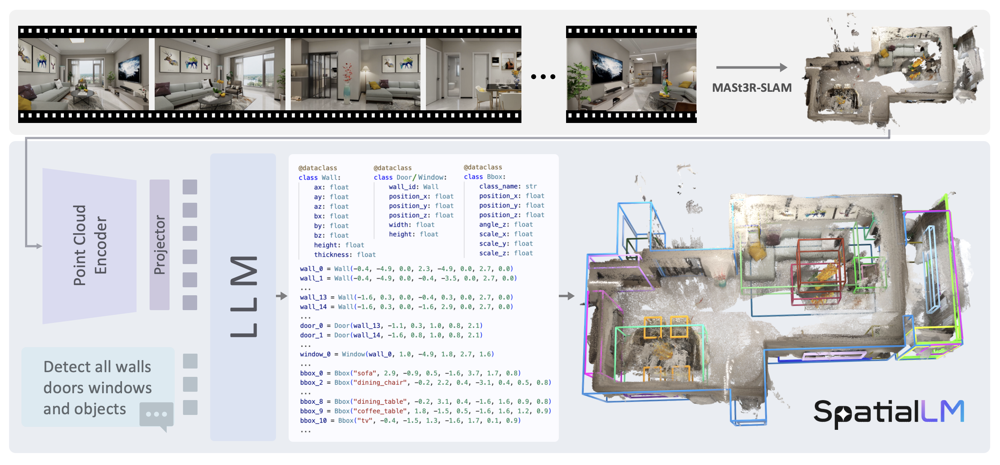

# SpatialLM 3D点云理解与目标检测模型部署

## 介绍
仓库地址：
- https://github.com/manycore-research/SpatialLM

模型地址：
- https://huggingface.co/manycore-research/SpatialLM-Llama-1B
- https://huggingface.co/manycore-research/SpatialLM-Qwen-0.5B

SpatialLM是一款专门为三维空间理解设计的大语言模型，通过三维点云数据，生成结构化的三维场景理解输出，包括墙壁、门、窗等建筑元素，以及带有语义类别的定向物体边界框。与传统需要专用设备进行数据采集的方法不同，SpatialLM能够处理来自多种来源的点云数据，如：单目视频序列、RGBD图像和LiDAR传感器等。  

其工作原理如下：给定一个RGB视频，首先使用MASt3R-SLAM进行三维点云重建，然后利用SpatialLM将这些密集点云转化为结构化表示。点云编码器将点云信息编码为紧凑的特征表示，随后由大语言模型（LLM）生成描述场景的场景代码（scene codes），这些场景代码可以被进一步转换为三维结构布局。  
SpatialLM当前提供了1B和0.5B两种模型版本。相比于现在的LLM而言可以说是很小了。SpatialLM-1B基于Llama3.2-1B-Instruct训练；SpatialLM-0.5B基于Qwen-2.5训练。SpatialLM采用多模态结构，有效地将非结构化的三维几何数据与结构化的三维表示相结合，提供高层次的语义理解。这一特性增强了其在具身机器人、自主导航等复杂三维场景分析任务中的空间推理能力。    
项目还提供了SpatialLM-Testset数据集，该数据集使用从单目RGB视频进行重建的3D点云。尽管存在噪声和遮挡等问题，但SpatialLM表现非常出色：在该数据集上，SpatialLM-Llama-1B模型在墙体的平均交并比（IoU）达到78.62%，在床的F1分数达到95.24%。  
SpatialLM通过其多模态架构和对多源点云数据的处理能力和多模态数据融合能力，为三维空间场景理解提供了具有广泛前景的创新解决方案，并在三维重建、声源定位等应用领域具有显著价值。

## 教程
官方仓库：https://github.com/manycore-research/SpatialLM  
这里以 PyTorch  2.5.1+Python  3.12(ubuntu22.04)+CUDA  12.4的云平台环境为例。  
如果是本地运行，推荐Ubuntu22.04+CUDA 12.4的环境，按照官方教程使用conda创建python3.11环境并安装相关依赖。  
参照官方教程，首先使用conda安装依赖:
```shell
conda install -y nvidia/label/cuda-12.4.0::cuda-toolkit conda-forge::sparsehash
```
使用poetry环境：  
这里由于SpatialLM官方的运行要求是Python3.12，但是现在主流的云平台提供的大多是3.12、3.10版本的Python，且预装好了PyTorch，所以小编在测试时对依赖文件`pyproject.toml`进行了修改
```toml
[tool.poetry]
name = "spatiallm"
version = "0.0.1"
description = "SpatialLM: Large Language Model for Spatial Understanding"
authors = ["ManyCore Research Team"]
license = "Llama3.2"
readme = "README.md"

[tool.poetry.dependencies]
python = ">=3.10,<3.13"
transformers = ">=4.41.2,<=4.46.1"
safetensors = "^0.4.5"
pandas = "^2.2.3"
einops = "^0.8.1"
numpy = "^1.26"
scipy = "^1.15.2"
scikit-learn = "^1.6.1"
toml = "^0.10.2"
tokenizers = ">=0.19.0,<0.20.4"
huggingface_hub = ">=0.25.0"
rerun-sdk = ">=0.21.0"
shapely = "^2.0.7"
bbox = "^0.9.4"
terminaltables = "^3.1.10"
open3d = "^0.19.0"
nvidia-cudnn-cu12 = "*"
nvidia-nccl-cu12 = "*"
poethepoet = {extras = ["poetry-plugin"], version = "^0.33.1"}
addict = "^2.4.0"

[tool.poe.tasks]
install-torchsparse = "pip install git+https://github.com/mit-han-lab/torchsparse.git"

[build-system]
requires = ["poetry-core", "setuptools", "wheel", "torch"]
build-backend = "poetry.core.masonry.api"
```

安装poetry依赖：
```shell
pip install poetry && poetry config virtualenvs.create false --local
poetry install
```

编译安装torchsparse，可能需要一些时间
> TorchSparse是一种基于PyTorch构建的高效稀疏张量处理库，专门用于加速三维稀疏卷积神经网络的训练和推理。
```shell
poe install-torchsparse
```

下载官方数据集中的ply格式的3D点云数据进行测试.
> 点云数据（Point Cloud）是一种由大量空间点组成的数据集合，每个点记录了其在三维空间中的位置坐标，通常还包含颜色或反射强度信息，可用于精确描述三维物体或场景的空间结构。
> 
> 如果想要使用自己录制的视频，可以参照[MASt3R-SLAM](https://github.com/rmurai0610/MASt3R-SLAM)进行三维重建。

```shell
huggingface-cli download manycore-research/SpatialLM-Testset pcd/scene0000_00.ply --repo-type dataset --local-dir .
```
下载SpatialLM-Llama-1B模型，大约需要2.6GB：
```shell
modelscope download manycore-research/SpatialLM-Llama-1B --local_dir ./manycore-research/SpatialLM-Llama-1B
```
模型推理：使用ply格式的点云文件生成txt格式的用于描述3D空间中的实体的文本。

```shell
python inference.py --point_cloud ./pcd/scene0000_00.ply --output scene0000_00.txt --model_path ./manycore-research/SpatialLM-Llama-1B
```
将生成的文件合并为用于表示3D的文件
```shell
python visualize.py --point_cloud ./pcd/scene0000_00.ply --layout scene0000_00.txt --save scene0000_00.rrd
```
可视化：如果云平台无法显示，可以拷贝到本地运行，需要安装rerun-sdk（`pip install rerun-sdk`）
```shell
rerun scene0000_00.rrd
```
效果如下：

> 考虑到部分同学配置环境可能会遇到一些问题，我们在AutoDL平台准备了SpatialLM的环境镜像，点击下方链接并直接创建Autodl示例即可。
> ***https://www.codewithgpu.com/i/datawhalechina/self-llm/SpatialLM***

