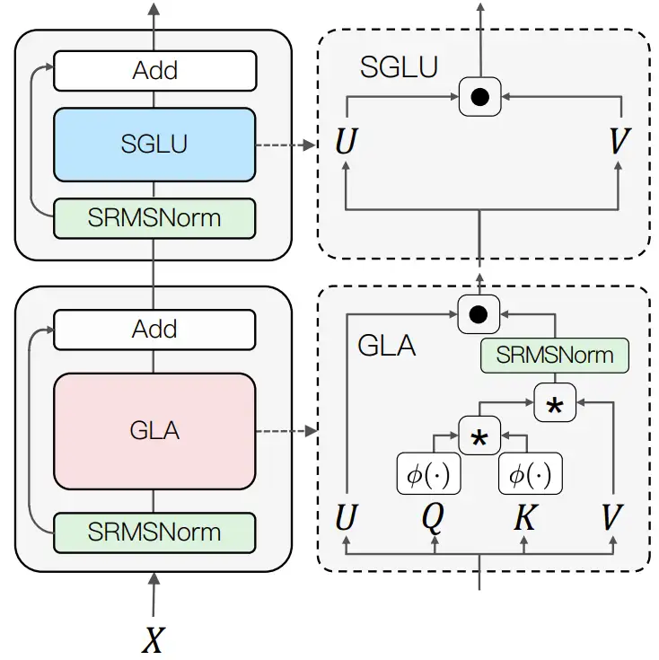
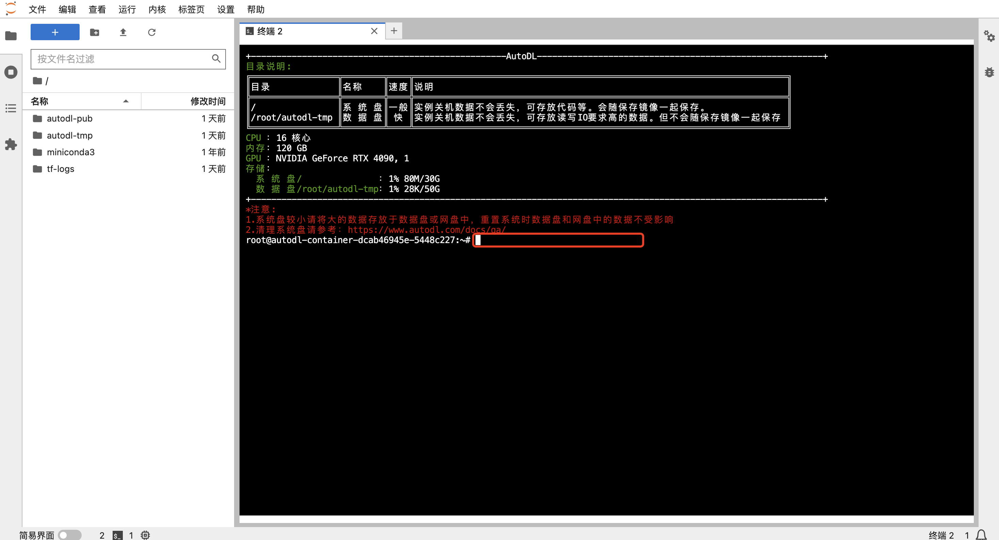
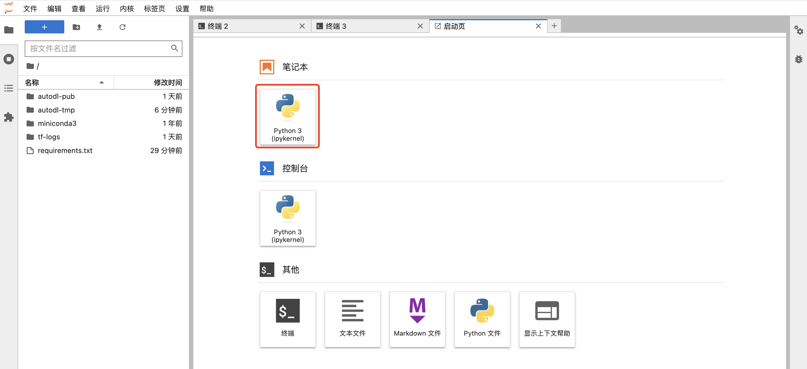

# TransNormerLLM-7B FastApi 部署调用

## 1. TransNormer 介绍

TransNormerLLM 是一个基于线性注意力的 LLM，在准确性和效率方面均优于传统的基于 softmax 注意力的模型。它是在包含多达1.4 万亿个令牌的高质量语料库上进行训练的，TransNormerLLM 从之前的线性注意力架构 TransNormer 演变而来，进行了高级修改，包括 LRPE 位置嵌入、闪电注意力加速、新的门控和标准化机制（将在下文进行简要的介绍）。TransNormerLLM 在多项广受认可的中文、英文以及多语言通用和特定领域基准测试中取得了与其规模相当的竞争性表现。TransNormer包括具有385M、1B和7B参数的基本版本。所有版本都完全开放给学术研究。

**TransNormerLLM的架构改进**

下文将简单介绍 TransNormerLLM 的各个模块以及研究者提出的一些改进措施。

**改进一：位置编码**

TransNormer 中的较低层使用了 DiagAttention 来避免 dilution 问题。但是，这会导致 token 之间缺乏全局互动能力。为了解决这个问题，研究者为 TransNormerLLM 使用了带指数衰减的 LRPE（线性化相对位置编码），从而可在较低层保留完整的注意力。研究者把这种方法称为 LRPE-d。

**改进二：门控机制**

门控可以增强模型的性能并使训练过程平滑。研究者为 TransNormerLLM 使用了来自论文《Transformer quality in linear time》的 Flash 方法并在 token 混合中使用了门控式线性注意力（GLA）的结构。为了进一步提升模型速度，其还提出了 Simple GLU（SGLU），其去除了原始 GLU 结构的激活函数，因为门本身就能引入非线性。

**改进三：张量归一化**

研究者使用了 TransNormer 中引入的 NormAttention。在 TransNormerLLM 中，他们使用一种新的简单归一化函数 SimpleRMSNorm（简写为 SRMSNorm）替换了 RMSNorm。

其整体结构如下：

图 1：新提出模型的整体架构

好啦，在了解TransNormer的基础上，我们开始调用吧，这里我们开始部署TransNormerLLM-7B的模型吧。

## 2. 环境准备  

### 2.1 进入配置环境

在 Autodl 平台中租赁一个 3090/4090 等 24G 显存的显卡机器，如下图所示镜像选择 PyTorch-->2.0.0-->3.8(ubuntu20.04)-->11.8（11.3 版本以上的都可以）。
接下来打开刚刚租用服务器的 JupyterLab，并且打开其中的终端开始环境配置、模型下载和运行演示。  


打开启动页的终端（Terminal）界面：


左击红色框的部分,进入Python的终端控制台，如下图所示：



### 2.2 pip 换源加速下载并安装依赖包

接下来安装运行TransNormerLLM-7B所需要的相关依赖库，这里我们有两种安装方式，不过在安装依赖库之前我们首先更新pip版本（防止版本过低），并切换pip的安装源（到国内源，这样可以安装更快，防止下载链接超时）

在红框部分逐行输入如下「2.2」中命令：
```shell
# 升级pip
python -m pip install --upgrade pip
# 更换 pypi 源加速库的安装
pip config set global.index-url https://pypi.tuna.tsinghua.edu.cn/simple
```

**方式一：**
依然在红框部分逐行输入如下「2.2」中命令：

```shell
pip install fastapi==0.104.1
pip install uvicorn==0.24.0.post1
pip install requests==2.25.1
pip install modelscope==1.11.0
pip install transformers==4.37.0
pip install streamlit==1.24.0
pip install sentencepiece==0.1.99
pip install accelerate==0.24.1
pip install transformers_stream_generator==0.0.4
pip install triton==2.0.0
pip install einops
```  

**方式二：**
将如下内容：
```shell
fastapi==0.104.1
uvicorn==0.24.0.post1
requests==2.25.1
modelscope==1.11.0
transformers==4.37.0
streamlit==1.24.0
sentencepiece==0.1.99
accelerate==0.24.1
transformers_stream_generator==0.0.4
triton==2.0.0
einops
```  
用 vim 写入一个 requirements.txt 文件，然后运行命令：pip install -r requirements.txt


## 3. 模型下载  

使用 modelscope 中的 snapshot_download 函数下载模型，第一个参数为模型名称，参数 cache_dir 为模型的下载路径。

模型的介绍地址（魔塔社区）：
https://www.modelscope.cn/models/OpenNLPLab/TransNormerLLM-7B/summary

在 /root/autodl-tmp 路径下新建 model_download.py 文件并在其中输入以下内容，粘贴代码后请及时保存文件，如下图所示。并运行 `python /root/autodl-tmp/model_download.py` 执行下载，模型大小为 12GB，下载模型大概需要 6 分钟。

其在终端界面的流程如下：
```cmd
cd /root/autodl-tmp
vim model_download.py
```
然后保存退出（:wq）

model_download.py 文件中的内容：
```python
import torch
from modelscope import snapshot_download, AutoModel, AutoTokenizer
import os
model_dir = snapshot_download('OpenNLPLab/TransNormerLLM-7B', cache_dir='/root/autodl-tmp', revision='master')
```  

> 大概解释一下，这里是在做什么：首先，我们加载了基础的torch环境，和 加载了modelscope函数库的 snapshot_download, AutoModel, AutoTokenizer 三个函数类，用 snapshot_download 函数下载模型。（虽然模型下载的方式有多种，但snapshot_download具有一定的优势）


## 代码准备  

在 /root/autodl-tmp 路径下新建 api.py 文件并在其中输入以下内容，粘贴代码后请及时保存文件。下面的代码有很详细的注释，大家如有不理解的地方，欢迎提出 issue。  

```python
from fastapi import FastAPI, Request
from transformers import AutoTokenizer, AutoModelForCausalLM, GenerationConfig
import uvicorn
import json
import datetime
import torch

# 设置设备参数
DEVICE = "cuda"  # 使用CUDA
DEVICE_ID = "0"  # CUDA设备ID，如果未设置则为空
CUDA_DEVICE = f"{DEVICE}:{DEVICE_ID}" if DEVICE_ID else DEVICE  # 组合CUDA设备信息

# 清理GPU内存函数
def torch_gc():
    if torch.cuda.is_available():  # 检查是否可用CUDA
        with torch.cuda.device(CUDA_DEVICE):  # 指定CUDA设备
            torch.cuda.empty_cache()  # 清空CUDA缓存
            torch.cuda.ipc_collect()  # 收集CUDA内存碎片

# 创建FastAPI应用
app = FastAPI()

# 处理POST请求的端点
@app.post("/")
async def create_item(request: Request):
    global model, tokenizer  # 声明全局变量以便在函数内部使用模型和分词器
    json_post_raw = await request.json()  # 获取POST请求的JSON数据
    json_post = json.dumps(json_post_raw)  # 将JSON数据转换为字符串
    json_post_list = json.loads(json_post)  # 将字符串转换为Python对象
    prompt = json_post_list.get('prompt')  # 获取请求中的提示

    messages = [
            {"role": "system", "content": "You are a helpful assistant."},
            {"role": "user", "content": prompt}
    ]

    # 调用模型进行对话生成
    input_ids = tokenizer.apply_chat_template(messages,tokenize=False,add_generation_prompt=True)
    model_inputs = tokenizer([input_ids], return_tensors="pt").to('cuda')
    generated_ids = model.generate(model_inputs.input_ids,max_new_tokens=512)
    generated_ids = [
        output_ids[len(input_ids):] for input_ids, output_ids in zip(model_inputs.input_ids, generated_ids)
    ]
    response = tokenizer.batch_decode(generated_ids, skip_special_tokens=True)[0]
    now = datetime.datetime.now()  # 获取当前时间
    time = now.strftime("%Y-%m-%d %H:%M:%S")  # 格式化时间为字符串
    # 构建响应JSON
    answer = {
        "response": response,
        "status": 200,
        "time": time
    }
    # 构建日志信息
    log = "[" + time + "] " + '", prompt:"' + prompt + '", response:"' + repr(response) + '"'
    print(log)  # 打印日志
    torch_gc()  # 执行GPU内存清理
    return answer  # 返回响应

# 主函数入口
if __name__ == '__main__':
    # 加载预训练的分词器和模型
    model_name_or_path = '/root/autodl-tmp/OpenNLPLab/TransNormerLLM-7B'
    tokenizer = AutoTokenizer.from_pretrained(model_name_or_path, trust_remote_code=True, use_fast=False)
    model = AutoModelForCausalLM.from_pretrained(model_name_or_path, device_map="auto", trust_remote_code=True, torch_dtype=torch.bfloat16)

    # 启动FastAPI应用
    # 用6006端口可以将autodl的端口映射到本地，从而在本地使用api
    uvicorn.run(app, host='0.0.0.0', port=6006, workers=1)  # 在指定端口和主机上启动应用
```  

## Api 部署  

在终端输入以下命令启动api服务：  

```shell  
cd /root/autodl-tmp #如果在 /root/autodl-tmp 路径下则这句不需要
python api.py
```  

加载完毕后出现如下信息说明成功。


默认部署在 6006 端口，通过 POST 方法进行调用，可以使用 curl 调用，如下所示：  

```shell
curl -X POST "http://127.0.0.1:6006" \
     -H 'Content-Type: application/json' \
     -d '{"prompt": "你好"}'
```  


也可以使用 python 中的 requests 库进行调用，如下所示：

这里我们可以启用Jupyter notebook进行交互




```python
import requests
import json

def get_completion(prompt):
    headers = {'Content-Type': 'application/json'}
    data = {"prompt": prompt}
    response = requests.post(url='http://127.0.0.1:6006', headers=headers, data=json.dumps(data))
    return response.json()['response']

if __name__ == '__main__':
    print(get_completion('你好'))
```

得到的返回值如下所示：

```json
{"response":"你好！有什么我可以帮助你的吗？","status":200,"time":"2024-02-05 18:08:19"}
```  


