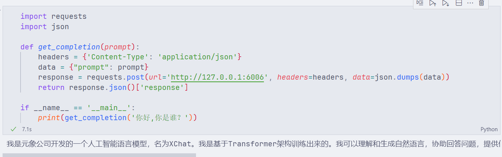

# XVERSE-7B-chat FastAPI 部署

XVERSE-7B-Chat为[XVERSE-7B](https://huggingface.co/xverse/XVERSE-7B)模型对齐后的版本。

XVERSE-7B 是由深圳元象科技自主研发的支持多语言的大语言模型（Large Language Model），参数规模为 70 亿，主要特点如下：

- 模型结构：XVERSE-7B 使用主流 Decoder-only 的标准 Transformer 网络结构，支持 8K 的上下文长度（Context Length），能满足更长的多轮对话、知识问答与摘要等需求，模型应用场景更广泛。
- 训练数据：构建了 2.6 万亿 token 的高质量、多样化的数据对模型进行充分训练，包含中、英、俄、西等 40 多种语言，通过精细化设置不同类型数据的采样比例，使得中英两种语言表现优异，也能兼顾其他语言效果。
- 分词：基于 BPE（Byte-Pair Encoding）算法，使用上百 GB 语料训练了一个词表大小为 100,534 的分词器，能够同时支持多语言，而无需额外扩展词表。
- 训练框架：自主研发多项关键技术，包括高效算子、显存优化、并行调度策略、数据-计算-通信重叠、平台和框架协同等，让训练效率更高，模型稳定性强，在千卡集群上的峰值算力利用率可达到 58.5%，位居业界前列。

## 环境准备  

在 Autodl 平台中租赁一个 3090 等 24G 显存的显卡机器，如下图所示镜像选择 PyTorch-->2.1.0-->3.10(ubuntu22.04)-->12.1（11.3 版本以上的都可以）。
接下来打开刚刚租用服务器的 JupyterLab，并且打开其中的终端开始环境配置、模型下载和运行演示。  


pip 换源加速下载并安装依赖包，为了方便大家进行环境配置，在 code 文件夹里面给大家提供了 requirement.txt 文件，大家直接使用下面的命令安装即可。如果你使用的是 [autodl](https://www.autodl.com/) 部署模型的话，我们有制作好的镜像供大家使用：[XVERSE-7B-Chat](https://www.codewithgpu.com/i/datawhalechina/self-llm/XVERSE-7B-Chat)

```shell
# 升级pip
python -m pip install --upgrade pip
# 更换 pypi 源加速库的安装
pip config set global.index-url https://pypi.tuna.tsinghua.edu.cn/simple

pip install -r requirement.txt
```  

## 模型下载  

使用 modelscope 中的 snapshot_download 函数下载模型，第一个参数为模型名称，参数 cache_dir 为模型的下载路径。

在 /root/autodl-tmp 路径下新建 [model_download.py](code/model_download.py) 文件并在其中输入以下内容，粘贴代码后请及时保存文件，如下图所示。并运行 `python /root/autodl-tmp/model_download.py` 执行下载，模型大小为 14GB，下载模型大概需要 2 分钟。

```python
import torch
from modelscope import snapshot_download, AutoModel, AutoTokenizer
import os
model_dir = snapshot_download('xverse/XVERSE-7B-Chat', cache_dir='/root/autodl-tmp', revision='master')
```  

## 代码准备  

> 为了方便大家部署，在 code 文件夹里面已经准备好了代码，大家可以将仓库 clone 到服务器上直接运行。

在 /root/autodl-tmp 路径下新建 [api.py](code/api.py) 文件并在其中输入以下内容，粘贴代码后请及时保存文件。下面的代码有很详细的注释，大家如有不理解的地方，欢迎提出 issue。  

```python
from fastapi import FastAPI, Request
from transformers import AutoTokenizer, AutoModelForCausalLM, GenerationConfig
import uvicorn
import json
import datetime
import torch

# 设置设备参数
DEVICE = "cuda"  # 使用CUDA
DEVICE_ID = "0"  # CUDA设备ID，如果未设置则为空
CUDA_DEVICE = f"{DEVICE}:{DEVICE_ID}" if DEVICE_ID else DEVICE  # 组合CUDA设备信息

# 清理GPU内存函数
def torch_gc():
    if torch.cuda.is_available():  # 检查是否可用CUDA
        with torch.cuda.device(CUDA_DEVICE):  # 指定CUDA设备
            torch.cuda.empty_cache()  # 清空CUDA缓存
            torch.cuda.ipc_collect()  # 收集CUDA内存碎片

# 创建FastAPI应用
app = FastAPI()

# 处理POST请求的端点
@app.post("/")
async def create_item(request: Request):
    global model, tokenizer  # 声明全局变量以便在函数内部使用模型和分词器
    json_post_raw = await request.json()  # 获取POST请求的JSON数据
    json_post = json.dumps(json_post_raw)  # 将JSON数据转换为字符串
    json_post_list = json.loads(json_post)  # 将字符串转换为Python对象
    prompt = json_post_list.get('prompt')  # 获取请求中的提示

    # 构建消息
    history = [{"role": "user", "content": prompt}]
    
    response = model.chat(tokenizer, history)
    
    now = datetime.datetime.now()  # 获取当前时间
    time = now.strftime("%Y-%m-%d %H:%M:%S")  # 格式化时间为字符串
    # 构建响应JSON
    answer = {
        "response": response,
        "status": 200,
        "time": time
    }
    # 构建日志信息
    log = "[" + time + "] " + '", prompt:"' + prompt + '", response:"' + repr(response) + '"'
    print(log)  # 打印日志
    torch_gc()  # 执行GPU内存清理
    return answer  # 返回响应

# 主函数入口
if __name__ == '__main__':
    # 加载预训练的分词器和模型
    model_path = "xverse/XVERSE-7B-Chat"
    tokenizer = AutoTokenizer.from_pretrained(model_path, trust_remote_code=True)
    model = AutoModelForCausalLM.from_pretrained(model_path, torch_dtype=torch.float16, trust_remote_code=True).cuda()
    model.generation_config = GenerationConfig.from_pretrained(model_path)
    model = model.eval()

    # 启动FastAPI应用
    # 用6006端口可以将autodl的端口映射到本地，从而在本地使用api
    uvicorn.run(app, host='0.0.0.0', port=6006, workers=1)  # 在指定端口和主机上启动应用
``` 

## Api 部署  

在终端输入以下命令启动api服务：  

```shell  
cd /root/autodl-tmp
python api.py
```  

加载完毕后出现如下信息说明成功。


默认部署在 6006 端口，通过 POST 方法进行调用，可以使用 curl 调用，如下所示：  

```shell
curl -X POST "http://127.0.0.1:6006" \
     -H 'Content-Type: application/json' \
     -d '{"prompt": "你好，你是谁？"}'
```  

也可以使用 python 中的 requests 库进行调用，如下所示：

```python
import requests
import json

def get_completion(prompt):
    headers = {'Content-Type': 'application/json'}
    data = {"prompt": prompt}
    response = requests.post(url='http://127.0.0.1:6006', headers=headers, data=json.dumps(data))
    return response.json()['response']

if __name__ == '__main__':
    print(get_completion('你好，你是谁？'))
```

得到的返回值如下所示：

```json
{"response":"我是元象公司开发的一个人工智能语言模型，名为XChat。我是基于Transformer架构训练出来的。我可以理解和生成自然语言，协助回答问题，提供信息，参与对话，创作文本等。请注意，我并非具有自我意识或个人情感，我只是一个能理解和生成文本的工具。我的知识截止于 2023 年 7 月，所以有关更近期事件和发展的信息可能不会包括在内。如果有任何问题，我会尽力提供帮助！","status":200,"time":"2024-04-18 12:07:16"}
```  


