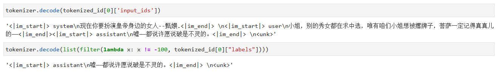
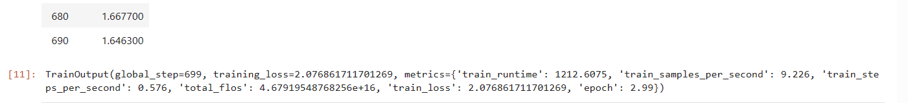

# 04-Yi-6B-Chat Lora 微调

## 概述

本节我们介绍如何基于 transformers、peft 等框架，对 Yi-6B-Chat 模型进行 Lora 微调。Lora 是一种高效微调方法，深入了解其原理可参见博客：[知乎|深入浅出Lora](https://zhuanlan.zhihu.com/p/650197598)。

本节所讲述的代码脚本在同级目录 [04-Yi-6B-Chat Lora 微调](./04-Yi-6B-chat%20Lora微调.py) 下，运行该脚本来执行微调过程，但注意，本文代码未使用分布式框架，微调 Yi-6B-Chat 模型至少需要 20G 及以上的显存，且需要修改脚本文件中的模型路径和数据集路径。

## 环境配置

在完成基本环境配置和本地模型部署的情况下（本教程中使用的模型路径是 /root/autodl-tmp/01ai/Yi-6B-Chat ），你还需要安装一些第三方库，可以使用以下命令：

```bash
pip install transformers==4.35.2
pip install peft==0.4.0
pip install datasets==2.10.1
pip install accelerate==0.20.3
pip install tiktoken
pip install transformers_stream_generator
```

在本节教程里，我们将微调数据集放置在根目录 [/dataset](../../dataset/huanhuan.jsonl)。

## 指令集构建

LLM 的微调一般指指令微调过程。所谓指令微调，是说我们使用的微调数据形如：

```json
{
    "instrution":"回答以下用户问题，仅输出答案。",
    "input":"1+1等于几?",
    "output":"2"
}
```

其中，`instruction` 是用户指令，告知模型其需要完成的任务；`input` 是用户输入，是完成用户指令所必须的输入内容；`output` 是模型应该给出的输出。

即我们的核心训练目标是让模型具有理解并遵循用户指令的能力。因此，在指令集构建时，我们应针对我们的目标任务，针对性构建任务指令集。例如，在本节我们使用由笔者合作开源的 [Chat-甄嬛](https://github.com/KMnO4-zx/huanhuan-chat) 项目作为示例，我们的目标是构建一个能够模拟甄嬛对话风格的个性化 LLM，因此我们构造的指令形如：##

```json
{
    "instruction": "现在你要扮演皇帝身边的女人--甄嬛",
    "input":"你是谁？",
    "output":"家父是大理寺少卿甄远道。"
}
```
我们所构造的全部指令数据集在根目录下。


## 数据格式化

`Lora` 训练的数据是需要经过格式化、编码之后再输入给模型进行训练的，如果是熟悉 `Pytorch` 模型训练流程的同学会知道，我们一般需要将输入文本编码为 input_ids，将输出文本编码为 `labels`，编码之后的结果都是多维的向量。我们首先定义一个预处理函数，这个函数用于对每一个样本，编码其输入、输出文本并返回一个编码后的字典：

```python
def process_func(example):
    MAX_LENGTH = 384    # Llama分词器会将一个中文字切分为多个token，因此需要放开一些最大长度，保证数据的完整性
    input_ids, attention_mask, labels = [], [], []
    instruction = tokenizer("\n".join(["<|im_start|>system", "现在你要扮演皇帝身边的女人--甄嬛.<|im_end|>" + "\n<|im_start|>user\n" + example["instruction"] + example["input"] + "<|im_end|>\n"]).strip(), add_special_tokens=False)  # add_special_tokens 不在开头加 special_tokens
    response = tokenizer("<|im_start|>assistant\n" + example["output"] + "<|im_end|>\n", add_special_tokens=False)
    input_ids = instruction["input_ids"] + response["input_ids"] + [tokenizer.pad_token_id]
    attention_mask = instruction["attention_mask"] + response["attention_mask"] + [1]  # 因为eos token咱们也是要关注的，所以补充为1
    labels = [-100] * len(instruction["input_ids"]) + response["input_ids"] + [tokenizer.pad_token_id]  # Yi-6B的构造就是这样的
    if len(input_ids) > MAX_LENGTH:  # 做一个截断
        input_ids = input_ids[:MAX_LENGTH]
        attention_mask = attention_mask[:MAX_LENGTH]
        labels = labels[:MAX_LENGTH]
    return {
        "input_ids": input_ids,
        "attention_mask": attention_mask,
        "labels": labels
    }
```

然后加载我们的数据集，用上面定义的函数处理数据
```python
# 将JSON文件转换为CSV文件
import pandas as pd
from datasets import Dataset
df = pd.read_json('/root/dataset/huanhuan.json')
ds = Dataset.from_pandas(df)

tokenized_id = ds.map(process_func, remove_columns=ds.column_names)
```

经过格式化的数据，也就是送入模型的每一条数据，都是一个字典，包含了 `input_ids`、`attention_mask`、`labels` 三个键值对，其中 `input_ids` 是输入文本的编码，`attention_mask` 是输入文本的 attention mask，`labels` 是输出文本的编码。decode之后应该是这样的：

```text
<|im_start|>system
现在你要扮演皇帝身边的女人--甄嬛.<|im_end|>
<|im_start|>user
小姐，别的秀女都在求中选，唯有咱们小姐想被撂牌子，菩萨一定记得真真儿的——<|im_end|>
<|im_start|>assistant
嘘——都说许愿说破是不灵的。<|im_end|>
<|endoftext|>
```

我们可以输出一条文本观察一下：

```python
print(tokenizer.decode(tokenized_id[0]['input_ids']))
print(tokenizer.decode(list(filter(lambda x: x != -100, tokenized_id[0]["labels"]))))
```

输出结果如下图所示：


## 加载tokenizer和半精度模型
```python
import torch
from transformers import AutoModelForCausalLM, AutoTokenizer
tokenizer = AutoTokenizer.from_pretrained('01ai/Yi-6B-Chat', use_fast=False, trust_remote_code=True)

# 模型以半精度形式加载，如果你的显卡比较新的话，可以用torch.bfolat形式加载
model = AutoModelForCausalLM.from_pretrained('01ai/Yi-6B-Chat', trust_remote_code=True, torch_dtype=torch.half, device_map="auto")
```

## 定义LoraConfig

`LoraConfig`这个类中可以设置很多参数，但主要的参数没多少，简单讲一讲，感兴趣的同学可以直接看源码。

- `task_type`：模型类型
- `target_modules`：需要训练的模型层的名字，主要就是`attention`部分的层，不同的模型对应的层的名字不同，可以传入数组，也可以字符串，也可以正则表达式。
- `r`：`lora`的秩，具体可以看`Lora`原理
- `lora_alpha`：`Lora alaph`，具体作用参见 `Lora` 原理 

```python
from peft import LoraConfig, TaskType, get_peft_model
config = LoraConfig(
    task_type=TaskType.CAUSAL_LM, 
    target_modules=["q_attn", "k_proj", "v_proj", "o_proj", "gate_proj", "up_proj", "down_proj"],
    inference_mode=False, # 训练模式
    r=8, # Lora 秩
    lora_alpha=32, # Lora alaph，具体作用参见 Lora 原理
    lora_dropout=0.1# Dropout 比例
)
```

## 训练模型
首先，使用get_peft_model函数将基础模型和peft_config包装起来，以创建PeftModel。要了解模型中可训练参数的数量，可以使用print_trainable_parameters方法。

```python
model = get_peft_model(model, config)
model.enable_input_require_grads() # 开启梯度检查点时，要执行该方法
model.print_trainable_parameters()
```

接下来，我们自定义 TrainingArguments 参数

`TrainingArguments`这个类的源码也介绍了每个参数的具体作用，当然大家可以来自行探索，这里就简单说几个常用的。

- `output_dir`：模型的输出路径
- `per_device_train_batch_size`：顾名思义 `batch_size`
- `gradient_accumulation_steps`: 梯度累加，如果你的显存比较小，那可以把 `batch_size` 设置小一点，梯度累加增大一些。
- `logging_steps`：多少步，输出一次`log`
- `num_train_epochs`：顾名思义 `epoch`
- `gradient_checkpointing`：梯度检查，这个一旦开启，模型就必须执行`model.enable_input_require_grads()`，这个原理大家可以自行探索，这里就不细说了。

```python
from transformers import DataCollatorForSeq2Seq, TrainingArguments, Trainer
args = TrainingArguments(
    output_dir="./output/Yi-6B",
    per_device_train_batch_size=8,
    gradient_accumulation_steps=2,
    logging_steps=10,
    num_train_epochs=3,
    gradient_checkpointing=True,
    save_steps=100,
    learning_rate=1e-4,
    save_on_each_node=True
)
```

最后，使用`Traniner`训练模型

```python
trainer = Trainer(
    model=model,
    args=args,
    train_dataset=tokenized_id,
    data_collator=DataCollatorForSeq2Seq(tokenizer=tokenizer, padding=True),
)
trainer.train()
```

模型训练完成后，会输出如下图所示的信息：


## 模型推理
下载好的模型被保存在了 ./output/Yi-6B 目录下，如果想要从头加载微调好的模型，需要执行下面的代码

```python
from transformers import AutoModelForSeq2SeqLM
from peft import PeftModel, PeftConfig

peft_model_id = "output/Yi-6B/checkpoint-600"  # 这里我训练出效果最好的一版是 checkpoint-600，所以调用了这个，大家可以根据自己情况选择
config = PeftConfig.from_pretrained(peft_model_id)
model = AutoModelForCausalLM.from_pretrained(config.base_model_name_or_path)
model = PeftModel.from_pretrained(model, peft_model_id)
```

然后使用以下代码进行模型推理：

```python
model.eval()
input = tokenizer("<|im_start|>system\n现在你要扮演皇帝身边的女人--甄嬛.<|im_end|>\n<|im_start|>user\n{}<|im_end|>\n".format("你是谁？", "").strip() + "\nassistant\n ", return_tensors="pt").to(model.device)

max_length = 512

outputs = model.generate(
    **input,
    max_length=max_length,
    eos_token_id=7,
    do_sample=True,
    repetition_penalty=1.3,
    no_repeat_ngram_size=5,
    temperature=0.1,
    top_k=40,
    top_p=0.8,
)
print(tokenizer.decode(outputs[0], skip_special_tokens=True))
```


