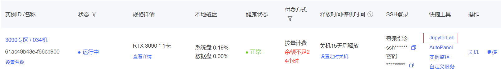
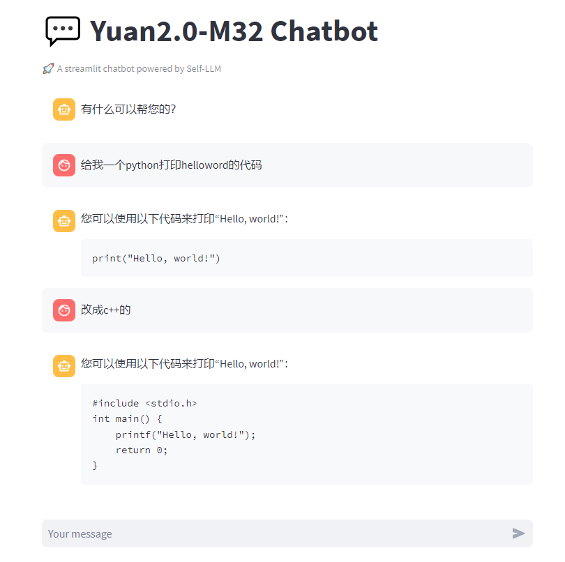

# Yuan2.0-M32 WebDemo部署

## 环境准备

在 Autodl 平台中租赁一个 RTX 3090/24G 显存的显卡机器。如下图所示，镜像选择 PyTorch-->2.1.0-->3.10(ubuntu22.04)-->12.1。


接下来，我们打开刚刚租用服务器的 JupyterLab，如下图所示。



然后打开其中的终端，开始环境配置、模型下载和运行演示。  


## 环境配置

Yuan2-M32-HF-INT4是由原始的Yuan2-M32-HF经过auto-gptq量化而来的模型。

通过模型量化，部署Yuan2-M32-HF-INT4对显存和硬盘的要求都会显著减低。

注：由于pip版本的auto-gptq目前还不支持Yuan2.0 M32，因此需要编译安装

```shell
# 升级pip
python -m pip install --upgrade pip

# 更换 pypi 源加速库的安装
pip config set global.index-url https://pypi.tuna.tsinghua.edu.cn/simple

# 拉取Yuan2.0-M32项目
git clone https://github.com/IEIT-Yuan/Yuan2.0-M32.git

# 进入AutoGPTQ
cd  Yuan2.0-M32/3rd_party/AutoGPTQ

# 安装autogptq
pip install --no-build-isolation -e .

# 安装 einops modelscope streamlit
pip install einops modelscope streamlit==1.24.0
```

> 考虑到部分同学配置环境可能会遇到一些问题，我们在AutoDL平台准备了Yuan2.0-M32的镜像，点击下方链接并直接创建Autodl示例即可。
> ***https://www.codewithgpu.com/i/datawhalechina/self-llm/Yuan2.0-M32***


## 模型下载  

使用 modelscope 中的 snapshot_download 函数下载模型，第一个参数为模型名称，参数 cache_dir 为模型的下载路径。

这里可以先进入autodl平台，初始化机器对应区域的的文件存储，文件存储路径为'/root/autodl-fs'。
该存储中的文件不会随着机器的关闭而丢失，这样可以避免模型二次下载。


然后运行下面代码，执行模型下载。

```python
from modelscope import snapshot_download
model_dir = snapshot_download('YuanLLM/Yuan2-M32-HF-INT4', cache_dir='/root/autodl-fs')
``` 

## 模型合并

下载后的模型为多个文件，需要将其进行合并。

```shell
cat /root/autodl-fs/YuanLLM/Yuan2-M32-HF-INT4/gptq_model-4bit-128g.safetensors*  > /root/autodl-fs/YuanLLM/Yuan2-M32-HF-INT4/gptq_model-4bit-128g.safetensors
```

## 代码准备

在`/root/autodl-tmp`路径下新建 `chatBot.py` 文件并在其中输入以下内容，粘贴代码后记得保存文件。下面的代码有很详细的注释，大家如有不理解的地方，欢迎提出issue。

chatBot.py代码如下

```python
# 导入所需的库
from auto_gptq import AutoGPTQForCausalLM
from transformers import LlamaTokenizer
import torch
import streamlit as st

# 在侧边栏中创建一个标题和一个链接
with st.sidebar:
    st.markdown("## Yuan2.0-M32 LLM")
    "[开源大模型食用指南 self-llm](https://github.com/datawhalechina/self-llm.git)"
    # 创建一个滑块，用于选择最大长度，范围在0到1024之间，默认值为512
    max_length = st.slider("max_length", 0, 1024, 512, step=1)

# 创建一个标题和一个副标题
st.title("💬 Yuan2.0-M32 Chatbot")
st.caption("🚀 A streamlit chatbot powered by Self-LLM")

# 定义模型路径
path = '/root/autodl-fs/YuanLLM/Yuan2-M32-HF-INT4'

# 定义一个函数，用于获取模型和tokenizer
@st.cache_resource
def get_model():
    print("Creat tokenizer...")
    tokenizer = LlamaTokenizer.from_pretrained(path, add_eos_token=False, add_bos_token=False, eos_token='<eod>')
    tokenizer.add_tokens(['<sep>', '<pad>', '<mask>', '<predict>', '<FIM_SUFFIX>', '<FIM_PREFIX>', '<FIM_MIDDLE>','<commit_before>','<commit_msg>','<commit_after>','<jupyter_start>','<jupyter_text>','<jupyter_code>','<jupyter_output>','<empty_output>'], special_tokens=True)

    print("Creat model...")
    model = AutoGPTQForCausalLM.from_quantized(path, trust_remote_code=True).cuda()
  
    return tokenizer, model

# 加载model和tokenizer
tokenizer, model = get_model()

# 如果session_state中没有"messages"，则创建一个包含默认消息的列表
if "messages" not in st.session_state:
    st.session_state["messages"] = [{"role": "assistant", "content": "有什么可以帮您的？"}]

# 遍历session_state中的所有消息，并显示在聊天界面上
for msg in st.session_state.messages:
    st.chat_message(msg["role"]).write(msg["content"])

# 如果用户在聊天输入框中输入了内容，则执行以下操作
if prompt := st.chat_input():
    # 将用户的输入添加到session_state中的messages列表中
    st.session_state.messages.append({"role": "user", "content": prompt})

    # 在聊天界面上显示用户的输入
    st.chat_message("user").write(prompt)

    # 调用模型
    input_str = "<n>".join(msg["content"] for msg in st.session_state.messages) + "<sep>"
    inputs = tokenizer(input_str, return_tensors="pt").to(model.device)
    outputs = model.generate(**inputs, do_sample=False, max_new_tokens=256)
    output = tokenizer.decode(outputs[0])
    response = output.split("<sep>")[-1].replace("<eod>", '')

    # 将模型的输出添加到session_state中的messages列表中
    st.session_state.messages.append({"role": "assistant", "content": response})

    # 在聊天界面上显示模型的输出
    st.chat_message("assistant").write(response)

    # print(st.session_state)
```

# 配置vscode ssh

复制机器ssh登录指令


粘贴到本地电脑的.ssh/config，并修改成如下格式


然后连接到此ssh，选择linx


复制密码并输入，按下回车即可登录到机器

## 运行demo

在终端中运行以下命令，启动streamlit服务

```shell
streamlit run chatBot.py --server.address 127.0.0.1 --server.port 6006
```


点击在浏览器中打开，即可看到聊天界面。

运行效果如下：



