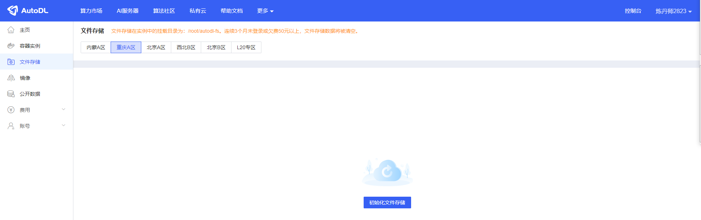
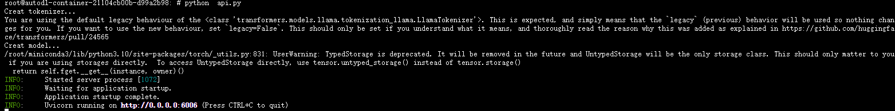
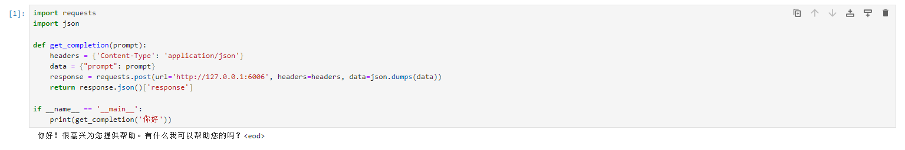

# Yuan2.0-2B FastApi 部署调用

## 环境准备

在 Autodl 平台中租赁一个 RTX 3090/24G 显存的显卡机器。如下图所示，镜像选择 PyTorch-->2.1.0-->3.10(ubuntu22.04)-->12.1。


接下来，我们打开刚刚租用服务器的 JupyterLab，如下图所示。


然后打开其中的终端，开始环境配置、模型下载和运行演示。  


## 环境配置

pip 换源加速下载并安装依赖包

```shell
# 升级pip
python -m pip install --upgrade pip

# 更换 pypi 源加速库的安装
pip config set global.index-url https://pypi.tuna.tsinghua.edu.cn/simple

# 安装 fastapi modelscope
pip install fastapi modelscope
```  

> 考虑到部分同学配置环境可能会遇到一些问题，我们在AutoDL平台准备了Yuan2.0的镜像，点击下方链接并直接创建Autodl示例即可。
> ***https://www.codewithgpu.com/i/datawhalechina/self-llm/Yuan2.0***


## 模型下载  

使用 modelscope 中的 snapshot_download 函数下载模型，第一个参数为模型名称，参数 cache_dir 为模型的下载路径。

这里可以先进入autodl平台，初始化机器对应区域的的文件存储，文件存储路径为'/root/autodl-fs'。
该存储中的文件不会随着机器的关闭而丢失，这样可以避免模型二次下载。



然后运行下面代码，执行模型下载。模型大小为 4.5GB，下载大概需要 5 分钟。

```python
from modelscope import snapshot_download
model_dir = snapshot_download('YuanLLM/Yuan2-2B-Mars-hf', cache_dir='/root/autodl-fs')
```

## 代码准备  

点击自定义服务，开启AutoDL开放端口。


有些区域的机器需要配置AutoDL开放端口，配置方法写在本项目中General-Setting目录，首次使用请参考该文档。

配置方法如下图所示。


新建 api.py 文件并在其中输入以下内容，粘贴代码后请及时保存文件。

下面的代码有很详细的注释，大家如有不理解的地方，欢迎提出 issue。  

```python
from fastapi import FastAPI, Request
from transformers import LlamaTokenizer, AutoModelForCausalLM
import uvicorn
import json
import datetime
import torch

# 设置设备参数
DEVICE = "cuda"  # 使用CUDA
DEVICE_ID = "0"  # CUDA设备ID，如果未设置则为空
CUDA_DEVICE = f"{DEVICE}:{DEVICE_ID}" if DEVICE_ID else DEVICE  # 组合CUDA设备信息

# 清理GPU内存函数
def torch_gc():
    if torch.cuda.is_available():  # 检查是否可用CUDA
        with torch.cuda.device(CUDA_DEVICE):  # 指定CUDA设备
            torch.cuda.empty_cache()  # 清空CUDA缓存
            torch.cuda.ipc_collect()  # 收集CUDA内存碎片

# 创建FastAPI应用
app = FastAPI()

# 处理POST请求的端点
@app.post("/")
async def create_item(request: Request):
    global model, tokenizer  # 声明全局变量以便在函数内部使用模型和分词器
    json_post_raw = await request.json()  # 获取POST请求的JSON数据
    json_post = json.dumps(json_post_raw)  # 将JSON数据转换为字符串
    json_post_list = json.loads(json_post)  # 将字符串转换为Python对象
    prompt = json_post_list.get('prompt')  # 获取请求中的提示

    # 调用模型进行对话生成
    prompt += "<sep>"
    inputs = tokenizer(prompt, return_tensors="pt")["input_ids"].cuda()
    outputs = model.generate(inputs,do_sample=False,max_length=4000)
    output = tokenizer.decode(outputs[0])
    response = output.split("<sep>")[-1]

    now = datetime.datetime.now()  # 获取当前时间
    time = now.strftime("%Y-%m-%d %H:%M:%S")  # 格式化时间为字符串

    # 构建响应JSON
    answer = {
        "response": response,
        "status": 200,
        "time": time
    }
    # 构建日志信息
    log = "[" + time + "] " + '", prompt:"' + prompt + '", response:"' + repr(response) + '"'
    print(log)  # 打印日志
    torch_gc()  # 执行GPU内存清理
    return answer  # 返回响应

# 主函数入口
if __name__ == '__main__':
    # 加载预训练的分词器和模型
    path = '/root/autodl-fs/YuanLLM/Yuan2-2B-Mars-hf'

    print("Creat tokenizer...")
    tokenizer = LlamaTokenizer.from_pretrained(path, add_eos_token=False, add_bos_token=False, eos_token='<eod>')
    tokenizer.add_tokens(['<sep>', '<pad>', '<mask>', '<predict>', '<FIM_SUFFIX>', '<FIM_PREFIX>', '<FIM_MIDDLE>','<commit_before>','<commit_msg>','<commit_after>','<jupyter_start>','<jupyter_text>','<jupyter_code>','<jupyter_output>','<empty_output>'], special_tokens=True)

    print("Creat model...")
    model = AutoModelForCausalLM.from_pretrained(path, torch_dtype=torch.bfloat16, trust_remote_code=True).cuda()

    # 启动FastAPI应用
    # 用6006端口可以将autodl的端口映射到本地，从而在本地使用api
    uvicorn.run(app, host='0.0.0.0', port=6006, workers=1)  # 在指定端口和主机上启动应用
```  

## Api 部署  

在终端输入以下命令启动api服务：  

```shell
python api.py
```  

加载完毕后出现如下信息说明成功。



默认部署在 6006 端口，通过 POST 方法进行调用，可以使用 curl 调用，如下所示：  

```shell
curl -X POST "http://127.0.0.1:6006" \
     -H 'Content-Type: application/json' \
     -d '{"prompt": "你好"}'
```


也可以使用 python 中的 requests 库进行调用，如下所示：

```python
import requests
import json

def get_completion(prompt):
    headers = {'Content-Type': 'application/json'}
    data = {"prompt": prompt}
    response = requests.post(url='http://127.0.0.1:6006', headers=headers, data=json.dumps(data))
    return response.json()['response']

if __name__ == '__main__':
    print(get_completion('你好'))
```


